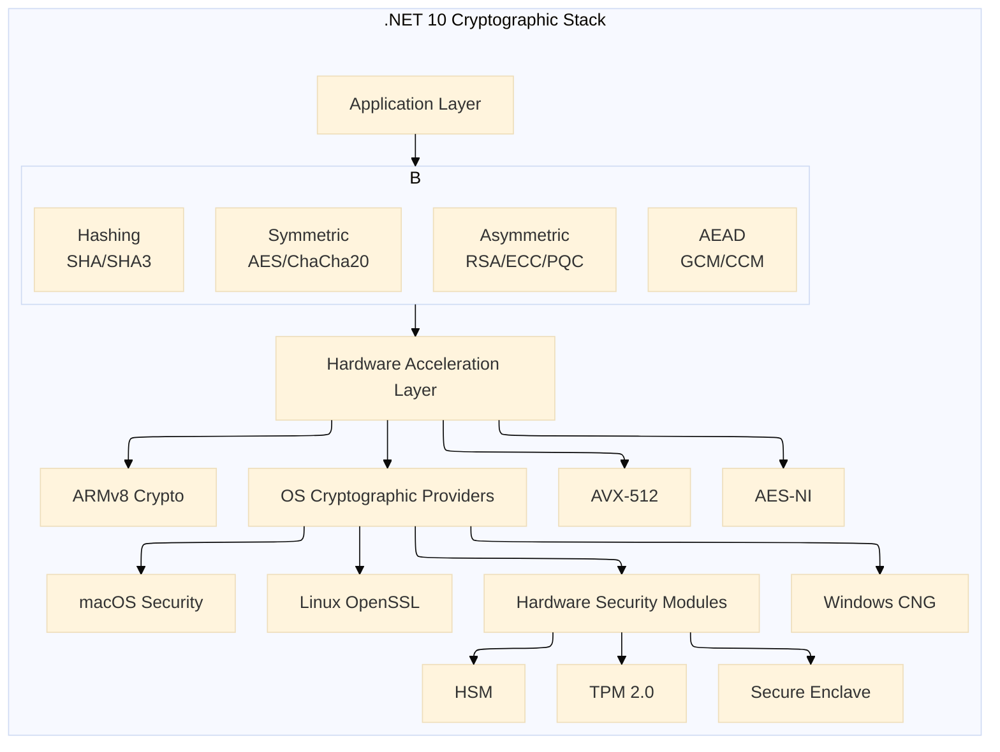

# ## .NET 10 Cryptographic Architecture

```mermaid
---
config:
  theme: base
  layout: elk
---
graph TB
    subgraph ".NET 10 Cryptographic Stack"
        A[Application Layer] --> B[Cryptographic APIs]
        
        subgraph B
            B1[Symmetric<br/>AES/ChaCha20]
            B2[Asymmetric<br/>RSA/ECC/PQC]
            B3[Hashing<br/>SHA/SHA3]
            B4[AEAD<br/>GCM/CCM]
        end
        
        B --> C[Hardware Acceleration Layer]
        C --> C1[AES-NI]
        C --> C2[ARMv8 Crypto]
        C --> C3[AVX-512]
        
        C --> D[OS Cryptographic Providers]
        D --> D1[Windows CNG]
        D --> D2[Linux OpenSSL]
        D --> D3[macOS Security]
        
        D --> E[Hardware Security Modules]
        E --> E1[TPM 2.0]
        E --> E2[Secure Enclave]
        E --> E3[HSM]
    end
```
