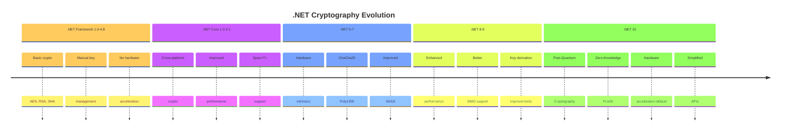

# 5. **Post-Quantum Cryptography Algorithms** (CRYST

```mermaid
---
config:
  theme: base
  layout: elk
---
timeline
    title .NET Cryptography Evolution
    section .NET Framework 1.0-4.8
        Basic crypto : AES, RSA, SHA
        Manual key : management
        No hardware : acceleration
    section .NET Core 1.0-3.1
        Cross-platform : crypto
        Improved : performance
        Span<T> : support
    section .NET 5-7
        Hardware : intrinsics
        ChaCha20 : Poly1305
        Improved : AEAD
    section .NET 8-9
        Enhanced : performance
        Better : SIMD support
        Key derivation : improvements
    section .NET 10
        Post-Quantum : Cryptography
        Zero-Knowledge : Proofs
        Hardware : acceleration default
        Simplified : APIs
```
