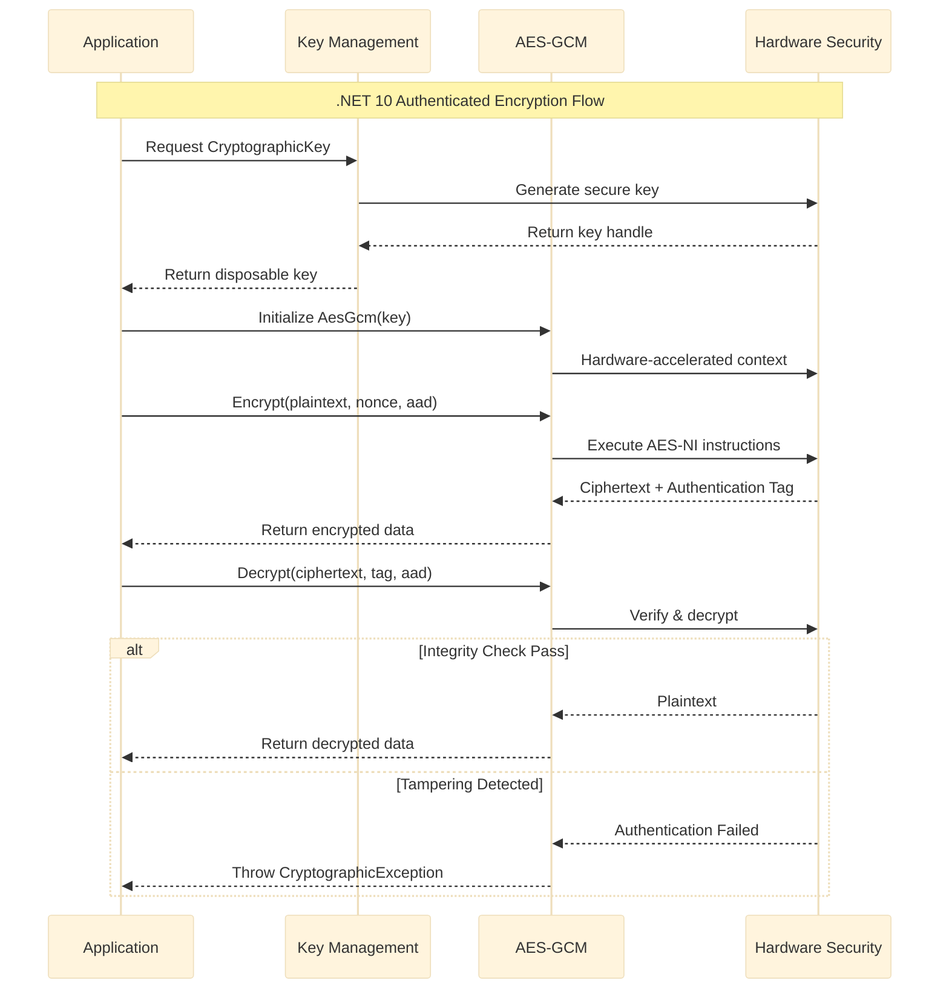

# ```


```mermaid
---
config:
  theme: base
  layout: elk
---
sequenceDiagram
    participant App as Application
    participant KM as Key Management
    participant AES as AES-GCM
    participant HSM as Hardware Security
    
    Note over App,HSM: .NET 10 Authenticated Encryption Flow
    
    App->>KM: Request CryptographicKey
    KM->>HSM: Generate secure key
    HSM-->>KM: Return key handle
    KM-->>App: Return disposable key
    
    App->>AES: Initialize AesGcm(key)
    AES->>HSM: Hardware-accelerated context
    
    App->>AES: Encrypt(plaintext, nonce, aad)
    AES->>HSM: Execute AES-NI instructions
    HSM-->>AES: Ciphertext + Authentication Tag
    AES-->>App: Return encrypted data
    
    App->>AES: Decrypt(ciphertext, tag, aad)
    AES->>HSM: Verify & decrypt
    alt Integrity Check Pass
        HSM-->>AES: Plaintext
        AES-->>App: Return decrypted data
    else Tampering Detected
        HSM-->>AES: Authentication Failed
        AES-->>App: Throw CryptographicException
    end
```
