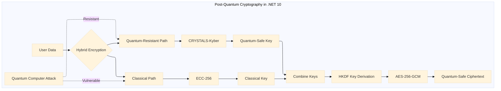

# ```


```mermaid
---
config:
  theme: base
  layout: elk
---
graph LR
    subgraph "Post-Quantum Cryptography in .NET 10"
        A[User Data] --> B{Hybrid Encryption}
        
        B --> C[Classical Path]
        B --> D[Quantum-Resistant Path]
        
        C --> C1[ECC-256]
        C1 --> C2[Classical Key]
        
        D --> D1[CRYSTALS-Kyber]
        D1 --> D2[Quantum-Safe Key]
        
        C2 --> E[Combine Keys]
        D2 --> E
        
        E --> F[HKDF Key Derivation]
        F --> G[AES-256-GCM]
        G --> H[Quantum-Safe Ciphertext]
        
        I[Quantum Computer Attack] -.->|Resistant| D
        I -.->|Vulnerable| C
    end
```
