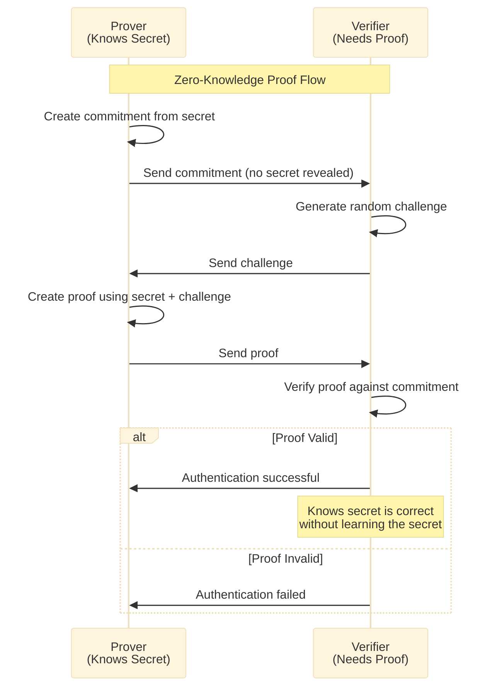

# ```


```mermaid
---
config:
  theme: base
  layout: elk
---
sequenceDiagram
    participant Prover as Prover<br/>(Knows Secret)
    participant Verifier as Verifier<br/>(Needs Proof)
    
    Note over Prover,Verifier: Zero-Knowledge Proof Flow
    
    Prover->>Prover: Create commitment from secret
    Prover->>Verifier: Send commitment (no secret revealed)
    
    Verifier->>Verifier: Generate random challenge
    Verifier->>Prover: Send challenge
    
    Prover->>Prover: Create proof using secret + challenge
    Prover->>Verifier: Send proof
    
    Verifier->>Verifier: Verify proof against commitment
    alt Proof Valid
        Verifier->>Prover: Authentication successful
        Note over Verifier: Knows secret is correct<br/>without learning the secret
    else Proof Invalid
        Verifier->>Prover: Authentication failed
    end
```
