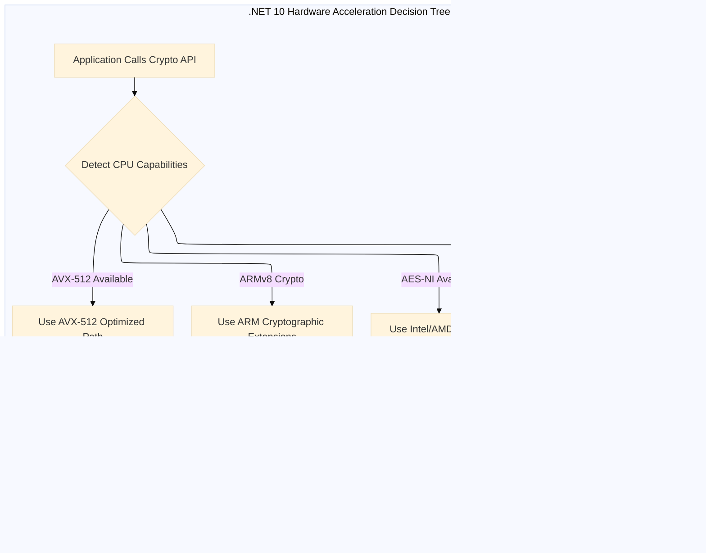

# ```


```mermaid
---
config:
  theme: base
  layout: elk
---
graph TB
    subgraph ".NET 10 Hardware Acceleration Decision Tree"
        A[Application Calls Crypto API] --> B{Detect CPU Capabilities}
        
        B -->|AES-NI Available| C[Use Intel/AMD AES-NI]
        B -->|ARMv8 Crypto| D[Use ARM Cryptographic Extensions]
        B -->|AVX-512 Available| E[Use AVX-512 Optimized Path]
        B -->|No Hardware Support| F[Fallback to Software Implementation]
        
        C --> G[Hardware-Accelerated AES]
        D --> G
        E --> G
        
        G --> H[10-50x Performance Improvement]
        F --> I[Standard Performance]
        
        H --> J[Reduced CPU Usage]
        H --> K[Lower Power Consumption]
        H --> L[Constant-Time Execution]
    end
```
