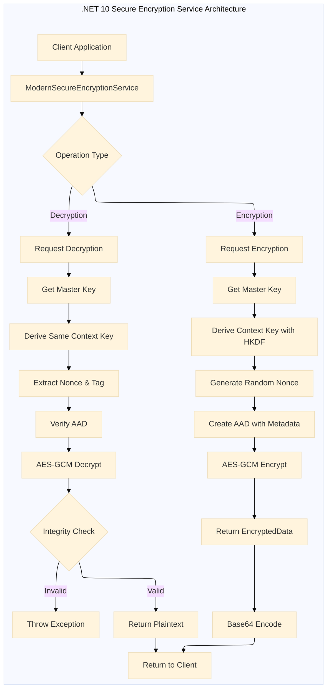

# ```


```mermaid
---
config:
  theme: base
  layout: elk
---
flowchart TD
    subgraph ".NET 10 Secure Encryption Service Architecture"
        A[Client Application] --> B[ModernSecureEncryptionService]
        
        B --> C{Operation Type}
        
        C -->|Encryption| D[Request Encryption]
        C -->|Decryption| E[Request Decryption]
        
        D --> F[Get Master Key]
        F --> G[Derive Context Key with HKDF]
        G --> H[Generate Random Nonce]
        H --> I[Create AAD with Metadata]
        I --> J[AES-GCM Encrypt]
        J --> K[Return EncryptedData]
        
        E --> L[Get Master Key]
        L --> M[Derive Same Context Key]
        M --> N[Extract Nonce & Tag]
        N --> O[Verify AAD]
        O --> P[AES-GCM Decrypt]
        
        P --> Q{Integrity Check}
        Q -->|Valid| R[Return Plaintext]
        Q -->|Invalid| S[Throw Exception]
        
        K --> T[Base64 Encode]
        T --> U[Return to Client]
        R --> U
    end
```
