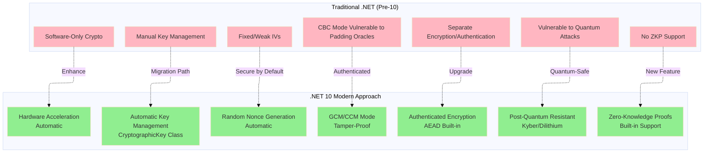

# ## Security Best Practices Comparison

```mermaid
---
config:
  theme: base
  layout: elk
---
graph TB
    subgraph "Traditional .NET (Pre-10)"
        T1[Manual Key Management]
        T2[Separate Encryption/Authentication]
        T3[Software-Only Crypto]
        T4[Vulnerable to Quantum Attacks]
        T5[No ZKP Support]
        T6[Fixed/Weak IVs]
        T7[CBC Mode Vulnerable to Padding Oracles]
    end
    
    subgraph ".NET 10 Modern Approach"
        N1[Automatic Key Management<br/>CryptographicKey Class]
        N2[Authenticated Encryption<br/>AEAD Built-in]
        N3[Hardware Acceleration<br/>Automatic]
        N4[Post-Quantum Resistant<br/>Kyber/Dilithium]
        N5[Zero-Knowledge Proofs<br/>Built-in Support]
        N6[Random Nonce Generation<br/>Automatic]
        N7[GCM/CCM Mode<br/>Tamper-Proof]
    end
    
    T1 -.->|Migration Path| N1
    T2 -.->|Upgrade| N2
    T3 -.->|Enhance| N3
    T4 -.->|Quantum-Safe| N4
    T5 -.->|New Feature| N5
    T6 -.->|Secure by Default| N6
    T7 -.->|Authenticated| N7
    
    style N1 fill:#90EE90
    style N2 fill:#90EE90
    style N3 fill:#90EE90
    style N4 fill:#90EE90
    style N5 fill:#90EE90
    style N6 fill:#90EE90
    style N7 fill:#90EE90
    
    style T1 fill:#FFB6C1
    style T2 fill:#FFB6C1
    style T3 fill:#FFB6C1
    style T4 fill:#FFB6C1
    style T5 fill:#FFB6C1
    style T6 fill:#FFB6C1
    style T7 fill:#FFB6C1
```
