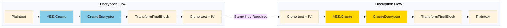

# ## Encryption vs Decryption Flow Comparison

```mermaid
---
config:
  theme: base
  layout: elk
---
flowchart LR
    subgraph "Encryption Flow"
        E1[Plaintext] --> E2[AES.Create]
        E2 --> E3[CreateEncryptor]
        E3 --> E4[TransformFinalBlock]
        E4 --> E5[Ciphertext + IV]
    end
    
    subgraph "Decryption Flow"
        D1[Ciphertext + IV] --> D2[AES.Create]
        D2 --> D3[CreateDecryptor]
        D3 --> D4[TransformFinalBlock]
        D4 --> D5[Plaintext]
    end
    
    E5 -.->|Same Key Required| D1
    
    style E2 fill:#87CEEB
    style E3 fill:#87CEEB
    style D2 fill:#FFD700
    style D3 fill:#FFD700
```
