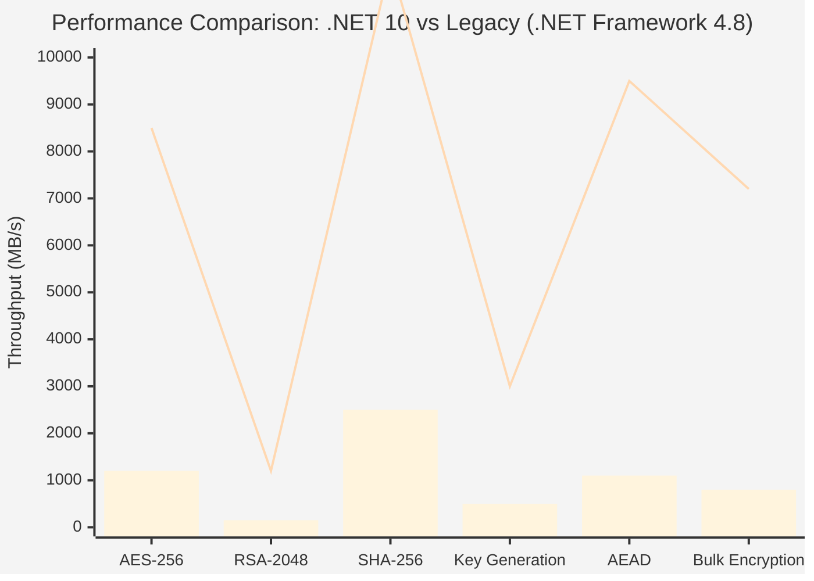

# ### .NET 10 Cryptographic Performance Metrics

```mermaid
---
config:
  theme: base
  layout: elk
---
xychart-beta
    title "Performance Comparison: .NET 10 vs Legacy (.NET Framework 4.8)"
    x-axis ["AES-256", "RSA-2048", "SHA-256", "Key Generation", "AEAD", "Bulk Encryption"]
    y-axis "Throughput (MB/s)" 0 --> 10000
    bar [1200, 150, 2500, 500, 1100, 800]
    line [8500, 1200, 12000, 3000, 9500, 7200]
```
