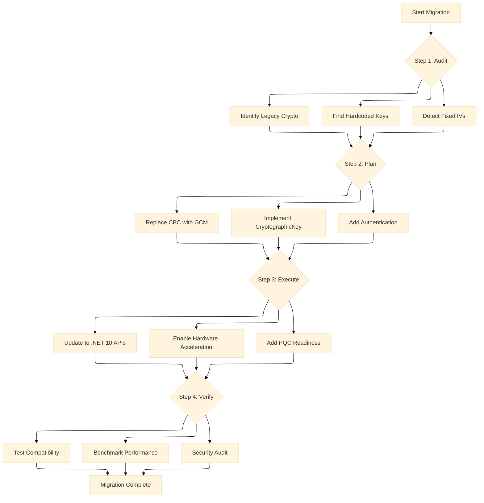

# ### Migration Checklist from Legacy to .NET 10

```mermaid
---
config:
  theme: base
  layout: elk
---
graph TD
    A[Start Migration] --> B{Step 1: Audit}
    B --> C[Identify Legacy Crypto]
    B --> D[Find Hardcoded Keys]
    B --> E[Detect Fixed IVs]
    
    C --> F{Step 2: Plan}
    D --> F
    E --> F
    
    F --> G[Replace CBC with GCM]
    F --> H[Implement CryptographicKey]
    F --> I[Add Authentication]
    
    G --> J{Step 3: Execute}
    H --> J
    I --> J
    
    J --> K[Update to .NET 10 APIs]
    J --> L[Enable Hardware Acceleration]
    J --> M[Add PQC Readiness]
    
    K --> N{Step 4: Verify}
    L --> N
    M --> N
    
    N --> O[Test Compatibility]
    N --> P[Benchmark Performance]
    N --> Q[Security Audit]
    
    O --> R[Migration Complete]
    P --> R
    Q --> R
```
