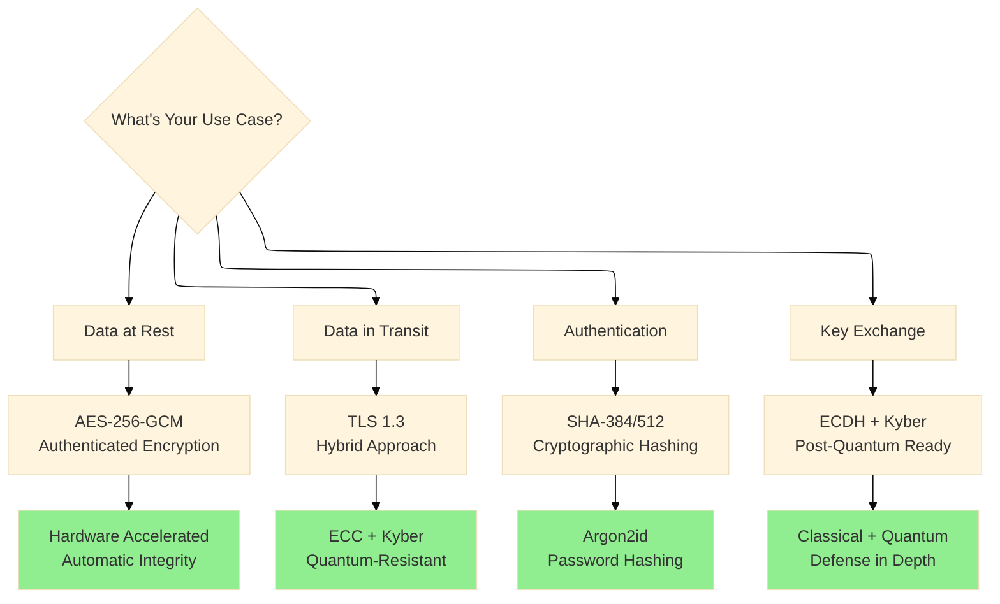

# ## Quick Reference: Algorithm Selection Guide

```mermaid
---
config:
  theme: base
  layout: elk
---
graph TB
    Start{What's Your Use Case?} --> A[Data at Rest]
    Start --> B[Data in Transit]
    Start --> C[Authentication]
    Start --> D[Key Exchange]
    
    A --> A1[AES-256-GCM<br/>Authenticated Encryption]
    A1 --> A2[Hardware Accelerated<br/>Automatic Integrity]
    
    B --> B1[TLS 1.3<br/>Hybrid Approach]
    B1 --> B2[ECC + Kyber<br/>Quantum-Resistant]
    
    C --> C1[SHA-384/512<br/>Cryptographic Hashing]
    C1 --> C2[Argon2id<br/>Password Hashing]
    
    D --> D1[ECDH + Kyber<br/>Post-Quantum Ready]
    D1 --> D2[Classical + Quantum<br/>Defense in Depth]
    
    style A2 fill:#90EE90
    style B2 fill:#90EE90
    style C2 fill:#90EE90
    style D2 fill:#90EE90
```
