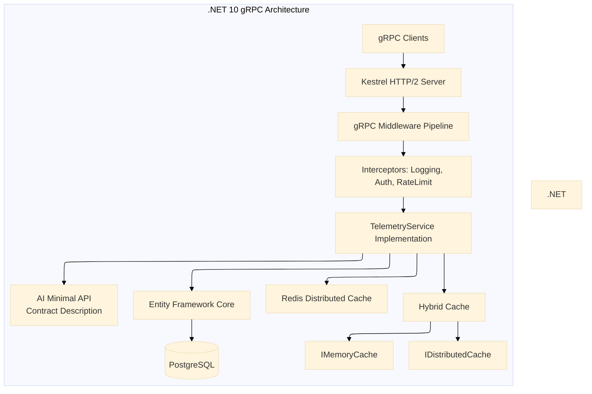

# ### Architecture Overview

```mermaid
---
config:
  theme: base
  layout: elk
---
graph TB
    subgraph ".NET 10 gRPC Architecture"
        Client[gRPC Clients] --> Kestrel[Kestrel HTTP/2 Server]
        Kestrel --> GrpcPipeline[gRPC Middleware Pipeline]
        GrpcPipeline --> Interceptors[Interceptors: Logging, Auth, RateLimit]
        Interceptors --> Service[TelemetryService Implementation]
        
        Service --> HybridCache[Hybrid Cache]
        Service --> EF[Entity Framework Core]
        Service --> Redis[Redis Distributed Cache]
        
        HybridCache --> MemoryCache[IMemoryCache]
        HybridCache --> RedisCache[IDistributedCache]
        
        EF --> PostgreSQL[(PostgreSQL)]
        
        Service --> AI[AI Minimal API<br/>Contract Description]
    end
    
    style .NET 10 gRPC Architecture fill:#f3e5f5
```
