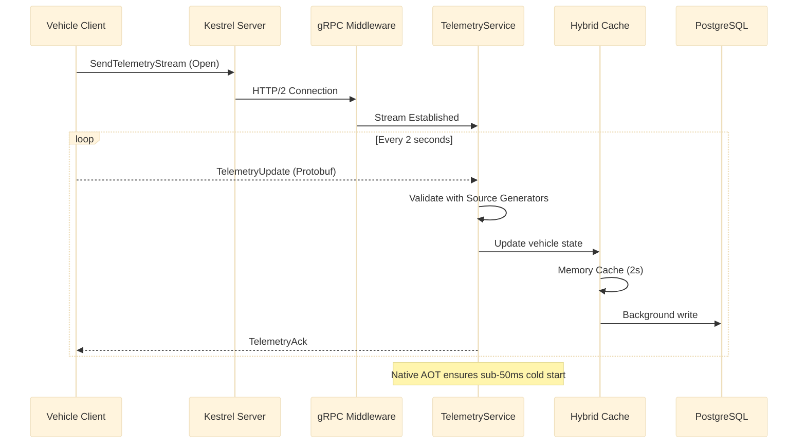

# ### Mermaid Sequence: Telemetry Stream in .NET 10

```mermaid
---
config:
  theme: base
  layout: elk
---
sequenceDiagram
    participant Vehicle as Vehicle Client
    participant Kestrel as Kestrel Server
    participant Middleware as gRPC Middleware
    participant Service as TelemetryService
    participant Cache as Hybrid Cache
    participant DB as PostgreSQL

    Vehicle->>Kestrel: SendTelemetryStream (Open)
    Kestrel->>Middleware: HTTP/2 Connection
    Middleware->>Service: Stream Established
    
    loop Every 2 seconds
        Vehicle-->>Service: TelemetryUpdate (Protobuf)
        Service->>Service: Validate with Source Generators
        Service->>Cache: Update vehicle state
        Cache->>Cache: Memory Cache (2s)
        Cache->>DB: Background write
        Service-->>Vehicle: TelemetryAck
    end
    
    Note over Service: Native AOT ensures sub-50ms cold start
```
