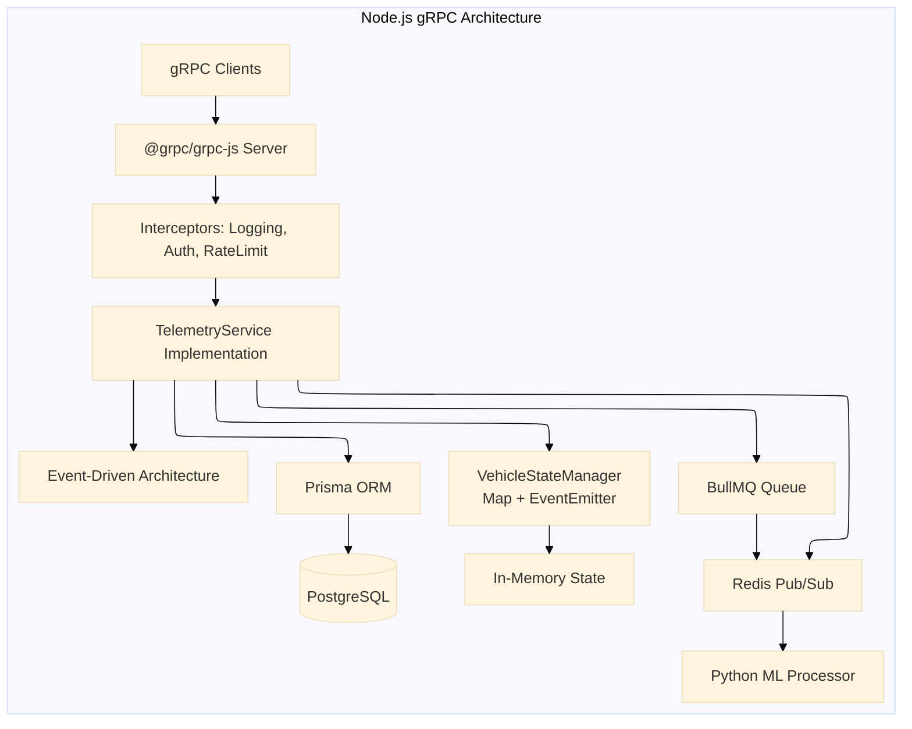

# ### Architecture Overview

```mermaid
---
config:
  theme: base
  layout: elk
---

graph TB
    subgraph NodejsArch["Node.js gRPC Architecture"]
        Client["gRPC Clients"] --> GrpcServer["@grpc/grpc-js Server"]
        GrpcServer --> Interceptors["Interceptors: Logging, Auth, RateLimit"]
        Interceptors --> Service["TelemetryService Implementation"]
        
        Service --> EventLoop["Event-Driven Architecture"]
        Service --> StateManager["VehicleStateManager<br/>Map + EventEmitter"]
        Service --> BullMQ["BullMQ Queue"]
        Service --> Redis["Redis Pub/Sub"]
        
        StateManager --> Memory["In-Memory State"]
        BullMQ --> Redis
        Redis --> Python["Python ML Processor"]
        
        Service --> Prisma["Prisma ORM"]
        Prisma --> PostgreSQL[("PostgreSQL")]
    end
    
```
