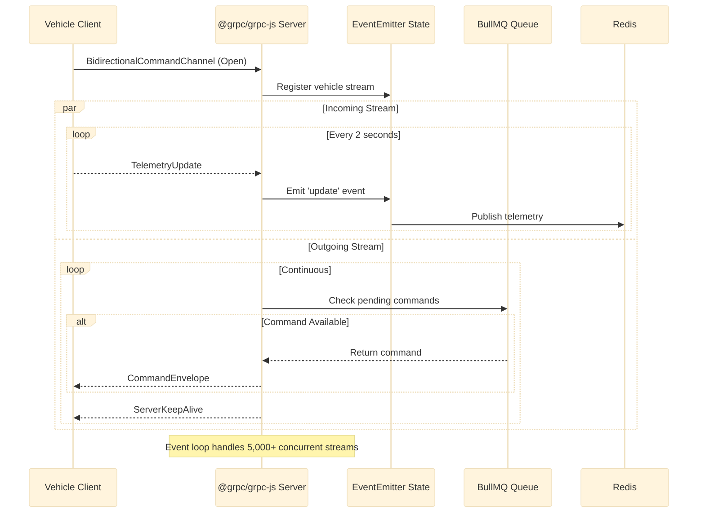

# ### Mermaid Sequence: Bidirectional Streaming in N

```mermaid
---
config:
  theme: base
  layout: elk
---
sequenceDiagram
    participant Vehicle as Vehicle Client
    participant Grpc as @grpc/grpc-js Server
    participant State as EventEmitter State
    participant Queue as BullMQ Queue
    participant Redis as Redis

    Vehicle->>Grpc: BidirectionalCommandChannel (Open)
    Grpc->>State: Register vehicle stream
    
    par Incoming Stream
        loop Every 2 seconds
            Vehicle-->>Grpc: TelemetryUpdate
            Grpc->>State: Emit 'update' event
            State->>Redis: Publish telemetry
        end
    and Outgoing Stream
        loop Continuous
            Grpc->>Queue: Check pending commands
            alt Command Available
                Queue-->>Grpc: Return command
                Grpc-->>Vehicle: CommandEnvelope
            end
            Grpc-->>Vehicle: ServerKeepAlive
        end
    end
    
    Note over Grpc: Event loop handles 5,000+ concurrent streams
```
