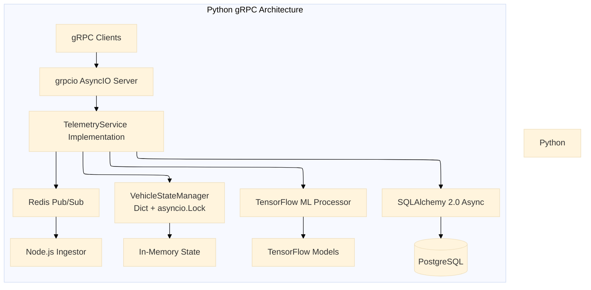

# ### Architecture Overview

```mermaid
---
config:
  theme: base
  layout: elk
---
graph TB
    subgraph "Python gRPC Architecture"
        Client[gRPC Clients] --> GrpcServer[grpcio AsyncIO Server]
        GrpcServer --> Service[TelemetryService Implementation]
        
        Service --> StateManager[VehicleStateManager<br/>Dict + asyncio.Lock]
        Service --> MLProcessor[TensorFlow ML Processor]
        Service --> Redis[Redis Pub/Sub]
        Service --> SQLAlchemy[SQLAlchemy 2.0 Async]
        
        StateManager --> Memory[In-Memory State]
        MLProcessor --> TensorFlow[TensorFlow Models]
        Redis --> NodeJS[Node.js Ingestor]
        
        SQLAlchemy --> PostgreSQL[(PostgreSQL)]
    end
    
    style Python gRPC Architecture fill:#e3f2fd
```
