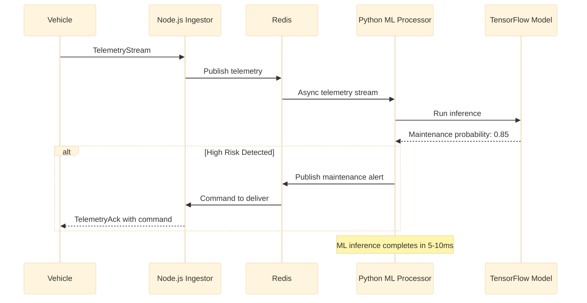

# ### Mermaid Sequence: ML-Powered Command Dispatch

```mermaid
---
config:
  theme: base
  layout: elk
---
sequenceDiagram
    participant Vehicle as Vehicle
    participant Node as Node.js Ingestor
    participant Redis as Redis
    participant Python as Python ML Processor
    participant Model as TensorFlow Model

    Vehicle->>Node: TelemetryStream
    Node->>Redis: Publish telemetry
    
    Redis->>Python: Async telemetry stream
    Python->>Model: Run inference
    Model-->>Python: Maintenance probability: 0.85
    
    alt High Risk Detected
        Python->>Redis: Publish maintenance alert
        Redis->>Node: Command to deliver
        Node-->>Vehicle: TelemetryAck with command
    end
    
    Note over Python: ML inference completes in 5-10ms
```
