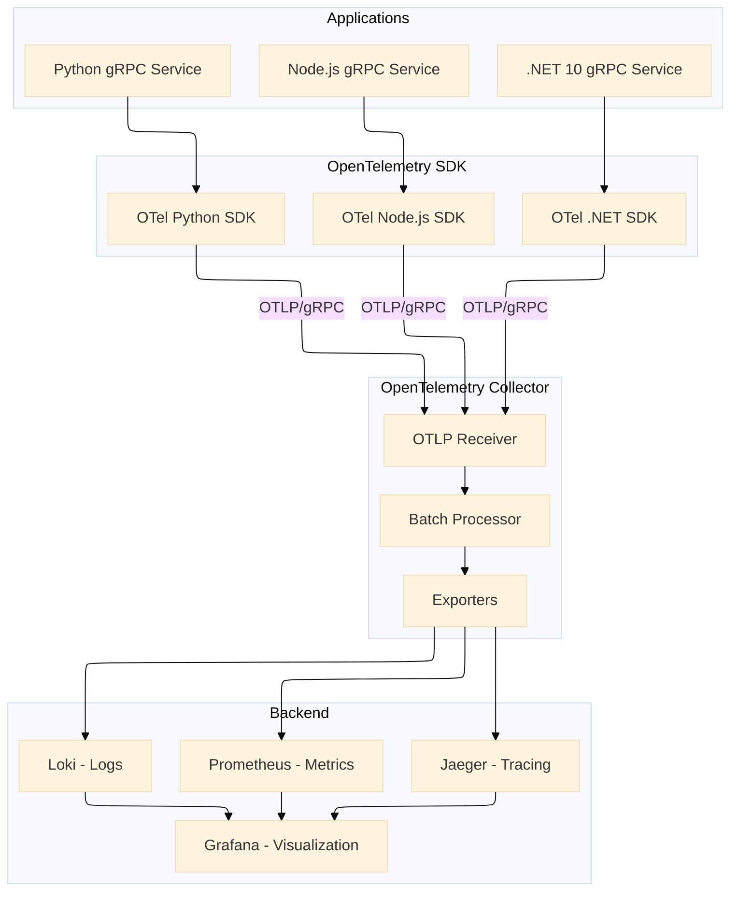

# ### OpenTelemetry Architecture Diagram

```mermaid
---
config:
  theme: base
  layout: elk
---
graph TB
    subgraph "Applications"
        DotNet[.NET 10 gRPC Service]
        Node[Node.js gRPC Service]
        Python[Python gRPC Service]
    end
    
    subgraph "OpenTelemetry SDK"
        DotNetSDK[OTel .NET SDK]
        NodeSDK[OTel Node.js SDK]
        PythonSDK[OTel Python SDK]
    end
    
    subgraph "OpenTelemetry Collector"
        OTLPReceiver[OTLP Receiver]
        BatchProcessor[Batch Processor]
        Exporters[Exporters]
    end
    
    subgraph "Backend"
        Jaeger[Jaeger - Tracing]
        Prometheus[Prometheus - Metrics]
        Grafana[Grafana - Visualization]
        Loki[Loki - Logs]
    end
    
    DotNet --> DotNetSDK
    Node --> NodeSDK
    Python --> PythonSDK
    
    DotNetSDK -->|OTLP/gRPC| OTLPReceiver
    NodeSDK -->|OTLP/gRPC| OTLPReceiver
    PythonSDK -->|OTLP/gRPC| OTLPReceiver
    
    OTLPReceiver --> BatchProcessor
    BatchProcessor --> Exporters
    
    Exporters --> Jaeger
    Exporters --> Prometheus
    Exporters --> Loki
    
    Jaeger --> Grafana
    Prometheus --> Grafana
    Loki --> Grafana
```
