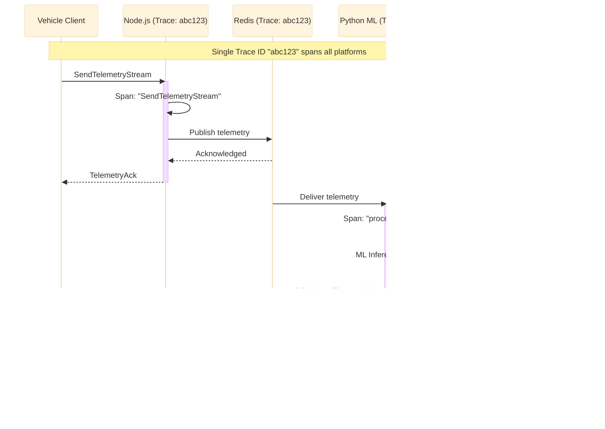

# ### Distributed Tracing Example

```mermaid
---
config:
  theme: base
  layout: elk
---
sequenceDiagram
    participant Client as Vehicle Client
    participant Node as Node.js (Trace: abc123)
    participant Redis as Redis (Trace: abc123)
    participant Python as Python ML (Trace: abc123)
    participant DotNet as .NET Dashboard (Trace: abc123)

    Note over Client,DotNet: Single Trace ID "abc123" spans all platforms

    Client->>Node: SendTelemetryStream
    activate Node
    Node->>Node: Span: "SendTelemetryStream"
    Node->>Redis: Publish telemetry
    Redis-->>Node: Acknowledged
    Node-->>Client: TelemetryAck
    deactivate Node

    Redis->>Python: Deliver telemetry
    activate Python
    Python->>Python: Span: "process_telemetry"
    Python->>Python: ML Inference (5ms)
    Python->>Redis: Publish alert (if anomaly)
    deactivate Python

    Redis->>DotNet: Command notification
    activate DotNet
    DotNet->>DotNet: Span: "DispatchCommand"
    DotNet-->>Client: Push command via gRPC
    deactivate DotNet
```
