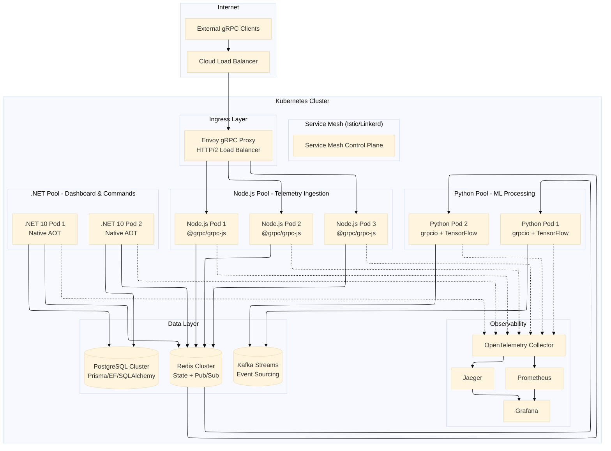

# ### Complete Deployment Architecture Diagram

```mermaid
---
config:
  theme: base
  layout: elk
---
graph TB
    subgraph "Internet"
        Client[External gRPC Clients]
        LB[Cloud Load Balancer]
    end
    
    subgraph "Kubernetes Cluster"
        subgraph "Ingress Layer"
            Envoy[Envoy gRPC Proxy<br/>HTTP/2 Load Balancer]
        end
        
        subgraph "Service Mesh (Istio/Linkerd)"
            MeshControl[Service Mesh Control Plane]
        end
        
        subgraph "Node.js Pool - Telemetry Ingestion"
            Node1[Node.js Pod 1<br/>@grpc/grpc-js]
            Node2[Node.js Pod 2<br/>@grpc/grpc-js]
            Node3[Node.js Pod 3<br/>@grpc/grpc-js]
        end
        
        subgraph "Python Pool - ML Processing"
            Python1[Python Pod 1<br/>grpcio + TensorFlow]
            Python2[Python Pod 2<br/>grpcio + TensorFlow]
        end
        
        subgraph ".NET Pool - Dashboard & Commands"
            DotNet1[.NET 10 Pod 1<br/>Native AOT]
            DotNet2[.NET 10 Pod 2<br/>Native AOT]
        end
        
        subgraph "Data Layer"
            Redis[(Redis Cluster<br/>State + Pub/Sub)]
            PG[(PostgreSQL Cluster<br/>Prisma/EF/SQLAlchemy)]
            Kafka[(Kafka Streams<br/>Event Sourcing)]
        end
        
        subgraph "Observability"
            OTEL[OpenTelemetry Collector]
            Jaeger[Jaeger]
            Prometheus[Prometheus]
            Grafana[Grafana]
        end
    end
    
    Client --> LB
    LB --> Envoy
    
    Envoy --> Node1
    Envoy --> Node2
    Envoy --> Node3
    
    Node1 --> Redis
    Node2 --> Redis
    Node3 --> Redis
    
    Redis --> Python1
    Redis --> Python2
    
    Python1 --> Kafka
    Python2 --> Kafka
    
    DotNet1 --> PG
    DotNet2 --> PG
    DotNet1 --> Redis
    DotNet2 --> Redis
    
    Node1 -.-> OTEL
    Node2 -.-> OTEL
    Node3 -.-> OTEL
    Python1 -.-> OTEL
    Python2 -.-> OTEL
    DotNet1 -.-> OTEL
    DotNet2 -.-> OTEL
    
    OTEL --> Jaeger
    OTEL --> Prometheus
    Prometheus --> Grafana
    Jaeger --> Grafana
```
