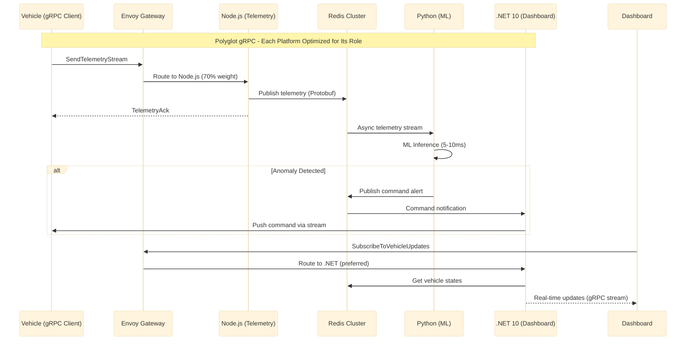

# ### Cross-Platform Communication Flow

```mermaid
---
config:
  theme: base
  layout: elk
---
sequenceDiagram
    participant Vehicle as Vehicle (gRPC Client)
    participant Envoy as Envoy Gateway
    participant Node as Node.js (Telemetry)
    participant Redis as Redis Cluster
    participant Python as Python (ML)
    participant DotNet as .NET 10 (Dashboard)

    Note over Vehicle,DotNet: Polyglot gRPC - Each Platform Optimized for Its Role

    Vehicle->>Envoy: SendTelemetryStream
    Envoy->>Node: Route to Node.js (70% weight)
    
    Node->>Redis: Publish telemetry (Protobuf)
    Node-->>Vehicle: TelemetryAck
    
    Redis->>Python: Async telemetry stream
    Python->>Python: ML Inference (5-10ms)
    
    alt Anomaly Detected
        Python->>Redis: Publish command alert
        Redis->>DotNet: Command notification
        DotNet->>Vehicle: Push command via stream
    end
    
    Dashboard->>Envoy: SubscribeToVehicleUpdates
    Envoy->>DotNet: Route to .NET (preferred)
    DotNet->>Redis: Get vehicle states
    DotNet-->>Dashboard: Real-time updates (gRPC stream)
```
