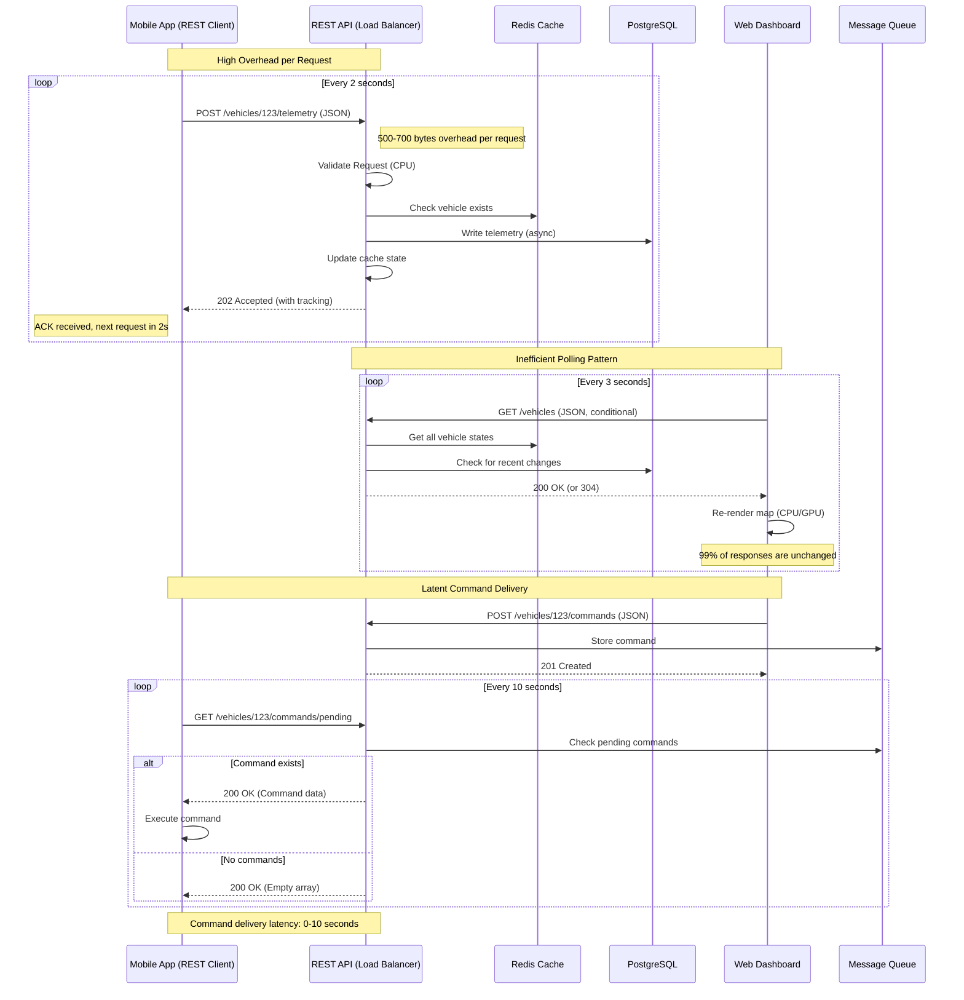

# 6.  **Inconsistent Error Handling and Retry Logic:

```mermaid
sequenceDiagram
    participant DriverApp as Mobile App (REST Client)
    participant API as REST API (Load Balancer)
    participant Cache as Redis Cache
    participant DB as PostgreSQL
    participant Dashboard as Web Dashboard
    participant Queue as Message Queue

    Note over DriverApp,API: High Overhead per Request
    
    loop Every 2 seconds
        DriverApp->>API: POST /vehicles/123/telemetry (JSON)
        Note right of API: 500-700 bytes overhead per request
        API->>API: Validate Request (CPU)
        API->>Cache: Check vehicle exists
        API->>DB: Write telemetry (async)
        API->>API: Update cache state
        API-->>DriverApp: 202 Accepted (with tracking)
        Note left of DriverApp: ACK received, next request in 2s
    end

    Note over Dashboard,API: Inefficient Polling Pattern
    
    loop Every 3 seconds
        Dashboard->>API: GET /vehicles (JSON, conditional)
        API->>Cache: Get all vehicle states
        API->>DB: Check for recent changes
        API-->>Dashboard: 200 OK (or 304)
        Dashboard->>Dashboard: Re-render map (CPU/GPU)
        Note over Dashboard: 99% of responses are unchanged
    end

    Note over Dashboard,DriverApp: Latent Command Delivery
    
    Dashboard->>API: POST /vehicles/123/commands (JSON)
    API->>Queue: Store command
    API-->>Dashboard: 201 Created
    
    loop Every 10 seconds
        DriverApp->>API: GET /vehicles/123/commands/pending
        API->>Queue: Check pending commands
        alt Command exists
            API-->>DriverApp: 200 OK (Command data)
            DriverApp->>DriverApp: Execute command
        else No commands
            API-->>DriverApp: 200 OK (Empty array)
        end
    end
    
    Note over DriverApp,API: Command delivery latency: 0-10 seconds
```
