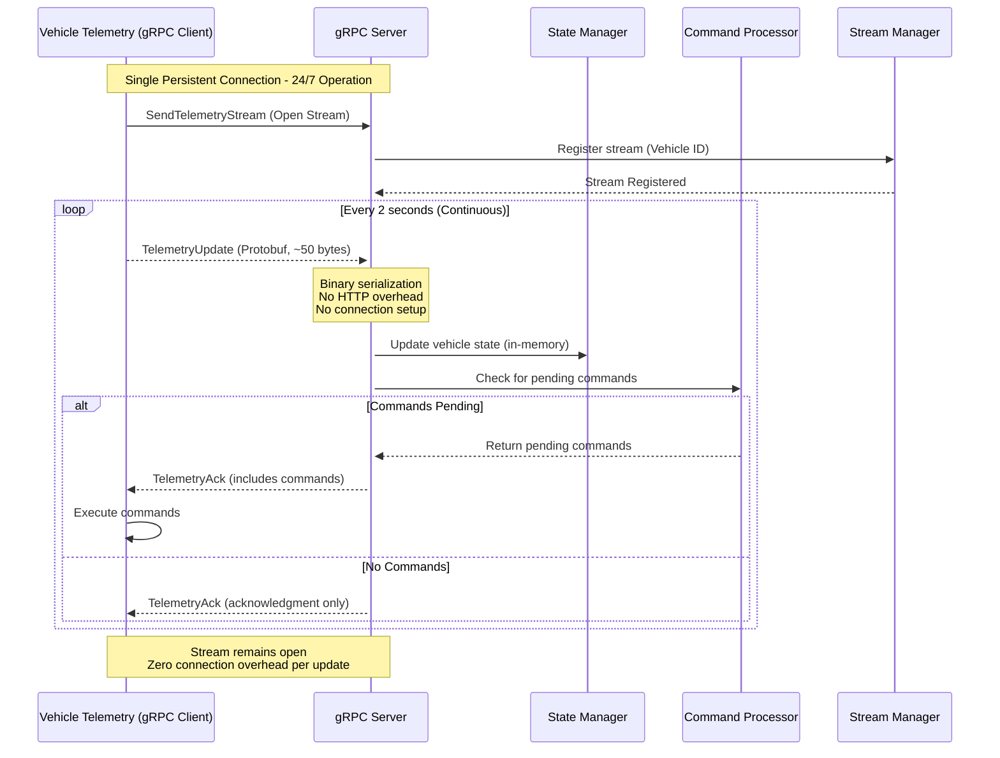

# **After (gRPC):** 500 vehicles × 1 persistent stre

```mermaid
sequenceDiagram
    participant Vehicle as Vehicle Telemetry (gRPC Client)
    participant gRPC as gRPC Server
    participant State as State Manager
    participant Command as Command Processor
    participant Stream as Stream Manager

    Note over Vehicle,gRPC: Single Persistent Connection - 24/7 Operation
    
    Vehicle->>gRPC: SendTelemetryStream (Open Stream)
    activate gRPC
    gRPC->>Stream: Register stream (Vehicle ID)
    Stream-->>gRPC: Stream Registered
    
    loop Every 2 seconds (Continuous)
        Vehicle-->>gRPC: TelemetryUpdate (Protobuf, ~50 bytes)
        Note over gRPC: Binary serialization<br/>No HTTP overhead<br/>No connection setup
        gRPC->>State: Update vehicle state (in-memory)
        gRPC->>Command: Check for pending commands
        alt Commands Pending
            Command-->>gRPC: Return pending commands
            gRPC-->>Vehicle: TelemetryAck (includes commands)
            Vehicle->>Vehicle: Execute commands
        else No Commands
            gRPC-->>Vehicle: TelemetryAck (acknowledgment only)
        end
    end
    
    Note over Vehicle,gRPC: Stream remains open<br/>Zero connection overhead per update
```
