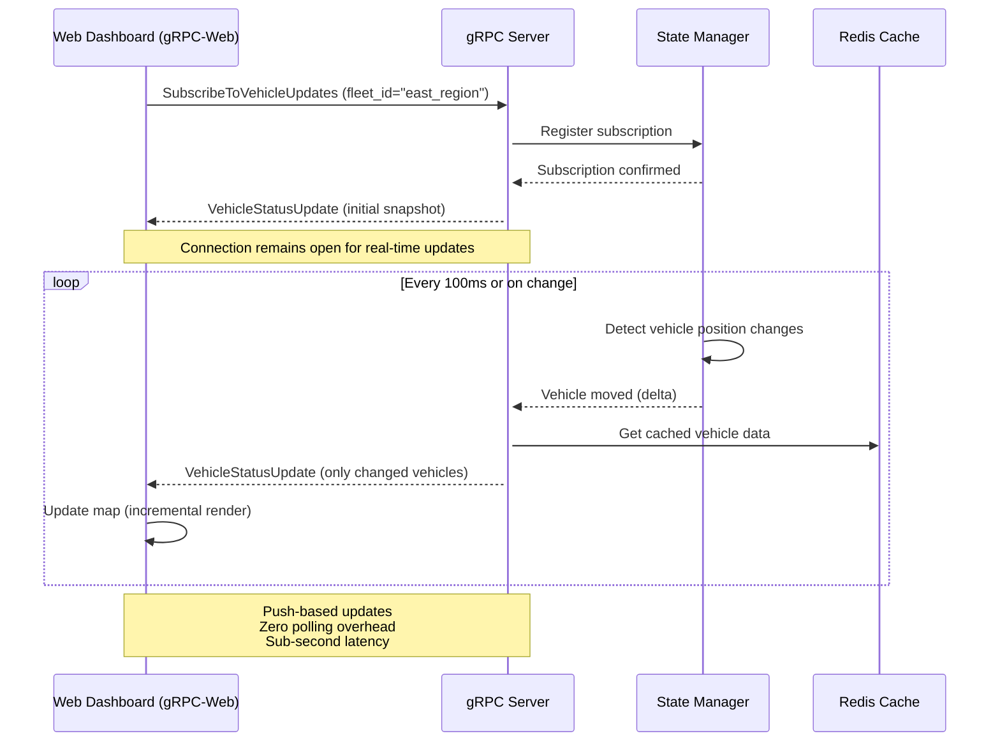

# **After (gRPC):** Dashboard subscribes once and re

```mermaid
sequenceDiagram
    participant Dashboard as Web Dashboard (gRPC-Web)
    participant gRPC as gRPC Server
    participant State as State Manager
    participant Cache as Redis Cache

    Dashboard->>gRPC: SubscribeToVehicleUpdates (fleet_id="east_region")
    activate gRPC
    gRPC->>State: Register subscription
    State-->>gRPC: Subscription confirmed
    gRPC-->>Dashboard: VehicleStatusUpdate (initial snapshot)
    
    Note over Dashboard,gRPC: Connection remains open for real-time updates
    
    loop Every 100ms or on change
        State->>State: Detect vehicle position changes
        State-->>gRPC: Vehicle moved (delta)
        gRPC->>Cache: Get cached vehicle data
        gRPC-->>Dashboard: VehicleStatusUpdate (only changed vehicles)
        Dashboard->>Dashboard: Update map (incremental render)
    end
    
    Note over Dashboard,gRPC: Push-based updates<br/>Zero polling overhead<br/>Sub-second latency
```
