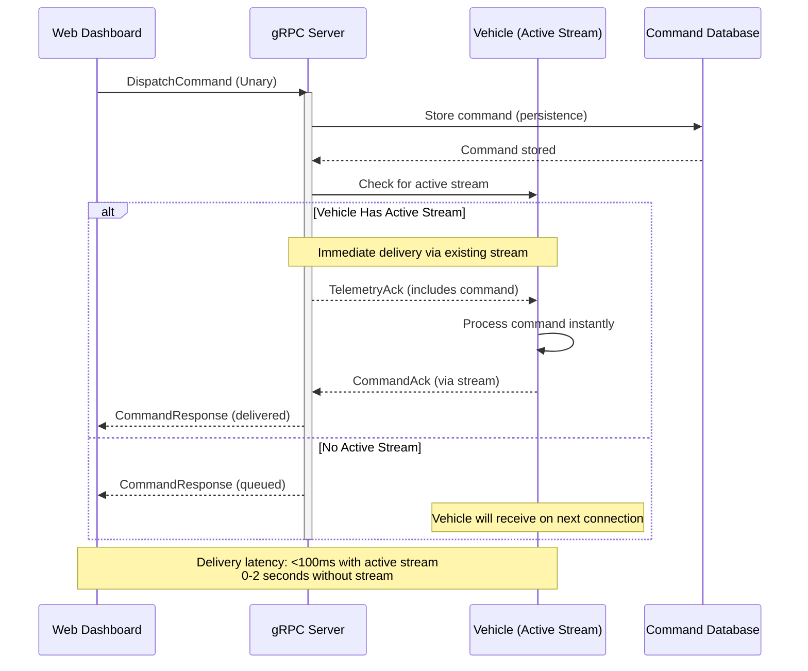

# **After (gRPC):** Commands delivered instantly thr

```mermaid
sequenceDiagram
    participant Dashboard as Web Dashboard
    participant gRPC as gRPC Server
    participant Vehicle as Vehicle (Active Stream)
    participant Database as Command Database

    Dashboard->>gRPC: DispatchCommand (Unary)
    activate gRPC
    gRPC->>Database: Store command (persistence)
    Database-->>gRPC: Command stored
    gRPC->>Vehicle: Check for active stream
    
    alt Vehicle Has Active Stream
        Note over gRPC,Vehicle: Immediate delivery via existing stream
        gRPC-->>Vehicle: TelemetryAck (includes command)
        Vehicle->>Vehicle: Process command instantly
        Vehicle-->>gRPC: CommandAck (via stream)
        gRPC-->>Dashboard: CommandResponse (delivered)
    else No Active Stream
        gRPC-->>Dashboard: CommandResponse (queued)
        Note over Vehicle: Vehicle will receive on next connection
    end
    
    deactivate gRPC
    
    Note over Dashboard,Vehicle: Delivery latency: <100ms with active stream<br/>0-2 seconds without stream
```
