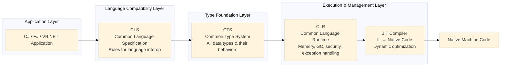

# ### 1.1 The Three Pillars of .NET Runtime

```mermaid
---
config:
  theme: base
  layout: elk
---
graph LR
    subgraph "Application Layer"
        APP["C# / F# / VB.NET Application"]
    end

    subgraph "Language Compatibility Layer"
        CLS["CLS<br/>Common Language Specification<br/>Rules for language interop"]
    end

    subgraph "Type Foundation Layer"
        CTS["CTS<br/>Common Type System<br/>All data types & their behaviors"]
    end

    subgraph "Execution & Management Layer"
        CLR["CLR<br/>Common Language Runtime<br/>Memory, GC, security, exception handling"]
        JIT["JIT Compiler<br/>IL → Native Code<br/>Dynamic optimization"]
    end

    APP --> CLS
    CLS --> CTS
    CTS --> CLR
    CLR --> JIT
    JIT --> NATIVE["Native Machine Code"]
```
