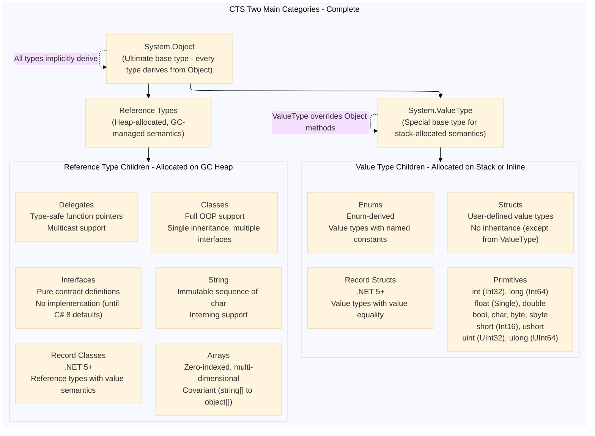

# The CTS divides all types into two fundamental cat

```mermaid
---
config:
  theme: base
  layout: elk
---
flowchart TD
    subgraph CTS_HIERARCHY ["CTS Two Main Categories - Complete"]
        ROOT["System.Object<br/>(Ultimate base type - every type derives from Object)"]
        
        ROOT --> VT["System.ValueType<br/>(Special base type for stack-allocated semantics)"]
        ROOT --> RT["Reference Types<br/>(Heap-allocated, GC-managed semantics)"]
        
        subgraph VT_CHILDREN ["Value Type Children - Allocated on Stack or Inline"]
            direction TB
            PRIM["Primitives<br/>int (Int32), long (Int64)<br/>float (Single), double<br/>bool, char, byte, sbyte<br/>short (Int16), ushort<br/>uint (UInt32), ulong (UInt64)"]
            ENUM["Enums<br/>Enum-derived<br/>Value types with named constants"]
            STRUCTS["Structs<br/>User-defined value types<br/>No inheritance (except from ValueType)"]
            RECORD_STRUCT["Record Structs<br/>.NET 5+<br/>Value types with value equality"]
        end
        
        subgraph RT_CHILDREN ["Reference Type Children - Allocated on GC Heap"]
            direction TB
            CLASS["Classes<br/>Full OOP support<br/>Single inheritance, multiple interfaces"]
            INTERFACE["Interfaces<br/>Pure contract definitions<br/>No implementation (until C# 8 defaults)"]
            DELEGATE["Delegates<br/>Type-safe function pointers<br/>Multicast support"]
            ARRAY["Arrays<br/>Zero-indexed, multi-dimensional<br/>Covariant (string[] to object[])"]
            STRING["String<br/>Immutable sequence of char<br/>Interning support"]
            RECORD_CLASS["Record Classes<br/>.NET 5+<br/>Reference types with value semantics"]
        end
        
        VT --> VT_CHILDREN
        RT --> RT_CHILDREN
    end
    
    ROOT -.->|All types implicitly derive| ROOT
    VT -.->|ValueType overrides Object methods| VT
```
