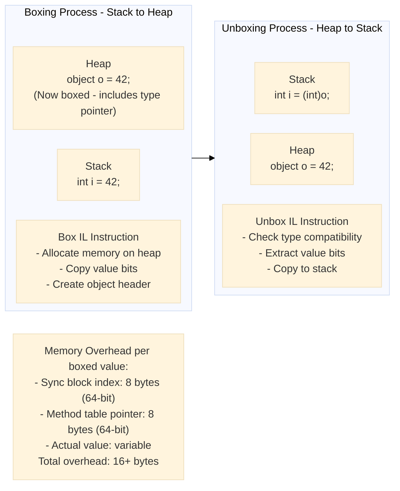

# Boxing is the process of converting a value type t

```mermaid
---
config:
  theme: base
  layout: elk
---
flowchart LR
    subgraph BOXING ["Boxing Process - Stack to Heap"]
        STACK["Stack<br/>int i = 42;"]
        BOX_OP["Box IL Instruction<br/>- Allocate memory on heap<br/>- Copy value bits<br/>- Create object header"]
        HEAP["Heap<br/>object o = 42;<br/>(Now boxed - includes type pointer)"]
    end
    
    subgraph UNBOXING ["Unboxing Process - Heap to Stack"]
        HEAP2["Heap<br/>object o = 42;"]
        UNBOX_OP["Unbox IL Instruction<br/>- Check type compatibility<br/>- Extract value bits<br/>- Copy to stack"]
        STACK2["Stack<br/>int i = (int)o;"]
    end
    
    BOXING --> UNBOXING
    
    MEM_OVERHEAD["Memory Overhead per boxed value:<br/>- Sync block index: 8 bytes (64-bit)<br/>- Method table pointer: 8 bytes (64-bit)<br/>- Actual value: variable<br/>Total overhead: 16+ bytes"]
```
