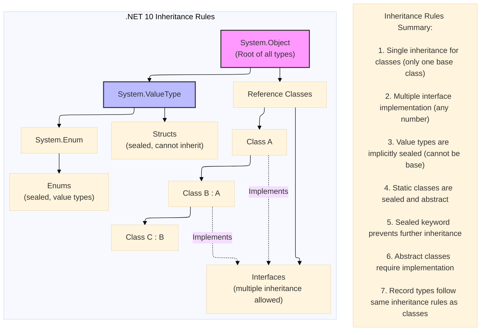

# ### 2.6 CTS Type Inheritance Rules — Complete Spec

```mermaid
---
config:
  theme: base
  layout: elk
---
flowchart TD
    subgraph INHERITANCE [".NET 10 Inheritance Rules"]
        OBJECT["System.Object<br/>(Root of all types)"]
        
        OBJECT --> VALUETYPE["System.ValueType"]
        OBJECT --> REFCLASS["Reference Classes"]
        
        VALUETYPE --> ENUMBASE["System.Enum"]
        VALUETYPE --> STRUCTBASE["Structs<br/>(sealed, cannot inherit)"]
        
        ENUMBASE --> ENUMS["Enums<br/>(sealed, value types)"]
        
        REFCLASS --> C1["Class A"]
        C1 --> C2["Class B : A"]
        C2 --> C3["Class C : B"]
        
        REFCLASS --> INTERFACES["Interfaces<br/>(multiple inheritance allowed)"]
        
        C1 -.->|Implements| INTERFACES
        C2 -.->|Implements| INTERFACES
        
        style OBJECT fill:#f9f,stroke:#333,stroke-width:2px
        style VALUETYPE fill:#bbf,stroke:#333,stroke-width:2px
    end
    
    RULES["Inheritance Rules Summary:<br/>
    1. Single inheritance for classes (only one base class)<br/>
    2. Multiple interface implementation (any number)<br/>
    3. Value types are implicitly sealed (cannot be base)<br/>
    4. Static classes are sealed and abstract<br/>
    5. Sealed keyword prevents further inheritance<br/>
    6. Abstract classes require implementation<br/>
    7. Record types follow same inheritance rules as classes"]
```
