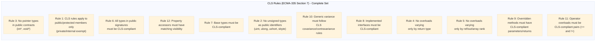

# ### 3.2 CLS Rules — Complete List (from ECMA-335)

```mermaid
---
config:
  theme: base
  layout: elk
---
flowchart TD
    subgraph CLS_RULES ["CLS Rules (ECMA-335 Section 7) - Complete Set"]
        R1["Rule 1: CLS rules apply to<br/>public/protected members only<br/>(private/internal exempt)"]
        R2["Rule 2: No unsigned types<br/>as public identifiers<br/>(uint, ulong, ushort, sbyte)"]
        R3["Rule 3: No pointer types<br/>in public contracts<br/>(int*, void*)"]
        R4["Rule 4: No overloads varying<br/>only by return type"]
        R5["Rule 5: No overloads varying<br/>only by ref/out/array rank"]
        R6["Rule 6: All types in public signatures<br/>must be CLS-compliant"]
        R7["Rule 7: Base types must be<br/>CLS-compliant"]
        R8["Rule 8: Implemented interfaces must be<br/>CLS-compliant"]
        R9["Rule 9: Overridden methods must have<br/>CLS-compliant parameters/returns"]
        R10["Rule 10: Generic variance must follow<br/>CLS covariance/contravariance rules"]
        R11["Rule 11: Operator overloads must be<br/>CLS-compliant pairs (== and !=)"]
        R12["Rule 12: Property accessors must have<br/>matching visibility"]
    end
```
