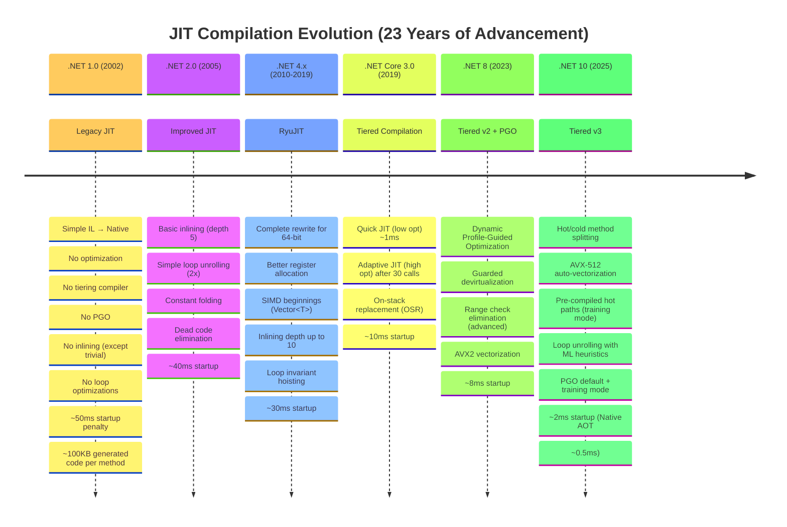

# ### 4.1 JIT Evolution: .NET 1.0 → .NET 8 → .NET 10

```mermaid
---
config:
  theme: base
  layout: elk
---
timeline
    title JIT Compilation Evolution (23 Years of Advancement)
    section .NET 1.0 (2002)
        Legacy JIT : Simple IL → Native
                  : No optimization
                  : No tiering compiler
                  : No PGO
                  : No inlining (except trivial)
                  : No loop optimizations
                  : ~50ms startup penalty
                  : ~100KB generated code per method
    section .NET 2.0 (2005)
        Improved JIT : Basic inlining (depth 5)
                    : Simple loop unrolling (2x)
                    : Constant folding
                    : Dead code elimination
                    : ~40ms startup
    section .NET 4.x (2010-2019)
        RyuJIT : Complete rewrite for 64-bit
               : Better register allocation
               : SIMD beginnings (Vector<T>)
               : Inlining depth up to 10
               : Loop invariant hoisting
               : ~30ms startup
    section .NET Core 3.0 (2019)
        Tiered Compilation : Quick JIT (low opt) ~1ms
                           : Adaptive JIT (high opt) after 30 calls
                           : On-stack replacement (OSR)
                           : ~10ms startup
    section .NET 8 (2023)
        Tiered v2 + PGO : Dynamic Profile-Guided Optimization
                        : Guarded devirtualization
                        : Range check elimination (advanced)
                        : AVX2 vectorization
                        : ~8ms startup
    section .NET 10 (2025)
        Tiered v3 : Hot/cold method splitting
                  : AVX-512 auto-vectorization
                  : Pre-compiled hot paths (training mode)
                  : Loop unrolling with ML heuristics
                  : PGO default + training mode
                  : ~2ms startup (Native AOT: ~0.5ms)
```
