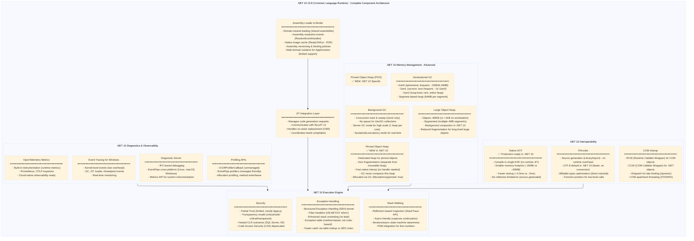

# ### 5.1 CLR Component Architecture (.NET 10 — Comp

```mermaid
---
config:
  theme: base
  layout: elk
---
flowchart TB
    subgraph CLR [".NET 10 CLR (Common Language Runtime) - Complete Component Architecture"]
        
        LOADER["Assembly Loader & Binder<br/>━━━━━━━━━━━━━━━━━━━━━━━━━━━━━━━━━<br/>- Domain-neutral loading (shared assemblies)<br/>- Assembly resolution events (ResolveEventHandler)<br/>- Native image cache (ReadyToRun - R2R)<br/>- Assembly versioning & binding policies<br/>- Multi-domain isolation for AppDomains (limited support)"]
        
        LOADER --> JIT_INT["JIT Integration Layer<br/>━━━━━━━━━━━━━━━━━━━━━━━━━━━━━━━━━<br/>- Manages code generation requests<br/>- Communicates with RyuJIT v3<br/>- Handles on-stack replacement (OSR)<br/>- Coordinates tiered compilation"]
        
        subgraph MEM [".NET 10 Memory Management - Advanced"]
            direction LR
            GC["Generational GC<br/>━━━━━━━━━━━━━━━━━━━━━━━━━━━━━━━━━<br/>- Gen0 (ephemeral, frequent, ~256KB-16MB)<br/>- Gen1 (survivor, less frequent, ~2x Gen0)<br/>- Gen2 (long-lived, rare, entire heap)<br/>- Segment-based heap (64MB per segment)"]
            
            BGC["Background GC<br/>━━━━━━━━━━━━━━━━━━━━━━━━━━━━━━━━━<br/>- Concurrent mark & sweep (Gen2 only)<br/>- No pause for Gen0/1 collections<br/>- Server GC mode for high scale (1 heap per core)<br/>- SustainedLowLatency mode for real-time"]
            
            NONG["Pinned Object Heap<br/>✅ NEW in .NET 10<br/>━━━━━━━━━━━━━━━━━━━━━━━━━━━━━━━━━<br/>- Dedicated heap for pinned objects<br/>- Zero fragmentation (separate from moveable heap)<br/>- Fast native interop (no handle needed)<br/>- GC never compacts this heap<br/>- Allocated via GC.AllocateArray(pinned: true)"]
            
            LOH["Large Object Heap<br/>━━━━━━━━━━━━━━━━━━━━━━━━━━━━━━━━━<br/>- Objects >85KB (or >1KB on workstation)<br/>- Segmented (multiple 4MB segments)<br/>- Background compaction in .NET 10<br/>- Reduced fragmentation for long-lived large objects"]
            
            POH["Pinned Object Heap (POH)<br/>✅ NEW .NET 10 Specific"]
        end
        
        subgraph EXEC [".NET 10 Execution Engine"]
            EXCEPT["Exception Handling<br/>━━━━━━━━━━━━━━━━━━━━━━━━━━━━━━━━━<br/>- Structured Exception Handling (SEH) kernel<br/>- Filter handlers (VB.NET/C# 'when')<br/>- Enhanced stack unwinding (no leak)<br/>- Exception table (method-based, not code-based)<br/>- Faster catch via table lookup vs SEH chain"]
            
            STACK["Stack Walking<br/>━━━━━━━━━━━━━━━━━━━━━━━━━━━━━━━━━<br/>- Reflection-based inspection (StackTrace API)<br/>- Async-friendly (captures continuation)<br/>- Iterators/async state machine awareness<br/>- PDB integration for line numbers"]
            
            SEC["Security<br/>━━━━━━━━━━━━━━━━━━━━━━━━━━━━━━━━━<br/>- Partial Trust (limited, mostly legacy)<br/>- Transparency model (critical/safe-critical/transparent)<br/>- Hosted CLR scenarios (SQL Server, IIS)<br/>- Code Access Security (CAS) deprecated"]
        end
        
        subgraph INTEROP [".NET 10 Interoperability"]
            PINT["P/Invoke<br/>━━━━━━━━━━━━━━━━━━━━━━━━━━━━━━━━━<br/>- Source generation (LibraryImport) - no runtime overhead<br/>- UTF-8 default in .NET 10 (faster, no conversion)<br/>- Blittable types optimization (direct marshal)<br/>- Function pointers for low-level calls"]
            
            COM["COM Interop<br/>━━━━━━━━━━━━━━━━━━━━━━━━━━━━━━━━━<br/>- RCW (Runtime Callable Wrapper) for COM objects<br/>- CCW (COM Callable Wrapper) for .NET objects<br/>- IDispatch for late binding (dynamic)<br/>- COM apartment threading (STA/MTA)"]
            
            NAT_AOT["Native AOT<br/>✅ Production-ready in .NET 10<br/>━━━━━━━━━━━━━━━━━━━━━━━━━━━━━━━━━<br/>- Compile to single EXE (no runtime JIT)<br/>- Smaller memory footprint (~20MB vs ~60MB)<br/>- Faster startup (~0.5ms vs ~2ms)<br/>- No reflection limitations (source-generated)"]
        end
        
        subgraph MONITOR [".NET 10 Diagnostics & Observability"]
            ETW["Event Tracing for Windows<br/>━━━━━━━━━━━━━━━━━━━━━━━━━━━━━━━━━<br/>- Kernel-level events (low overhead)<br/>- GC, JIT, loader, threadpool events<br/>- Real-time monitoring"]
            
            DIAG["Diagnostic Server<br/>━━━━━━━━━━━━━━━━━━━━━━━━━━━━━━━━━<br/>- IPC-based debugging<br/>- EventPipe cross-platform (Linux, macOS, Windows)<br/>- Metrics API for custom instrumentation"]
            
            METRICS["OpenTelemetry Metrics<br/>━━━━━━━━━━━━━━━━━━━━━━━━━━━━━━━━━<br/>- Built-in instrumentation (runtime metrics)<br/>- Prometheus, OTLP exporters<br/>- Cloud-native observability ready"]
            
            PROFILING["Profiling APIs<br/>━━━━━━━━━━━━━━━━━━━━━━━━━━━━━━━━━<br/>- ICORProfilerCallback (unmanaged)<br/>- EventPipe profilers (managed friendly)<br/>- Allocation profiling, method enter/leave"]
        end
    end
    
    JIT_INT --> EXEC
    MEM --> EXEC
    INTEROP --> EXEC
    MONITOR --> EXEC
```
