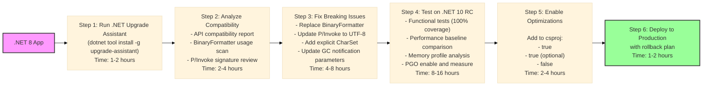

# ### 7.2 Recommended Upgrade Path with Timeline

```mermaid
---
config:
  theme: base
  layout: elk
---
flowchart LR
    APP[".NET 8 App"] --> ASSIST["Step 1: Run .NET Upgrade Assistant<br/>(dotnet tool install -g upgrade-assistant)<br/>Time: 1-2 hours"]
    
    ASSIST --> ANALYZE["Step 2: Analyze Compatibility<br/>- API compatibility report<br/>- BinaryFormatter usage scan<br/>- P/Invoke signature review<br/>Time: 2-4 hours"]
    
    ANALYZE --> FIX["Step 3: Fix Breaking Issues<br/>- Replace BinaryFormatter<br/>- Update P/Invoke to UTF-8<br/>- Add explicit CharSet<br/>- Update GC notification parameters<br/>Time: 4-8 hours"]
    
    FIX --> TEST["Step 4: Test on .NET 10 RC<br/>- Functional tests (100% coverage)<br/>- Performance baseline comparison<br/>- Memory profile analysis<br/>- PGO enable and measure<br/>Time: 8-16 hours"]
    
    TEST --> PERF["Step 5: Enable Optimizations<br/><br/>Add to csproj:<br/>- <TieredPGO>true</TieredPGO><br/>- <PublishAot>true</PublishAot> (optional)<br/>- <EnableUnsafeBinaryFormatter>false</EnableUnsafeBinaryFormatter><br/>Time: 2-4 hours"]
    
    PERF --> PROD["Step 6: Deploy to Production<br/>with rollback plan<br/>Time: 1-2 hours"]
    
    style APP fill:#f9f,stroke:#333,stroke-width:2px
    style PROD fill:#9f9,stroke:#333,stroke-width:2px
```
