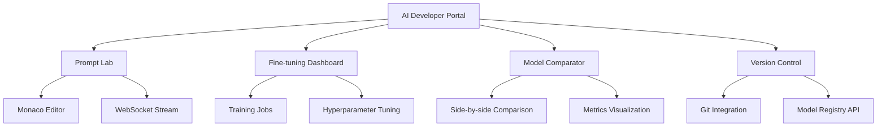
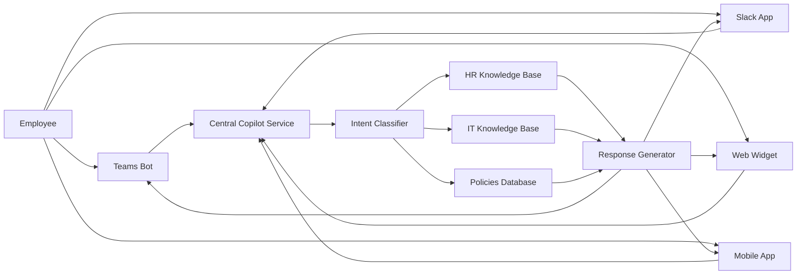
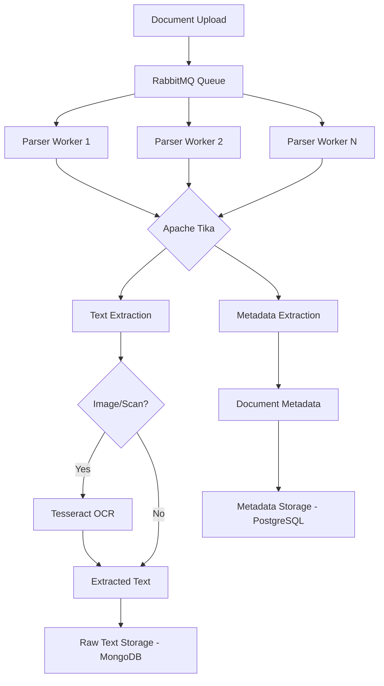
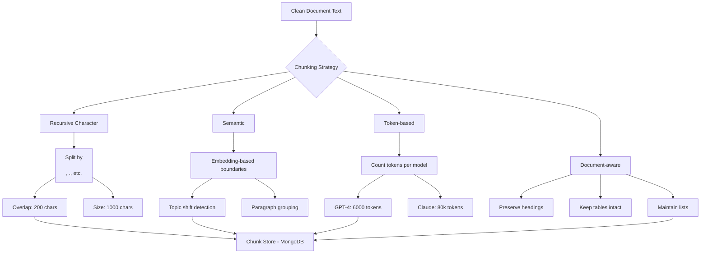
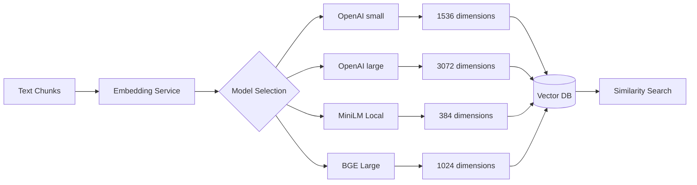
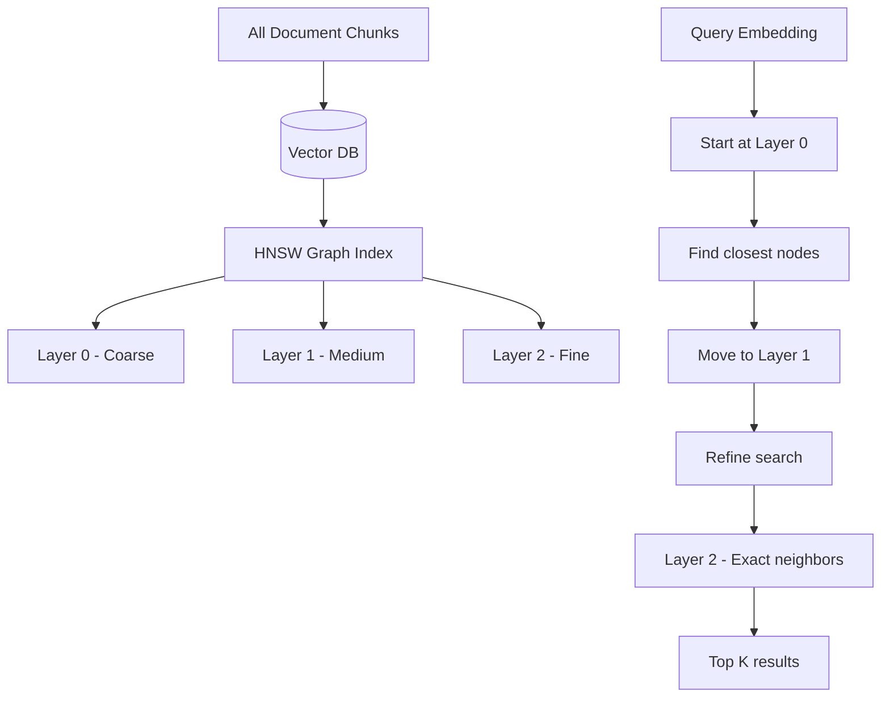

# Enterprise AI Architecture Part 1: The Foundation - User Access & Data Ingestion
## The Foundation: User Access & Data Ingestion


# INTRODUCTION: The Digital Brain Blueprint

Imagine walking into the world's most advanced library. It contains every book your company has ever written, every email ever sent, every policy ever created, and every piece of customer data ever collected. Now imagine having a librarian who has read every single one of those books, remembers them perfectly, and can answer any question by synthesizing information across millions of pages in seconds.

That librarian is an Enterprise AI system.

But building such a librarian isn't just about hiring the smartest person (or in our case, the largest language model). It's about designing the entire library system—the cataloging system, the security checkpoints, the retrieval mechanisms, and the quality control processes.

This four-part series takes you on a journey through that library. We'll explore how users enter, how documents are processed, how knowledge is stored, how decisions are made, and how we ensure everything runs smoothly and securely.

**In Part 1**, we lay the foundation. We'll start at the front door—understanding who uses the system and how they authenticate. Then we'll go to the loading dock where millions of documents are ingested, parsed, chunked, and converted into searchable knowledge. This is where raw data becomes intelligent information.

**Coming up in Part 2**, we'll explore the heart of the system—the models themselves, the routing layer that decides which model to use, and the agent framework that turns simple Q&A into complex task execution.

**Part 3** dives into the execution environment—how agents actually interact with your enterprise systems, access databases, and retrieve documents securely.

**Part 4** concludes with the control room—observability, governance, security, and all the cross-cutting concerns that keep the system running smoothly and compliantly.

Let's begin our journey through the Enterprise AI Architecture.

---

# PART 1: USER ACCESS & DATA INGESTION

## Chapter 1: The Four Faces at the Door - User Layer

Every great library has different types of visitors. The researcher needs access to restricted archives. The casual reader just wants the latest bestseller. The librarian needs to manage the catalog. And the security team needs to monitor who comes and goes.

In our Enterprise AI system, we have four distinct personas, each with their own needs, interfaces, and access levels.

### 1.1 AI Developer Portal

**The Persona**: Meet Sarah, a Machine Learning Engineer. She doesn't just want to ask questions; she wants to understand why the model gives certain answers, experiment with different prompts, fine-tune models on specific datasets, and compare performance across versions.

**Technical Deep Dive**: The AI Developer Portal is a sophisticated environment that combines code editing, visualization, and model management. It's built on React 18 for a responsive UI, with Monaco Editor (the same editor that powers VS Code) for prompt engineering. Real-time updates are handled via WebSocket connections, allowing developers to see model outputs stream in character by character.



**The Layman Explanation**: Imagine a chef's kitchen designed for creating and perfecting recipes. Sarah has access to all the ingredients (models), tools (prompts), and testing equipment (evaluation metrics). She can try different combinations, see immediate results, and save her favorite recipes for others to use.


**Storage & State Management:**
```javascript
// Session state in Redis
{
  "session_id": "sess_123xyz",
  "user_id": "dev_sarah",
  "active_prompt": "Summarize the quarterly report...",
  "experiment_results": [
    {"model": "gpt-4", "latency": 450, "tokens": 150},
    {"model": "claude", "latency": 520, "tokens": 142}
  ],
  "draft_prompts": ["prompt_1", "prompt_2"],
  "expires_in": 86400 // 24 hours
}
```

### 1.2 Business User Dashboard

**The Persona**: Meet Michael, a Product Manager. He needs to understand customer feedback trends, but he doesn't know SQL. He wants to ask "Show me all customer complaints about the new mobile app from last month" and get an instant visualization with insights.

**Technical Deep Dive**: The Business User Dashboard combines natural language processing with business intelligence. Built on Next.js for server-side rendering and SEO, it uses AG Grid for handling large datasets and D3.js for custom visualizations. The magic happens in the NL2SQL (Natural Language to SQL) layer, which converts Michael's question into a database query.

```python
# NL2SQL Conversion Pipeline
class NL2SQLService:
    def process_query(self, natural_language_query):
        # Step 1: Identify entities and intent
        intent = self.classify_intent(natural_language_query)
        
        # Step 2: Extract filters and time ranges
        filters = self.extract_filters(natural_language_query)
        
        # Step 3: Map to database schema
        sql = self.generate_sql(intent, filters)
        
        # Step 4: Execute safely with row-level security
        results = self.execute_with_rls(sql, user_permissions)
        
        # Step 5: Determine visualization type
        viz_type = self.suggest_visualization(results)
        
        return {"data": results, "viz": viz_type}
```

**The Layman Explanation**: Think of Michael as someone who speaks only English walking into a foreign country where everyone speaks SQL. The Business User Dashboard is like having a real-time translator that not only converts his questions into database language but also draws pictures of the answers.

### 1.3 Employee Copilot Interface

**The Persona**: Meet Priya, a new HR Coordinator. She needs to understand the company's parental leave policy, find the form for updating employee records, and check if she has the correct permissions—all while onboarding herself.

**Technical Deep Dive**: The Employee Copilot is a multi-channel interface that meets employees where they are—Microsoft Teams, Slack, mobile apps, or web widgets. Built on the Bot Framework SDK for Teams and Slack Bolt for Slack, it maintains conversation context across channels.



**The Layman Explanation**: Imagine having a personal assistant who follows you everywhere—on your computer, your phone, your chat apps—and has read every company document ever created. You can ask questions naturally, and the assistant instantly finds answers across all company knowledge.


### 1.4 AI Admin Console

**The Persona**: Meet David, the IT Director. He doesn't care about individual questions. He cares about costs, security, compliance, and system health. He needs to know which departments are using the most tokens, set budget alerts, review audit logs, and configure access permissions.

**Technical Deep Dive**: The Admin Console is built on Angular 17 with PrimeNG for enterprise-grade admin components. It integrates directly with Prometheus for real-time metrics, Elasticsearch for log exploration, and custom services for quota management.

```javascript
// Real-time cost dashboard data
const costDashboard = {
  daily_total: 2450.75,
  by_department: [
    { name: "Engineering", cost: 1250.30, tokens: 5_200_000, trend: "+12%" },
    { name: "Sales", cost: 650.20, tokens: 2_800_000, trend: "-3%" },
    { name: "HR", cost: 320.15, tokens: 1_400_000, trend: "+5%" },
    { name: "Finance", cost: 230.10, tokens: 950_000, trend: "+1%" }
  ],
  budget_alerts: [
    { department: "Engineering", threshold: "80%", current: "78%" },
    { department: "Marketing", threshold: "90%", current: "92%", critical: true }
  ],
  system_health: {
    api_latency_p95: 450, // ms
    error_rate: "0.23%",
    active_users: 342,
    queue_depth: 12
  }
};
```

**The Layman Explanation**: David is the air traffic controller. While pilots (users) focus on their individual flights, David watches the radar, manages fuel (budgets), ensures no planes get too close (security), and handles emergencies. His console shows the big picture.


---

## Chapter 2: The Security Checkpoint - API Gateway & Identity

Before anyone enters our library, they must pass through security. We need to know who they are, what they're allowed to access, and ensure their credentials haven't been compromised.

### 2.1 OAuth2 / OIDC Authentication

**The Scenario**: Sarah (our ML Engineer) logs in through her company single sign-on. The system needs to verify her identity, understand her role, and generate secure tokens for subsequent API calls.

**Technical Deep Dive**: We use Keycloak as our identity provider, which integrates with corporate Active Directory via SAML. When Sarah logs in, she's issued a JWT (JSON Web Token) containing her identity claims.

```mermaid
sequenceDiagram
    participant User as Sarah (AI Developer)
    portal Browser as Developer Portal
    participant Keycloak as Keycloak IdP
    participant AD as Active Directory
    participant API as API Gateway
    
    User->>Browser: Clicks "Login with SSO"
    Browser->>Keycloak: Redirect to /auth
    Keycloak->>AD: Validate credentials
    AD-->>Keycloak: Authentication success
    Keycloak-->>Browser: Authorization code
    Browser->>Keycloak: Exchange code for tokens
    Keycloak-->>Browser: Access Token (JWT) + Refresh Token
    Browser->>API: API Request + Bearer Token
    API->>API: Validate JWT signature
    API->>API: Check expiry & permissions
    API-->>Browser: Response
```

**JWT Token Structure:**
```json
{
  "header": {
    "alg": "RS256",
    "typ": "JWT",
    "kid": "key-id-123"
  },
  "payload": {
    "sub": "user-123-456",
    "email": "sarah@company.com",
    "name": "Sarah Chen",
    "department": "AI-Engineering",
    "roles": ["ai-developer", "model-trainer"],
    "permissions": ["models:read", "models:fine-tune", "prompts:write"],
    "iat": 1710931200,
    "exp": 1710934800,
    "iss": "https://auth.company.com",
    "aud": "ai-platform"
  }
}
```

**The Layman Explanation**: Think of this like a hotel key card. When you check in, the front desk verifies your identity and gives you a card that works for your specific room, the gym, and the pool—but not the staff areas. The card expires at checkout. Similarly, Sarah gets a digital "key card" (JWT) that works for the AI systems she's authorized to use for a limited time.


### 2.2 RBAC & Zero Trust Access

**The Scenario**: Sarah should access the model training interface but not the billing dashboard. Even within model training, she should only access models her team owns, not finance department models.

**Technical Deep Dive**: We implement Role-Based Access Control (RBAC) using Open Policy Agent (OPA). Every API request includes the JWT, and OPA evaluates policies to determine if the action is permitted.

**OPA Policy Example (Rego language):**
```rego
package authz

# Default deny
default allow = false

# Allow if user has required role and resource access
allow {
    # Check role requirement
    input.user.roles[_] == input.required_role
    
    # Check resource ownership or team access
    resource_allowed
}

# Resource access rule
resource_allowed {
    # Public resources accessible to all
    input.resource.public == true
}

resource_allowed {
    # Team resources accessible to team members
    input.user.team == input.resource.owner_team
}

resource_allowed {
    # Admin override
    "admin" in input.user.roles
}
```

**Zero Trust Implementation:**
Beyond just authentication, we implement Zero Trust principles:
- **mTLS**: Every service-to-service call is encrypted and mutually authenticated
- **Continuous Verification**: Even after authentication, suspicious behavior triggers re-verification
- **Least Privilege**: Services get minimum permissions needed, rotated regularly

```yaml
# Istio mTLS configuration
apiVersion: security.istio.io/v1beta1
kind: PeerAuthentication
metadata:
  name: default
  namespace: ai-platform
spec:
  mtls:
    mode: STRICT  # Enforce mTLS for all services
---
apiVersion: security.istio.io/v1beta1
kind: AuthorizationPolicy
metadata:
  name: model-service-policy
spec:
  selector:
    matchLabels:
      app: model-service
  rules:
  - from:
    - source:
        principals: ["cluster.local/ns/ai-platform/sa/api-gateway"]
    to:
    - operation:
        methods: ["POST"]
        paths: ["/v1/completions"]
```

**The Layman Explanation**: RBAC is like different access cards for different buildings. Sarah's card works for the Engineering building but not Finance. Zero Trust is like having security guards who don't just check your card once—they keep verifying you're supposed to be there, even after you're inside. If you suddenly try to enter a restricted area, they'll stop you immediately.


---

## Chapter 3: The Loading Dock - RAG Ingestion Pipeline

Now we enter the heart of our library's operations—the loading dock where millions of documents arrive daily, are processed, cataloged, and shelved. This is the RAG (Retrieval-Augmented Generation) pipeline.

### 3.1 Document Parsing

**The Scenario**: Our company generates thousands of documents daily—PDF reports, Word docs, PowerPoint presentations, emails, Slack messages, and scanned images. They're in different formats, languages, and quality levels. We need to extract the text content from all of them.

**Technical Deep Dive**: We use Apache Tika as our universal document parser, backed by Tesseract for OCR (Optical Character Recognition) on images and scanned documents. The system processes documents asynchronously through a RabbitMQ queue.



**The Challenge**: Different document types require different approaches:
- **PDFs**: Extract text with layout preservation, handle forms, extract tables
- **Word Docs**: Preserve styles, headings, comments
- **Images**: OCR with language detection, deskewing, noise reduction
- **Emails**: Extract headers, attachments, thread structure

```python
# Document parser worker
class DocumentParser:
    async def parse_document(self, file_path: str, doc_type: str):
        try:
            if doc_type == "pdf":
                text = await self.parse_pdf(file_path)
            elif doc_type == "image":
                text = await self.ocr_image(file_path)
            elif doc_type == "email":
                text = await self.parse_email(file_path)
            else:
                text = await self.parse_with_tika(file_path)
            
            # Extract metadata
            metadata = await self.extract_metadata(file_path, text)
            
            # Store results
            doc_id = await self.store_document(text, metadata)
            
            # Publish for next stage
            await self.publish_for_chunking(doc_id)
            
            return {"doc_id": doc_id, "status": "success"}
            
        except Exception as e:
            await self.log_error(file_path, str(e))
            return {"status": "failed", "error": str(e)}
```

**The Layman Explanation**: Imagine a massive mail sorting facility. Documents arrive in all shapes and sizes—letters, packages, postcards, even things written in different languages. The parsing system is like having workers who can open any package, read any language, and extract the important information, regardless of how it arrives. They then put the contents on a conveyor belt for the next step.


### 3.2 Data Privacy Filter (PII Redaction)

**The Scenario**: Among our documents are employee records with social security numbers, customer contracts with credit card information, and internal emails with personal addresses. Before any document enters the AI system, we must protect this sensitive information.

**Technical Deep Dive**: We implement Microsoft Presidio for PII detection, combined with custom regex patterns and fine-tuned NER models. The system runs in real-time as documents are parsed.

```python
# PII detection and redaction
class PIIRedactor:
    def __init__(self):
        self.analyzer = AnalyzerEngine()
        self.anonymizer = AnonymizerEngine()
        
    async def redact_pii(self, text: str, doc_type: str):
        # Analyze text for PII
        results = await self.analyzer.analyze(
            text=text,
            language='en',
            entities=[
                "PERSON", "EMAIL_ADDRESS", "PHONE_NUMBER",
                "CREDIT_CARD", "SSN", "DATE_TIME", "LOCATION",
                "NRP", "MEDICAL_LICENSE", "PASSPORT"
            ],
            score_threshold=0.6
        )
        
        # Redact based on document sensitivity
        if doc_type == "public":
            operator = "replace"  # Replace with [REDACTED]
        elif doc_type == "internal":
            operator = "mask"     # Mask first/last characters
        else:  # confidential
            operator = "remove"   # Remove entirely
        
        redacted_text = await self.anonymizer.anonymize(
            text=text,
            analyzer_results=results,
            operators={operator: {"type": operator}}
        )
        
        # Log redactions for audit
        await self.log_redaction(results)
        
        return redacted_text
```

**Detection Accuracy:**
| PII Type | Detection Method | Accuracy | Action |
|----------|-----------------|----------|--------|
| SSN | Pattern + Checksum | 99.5% | Block |
| Credit Card | Luhn Algorithm + Pattern | 99.8% | Block |
| Email | Regex | 99.9% | Mask |
| Phone | Regex + Context | 98.5% | Mask |
| Person Name | NER Model | 94% | Replace |
| Address | NER + Regex | 87% | Generalize |

**The Layman Explanation**: Think of this as an automatic privacy filter, like the blurring of faces on Google Street View. As documents flow through, the system automatically detects sensitive information and obscures it—replacing names with "[NAME]", blocking out credit card numbers entirely, or masking email addresses. No human ever sees the original sensitive data.


### 3.3 Chunking Strategies

**The Scenario**: We now have clean text, but language models can only process limited amounts at once (context windows). A 100-page document won't fit. We need to break documents into smaller, meaningful pieces.

**Technical Deep Dive**: We implement multiple chunking strategies, selecting the best approach based on document type and intended use.



**Recursive Character Chunking** (General purpose):
```python
# LangChain implementation
text_splitter = RecursiveCharacterTextSplitter(
    chunk_size=1000,
    chunk_overlap=200,
    separators=["\n\n", "\n", ".", "!", "?", ",", " ", ""],
    keep_separator=False
)
chunks = text_splitter.split_text(document_text)
```

**Semantic Chunking** (For complex documents):
```python
def semantic_chunking(text):
    # Split into sentences
    sentences = sent_tokenize(text)
    
    # Generate embeddings
    embeddings = sentence_model.encode(sentences)
    
    # Detect topic shifts using change point detection
    shifts = detect_change_points(embeddings)
    
    # Group sentences between shifts
    chunks = []
    start = 0
    for shift in shifts:
        chunk = " ".join(sentences[start:shift])
        chunks.append(chunk)
        start = shift
    
    return chunks
```

**Token-based Chunking** (Model-optimized):
| Model | Max Tokens | Optimal Chunk | Overlap |
|-------|------------|---------------|---------|
| GPT-3.5 | 4096 | 3000 | 200 |
| GPT-4 | 8192 | 6000 | 400 |
| Claude 2 | 100k | 80k | 1000 |
| Llama 2 | 4096 | 3000 | 200 |
| Mistral | 8192 | 6000 | 400 |

**The Layman Explanation**: Imagine you have a very long encyclopedia. You can't give the whole thing to someone to read at once. Instead, you break it into articles, then paragraphs, ensuring each piece makes sense on its own. Chunking does this automatically—it knows where paragraphs end, where topics change, and how much each AI model can handle at once.


### 3.4 Embedding Generation

**The Scenario**: Text chunks are great for humans, but computers need numbers. We need to convert each chunk into a mathematical representation (vector) that captures its meaning.

**Technical Deep Dive**: We use embedding models to convert text into vectors—lists of hundreds of numbers. Similar meanings produce similar vectors, enabling semantic search.



**Embedding Models Comparison**:
| Model | Dimensions | Quality | Speed | Cost | Use Case |
|-------|------------|---------|-------|------|----------|
| text-embedding-3-small | 1536 | High | Fast | $0.13/1M | General purpose |
| text-embedding-3-large | 3072 | Very High | Medium | $0.26/1M | High precision |
| all-MiniLM-L6-v2 | 384 | Good | Very Fast | Free (local) | Low latency |
| bge-large-en-v1.5 | 1024 | High | Medium | Free (local) | Quality/cost balance |

**Vector Mathematics**:
```
Word: "king"
Vector: [0.324, -0.123, 0.856, ..., 0.234]  # 1536 numbers

Word: "queen"
Vector: [0.319, -0.118, 0.849, ..., 0.241]  # Similar numbers

Word: "car"
Vector: [-0.542, 0.876, -0.234, ..., 0.567]  # Different numbers

Similarity = cosine(king, queen) ≈ 0.85 (close)
Similarity = cosine(king, car) ≈ 0.12 (far apart)
```

**The Layman Explanation**: Think of this like creating a fingerprint for each piece of text. Every chunk gets a unique fingerprint—but fingerprints for similar topics look alike. "Quarterly earnings report" and "financial results" have similar fingerprints, while "puppy training tips" looks completely different. These fingerprints let us find similar content instantly.


### 3.5 Embeddings Cache (Redis)

**The Scenario**: Many queries are repeated—"What's the vacation policy?" might be asked hundreds of times daily. Generating embeddings for the same query repeatedly wastes time and money.

**Technical Deep Dive**: We implement a multi-tier cache using Redis, storing embeddings for frequent queries.

```python
class EmbeddingCache:
    def __init__(self):
        self.redis = Redis(host='redis-cluster', decode_responses=False)
        self.local_cache = LRUCache(maxsize=1000)  # L1 cache
        
    async def get_embedding(self, text: str, model: str):
        # Generate cache key
        key = f"emb:{model}:{hash(text)}"
        
        # Check L1 cache (local memory)
        if key in self.local_cache:
            return self.local_cache[key]
        
        # Check L2 cache (Redis)
        cached = await self.redis.get(key)
        if cached:
            # Deserialize and store in L1
            embedding = pickle.loads(cached)
            self.local_cache[key] = embedding
            return embedding
        
        # Generate new embedding
        embedding = await self.generate_embedding(text, model)
        
        # Store in Redis (24 hour TTL)
        await self.redis.setex(
            key, 
            86400, 
            pickle.dumps(embedding)
        )
        
        return embedding
```

**Cache Performance**:
| Tier | Hit Rate | Latency | Capacity |
|------|----------|---------|----------|
| L1 (Memory) | 20% | <1ms | 1000 items |
| L2 (Redis) | 70% | 5ms | 1M items |
| Miss (Generate) | 10% | 200ms | Unlimited |

**The Layman Explanation**: Imagine a library with a "frequently asked questions" shelf. Instead of searching through millions of books every time someone asks about vacation policy, the librarian keeps the most popular answers right at the front desk. Our embedding cache does the same—keeping the most common question fingerprints instantly accessible.


### 3.6 Vector Database & Indexing

**The Scenario**: We now have millions of document chunks, each with a vector fingerprint. When someone asks a question, we need to find the most relevant chunks among millions in milliseconds.

**Technical Deep Dive**: We use Qdrant as our vector database, which implements HNSW (Hierarchical Navigable Small World) graphs for fast approximate nearest neighbor search.



**Vector Database Schema**:
```sql
-- Collection: document_chunks
{
  "id": "chunk_123456",
  "vector": [0.123, -0.456, ..., 0.789],  -- 1536 dimensions
  "payload": {
    "content": "The vacation policy allows 20 days per year...",
    "document_id": "doc_789",
    "document_title": "HR Policy Manual 2024",
    "chunk_index": 42,
    "page_number": 15,
    "section": "Benefits",
    "department": "HR",
    "created_at": "2024-01-15T10:00:00Z",
    "embedding_model": "text-embedding-3-small"
  }
}
```

**Search Performance**:
| Collection Size | Index Type | Latency (p95) | Recall@10 |
|-----------------|------------|----------------|-----------|
| 100k chunks | HNSW | 10ms | 0.99 |
| 1M chunks | HNSW | 25ms | 0.98 |
| 10M chunks | HNSW + Filtering | 50ms | 0.97 |
| 100M chunks | Distributed | 100ms | 0.95 |

**The Layman Explanation**: Imagine you have a massive warehouse with millions of boxes, each labeled with a complex pattern. You need to find the boxes most similar to a query pattern. Vector databases build a "neighborhood map"—boxes with similar patterns are stored near each other. When you search, you go to the rough neighborhood, then the right street, then the specific house. You find what you need without checking every box.

# PART 1 CONCLUSION

We've built the foundation of our Enterprise AI system. Users can now authenticate securely, documents flow through our ingestion pipeline, are cleaned of sensitive information, broken into meaningful chunks, converted to vector fingerprints, and stored in a searchable database.

**What We've Accomplished:**
- ✅ Four user personas identified with tailored interfaces
- ✅ Secure authentication with OAuth2/OIDC and Zero Trust
- ✅ Document parsing handling multiple formats
- ✅ PII detection and redaction for privacy
- ✅ Intelligent chunking strategies for different document types
- ✅ Embedding generation converting text to vectors
- ✅ Multi-tier caching for performance
- ✅ Vector database for semantic search

**The Journey Ahead:**

In **Part 2**, we'll bring this knowledge to life. We'll explore:
- The model infrastructure—connecting to OpenAI, Claude, Mistral, and running local models
- The intelligent router that decides which model to use based on cost, latency, and capability
- The prompt library that stores and versions our best prompts
- The agent orchestrator that turns simple Q&A into complex, multi-step tasks

The library now has its books processed and shelved. In Part 2, we'll hire our librarians.

---

**Coming Next: Enterprise AI Architecture - Part 2: The Brain - Models, Routing & Agents**

*In Part 2, we'll explore how queries are processed, how we choose between different AI models, and how agents break down complex tasks into executable steps.*
