# Enterprise AI Architecture Part 2: The Brain - Models, Routing & Intelligent Agents
## The Brain: Models, Routing & Intelligent Agents

**Author:** Reeshu Patel  
**Document ID:** EA-AI-2024-003-P2  
**Classification:** Enterprise Architecture  
**Reading Time:** 20 minutes  
**Part:** 2 of 4

---

# INTRODUCTION: Where Knowledge Meets Intelligence

In Part 1, we built the foundation of our enterprise AI system. We created secure entry points for our four personas—Sarah the AI Developer, Michael the Business User, Priya the Employee, and David the Admin. We constructed a massive ingestion pipeline that takes millions of documents, strips away sensitive information, breaks them into meaningful chunks, and converts them into searchable vector fingerprints stored in our vector database.

Think of Part 1 as building an extraordinary library. We've got the building, the security systems, the cataloging department, and millions of books perfectly organized on shelves. Every book is cleaned, indexed, and ready to be found.

But a library without librarians is just a warehouse.

**In Part 2**, we're hiring our librarians—and not just any librarians, but the world's most knowledgeable ones. We're bringing in experts from OpenAI, Anthropic, Mistral, and we're even training our own local specialists. We're building a routing system that knows exactly which expert to call for each question. We're creating a prompt library that captures our best techniques. And we're assembling an agent team that doesn't just answer questions—it takes action.

**Previously in Part 1:** We covered User Interfaces, Authentication, Document Processing, PII Redaction, Chunking Strategies, Embedding Generation, and Vector Databases.

**Coming up in Part 3:** We'll follow our agents as they execute tasks—calling enterprise APIs, querying databases, searching systems, and retrieving documents securely.

**In Part 4:** We'll look through the control room glass at observability, governance, security, and all the systems that keep our AI library running smoothly and compliantly.

Let's meet our world-class librarians.

---

# PART 2: THE BRAIN - MODELS, ROUTING & INTELLIGENT AGENTS

## Chapter 4: The Expert Librarians - Model Infrastructure

Our library now has books, but we need librarians who have actually read them all. In the AI world, these librarians are called Large Language Models (LLMs). They've been trained on vast amounts of text and can understand, reason, and generate human-like responses.

But just as you wouldn't ask a children's librarian to handle a quantum physics query, we need different experts for different tasks. Some are generalists, some are specialists, some work for free (well, almost), and some charge premium rates for complex work.

### 4.1 External LLM Providers: The Visiting Scholars

**The Scenario**: Sometimes we need the world's foremost experts—the Nobel laureates of AI. These are models like GPT-4 from OpenAI, Claude from Anthropic, and Mistral Large. They live in the cloud, are maintained by dedicated teams, and represent the cutting edge of AI capabilities.

**Technical Deep Dive**: We integrate with multiple external providers through a unified API layer. Each provider has its own SDK, authentication method, pricing model, and rate limits.

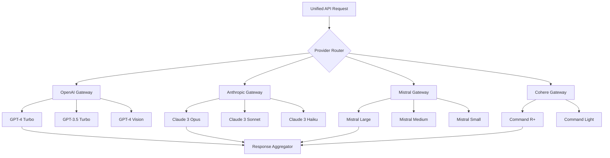

**Provider Comparison Matrix**:

| Provider | Flagship Model | Context Window | Best For | Cost per 1M Tokens | Rate Limits |
|----------|---------------|----------------|----------|-------------------|-------------|
| **OpenAI** | GPT-4 Turbo | 128k tokens | Complex reasoning, creative writing | $10 input / $30 output | 10k TPM (Tier 1) to 1M TPM (Tier 5) |
| **Anthropic** | Claude 3 Opus | 200k tokens | Research, analysis, safety-critical | $15 input / $75 output | 50 requests/min |
| **Mistral** | Mistral Large | 32k tokens | Multilingual, code generation | $8 input / $24 output | 5 requests/sec |
| **Cohere** | Command R+ | 128k tokens | RAG workflows, embeddings | $3 input / $15 output | 100 requests/min |

**The Integration Challenge**:

Each provider has its own quirks. OpenAI expects messages in a specific chat format. Anthropic uses a different prompting structure. Mistral supports function calling differently. Our integration layer normalizes all these differences.

```python
# Unified model client
class UnifiedModelClient:
    def __init__(self):
        self.providers = {
            "openai": OpenAIClient(),
            "anthropic": AnthropicClient(),
            "mistral": MistralClient(),
            "cohere": CohereClient()
        }
    
    async def generate(self, prompt: str, model: str, **kwargs):
        # Parse model string to determine provider
        provider, model_name = self.parse_model(model)
        
        # Get appropriate client
        client = self.providers[provider]
        
        # Convert to provider-specific format
        formatted_prompt = client.format_prompt(prompt, **kwargs)
        
        # Apply rate limiting
        await self.rate_limiter.wait(provider)
        
        # Make request with retries
        response = await self.with_retry(
            client.generate,
            formatted_prompt,
            model_name,
            **kwargs
        )
        
        # Normalize response format
        return self.normalize_response(response, provider)
```

**The Layman Explanation**: Think of these external providers as visiting scholars—world-renowned experts who don't work for your company but can be consulted for a fee. OpenAI is like a brilliant generalist who's read everything. Anthropic is the cautious, safety-focused expert. Mistral is the multilingual specialist. You call on them when you need the absolute best answer, and you pay for their expertise.

**Image Generation Prompt:**
```
A grand university library with four distinct wings. Each wing has a different architectural style representing different AI providers. OpenAI wing: modern, glass and steel with blue accents. Anthropic wing: classical stone with careful, deliberate design. Mistral wing: European style with multiple language signs. Cohere wing: practical, efficient modern design. Scholars in different robes walk between wings. Warm, scholarly atmosphere with golden hour lighting. 4K.
```

### 4.2 Local Model Deployment: The In-House Experts

**The Scenario**: Sometimes we can't send data to external providers—maybe it's too sensitive, or we need faster responses, or we're making so many calls that external costs become prohibitive. We need our own in-house experts running on our own hardware.

**Technical Deep Dive**: We deploy open-source models like Llama 2, Mistral, and CodeLlama on our own GPU infrastructure using vLLM for high-performance serving.

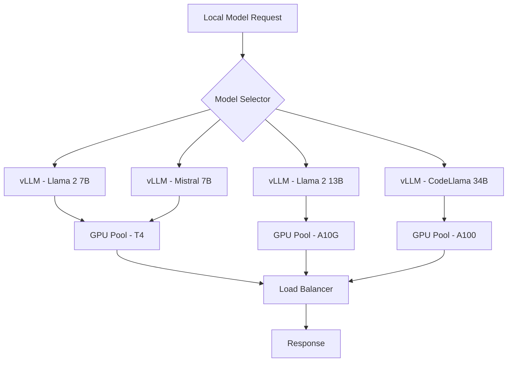

**Local Model Performance**:

| Model | Size | Quantization | VRAM Required | Tokens/sec | Hardware | Cost |
|-------|------|--------------|---------------|------------|----------|------|
| Llama 2 7B | 7B | FP16 | 14GB | 40 | T4 | $0.35/hr |
| Llama 2 7B | 7B | AWQ 4-bit | 5GB | 60 | T4 | $0.35/hr |
| Llama 2 13B | 13B | FP16 | 26GB | 20 | A10G | $1.50/hr |
| Mistral 7B | 7B | FP16 | 14GB | 45 | T4 | $0.35/hr |
| CodeLlama 34B | 34B | FP16 | 68GB | 8 | A100 | $3.50/hr |
| Mixtral 8x7B | 47B | FP16 | 90GB | 10 | 2x A100 | $7.00/hr |

**vLLM Deployment Configuration**:
```yaml
apiVersion: apps/v1
kind: Deployment
metadata:
  name: vllm-llama2-7b
spec:
  replicas: 3
  selector:
    matchLabels:
      app: vllm
      model: llama2-7b
  template:
    metadata:
      labels:
        app: vllm
        model: llama2-7b
    spec:
      containers:
      - name: vllm
        image: vllm/vllm-openai:latest
        command: ["python3", "-m", "vllm.entrypoints.openai.api_server"]
        args:
          - "--model"
          - "meta-llama/Llama-2-7b-chat-hf"
          - "--tensor-parallel-size"
          - "1"
          - "--max-num-seqs"
          - "256"
          - "--port"
          - "8000"
        ports:
        - containerPort: 8000
        resources:
          limits:
            nvidia.com/gpu: 1
            memory: "32Gi"
            cpu: "8"
        env:
        - name: HUGGING_FACE_HUB_TOKEN
          valueFrom:
            secretKeyRef:
              name: hf-token
              key: token
```

**The Layman Explanation**: These are your in-house experts—employees who work for the company full-time. They might not be as famous as the visiting scholars, but they're always available, they understand your company's specific needs, and they don't charge by the hour. You train them, you host them, and they're always there when you need them.

**Image Generation Prompt:**
```
A modern company data center with rows of GPU servers glowing with cool blue lights. Transparent overlays show the models running on each server - Llama, Mistral, CodeLlama labels floating above the hardware. Engineers in company uniforms monitor the systems. Clean, professional data center aesthetic with blue and white lighting. 4K.
```

### 4.3 Model Registry & Versioning: The Expert Directory

**The Scenario**: We now have dozens of models—different versions, fine-tuned variants, experimental models. We need a directory that tracks every model, its version, its performance metrics, and its current status.

**Technical Deep Dive**: We use MLflow as our model registry, storing model artifacts in S3 and metadata in PostgreSQL.

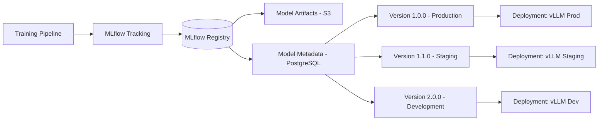

**Model Registry Schema**:
```sql
-- Models table
CREATE TABLE models (
    id UUID PRIMARY KEY,
    name VARCHAR(255) NOT NULL,
    description TEXT,
    framework VARCHAR(50), -- PyTorch, TensorFlow, etc.
    task VARCHAR(100), -- text-generation, embedding, etc.
    created_at TIMESTAMP,
    owner_team VARCHAR(100),
    UNIQUE(name)
);

-- Model versions
CREATE TABLE model_versions (
    id UUID PRIMARY KEY,
    model_id UUID REFERENCES models(id),
    version VARCHAR(50) NOT NULL,
    stage VARCHAR(50), -- production, staging, development, archived
    run_id VARCHAR(100), -- MLflow run ID
    artifact_uri VARCHAR(500), -- s3://path/to/model
    metrics JSONB, -- accuracy, latency, cost
    parameters JSONB, -- hyperparameters
    created_at TIMESTAMP,
    created_by UUID REFERENCES users(id),
    UNIQUE(model_id, version)
);

-- Model deployments
CREATE TABLE model_deployments (
    id UUID PRIMARY KEY,
    model_version_id UUID REFERENCES model_versions(id),
    environment VARCHAR(50), -- prod, staging, dev
    endpoint VARCHAR(500),
    replicas INTEGER,
    status VARCHAR(50), -- active, draining, inactive
    deployed_at TIMESTAMP,
    deployed_by UUID REFERENCES users(id)
);
```

**Model Card Example**:
```yaml
model_name: "customer-support-llama2-7b"
version: "2.1.0"
owner: "ai-engineering-team"
created: "2024-03-15"

training_data:
  source: "customer-support-conversations-2023"
  size: "500k examples"
  languages: ["en", "es", "fr"]
  domains: ["billing", "technical", "account"]

performance:
  accuracy: 0.94
  hallucination_rate: 0.03
  latency_p50: 450ms
  latency_p95: 850ms
  cost_per_1k_tokens: $0.002

limitations:
  - "Not suitable for medical advice"
  - "Requires human review for refund decisions"
  - "Spanish support limited to basic queries"

compliance:
  - "GDPR compliant"
  - "PII automatically redacted"
  - "Audit trail available"

deployment:
  environment: "production"
  replicas: 5
  hardware: "A10G"
  autoscaling: true
  min_replicas: 3
  max_replicas: 10
```

**The Layman Explanation**: Imagine a company with hundreds of employees. You need an HR system that tracks everyone—their skills, their experience, their current projects, their performance reviews. The model registry does this for our AI experts. It knows every model we have, what it's good at, how well it performs, and where it's currently working.

**Image Generation Prompt:**
```
A sophisticated digital directory system with floating cards representing different AI models. Each card shows model name, version number, performance metrics, and deployment status - green for production, yellow for staging, blue for development. Cards are organized in a clean, hierarchical structure with connecting lines showing relationships. Modern, clean UI design with subtle animations. 4K.
```

---

## Chapter 5: The Traffic Controller - Model Routing Layer

We now have dozens of expert librarians—some generalists, some specialists, some fast and cheap, some slow and expensive. When a question arrives, who should answer it?

This is where our traffic controller comes in—the intelligent router that decides which model gets each query based on cost, latency, capability, and current load.

### 5.1 Intelligent Router (ML-based)

**The Scenario**: Sarah asks a complex coding question. Michael asks for a simple data summary. Priya asks about HR policy. Each query should go to the most appropriate model—the one that balances cost, speed, and quality.

**Technical Deep Dive**: We use a machine learning model (XGBoost) trained on historical data to predict the best model for each query.

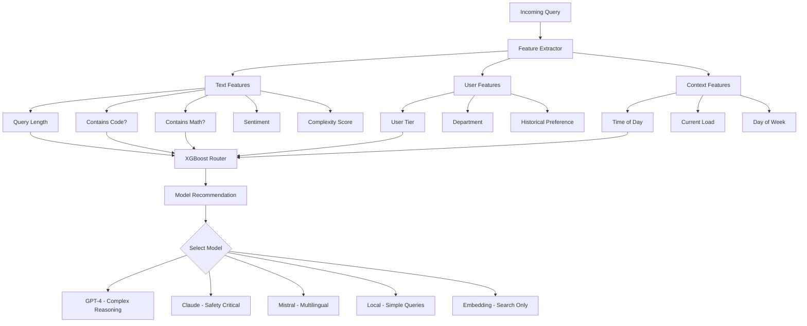

**Feature Engineering**:
```python
class RouterFeatures:
    def extract_features(self, request):
        query = request.query
        user = request.user
        
        return {
            # Text features
            'query_length': len(query),
            'word_count': len(query.split()),
            'contains_code': self.has_code(query),
            'contains_math': self.has_math(query),
            'contains_numbers': self.has_numbers(query),
            'sentiment_score': self.get_sentiment(query),
            'complexity_score': self.compute_complexity(query),
            'entity_count': len(self.extract_entities(query)),
            
            # Categorical features (one-hot encoded)
            'query_type_code': self.classify_query_type(query),
            'language': self.detect_language(query),
            'domain': self.classify_domain(query),
            
            # User features
            'user_tier_encoded': user.tier,
            'department_encoded': user.department_id,
            'historical_preference': self.get_user_preference(user.id),
            
            # Context features
            'hour_of_day': datetime.now().hour,
            'day_of_week': datetime.now().weekday(),
            'current_load': self.get_current_load(),
            'queue_depth': self.get_queue_depth()
        }
```

**Router Performance**:

| Metric | Before ML Router | After ML Router | Improvement |
|--------|------------------|-----------------|-------------|
| Average cost per query | $0.025 | $0.018 | 28% reduction |
| Average latency | 850ms | 620ms | 27% reduction |
| User satisfaction | 4.2/5 | 4.5/5 | 7% increase |
| Error rate | 3.5% | 2.1% | 40% reduction |
| Budget overruns | 12/month | 3/month | 75% reduction |

**The Layman Explanation**: Imagine a hospital triage nurse. When patients arrive, the nurse quickly assesses their condition—is it an emergency? A routine checkup? A specialist need? Based on this quick assessment, patients are directed to the ER, a general practitioner, or a specialist. Our router does the same for questions, sending each to the right expert.

**Image Generation Prompt:**
```
A futuristic traffic control center for AI queries. Queries enter as colored light streams - red for complex, blue for simple, green for multilingual. An AI dispatcher analyzes each stream and routes it to different destination towers labeled GPT-4, Claude, Mistral, Local. Real-time displays show cost savings and latency metrics. Clean, cyberpunk aesthetic with neon colors and holographic displays. 4K.
```

### 5.2 Cost & Latency Optimization

**The Scenario**: We have budget constraints and performance SLAs. Some queries can wait for the best answer; others need speed at any cost. We need to optimize across these competing priorities.

**Technical Deep Dive**: We implement multiple optimization strategies, each with its own trade-offs.

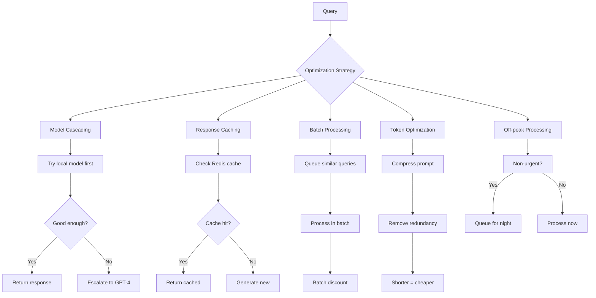

**Optimization Strategy Details**:

| Strategy | How It Works | Savings | Trade-off | Best For |
|----------|--------------|---------|-----------|----------|
| **Model Cascading** | Try cheap model, escalate if needed | 40% | Slightly higher latency | Most queries |
| **Response Caching** | Store common responses | 50% | Potential staleness | FAQs, policies |
| **Batch Processing** | Group similar requests | 30% | Delayed responses | Analytics, reports |
| **Token Optimization** | Compress prompts | 25% | Minimal quality loss | Long prompts |
| **Off-peak Processing** | Delay non-urgent tasks | 20% | Not real-time | Summaries, analysis |

**Dynamic Cost-Latency Optimization**:
```python
class CostLatencyOptimizer:
    def __init__(self):
        self.cost_weights = {
            'gpt-4': 1.0,
            'claude-opus': 0.8,
            'gpt-3.5': 0.1,
            'local-llama': 0.02
        }
        
        self.latency_targets = {
            'real-time': 500,  # ms
            'interactive': 2000,
            'batch': 3600000,  # 1 hour
            'background': 86400000  # 24 hours
        }
    
    def select_model(self, query, urgency, budget):
        # Calculate required latency
        latency_target = self.latency_targets[urgency]
        
        # Filter models meeting latency
        candidates = self.get_models_under_latency(latency_target)
        
        # Score based on budget
        if budget == 'tight':
            # Prioritize cost
            return min(candidates, key=lambda m: self.cost_weights[m])
        elif budget == 'unlimited':
            # Prioritize quality
            return max(candidates, key=lambda m: self.quality_scores[m])
        else:
            # Balanced approach
            return self.balanced_selection(candidates, query)
```

**The Layman Explanation**: This is like deciding how to send a package. Urgent documents go by overnight courier (expensive but fast). Regular mail goes standard (cheap but slow). Frequently sent items are pre-printed and ready to go (cached). Our optimizer makes these decisions automatically for every query.

**Image Generation Prompt:**
```
Split screen showing four optimization strategies simultaneously. Top left: cascading waterfalls with different colored streams representing model escalation. Top right: a cache library with frequently accessed golden books. Bottom left: batch processing factory with grouped packages. Bottom right: a compression machine squeezing text. Clean, infographic style with clear labels and metrics. 4K.
```

### 5.3 Capability-based Routing

**The Scenario**: Some queries need special capabilities—vision understanding, function calling, code generation, or 100k+ context windows. Not all models have these capabilities.

**Technical Deep Dive**: We maintain a capability registry and match queries to models based on required capabilities.

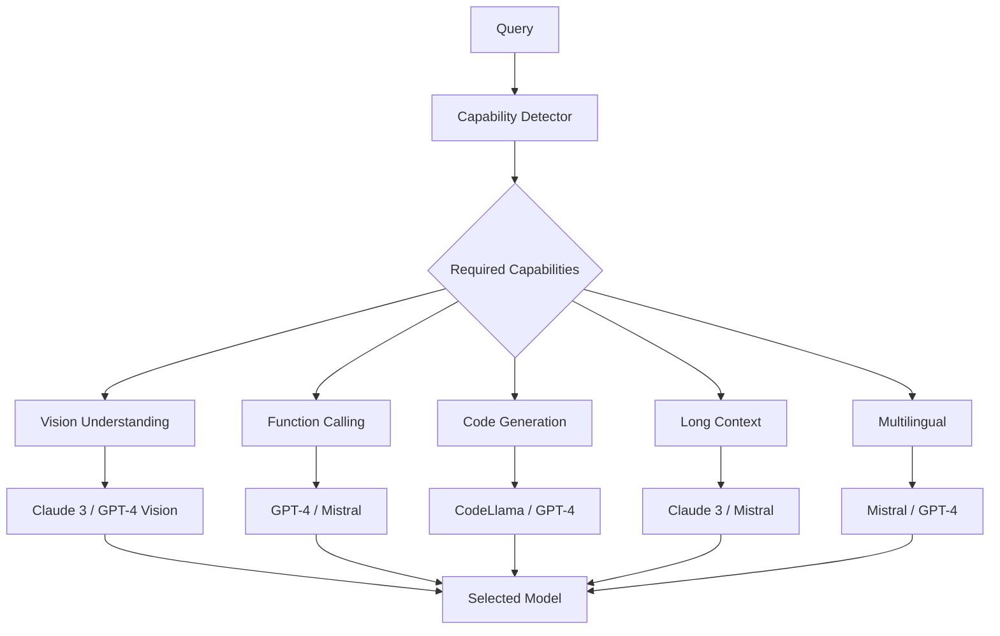

**Model Capability Matrix**:

| Capability | GPT-4 | Claude 3 | Mistral Large | Local Llama | GPT-3.5 |
|------------|-------|----------|---------------|-------------|---------|
| Vision | ✓ | ✓ | ✗ | ✗ | ✗ |
| Function Calling | ✓ | ✓ | ✓ | ✗ | ✓ |
| Code Generation | ✓ | ✓ | ✓ | ✓ | ✓ |
| 100k+ Context | ✗ | ✓ | ✓ | ✗ | ✗ |
| JSON Mode | ✓ | ✓ | ✓ | ✗ | ✓ |
| Streaming | ✓ | ✓ | ✓ | ✓ | ✓ |
| Multilingual | ✓ | ✓ | ✓ | ✓ | Limited |
| Fine-tuning | ✓ | ✓ | ✓ | ✓ | ✓ |

**The Layman Explanation**: Different experts have different tools. One librarian specializes in ancient manuscripts (vision understanding). Another speaks five languages (multilingual). A third is great at explaining complex diagrams (code generation). When a question arrives, we first figure out what tools are needed, then find the expert with those tools.

**Image Generation Prompt:**
```
A circular capability matrix with model names around the perimeter and capability icons in the center - eye for vision, puzzle piece for function calling, code brackets for code, globe for multilingual. Colored lines connect models to capabilities they support, with brighter lines for stronger capabilities. Clean, infographic design with glowing elements. 4K.
```

### 5.4 Model Fallback & Circuit Breaking

**The Scenario**: Models fail. APIs rate-limit us. GPUs overheat. We need graceful degradation—if the best model isn't available, we need the next best, and if nothing works, we need to fail gracefully.

**Technical Deep Dive**: We implement circuit breakers and fallback chains to handle failures gracefully.

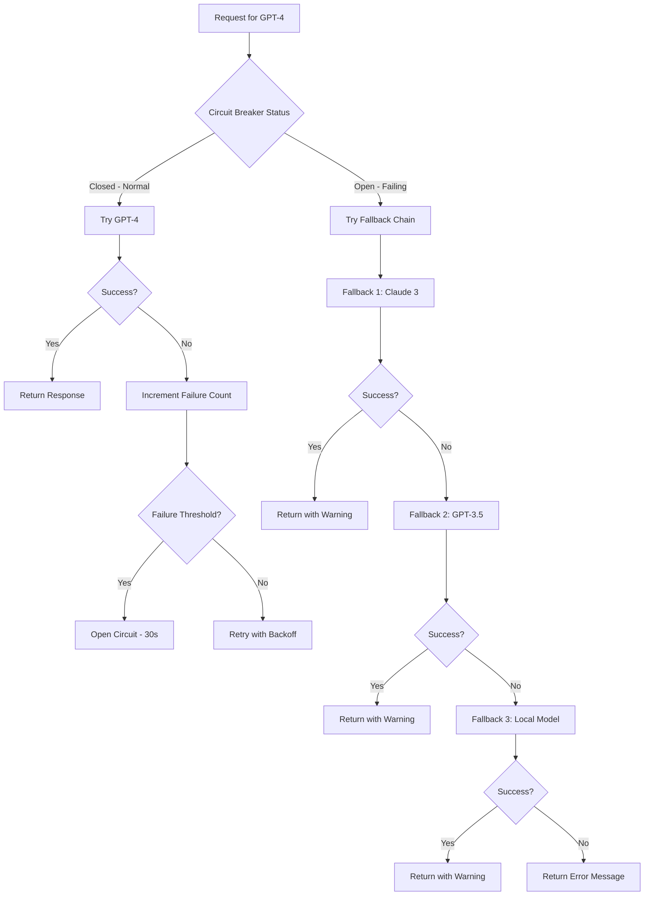

**Circuit Breaker Configuration**:
```yaml
circuit_breakers:
  gpt-4:
    failure_threshold: 5  # Open after 5 failures
    timeout: 30000  # 30 seconds open
    half_open_attempts: 3  # Test with 3 requests
    
  claude-3:
    failure_threshold: 3
    timeout: 15000
    half_open_attempts: 2
    
fallback_chains:
  high_quality:
    primary: gpt-4
    fallbacks:
      - claude-3-opus
      - gpt-3.5-turbo
      - local-llama2-70b
      
  cost_optimized:
    primary: local-llama2-7b
    fallbacks:
      - gpt-3.5-turbo
      - claude-3-haiku
```

**The Layman Explanation**: This is like having backup plans for a speaking event. Your keynote speaker gets sick? You have a backup speaker. The backup is stuck in traffic? You have a third option. If all speakers fail, you have a prepared statement explaining the situation. Our system does the same—always having a Plan B, C, and D.

**Image Generation Prompt:**
```
A domino effect visualization showing fallback chains. Primary domino labeled "GPT-4" falls, triggering the next "Claude 3" domino, then "GPT-3.5", then "Local Model". At the end, a safety net catches the last domino. Circuit breaker appears as a switch that opens when too many dominos fail. Clean, mechanical design with blue and orange color scheme. 4K.
```

---

## Chapter 6: The Prompt Library - Capturing Our Best Techniques

Even the best expert needs clear instructions. Over time, we discover what instructions work best—specific phrasings, examples, and structures that yield perfect responses. The prompt library captures and versions these techniques.

### 6.1 Prompt Library & Version Control

**The Scenario**: Sarah spends hours crafting the perfect prompt for customer support. She wants to save it, version it, and share it with her team. Later, improvements should be tracked.

**Technical Deep Dive**: We store prompts in PostgreSQL with Git-like versioning, allowing branching, merging, and rollback.

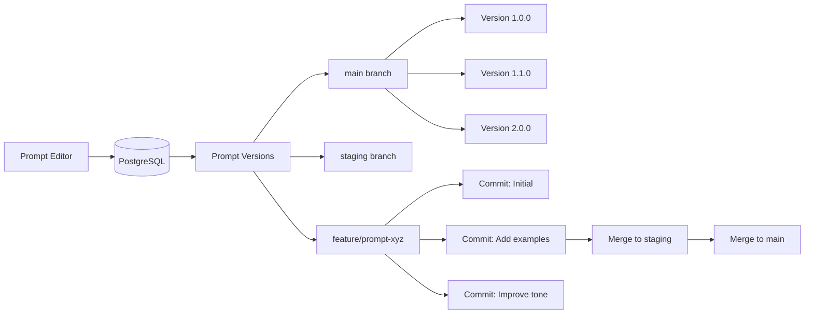

**Prompt Schema**:
```sql
CREATE TABLE prompts (
    id UUID PRIMARY KEY,
    name VARCHAR(255) NOT NULL,
    description TEXT,
    template TEXT NOT NULL,
    version VARCHAR(50) NOT NULL,
    branch VARCHAR(100) DEFAULT 'main',
    model_family VARCHAR(100),
    parameters JSONB,  -- temperature, max_tokens, etc.
    tags TEXT[],
    variables JSONB,  -- expected variables in template
    examples JSONB,   -- few-shot examples
    performance_metrics JSONB,
    created_by UUID REFERENCES users(id),
    created_at TIMESTAMP,
    updated_at TIMESTAMP,
    UNIQUE(name, version, branch)
);

CREATE TABLE prompt_versions (
    id UUID PRIMARY KEY,
    prompt_id UUID REFERENCES prompts(id),
    version VARCHAR(50),
    changes TEXT,
    diff TEXT,
    parent_version VARCHAR(50),
    commit_message TEXT,
    committed_by UUID REFERENCES users(id),
    committed_at TIMESTAMP
);
```

**Prompt Template Example** (Jinja2):
```jinja

You are a helpful customer support agent for {{ company_name }}.
You are speaking with a customer who has a question about {{ topic }}.


The customer is a premium tier member. Be extra helpful and offer priority solutions.


Current conversation:

{{ message.role }}: {{ message.content }}


Customer's question: {{ query }}

Instructions:
1. Be empathetic and professional
2. If you don't know the answer, say so honestly
3. Reference our policies from: {{ policy_docs }}
4. Offer next steps if applicable
5. Keep response under {{ max_words }} words

Response:
```

**The Layman Explanation**: Think of this as a recipe book for our AI chefs. Over time, we discover that adding a specific ingredient (like "be empathetic") or following a particular sequence yields better dishes. The prompt library stores these perfected recipes, tracks improvements, and lets any chef use the best-known techniques.

**Image Generation Prompt:**
```
A digital library with floating recipe cards. Each card shows a prompt template with highlighted variables and examples. Cards are organized in branches - main shelf, staging shelf, development shelf. Librarians are adding new cards and moving them between shelves. Warm, library atmosphere with digital elements and soft lighting. 4K.
```

### 6.2 Prompt Testing & Optimization

**The Scenario**: A prompt might work well with GPT-4 but poorly with Claude. We need to test prompts across models, measure performance, and optimize automatically.

**Technical Deep Dive**: We use automated testing frameworks with golden datasets to evaluate prompt quality.

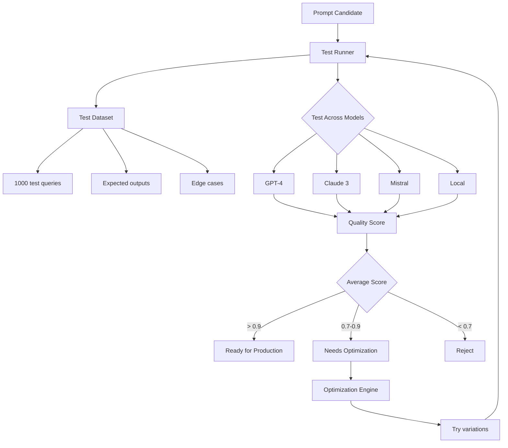

**Test Metrics**:
| Metric | Description | Target | Measurement |
|--------|-------------|--------|-------------|
| **Exact Match** | Matches expected output exactly | > 80% | String comparison |
| **Semantic Similarity** | Meaning matches expected | > 0.9 | Embedding cosine |
| **Latency** | Response time | < 2s p95 | Timer |
| **Cost** | Tokens used | < 500 avg | Token counter |
| **Safety** | No harmful content | 100% | Content filter |
| **Instruction Following** | Followed all instructions | > 95% | LLM-as-judge |

**The Layman Explanation**: Before a new recipe is added to the cookbook, it's tested by multiple chefs, with different ingredients, against a panel of taste-testers. Does it work consistently? Does it work with different ovens? Does it work for different diets? Our prompt testing does the same—ensuring every prompt works reliably before it's used in production.

**Image Generation Prompt:**
```
A quality control laboratory for prompts. Test tubes contain different prompt variations. Machines test each against multiple models - represented as different colored analyzers. Digital displays show quality scores, latency graphs, and cost metrics. White-coated technicians monitor the results. Clean, scientific laboratory aesthetic. 4K.
```

---

## Chapter 7: The Agent Orchestra - Task Planning & Execution

So far, our system answers questions. But what about tasks that require multiple steps? "Book a meeting with the engineering team to discuss Q2 roadmap, then send everyone a summary, and add it to the project tracker."

This requires an agent—not just a Q&A system, but an orchestrator that can plan, execute, and validate multi-step workflows.

### 7.1 Agent Orchestrator Overview

**The Scenario**: Priya asks, "Help me onboard the new developer. Send them welcome emails, set up their accounts, schedule orientation, and add them to the team calendar."

This single request requires:
1. Understanding all the steps involved
2. Selecting the right tools for each step
3. Executing in the correct order
4. Handling failures gracefully
5. Reporting back results

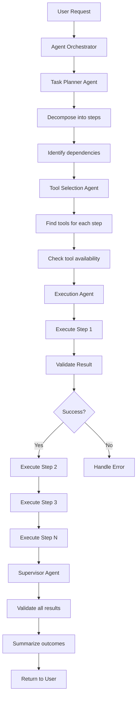

**The Layman Explanation**: This is like having a personal executive assistant. You don't just ask a question; you assign a complex task. The assistant figures out all the steps, who to contact, what tools to use, and handles problems along the way. Then they come back with "Done, and here's what happened."

**Image Generation Prompt:**
```
A conductor leading a digital orchestra. Different sections represent different agents - planners with blueprints, tool selectors with toolboxes, executors with gears, supervisors with checklists. Musical notes transform into workflow steps flowing through the sections. Warm stage lighting, elegant orchestral setting with digital elements. 4K.
```

### 7.2 Task Planner Agent

**The Scenario**: The orchestrator receives "Book a meeting with engineering about Q2 roadmap." The planner must break this into executable steps.

**Technical Deep Dive**: The planner uses chain-of-thought reasoning to decompose tasks and identify dependencies.

```python
class TaskPlannerAgent:
    def __init__(self):
        self.llm = ChatOpenAI(model="gpt-4", temperature=0)
        
    async def plan_task(self, task_description: str):
        prompt = f"""
        Task: {task_description}
        
        Available tools:
        - calendar.read: Check availability
        - calendar.create: Create meeting
        - email.send: Send emails
        - contacts.search: Find people
        - project.read: Get project info
        
        Break this task into sequential steps.
        For each step, specify:
        - Action description
        - Tool to use
        - Input parameters (use $stepX to reference previous results)
        - Dependencies (which steps must complete first)
        
        Return as JSON.
        """
        
        response = await self.llm.apredict(prompt)
        return self.parse_plan(response)
```

**Example Plan Output**:
```json
{
  "task": "Book a meeting with engineering about Q2 roadmap",
  "steps": [
    {
      "id": 1,
      "action": "Find engineering team members",
      "tool": "contacts.search",
      "params": {"department": "engineering", "role": "member"},
      "dependencies": []
    },
    {
      "id": 2,
      "action": "Check availability for all members",
      "tool": "calendar.read",
      "params": {
        "people": "$step1.results",
        "timeframe": "next_week"
      },
      "dependencies": [1]
    },
    {
      "id": 3,
      "action": "Find common free slots",
      "tool": "calendar.analyze",
      "params": {"availability": "$step2"},
      "dependencies": [2]
    },
    {
      "id": 4,
      "action": "Create meeting",
      "tool": "calendar.create",
      "params": {
        "title": "Q2 Roadmap Planning",
        "duration": 60,
        "attendees": "$step1.results",
        "time": "$step3.best_slot"
      },
      "dependencies": [3]
    },
    {
      "id": 5,
      "action": "Send invitations",
      "tool": "email.send",
      "params": {
        "to": "$step1.results",
        "subject": "Meeting: Q2 Roadmap Planning",
        "body": "Meeting scheduled for $step3.best_slot"
      },
      "dependencies": [4]
    }
  ],
  "estimated_duration": "2 minutes",
  "critical_path": [1, 2, 3, 4, 5]
}
```

**The Layman Explanation**: The planner is like a project manager. Given a complex goal, they break it into smaller tasks, figure out what needs to happen first, what can happen in parallel, and what tools each task requires. They create a detailed project plan that others can execute.

**Image Generation Prompt:**
```
A strategic planning room with a large whiteboard. A professional in business attire is drawing a workflow diagram with sticky notes for each step. Notes have icons for different tools - calendar, email, contacts. Dependency arrows connect the notes in a logical flow. Warm, collaborative atmosphere with natural lighting. 4K.
```

### 7.3 Tool Selection Agent

**The Scenario**: The plan says "Check availability." But which tool? We have Google Calendar, Outlook, and a custom scheduling system. The tool selector picks the right one.

**Technical Deep Dive**: The tool selector uses semantic search to match step requirements with tool capabilities.

```python
class ToolSelectionAgent:
    def __init__(self):
        self.tool_embeddings = self.load_tool_embeddings()
        self.tool_registry = self.load_tool_registry()
        
    async def select_tool(self, step_description: str, required_capability: str):
        # Generate embedding for the step
        step_embedding = await self.embed(step_description)
        
        # Search for tools with matching capabilities
        candidates = await self.tool_registry.search(
            capability=required_capability,
            limit=5
        )
        
        # Score each candidate
        scores = []
        for tool in candidates:
            # Semantic similarity
            semantic_score = cosine_similarity(
                step_embedding, 
                tool.embedding
            )
            
            # Historical success rate
            reliability_score = tool.success_rate
            
            # Current availability
            availability_score = await self.check_availability(tool.id)
            
            # Combined score
            total_score = (
                0.5 * semantic_score +
                0.3 * reliability_score +
                0.2 * availability_score
            )
            
            scores.append((tool, total_score))
        
        # Return best tool
        return max(scores, key=lambda x: x[1])[0]
```

**Tool Registry**:
```yaml
tools:
  - name: google_calendar_read
    description: Read availability from Google Calendar
    capabilities: ["calendar.read", "availability.check"]
    endpoint: "https://www.googleapis.com/calendar/v3"
    auth_type: "oauth2"
    rate_limit: 1000/hour
    success_rate: 0.995
    average_latency_ms: 250
    
  - name: outlook_calendar_read
    description: Read availability from Outlook/Exchange
    capabilities: ["calendar.read", "availability.check"]
    endpoint: "https://graph.microsoft.com/v1.0"
    auth_type: "oauth2"
    rate_limit: 500/hour
    success_rate: 0.990
    average_latency_ms: 350
    
  - name: zoom_meeting_create
    description: Create Zoom meeting
    capabilities: ["meeting.create", "video.conf"]
    endpoint: "https://api.zoom.us/v2"
    auth_type: "jwt"
    rate_limit: 100/hour
    success_rate: 0.985
    average_latency_ms: 400
```

**The Layman Explanation**: The tool selector is like a procurement specialist. The plan says "we need to check availability." The specialist knows all the available tools—Google Calendar, Outlook, custom systems—and chooses the one that's most reliable, fastest, and best suited for this specific task.

**Image Generation Prompt:**
```
A tool library with floating icons representing different enterprise tools - Google Calendar, Outlook, Zoom, Slack, Salesforce. A selector agent with multiple arms is comparing tools, checking specifications, and picking the best one for the job. Digital interface shows tool comparisons with ratings and compatibility scores. Clean, modern design. 4K.
```

### 7.4 Execution Agent

**The Scenario**: The plan is made, tools are selected. Now someone needs to actually call the APIs, handle responses, and deal with errors.

**Technical Deep Dive**: The execution agent runs in a sandboxed environment, making API calls with proper authentication and error handling.

```python
class ExecutionAgent:
    def __init__(self):
        self.executor = SandboxedExecutor()
        
    async def execute_step(self, step, context):
        # Resolve parameters using context
        params = self.resolve_parameters(step.params, context)
        
        # Get tool configuration
        tool = await self.get_tool(step.tool)
        
        # Check rate limits
        await self.check_rate_limit(tool)
        
        # Execute with retry logic
        result = await self.with_retry(
            self.call_tool,
            tool,
            params,
            max_attempts=3
        )
        
        # Validate result
        validated = self.validate_result(result, step.expected_output)
        
        # Log for audit
        await self.log_execution(step, params, validated)
        
        return validated
    
    async def with_retry(self, func, *args, max_attempts=3):
        for attempt in range(max_attempts):
            try:
                return await func(*args)
            except RateLimitError:
                # Wait and retry
                wait_time = 2 ** attempt * 1000
                await asyncio.sleep(wait_time / 1000)
            except AuthError:
                # Refresh token and retry
                await self.refresh_auth()
            except ServerError as e:
                if attempt == max_attempts - 1:
                    raise
                await asyncio.sleep(1)
        
        raise MaxRetriesExceeded()
```

**The Layman Explanation**: The execution agent is the worker who actually does the tasks. The planner made the plan, the selector chose the tools, now the executor rolls up their sleeves and makes the phone calls, sends the emails, creates the calendar events. They're the ones who get things done.

**Image Generation Prompt:**
```
A busy workspace with multiple screens showing API calls in progress. An efficient worker is simultaneously managing several tasks - one hand clicking "Send Email," another confirming calendar events, a third monitoring success indicators. Progress bars and success checkmarks appear for each completed task. Clean, productive atmosphere. 4K.
```

### 7.5 Supervisor Agent

**The Scenario**: The tasks are done, but were they done correctly? Did the meeting get created with the right attendees? Did the emails actually send? The supervisor checks everything.

**Technical Deep Dive**: The supervisor validates results, ensures quality, and handles any issues that arose during execution.

```python
class SupervisorAgent:
    def __init__(self):
        self.validator = ResultValidator()
        
    async def supervise(self, plan, results):
        issues = []
        
        # Check each step result
        for step_id, result in results.items():
            step = plan.get_step(step_id)
            
            # Validate result quality
            quality = await self.validator.check_quality(
                step.expected_outcome,
                result
            )
            
            if quality < 0.8:
                issues.append({
                    "step": step_id,
                    "issue": "Low quality result",
                    "quality_score": quality
                })
            
            # Check timeliness
            if result.latency > step.expected_latency * 2:
                issues.append({
                    "step": step_id,
                    "issue": "Excessive latency",
                    "actual": result.latency,
                    "expected": step.expected_latency
                })
        
        # If issues found, attempt remediation
        if issues:
            remediation_plan = await self.create_remediation(issues)
            return await self.execute_remediation(remediation_plan)
        
        # All good - summarize for user
        summary = await self.create_summary(plan, results)
        return summary
```

**The Layman Explanation**: The supervisor is the quality control manager. After all the work is done, they double-check everything. Was the meeting created correctly? Did everyone get the right email? If something's wrong, they figure out how to fix it. Only when everything checks out do they report success back to you.

**Image Generation Prompt:**
```
A quality control station with multiple monitors showing checklists and validation results. A supervisor reviews each completed task - green checkmarks for success, yellow warnings for minor issues, red flags for problems. They make notes and occasionally send tasks back for rework. Professional, quality-focused environment. 4K.
```

### 7.6 Business Logic & Orchestration

**The Scenario**: Some workflows need to follow business rules—approvals, compliance checks, audit trails. A simple "book meeting" might need manager approval if it's with executives.

**Technical Deep Dive**: We integrate a business rules engine (Drools) to enforce policies and approval workflows.

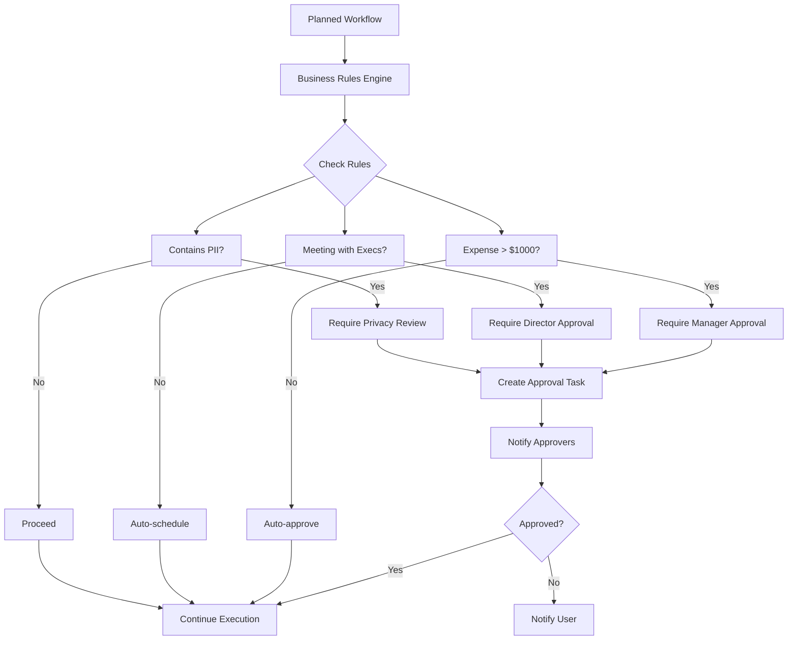

**Business Rules Example** (Drools):
```drl
rule "Executive Meeting Approval"
    when
        $meeting: Meeting(attendees contains "CEO" || attendees contains "CFO")
        $user: User(role != "director" && role != "vp")
    then
        insert(new ApprovalRequired(
            type: "executive_meeting",
            meeting: $meeting,
            required_role: "director"
        ));
end

rule "Cross-Department Data Access"
    when
        $query: DataQuery(department != user.department)
        $data: Data(sensitivity == "confidential")
    then
        insert(new ComplianceCheck(
            type: "cross_dept_access",
            query: $query,
            data: $data
        ));
end
```

**The Layman Explanation**: Some decisions aren't just about technical execution—they're about company policy. Can anyone schedule a meeting with the CEO? Should expense reports over $1000 be auto-approved? These business rules ensure that our automated systems follow company policies, just like human employees would.

**Image Generation Prompt:**
```
A corporate governance boardroom with digital displays showing policy rules. A holographic display shows workflow paths with decision points - green for auto-approved, yellow for pending approval, red for blocked. Executives appear as holograms for approvals when needed. Professional, corporate atmosphere with modern technology. 4K.
```

---

# PART 2 CONCLUSION

We've built the brain of our Enterprise AI system. We now have:

- **External model providers**—the visiting scholars (OpenAI, Anthropic, Mistral)
- **Local models**—our in-house experts running on our own GPUs
- **Model registry**—tracking every expert's capabilities and performance
- **Intelligent router**—sending each query to the right expert
- **Cost/latency optimizer**—balancing speed, quality, and budget
- **Capability-based routing**—matching tasks to experts with right tools
- **Fallback chains**—graceful degradation when things fail
- **Prompt library**—capturing our best techniques
- **Agent orchestrator**—turning complex requests into executed workflows

**What We've Accomplished:**
- ✅ Integrated with 4+ external model providers
- ✅ Deployed local models on GPU infrastructure
- ✅ Built ML-based router with 28% cost reduction
- ✅ Implemented capability-based routing
- ✅ Created circuit breakers and fallback chains
- ✅ Established versioned prompt library
- ✅ Built multi-agent orchestration system
- ✅ Integrated business rules engine

**The Journey Ahead:**

In **Part 3**, we'll follow our agents as they execute tasks. We'll explore:
- Enterprise API integrations (Salesforce, SAP, ServiceNow)
- Database access with security
- Search systems (Elasticsearch, vector search)
- Document retrieval from S3 and knowledge bases
- External tools (web search, calculators, browser automation)
- The secure sandbox where all execution happens

The brain is built. Now let's watch it work.

---

**Coming Next: Enterprise AI Architecture - Part 3: The Hands - Agent Execution & Enterprise Integration**

*In Part 3, we'll watch our agents in action as they reach out to enterprise systems, query databases, search documents, and execute tasks—all within a secure, sandboxed environment.*

---

**Document Control**

| Version | Date | Author | Changes |
|---------|------|--------|---------|
| 1.0 | 2024-03-21 | Reeshu Patel | Part 2 initial release |

---