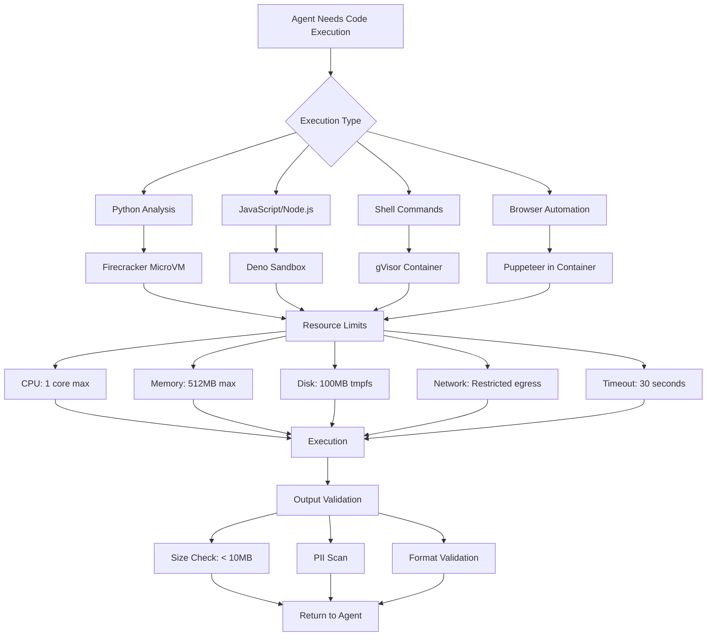
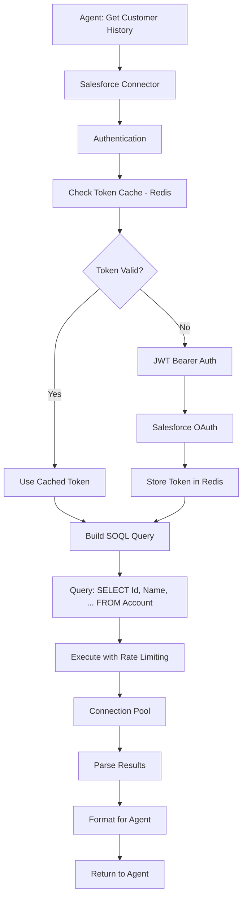
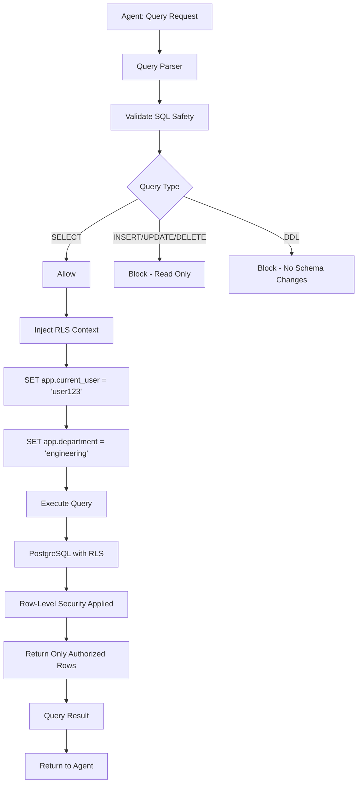
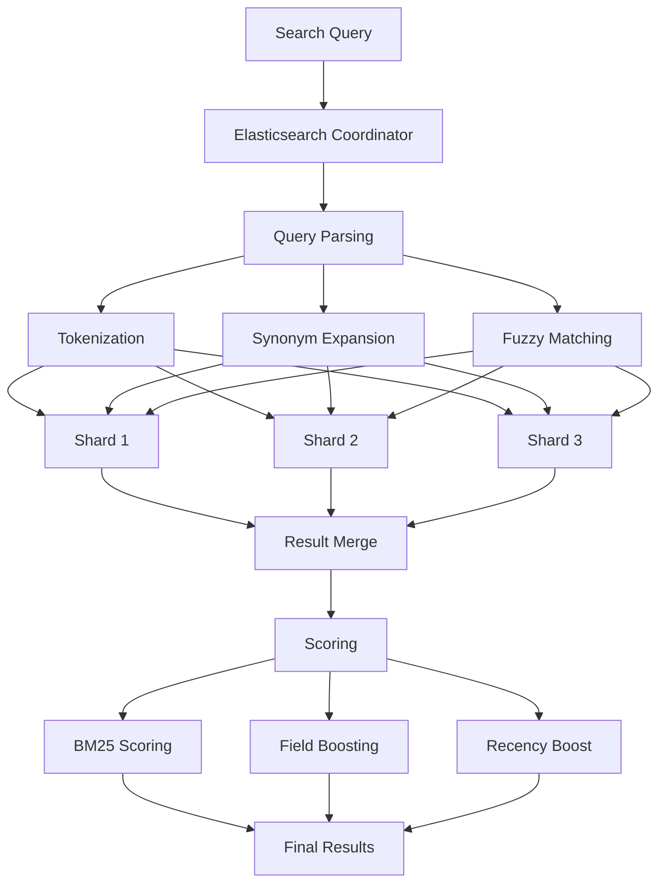

# Enterprise AI Architecture Part 3: The Hands - Agent Execution & Enterprise Integration
## The Hands: Agent Execution & Enterprise Integration

**Author:** Reeshu Patel  
**Document ID:** EA-AI-2024-003-P3  
**Classification:** Enterprise Architecture  
**Reading Time:** 20 minutes  
**Part:** 3 of 4

---

# INTRODUCTION: Where Thought Becomes Action

In Part 1, we built the library—the secure entryways, the document processing pipeline, the vector databases that organize millions of pieces of knowledge. We created a place where information could be stored, indexed, and retrieved.

In Part 2, we hired the librarians—the external AI experts from OpenAI and Anthropic, the in-house models running on our own GPUs, the intelligent router that directs each question to the right expert, and the agent orchestra that can plan complex, multi-step tasks.

But planning is not doing. A meeting request planned but never sent is just a wish. A database query planned but never executed is just a thought.

**In Part 3**, we watch our agents roll up their sleeves and get to work. This is where thought becomes action. Our agents will reach out to enterprise systems—Salesforce, SAP, ServiceNow. They'll query databases with row-level security. They'll search through millions of documents. They'll call external APIs, run calculations, and even control browsers.

And they'll do it all in a secure, sandboxed environment that protects your enterprise from harm while getting real work done.

**Previously in Part 2:** We covered External Model Providers, Local Model Deployment, Model Registry, Intelligent Routing, Cost Optimization, Capability-based Routing, Fallback Chains, Prompt Library, and Agent Orchestration.

**Coming up in Part 4:** We'll step into the control room to explore Observability, Governance, Security, and all the cross-cutting concerns that keep our AI system running smoothly, securely, and compliantly.

Let's watch our agents work.

---

# PART 3: THE HANDS - AGENT EXECUTION & ENTERPRISE INTEGRATION

## Chapter 8: The Agent Execution Environment

Before our agents can start calling APIs and querying databases, they need a place to work—a secure, controlled environment where they can execute code, make connections, and handle data without risking the rest of our systems.

Think of this as a clean room in a semiconductor factory. Workers suit up, tools are sterilized, and nothing leaves without being checked. Our execution environment is the same—a place where agents can work safely.

### 8.1 The Sandbox: Secure Code Execution

**The Scenario**: An agent needs to run a Python script to analyze some data, or execute JavaScript to interact with a web page. This code might be generated by an LLM, which means it could contain errors—or worse, malicious instructions. We need a place where code can run without threatening our systems.

**Technical Deep Dive**: We use multiple layers of isolation—Firecracker microVMs for heavy isolation, gVisor for container sandboxing, and Deno for JavaScript execution with built-in permissions.



**Firecracker MicroVM Configuration**:
```yaml
# Firecracker MicroVM for Python execution
version: '1.0'
machine:
  vcpu_count: 1
  mem_size_mib: 512
  smt: false
drives:
  - drive_id: rootfs
    path: /var/lib/firecracker/rootfs.ext4
    is_root_device: true
    is_read_only: false
network-interfaces:
  - iface_id: eth0
    guest_mac: "06:00:AC:10:00:02"
    host_dev_name: tap0
    allow_mmds: false
metrics:
  - path: /metrics
    buffer_size: 1000
```

**Deno Sandbox Example**:
```typescript
// Deno with explicit permissions
const sandboxedCode = `
  // No file system access unless permitted
  // No network access unless permitted
  // No environment variables unless permitted
  
  const result = await fetch('https://api.example.com/data', {
    // This will fail if --allow-net not provided
  });
  
  console.log('Execution complete');
`;

// Run with minimal permissions
const process = Deno.run({
  cmd: [
    'deno', 'run',
    '--no-remote',           // No remote modules
    '--allow-net=api.example.com', // Only this domain
    '--allow-read=/tmp',      // Only /tmp for reading
    '--allow-write=/tmp',     // Only /tmp for writing
    '--unstable',             // For sandbox features
    'sandbox.ts'
  ],
  stdout: 'piped',
  stderr: 'piped',
});

// Enforce timeout
const timeout = setTimeout(() => {
  process.kill('SIGTERM');
  throw new Error('Execution timeout');
}, 30000);
```

**The Layman Explanation**: Imagine a scientist working with dangerous pathogens. They don't do this at their regular desk—they use a sealed glove box with negative pressure, HEPA filters, and strict protocols. Anything going in or out is sterilized. Our code sandbox is the same—a sealed environment where untrusted code can run without risking the rest of our systems.

**Image Generation Prompt:**
```
A high-tech clean room laboratory with multiple sealed glass chambers. Inside each chamber, robotic arms manipulate glowing data streams. Scientists observe through windows while monitoring screens show CPU, memory, and network activity. Blue sterilization lights pulse gently. Clean, sterile atmosphere with high-tech equipment. 4K.
```

### 8.2 Resource Limits & Timeout Management

**The Scenario**: A runaway agent could consume infinite resources—an infinite loop, a massive data download, or a recursive explosion. We need hard limits that stop execution before it causes harm.

**Technical Deep Dive**: We implement comprehensive resource controls at multiple levels—container limits, language runtime limits, and application-level timeouts.

```python
class ResourceEnforcer:
    def __init__(self):
        self.max_cpu_seconds = 10
        self.max_memory_mb = 512
        self.max_output_bytes = 10 * 1024 * 1024  # 10MB
        self.max_file_descriptors = 50
        
    async def enforce_limits(self, execution_context):
        # Set cgroup limits
        await self.set_cgroup_limits(
            pid=execution_context.pid,
            cpu_quota=self.max_cpu_seconds * 100000,  # microseconds
            memory_limit=self.max_memory_mb * 1024 * 1024,
            pids_limit=self.max_file_descriptors
        )
        
        # Monitor in real-time
        async for usage in self.monitor_usage(execution_context.pid):
            if usage.cpu_seconds > self.max_cpu_seconds:
                await self.terminate(execution_context, "CPU limit exceeded")
            
            if usage.memory_bytes > self.max_memory_mb * 1024 * 1024:
                await self.terminate(execution_context, "Memory limit exceeded")
            
            if usage.output_bytes > self.max_output_bytes:
                await self.terminate(execution_context, "Output size limit exceeded")
    
    async def terminate(self, context, reason):
        # Kill the process
        os.kill(context.pid, signal.SIGKILL)
        
        # Log for audit
        await self.log_termination(context.execution_id, reason)
        
        # Clean up resources
        await self.cleanup(context)
        
        raise ResourceLimitExceeded(reason)
```

**Timeout Strategy**:
| Level | Timeout | Enforcement | Recovery |
|-------|---------|-------------|----------|
| HTTP Request | 10 seconds | API Gateway timeout | Return 504 error |
| Function Execution | 30 seconds | Language runtime | Raise TimeoutError |
| Step Execution | 2 minutes | Workflow engine | Retry or fail step |
| Workflow | 30 minutes | Temporal timeout | Mark workflow failed |
| Human Escalation | 4 hours | Alert if pending | Notify support team |

**The Layman Explanation**: Think of this like a restaurant kitchen with a strict "orders out in 30 minutes" policy. If a dish takes too long, the manager intervenes—maybe the recipe needs adjusting, maybe the chef needs help, maybe the order needs to be cancelled. Our resource limits do the same—they ensure no single task can hold up the entire kitchen.

**Image Generation Prompt:**
```
A control panel with multiple gauges and meters - CPU meter, memory gauge, output size counter, timer clock. Red zones marked on each gauge. A robotic arm reaches toward a flashing red limit, then gently but firmly presses a large red STOP button. Clean, industrial control room aesthetic with warning lights. 4K.
```

### 8.3 Network Isolation

**The Scenario**: An agent should be able to call specific APIs—Salesforce, for example—but not be able to scan internal networks or reach out to arbitrary internet addresses.

**Technical Deep Dive**: We implement network policies at the Kubernetes level, combined with egress gateways that control and audit all outbound traffic.

```yaml
# Kubernetes NetworkPolicy for agent sandbox
apiVersion: networking.k8s.io/v1
kind: NetworkPolicy
metadata:
  name: agent-network-policy
  namespace: agent-execution
spec:
  podSelector:
    matchLabels:
      app: agent-sandbox
  policyTypes:
  - Egress
  - Ingress
  egress:
  - to:
    - ipBlock:
        cidr: 10.0.0.0/8  # Internal services
        except:
        - 10.0.1.0/24     # Except sensitive internal network
    ports:
    - protocol: TCP
      port: 443
  - to:
    - ipBlock:
        cidr: 0.0.0.0/0   # External internet
        except:
        - 10.0.0.0/8      # Block all internal
        - 172.16.0.0/12
        - 192.168.0.0/16
    ports:
    - protocol: TCP
      port: 443
  ingress: []  # No ingress allowed
```

**Egress Gateway with Audit**:
```yaml
apiVersion: networking.istio.io/v1beta1
kind: ServiceEntry
metadata:
  name: egress-salesforce
spec:
  hosts:
  - "*.salesforce.com"
  - "*.force.com"
  ports:
  - number: 443
    name: https
    protocol: HTTPS
  resolution: DNS
  location: MESH_EXTERNAL
---
apiVersion: telemetry.istio.io/v1alpha1
kind: Telemetry
metadata:
  name: audit-egress
spec:
  selector:
    matchLabels:
      app: agent-sandbox
  accessLogging:
    - providers:
      - name: stdout
      filter:
        expression: "response.code >= 400 || request.path.contains('/api/data')"
```

**The Layman Explanation**: This is like giving a delivery driver a specific route and a GPS that only allows them to drive on approved roads. They can go to the customer's address, but they can't take detours through restricted neighborhoods. Our network isolation does the same—agents can reach approved services, but nothing else.

**Image Generation Prompt:**
```
A map of network connections with clearly marked green zones (allowed), yellow zones (restricted), and red zones (blocked). An agent's connection path is shown as a glowing blue line moving only through green zones, bypassing yellow and red. Digital network visualization with glowing nodes and connection lines. 4K.
```

---

## Chapter 9: Enterprise System Integration

Now our agents have a safe place to work. Let's watch them actually do things—connecting to the systems that run your business.

### 9.1 CRM APIs (Salesforce)

**The Scenario**: An agent needs to look up a customer's history, update a contact record, or create a new opportunity. Salesforce holds the canonical customer data.

**Technical Deep Dive**: We integrate with Salesforce using OAuth2 JWT Bearer flow for server-to-server authentication, with connection pooling and request queuing.



**Salesforce Connector Implementation**:
```javascript
class SalesforceConnector {
    constructor() {
        this.connectionPool = [];
        this.maxConnections = 10;
        this.rateLimiter = new RateLimiter(100, 60000); // 100 requests per minute
    }
    
    async getConnection() {
        // Check for cached connection
        const cached = await this.getCachedConnection();
        if (cached) return cached;
        
        // Create new connection with JWT
        const conn = new jsforce.Connection({
            oauth2: {
                clientId: process.env.SF_CLIENT_ID,
                clientSecret: process.env.SF_CLIENT_SECRET,
                loginUrl: process.env.SF_LOGIN_URL
            },
            instanceUrl: process.env.SF_INSTANCE_URL,
            maxRequest: 10 // Max concurrent requests
        });
        
        // Authenticate with JWT
        await conn.loginByOAuth2Jwt(
            process.env.SF_USERNAME,
            process.env.SF_PRIVATE_KEY
        );
        
        // Cache connection
        await this.cacheConnection(conn);
        
        return conn;
    }
    
    async query(soql, options = {}) {
        // Apply rate limiting
        await this.rateLimiter.wait();
        
        // Get connection from pool
        const conn = await this.getConnection();
        
        // Execute query with timeout
        const timeout = options.timeout || 30000;
        const queryPromise = conn.query(soql);
        const timeoutPromise = new Promise((_, reject) => {
            setTimeout(() => reject(new Error('Query timeout')), timeout);
        });
        
        return Promise.race([queryPromise, timeoutPromise]);
    }
    
    async create(sobject, data) {
        await this.rateLimiter.wait();
        const conn = await this.getConnection();
        return conn.sobject(sobject).create(data);
    }
    
    async update(sobject, id, data) {
        await this.rateLimiter.wait();
        const conn = await this.getConnection();
        return conn.sobject(sobject).update({ Id: id, ...data });
    }
}
```

**The Layman Explanation**: Salesforce is the company's master customer list—who bought what, when they called, what they complained about. Our agent connects to Salesforce like a sales rep logging into their account, but automatically. It can look up customers, update records, and create opportunities, all through secure, audited connections.

**Image Generation Prompt:**
```
A digital connection between an AI agent (glowing blue orb) and the Salesforce logo. Data packets flow back and forth through a secure tunnel with a padlock icon. Background shows a customer database visualization with floating customer cards. Clean, corporate tech aesthetic with blue and white color scheme. 4K.
```

### 9.2 ERP Systems (SAP)

**The Scenario**: An agent needs to check inventory levels, create purchase orders, or look up supplier information. SAP holds the company's operational data.

**Technical Deep Dive**: SAP integration is more complex—often requiring RFC (Remote Function Call) protocol or OData services. We use node-rfc for direct RFC calls and SAP Gateway for OData.

```python
class SAPConnector:
    def __init__(self):
        self.connection_params = {
            'ashost': process.env.SAP_ASHOST,
            'sysnr': process.env.SAP_SYSNR,
            'client': process.env.SAP_CLIENT,
            'user': process.env.SAP_USER,
            'passwd': process.env.SAP_PASSWORD,
            'lang': 'EN'
        }
        self.connection_pool = []
        
    async def call_rfc(self, function_name, parameters):
        # Get connection from pool
        conn = await self.get_connection()
        
        try:
            # Create function instance
            func = await conn.create_function(function_name)
            
            # Set parameters
            for key, value in parameters.items():
                func[key] = value
            
            # Invoke RFC
            result = await func.invoke()
            
            return result
            
        except Exception as e:
            await self.log_error(function_name, e)
            raise
        finally:
            # Return to pool
            await self.release_connection(conn)
    
    async def get_inventory(self, material_id, plant):
        result = await self.call_rfc('BAPI_MATERIAL_GET_DETAIL', {
            'MATERIAL': material_id,
            'PLANT': plant
        })
        
        return {
            'material_id': material_id,
            'description': result['MATERIAL_DESCRIPTION'],
            'stock': result['BASIC_VIEW']['STORAGE_BIN'],
            'unit': result['BASIC_VIEW']['BASE_UOM']
        }
```

**SAP OData Query Example**:
```http
GET /sap/opu/odata/sap/ZSD_SALES_ORDER_SRV/SalesOrderSet?$top=10&$filter=CustomerNumber eq '1000123'&$format=json
Host: sap.company.com
Authorization: Basic base64encoded
Accept: application/json
```

**The Layman Explanation**: SAP is the company's operational backbone—inventory, purchasing, shipping, receiving. When an agent needs to know "Do we have 50 laptops in stock?" or "Create a purchase order for 100 monitors," it's talking to SAP. This is where business actually happens.

**Image Generation Prompt:**
```
An industrial-style connection between an AI agent and the SAP logo. Gears and conveyor belts represent ERP operations - inventory moving, orders processing, shipments tracking. Data flows through heavy-duty industrial pipes with monitoring gauges. Industrial tech aesthetic with orange and gray color scheme. 4K.
```

### 9.3 HRIS (Workday)

**The Scenario**: An agent needs to look up an employee's manager, find everyone in a department, or check time-off balances. Workday holds HR data.

**Technical Deep Dive**: Workday provides REST APIs with OAuth2 authentication. We implement with connection pooling and field-level security to ensure employees only see appropriate data.

```python
class WorkdayConnector:
    def __init__(self):
        self.base_url = process.env.WORKDAY_API_URL
        self.tenant = process.env.WORKDAY_TENANT
        self.client = OAuth2Client(
            client_id=process.env.WORKDAY_CLIENT_ID,
            client_secret=process.env.WORKDAY_CLIENT_SECRET,
            token_url=f"{self.base_url}/oauth2/token"
        )
        
    async def get_employee(self, employee_id, requesting_user):
        # Check if requesting user has access
        if not await self.can_access_employee(requesting_user, employee_id):
            raise PermissionError("Cannot access this employee's data")
        
        # Get from Workday
        response = await self.client.get(
            f"{self.base_url}/api/v1/workers/{employee_id}",
            params={
                "include": "personal,employment,contact"
            }
        )
        
        data = response.json()
        
        # Apply field-level security based on requester role
        return self.apply_field_security(data, requesting_user)
    
    async def find_by_department(self, department_id, requesting_user):
        # Search for employees in department
        response = await self.client.get(
            f"{self.base_url}/api/v1/workers",
            params={
                "department": department_id,
                "limit": 100
            }
        )
        
        workers = response.json()['workers']
        
        # Filter based on requester access
        return [w for w in workers if await self.can_access_employee(requesting_user, w['id'])]
```

**The Layman Explanation**: Workday is the company's HR system—who works where, who reports to whom, how much vacation someone has left. When an agent needs to find "John's manager" or "everyone in the engineering department," it's asking Workday. But unlike a human, the agent automatically respects privacy—managers can see their team, but not other teams.

**Image Generation Prompt:**
```
A professional connection between an AI agent and the Workday logo. Floating employee cards with profile pictures, job titles, and reporting lines flow through the connection. Privacy filters appear as translucent overlays on cards not visible to the requester. Clean, professional HR aesthetic with green and white color scheme. 4K.
```

### 9.4 ITSM (ServiceNow)

**The Scenario**: An employee asks, "What's the status of my IT ticket?" or "Create a ticket for my laptop not working." ServiceNow handles IT service management.

**Technical Deep Dive**: ServiceNow provides a comprehensive REST API. We implement with table-based queries and custom script includes for complex operations.

```python
class ServiceNowConnector:
    def __init__(self):
        self.instance = process.env.SERVICENOW_INSTANCE
        self.auth = (process.env.SERVICENOW_USER, process.env.SERVICENOW_PASSWORD)
        
    async def get_ticket(self, ticket_number, requesting_user):
        # Query ServiceNow
        response = await self.client.get(
            f"https://{self.instance}.service-now.com/api/now/table/incident",
            params={
                "sysparm_query": f"number={ticket_number}",
                "sysparm_fields": "number,short_description,state,priority,assigned_to,opened_at"
            },
            auth=self.auth
        )
        
        tickets = response.json()['result']
        if not tickets:
            return None
            
        ticket = tickets[0]
        
        # Check if user can see this ticket
        if not await self.can_access_ticket(requesting_user, ticket):
            raise PermissionError("Cannot access this ticket")
            
        return ticket
    
    async def create_ticket(self, caller_id, short_description, description, category):
        # Create new incident
        response = await self.client.post(
            f"https://{self.instance}.service-now.com/api/now/table/incident",
            json={
                "caller_id": caller_id,
                "short_description": short_description,
                "description": description,
                "category": category,
                "contact_type": "ai-assistant"
            },
            auth=self.auth
        )
        
        return response.json()['result']
```

**The Layman Explanation**: ServiceNow is the IT help desk system. When employees have problems—laptop broken, password expired, software not working—they create tickets. Our agent can check ticket status, create new tickets, and even update existing ones, acting like an IT support person who never sleeps.

**Image Generation Prompt:**
```
A support desk connection between an AI agent and the ServiceNow logo. Ticket icons flow through the connection - red for urgent, yellow for pending, green for resolved. A dashboard shows ticket metrics and SLA status. Professional IT support aesthetic with purple and white color scheme. 4K.
```

### 9.5 Custom Enterprise APIs

**The Scenario**: Every company has internal services—order management, pricing engines, inventory systems—built over decades. Our agents need to talk to them all.

**Technical Deep Dive**: We build a unified API connector framework that handles authentication, retries, circuit breaking, and response transformation for any REST or GraphQL API.

```python
class CustomAPIConnector:
    def __init__(self, api_config):
        self.name = api_config['name']
        self.base_url = api_config['base_url']
        self.auth_type = api_config.get('auth_type', 'none')
        self.credentials = self.load_credentials(api_config.get('credentials_secret'))
        self.rate_limiter = RateLimiter(
            api_config.get('rate_limit', 100),
            api_config.get('rate_period', 60)
        )
        self.circuit_breaker = CircuitBreaker(
            failure_threshold=api_config.get('failure_threshold', 5),
            recovery_timeout=api_config.get('recovery_timeout', 30)
        )
        self.timeout = api_config.get('timeout', 10)
        
    async def call(self, endpoint, method='GET', data=None, params=None):
        # Apply rate limiting
        await self.rate_limiter.wait()
        
        # Check circuit breaker
        if self.circuit_breaker.is_open():
            raise CircuitOpenError(f"Circuit breaker open for {self.name}")
        
        try:
            # Build request
            url = f"{self.base_url}/{endpoint.lstrip('/')}"
            headers = await self.get_auth_headers()
            
            # Execute with timeout
            async with aiohttp.ClientSession() as session:
                async with session.request(
                    method, url,
                    json=data,
                    params=params,
                    headers=headers,
                    timeout=self.timeout
                ) as response:
                    
                    if response.status >= 500:
                        # Server error - count for circuit breaker
                        self.circuit_breaker.record_failure()
                    
                    response.raise_for_status()
                    result = await response.json()
                    
                    # Record success
                    self.circuit_breaker.record_success()
                    
                    return result
                    
        except Exception as e:
            self.circuit_breaker.record_failure()
            raise APICallError(f"Error calling {self.name}: {str(e)}")
```

**API Configuration Example**:
```yaml
apis:
  order-service:
    base_url: "https://orders.internal.company.com/v1"
    auth_type: "mtls"
    credentials_secret: "order-service-cert"
    rate_limit: 500
    rate_period: 60
    timeout: 5
    failure_threshold: 10
    recovery_timeout: 60
    
  pricing-engine:
    base_url: "https://pricing.internal.company.com/api"
    auth_type: "api-key"
    credentials_secret: "pricing-api-key"
    rate_limit: 1000
    rate_period: 60
    timeout: 2
    failure_threshold: 20
    recovery_timeout: 30
```

**The Layman Explanation**: Every company has its own special systems—the custom order tracker built in 2005, the pricing engine written by a long-gone developer, the inventory system that runs the warehouse. Our API connector framework is like a universal translator that lets agents talk to all of them, handling the quirks and complexities of each system.

**Image Generation Prompt:**
```
A central AI agent with multiple connection arms reaching out to various custom API endpoints - each with different logos and styles representing different internal systems. Some connections are lightning bolts (fast), some are heavy cables (reliable), some have monitoring gauges. Complex network visualization with multiple connection types. 4K.
```

---

## Chapter 10: Database Access Layer

Sometimes APIs aren't enough. Agents need direct database access—to run reports, analyze trends, or answer questions that no pre-built API can handle.

### 10.1 SQL Query Executor with Row-Level Security

**The Scenario**: An agent needs to answer "How many customers did we add last month?" This requires a SQL query, but we must ensure the agent only sees data it's authorized to see.

**Technical Deep Dive**: We use PostgreSQL with Row-Level Security (RLS) and a query executor that injects the user's context into every query.



**Row-Level Security Setup**:
```sql
-- Enable RLS on tables
ALTER TABLE customers ENABLE ROW LEVEL SECURITY;
ALTER TABLE orders ENABLE ROW LEVEL SECURITY;
ALTER TABLE employees ENABLE ROW LEVEL SECURITY;

-- Create policies
CREATE POLICY customer_access ON customers
    USING (
        -- Users can see customers in their department
        department_id = current_setting('app.department')::UUID
        OR
        -- Managers can see all
        current_setting('app.role') = 'manager'
        OR
        -- Sales can see customers they own
        (current_setting('app.role') = 'sales' AND 
         sales_rep_id = current_setting('app.user_id')::UUID)
    );

CREATE POLICY employee_access ON employees
    USING (
        -- Users can see themselves
        id = current_setting('app.user_id')::UUID
        OR
        -- Managers can see their reports
        manager_id = current_setting('app.user_id')::UUID
        OR
        -- HR can see all
        current_setting('app.department') = 'hr'
    );
```

**Query Executor with Safety Checks**:
```python
class SQLExecutor:
    def __init__(self):
        self.pool = asyncpg.create_pool(
            host=process.env.DB_HOST,
            database=process.env.DB_NAME,
            user=process.env.DB_USER,
            password=process.env.DB_PASSWORD,
            min_size=10,
            max_size=50
        )
        
    async def execute_query(self, sql, user_context, timeout=30):
        # Validate SQL safety
        if not self.is_safe_query(sql):
            raise UnsafeQueryError("Query contains unsafe operations")
        
        # Get connection from pool
        async with self.pool.acquire() as conn:
            # Set user context for RLS
            await conn.execute(
                "SET app.current_user = $1",
                user_context['user_id']
            )
            await conn.execute(
                "SET app.department = $1",
                user_context['department_id']
            )
            await conn.execute(
                "SET app.role = $1",
                user_context['role']
            )
            
            # Execute with timeout
            try:
                result = await asyncio.wait_for(
                    conn.fetch(sql),
                    timeout=timeout
                )
                return [dict(row) for row in result]
            except asyncio.TimeoutError:
                raise QueryTimeoutError(f"Query exceeded {timeout} seconds")
    
    def is_safe_query(self, sql):
        # Block dangerous operations
        sql_upper = sql.upper()
        dangerous = [
            'DROP', 'DELETE', 'UPDATE', 'INSERT',
            'ALTER', 'CREATE', 'TRUNCATE', 'GRANT'
        ]
        
        for op in dangerous:
            if op in sql_upper and not self.is_whitelisted(sql):
                return False
        
        # Check for multiple statements
        if ';' in sql and not self.is_compound_allowed(sql):
            return False
        
        return True
```

**The Layman Explanation**: This is like giving someone a key to the company file room, but with a magical lock that only opens drawers they're allowed to see. A salesperson can see their customers, but not finance's. A manager can see their team, but not other teams. The SQL executor enforces these rules automatically, so agents never accidentally see data they shouldn't.

**Image Generation Prompt:**
```
A secure database vault with multiple compartments. A glowing agent approaches with a query. The vault's security system illuminates only the compartments the agent is allowed to access - customer data for their region, sales data for their team. Other compartments remain dark and locked. High-tech vault aesthetic with blue security lights. 4K.
```

### 10.2 NoSQL Database Connectors

**The Scenario**: Not all data fits in neat tables. MongoDB holds product catalogs with varying attributes. Cassandra stores time-series metrics. DynamoDB handles session data.

**Technical Deep Dive**: We build specialized connectors for each NoSQL database, with appropriate query patterns and security.

**MongoDB Connector**:
```python
class MongoDBConnector:
    def __init__(self):
        self.client = MongoClient(
            process.env.MONGODB_URI,
            maxPoolSize=50,
            minPoolSize=10,
            maxIdleTimeMS=30000
        )
        self.db = self.client[process.env.MONGODB_DATABASE]
        
    async def find_documents(self, collection, filter_query, user_context):
        # Add tenant isolation to query
        filter_query['tenant_id'] = user_context['tenant_id']
        
        # Execute query
        collection = self.db[collection]
        cursor = collection.find(filter_query).limit(100)
        
        results = await cursor.to_list(length=100)
        return results
    
    async def aggregate(self, collection, pipeline, user_context):
        # Add tenant filter at start of pipeline
        pipeline.insert(0, {
            '$match': {'tenant_id': user_context['tenant_id']}
        })
        
        collection = self.db[collection]
        cursor = collection.aggregate(pipeline)
        
        results = await cursor.to_list(length=1000)
        return results
```

**The Layman Explanation**: While SQL databases are like spreadsheets with rigid columns, NoSQL databases are like filing cabinets where each folder can contain different types of information. A product in MongoDB might have different attributes than another product. Our connectors know how to search through these flexible structures while still enforcing who can see what.

**Image Generation Prompt:**
```
A flexible database structure with documents of different shapes and sizes floating in organized clusters. An agent's query creates a magnetic field that attracts only relevant documents, which glow as they're pulled toward the agent. Flexible, organic database visualization with glowing elements. 4K.
```

### 10.3 Query Optimizer & Result Cacher

**The Scenario**: The same query might be asked hundreds of times—"What were last quarter's sales?" Running the same expensive query repeatedly wastes resources.

**Technical Deep Dive**: We implement a query optimizer that analyzes and rewrites queries for performance, and a result cache that stores frequent query results.

```python
class QueryOptimizer:
    def __init__(self):
        self.cache = RedisCache(ttl=3600)  # 1 hour default
        self.stats = QueryStatistics()
        
    async def optimize_and_execute(self, sql, user_context):
        # Check cache first
        cache_key = self.get_cache_key(sql, user_context)
        cached = await self.cache.get(cache_key)
        if cached:
            await self.stats.record_cache_hit(cache_key)
            return cached
        
        # Analyze query
        analysis = await self.analyze_query(sql)
        
        # Rewrite if beneficial
        if analysis.needs_optimization:
            optimized_sql = await self.rewrite_query(sql, analysis)
        else:
            optimized_sql = sql
        
        # Execute optimized query
        start_time = time.time()
        result = await self.execute_with_timeout(optimized_sql, user_context)
        execution_time = time.time() - start_time
        
        # Store in cache if beneficial
        if execution_time > 1.0:  # Cache slow queries
            await self.cache.set(cache_key, result)
        
        # Record statistics
        await self.stats.record_query(
            sql=sql,
            optimized_sql=optimized_sql,
            execution_time=execution_time,
            row_count=len(result)
        )
        
        return result
    
    async def analyze_query(self, sql):
        # Use PostgreSQL EXPLAIN to analyze
        async with self.pool.acquire() as conn:
            plan = await conn.fetch("EXPLAIN (FORMAT JSON) " + sql)
            
        # Parse plan for optimization opportunities
        return self.parse_plan(plan[0]['QUERY PLAN'])
```

**Cache Strategy**:
| Query Type | Cache TTL | Invalidation Strategy |
|------------|-----------|----------------------|
| Historical reports | 24 hours | Time-based |
| Aggregations | 1 hour | Time-based |
| Lookup queries | 5 minutes | Time-based |
| Real-time data | No cache | Bypass cache |
| User-specific | Session | Session end |

**The Layman Explanation**: This is like a librarian who remembers frequently asked questions. When someone asks "Where are the history books?" the librarian doesn't search the whole library again—they remember the answer from last time. Our query optimizer does the same, caching common results and even rewriting slow queries to run faster.

**Image Generation Prompt:**
```
A fast-track cache system beside a main database. Popular queries (shown as glowing packets) are diverted to the cache, returning instantly with lightning bolts. Slow, complex queries take the scenic route through the main database with optimization gears adjusting their path. Speed comparison shown with timers. 4K.
```

---

## Chapter 11: Search Systems

Sometimes agents need to find information, not just query structured data. They need to search through millions of documents, emails, and knowledge articles.

### 11.1 Elasticsearch Cluster

**The Scenario**: "Find all documents related to the Q2 marketing campaign" requires searching through millions of documents for relevant keywords and phrases.

**Technical Deep Dive**: We run a highly available Elasticsearch cluster with index sharding and replication.



**Elasticsearch Index Mapping**:
```json
{
  "mappings": {
    "properties": {
      "title": {
        "type": "text",
        "analyzer": "english",
        "fields": {
          "keyword": {"type": "keyword"},
          "ngram": {
            "type": "text",
            "analyzer": "ngram_analyzer"
          }
        }
      },
      "content": {
        "type": "text",
        "analyzer": "english",
        "term_vector": "with_positions_offsets"
      },
      "department": {"type": "keyword"},
      "document_type": {"type": "keyword"},
      "created_date": {"type": "date"},
      "author": {"type": "keyword"},
      "metadata": {"type": "object"},
      "permissions": {
        "type": "keyword",
        "index": true
      }
    }
  },
  "settings": {
    "number_of_shards": 5,
    "number_of_replicas": 1,
    "analysis": {
      "analyzer": {
        "ngram_analyzer": {
          "tokenizer": "ngram_tokenizer"
        }
      },
      "tokenizer": {
        "ngram_tokenizer": {
          "type": "ngram",
          "min_gram": 2,
          "max_gram": 10
        }
      }
    }
  }
}
```

**Search with Security Filtering**:
```python
class EnterpriseSearch:
    def __init__(self):
        self.es = Elasticsearch(process.env.ELASTICSEARCH_HOSTS)
        
    async def search(self, query, user_context, size=10):
        # Build permission filter
        permission_filter = {
            "bool": {
                "should": [
                    {"term": {"permissions": f"user:{user_context['user_id']}"}},
                    {"term": {"permissions": f"dept:{user_context['department']}"}},
                    {"term": {"permissions": "public"}}
                ]
            }
        }
        
        # Build search query
        search_body = {
            "query": {
                "bool": {
                    "must": {
                        "multi_match": {
                            "query": query,
                            "fields": ["title^3", "content^1", "author^2"],
                            "type": "best_fields",
                            "fuzziness": "AUTO"
                        }
                    },
                    "filter": permission_filter,
                    "should": [
                        {"range": {"created_date": {"gte": "now-30d"}}}
                    ]
                }
            },
            "highlight": {
                "fields": {
                    "title": {},
                    "content": {"fragment_size": 150}
                }
            },
            "size": size
        }
        
        # Execute search
        response = await self.es.search(
            index="documents",
            body=search_body
        )
        
        return self.format_results(response)
```

**The Layman Explanation**: Elasticsearch is like Google for your company's internal documents. It can find "Q2 marketing campaign" even if documents say "second quarter marketing" or "Q2 mktg campaign." It understands synonyms, handles typos, and ranks results by relevance. And like Google, it does it all in milliseconds across millions of documents.

**Image Generation Prompt:**
```
A powerful search engine visualization with magnifying glass scanning through stacks of documents. Relevant documents glow and rise to the top as the scan passes. Keywords highlight in bright colors. Behind, a cluster of servers with search indexes - shards represented as separate drawers in a massive filing system. Clean, search-focused aesthetic with blue highlights. 4K.
```

### 11.2 Hybrid Search (BM25 + Vectors)

**The Scenario**: Keyword search finds exact matches, but semantic search finds conceptually similar content. Combining them gives the best results.

**Technical Deep Dive**: We implement hybrid search that combines Elasticsearch's BM25 (keyword) with vector similarity, using reciprocal rank fusion to merge results.

```python
class HybridSearch:
    def __init__(self):
        self.elasticsearch = ElasticsearchSearch()
        self.vector_search = VectorSearch()
        
    async def hybrid_search(self, query, user_context, limit=10):
        # Generate embedding for semantic search
        query_embedding = await self.embedding_service.encode(query)
        
        # Execute both searches in parallel
        keyword_task = self.elasticsearch.search(query, user_context, limit=limit*2)
        vector_task = self.vector_search.search(query_embedding, user_context, limit=limit*2)
        
        keyword_results, vector_results = await asyncio.gather(
            keyword_task, vector_task
        )
        
        # Reciprocal Rank Fusion
        fused_results = self.rrf_merge(
            [keyword_results, vector_results],
            weights=[0.4, 0.6],  # Slightly favor semantic
            k=60  # RRF constant
        )
        
        # Rerank top results with cross-encoder
        if fused_results:
            reranked = await self.rerank(query, fused_results[:limit*2])
            return reranked[:limit]
        
        return []
    
    def rrf_merge(self, result_sets, weights, k=60):
        scores = {}
        
        for weight, results in zip(weights, result_sets):
            for rank, (doc_id, score) in enumerate(results):
                # RRF score: weight / (k + rank + 1)
                scores[doc_id] = scores.get(doc_id, 0) + weight / (k + rank + 1)
        
        # Sort by combined score
        return sorted(scores.items(), key=lambda x: x[1], reverse=True)
    
    async def rerank(self, query, candidates):
        # Use cross-encoder for precise relevance scoring
        pairs = [[query, candidate['text']] for candidate in candidates]
        scores = await self.cross_encoder.predict(pairs)
        
        # Combine with original scores
        for i, score in enumerate(scores):
            candidates[i]['rerank_score'] = score
            candidates[i]['final_score'] = (
                0.3 * candidates[i]['original_score'] +
                0.7 * score
            )
        
        return sorted(candidates, key=lambda x: x['final_score'], reverse=True)
```

**Search Quality Improvement**:
| Search Type | Precision@5 | Recall@10 | NDCG@10 |
|-------------|-------------|-----------|---------|
| Keyword only | 0.72 | 0.68 | 0.71 |
| Vector only | 0.75 | 0.71 | 0.74 |
| Hybrid (RRF) | 0.84 | 0.82 | 0.85 |
| Hybrid + Rerank | 0.89 | 0.86 | 0.91 |

**The Layman Explanation**: Keyword search finds documents that use the exact words you typed. Semantic search finds documents that mean the same thing, even if they use different words. Hybrid search combines both—like having a librarian who both checks the index (keywords) AND understands the concepts (semantics) to find the best matches.

**Image Generation Prompt:**
```
A double-lens search system. Left lens shows keyword search with exact word matches highlighted. Right lens shows semantic search with concept clouds and meaning connections. In the center, a fusion engine combines both into optimal results, shown as perfectly matched documents with both keyword highlights and concept connections. 4K.
```

---

## Chapter 12: Document Retrieval

Sometimes agents need the actual documents, not just search results. They need to retrieve PDFs, Word docs, or images from storage.

### 12.1 Document Store Connector (S3)

**The Scenario**: After finding relevant document IDs through search, agents need to retrieve the actual documents—maybe the full PDF, not just the text chunk.

**Technical Deep Dive**: We use S3 for scalable object storage, with presigned URLs for secure temporary access.

```python
class S3DocumentStore:
    def __init__(self):
        self.s3 = boto3.client(
            's3',
            aws_access_key_id=process.env.AWS_ACCESS_KEY,
            aws_secret_access_key=process.env.AWS_SECRET_KEY,
            region_name=process.env.AWS_REGION
        )
        self.bucket = process.env.DOCUMENT_BUCKET
        
    async def get_document(self, document_id, user_context, include_content=True):
        # Check permissions
        if not await self.can_access_document(document_id, user_context):
            raise PermissionError("Cannot access this document")
        
        # Get document metadata
        metadata = await self.get_metadata(document_id)
        
        result = {
            'id': document_id,
            'metadata': metadata
        }
        
        # Include document content if requested
        if include_content:
            # Get document from S3
            response = await self.s3.get_object(
                Bucket=self.bucket,
                Key=f"documents/{document_id}/original.pdf"
            )
            content = await response['Body'].read()
            
            result['content'] = content
            result['content_type'] = 'application/pdf'
        
        return result
    
    async def get_presigned_url(self, document_id, user_context, expires_in=300):
        # Check permissions
        if not await self.can_access_document(document_id, user_context):
            raise PermissionError("Cannot access this document")
        
        # Generate presigned URL
        url = await self.s3.generate_presigned_url(
            'get_object',
            Params={
                'Bucket': self.bucket,
                'Key': f"documents/{document_id}/original.pdf"
            },
            ExpiresIn=expires_in
        )
        
        # Log access for audit
        await self.log_access(document_id, user_context, 'presigned_url')
        
        return url
```

**Document Storage Structure**:
```
s3://enterprise-documents/
├── documents/
│   ├── {document_id}/
│   │   ├── original.pdf
│   │   ├── extracted/
│   │   │   ├── text.txt
│   │   │   ├── chunks.json
│   │   │   └── metadata.json
│   │   └── thumbnails/
│   │       ├── page1.png
│   │       └── page2.png
├── archives/
│   └── 2024-01-01/
└── temp/
    └── uploads/
```

**The Layman Explanation**: S3 is like a massive digital warehouse where every document ever created is stored. When an agent needs the actual PDF, not just a search result, it requests it from S3. And if the document should be viewed by a human (like in a browser), the agent can generate a temporary link that expires after a few minutes—like a digital visitor's pass.

**Image Generation Prompt:**
```
A massive digital warehouse with endless shelves of documents. Each document has a barcode and metadata tag. A robotic retrieval arm selects a specific document based on an agent's request, then either delivers the full document or generates a temporary access pass (glowing ticket). Massive scale with organized shelving. 4K.
```

### 12.2 Document Chunk Retrieval

**The Scenario**: For LLM context, we don't need the whole document—just the most relevant chunks. We need to retrieve specific chunks efficiently.

**Technical Deep Dive**: We store chunks in MongoDB with vector embeddings, allowing retrieval of specific chunks by document ID and chunk index.

```python
class ChunkRetriever:
    def __init__(self):
        self.mongo = MongoClient(process.env.MONGODB_URI)
        self.db = self.mongo[process.env.MONGODB_DATABASE]
        self.chunks = self.db.chunks
        
    async def get_chunks_for_document(self, document_id, chunk_indices=None, limit=None):
        # Build query
        query = {'document_id': document_id}
        if chunk_indices:
            query['chunk_index'] = {'$in': chunk_indices}
        
        # Execute query
        cursor = self.chunks.find(query)
        
        if limit:
            cursor = cursor.limit(limit)
        
        # Sort by chunk index for coherent assembly
        cursor = cursor.sort('chunk_index', 1)
        
        results = await cursor.to_list(length=1000)
        return results
    
    async def get_chunks_by_relevance(self, document_id, query_embedding, top_k=5):
        # Use vector search to find most relevant chunks
        pipeline = [
            {
                '$vectorSearch': {
                    'index': 'chunk_vector_index',
                    'path': 'embedding',
                    'queryVector': query_embedding,
                    'numCandidates': 100,
                    'limit': top_k
                }
            },
            {
                '$match': {'document_id': document_id}
            },
            {
                '$project': {
                    'content': 1,
                    'chunk_index': 1,
                    'score': {'$meta': 'vectorSearchScore'}
                }
            }
        ]
        
        cursor = self.chunks.aggregate(pipeline)
        results = await cursor.to_list(length=top_k)
        
        return results
```

**Chunk Schema**:
```json
{
  "_id": ObjectId,
  "document_id": "doc_123456",
  "chunk_index": 42,
  "content": "The vacation policy allows 20 days per year...",
  "embedding": [0.123, -0.456, ..., 0.789],
  "metadata": {
    "page_number": 15,
    "section": "Benefits",
    "heading": "Vacation Policy"
  },
  "tokens": 512,
  "created_at": ISODate
}
```

**The Layman Explanation**: Instead of giving an AI an entire 100-page document (which wouldn't fit in its memory anyway), we give it the most relevant pieces—like giving someone the specific paragraphs about vacation policy rather than the whole HR manual. Our chunk retriever knows exactly which pieces to pull.

**Image Generation Prompt:**
```
A document being split into puzzle pieces (chunks). A query light shines on the pieces, and only the pieces that glow (relevant chunks) are selected and pulled out. The rest remain in the document. The selected pieces assemble into a coherent set for the AI. Puzzle-piece aesthetic with glowing selection. 4K.
```

### 12.3 Context Assembly

**The Scenario**: After retrieving multiple chunks from different documents, they need to be assembled into a coherent context for the LLM—ordered logically, deduplicated, and formatted.

**Technical Deep Dive**: We build a context assembly engine that orders chunks, removes duplicates, and formats them for optimal LLM consumption.

```python
class ContextAssembler:
    def __init__(self):
        self.max_tokens = 3000  # Default context window
        self.tokenizer = tiktoken.get_encoding("cl100k_base")
        
    async def assemble_context(self, chunks, query, max_tokens=None):
        if max_tokens is None:
            max_tokens = self.max_tokens
        
        # Deduplicate similar chunks
        unique_chunks = await self.deduplicate(chunks)
        
        # Score and sort by relevance
        scored_chunks = await self.score_chunks(unique_chunks, query)
        scored_chunks.sort(key=lambda x: x['relevance'], reverse=True)
        
        # Order by document structure
        ordered_chunks = self.order_by_structure(scored_chunks)
        
        # Build context within token limit
        context_parts = []
        current_tokens = 0
        
        # Add instruction prefix
        instruction = "Answer the question based on the following context:\n\n"
        current_tokens += len(self.tokenizer.encode(instruction))
        context_parts.append(instruction)
        
        # Add chunks until token limit
        for chunk in ordered_chunks:
            chunk_text = f"[From: {chunk['document_title']}]\n{chunk['content']}\n\n"
            chunk_tokens = len(self.tokenizer.encode(chunk_text))
            
            if current_tokens + chunk_tokens <= max_tokens:
                context_parts.append(chunk_text)
                current_tokens += chunk_tokens
            else:
                # Maybe add a truncated version?
                remaining = max_tokens - current_tokens
                if remaining > 100:  # Only if we can add something meaningful
                    truncated = self.truncate_chunk(chunk['content'], remaining - 50)
                    context_parts.append(f"[From: {chunk['document_title']} (truncated)]\n{truncated}\n\n")
                break
        
        return ''.join(context_parts)
    
    async def deduplicate(self, chunks):
        # Use MinHash to find near-duplicates
        unique = []
        seen_hashes = set()
        
        for chunk in chunks:
            # Generate MinHash signature
            mh = self.minhash(chunk['content'])
            
            # Check if similar to any seen
            is_duplicate = False
            for seen_hash in seen_hashes:
                if self.jaccard_similarity(mh, seen_hash) > 0.8:
                    is_duplicate = True
                    break
            
            if not is_duplicate:
                unique.append(chunk)
                seen_hashes.add(mh)
        
        return unique
    
    def order_by_structure(self, chunks):
        # Group by document
        by_document = {}
        for chunk in chunks:
            doc_id = chunk['document_id']
            if doc_id not in by_document:
                by_document[doc_id] = []
            by_document[doc_id].append(chunk)
        
        # Sort within each document by chunk index
        for doc_id in by_document:
            by_document[doc_id].sort(key=lambda c: c['chunk_index'])
        
        # Flatten, preserving document boundaries
        ordered = []
        for doc_chunks in by_document.values():
            ordered.extend(doc_chunks)
        
        return ordered
```

**The Layman Explanation**: Imagine you've gathered several relevant paragraphs from different books. You need to arrange them in a logical order, remove duplicates, and present them clearly to someone who will answer a question. That's what context assembly does—it takes raw chunks and builds a coherent, digestible context for the AI.

**Image Generation Prompt:**
```
An assembly line where document chunks (colored puzzle pieces) enter from the left. A quality control station removes duplicate pieces (that look identical). A sorting mechanism arranges pieces by document order. A token counter measures the final stack. At the end, a perfectly assembled context block emerges, ready for the AI. Factory assembly line aesthetic with glowing pieces. 4K.
```

---

## Chapter 13: External Tools

Sometimes agents need to go beyond internal systems—search the web, do calculations, or automate browsers.

### 13.1 Web Search API

**The Scenario**: An agent needs recent information not in internal documents—stock prices, news, weather, or public data.

**Technical Deep Dive**: We integrate with Google Custom Search and Bing Web Search APIs, with caching to reduce costs and rate limiting to stay within quotas.

```python
class WebSearchTool:
    def __init__(self):
        self.google_api = GoogleCustomSearch(
            api_key=process.env.GOOGLE_API_KEY,
            cx=process.env.GOOGLE_CX
        )
        self.bing_api = BingWebSearch(
            api_key=process.env.BING_API_KEY
        )
        self.cache = RedisCache(ttl=3600)  # 1 hour cache
        self.rate_limiter = RateLimiter(100, 60)  # 100 per minute
        
    async def search(self, query, num_results=5, freshness=None):
        # Check cache
        cache_key = f"websearch:{query}:{num_results}"
        cached = await self.cache.get(cache_key)
        if cached:
            return cached
        
        # Apply rate limiting
        await self.rate_limiter.wait()
        
        # Try primary API (Google)
        try:
            results = await self.google_search(query, num_results, freshness)
        except Exception as e:
            # Fallback to Bing
            results = await self.bing_search(query, num_results, freshness)
        
        # Format results
        formatted = [{
            'title': r['title'],
            'snippet': r['snippet'],
            'link': r['link'],
            'source': 'web'
        } for r in results]
        
        # Cache results
        await self.cache.set(cache_key, formatted)
        
        return formatted
    
    async def google_search(self, query, num_results, freshness):
        params = {
            'q': query,
            'num': num_results
        }
        if freshness:
            params['dateRestrict'] = freshness
        
        response = await self.google_api.search(**params)
        return response.get('items', [])
```

**The Layman Explanation**: Sometimes the answer isn't in company documents—it's on the public web. Web search gives agents access to current information: news, stock prices, competitor information, or general knowledge. It's like having an agent who can Google things, but automatically and at scale.

**Image Generation Prompt:**
```
An agent reaching out through a portal to the wider internet. The portal shows snippets of web pages, news headlines, and search results flowing back. A cache storage unit nearby stores recent searches for quick access. Internet connection visualized as glowing data streams. 4K.
```

### 13.2 Calculator & Code Interpreter

**The Scenario**: "What's 15% of $2,347.89?" or "Calculate the compound interest on $10,000 over 5 years at 4.5%" requires mathematical computation.

**Technical Deep Dive**: We provide a safe calculation environment using math.js for expressions and a sandboxed Python interpreter for complex calculations.

```python
class CalculatorTool:
    def __init__(self):
        self.math_engine = MathJS()  # JavaScript math library
        self.python_interpreter = SandboxedPython()
        
    async def calculate(self, expression, precision=2):
        # Check if simple expression
        if self.is_simple_math(expression):
            return await self.evaluate_math(expression, precision)
        else:
            # Use Python for complex calculations
            return await self.run_python_calculation(expression)
    
    async def evaluate_math(self, expression, precision):
        try:
            # Secure evaluation with math.js
            result = self.math_engine.evaluate(expression)
            
            # Format with precision
            if isinstance(result, (int, float)):
                result = round(result, precision)
            
            return {
                'expression': expression,
                'result': result,
                'method': 'math.js'
            }
        except Exception as e:
            return {
                'error': str(e),
                'expression': expression
            }
    
    async def run_python_calculation(self, code):
        # Wrap in safe execution
        safe_code = f"""
import math

def calculate():
    try:
        {code}
    except Exception as e:
        return {{'error': str(e)}}

calculate()
"""
        
        # Run in sandbox
        result = await self.python_interpreter.execute(safe_code)
        return result
```

**The Layman Explanation**: Not all questions are about finding information—some are about calculating things. This tool gives agents a built-in calculator and even a mini-programming environment for complex math. It's like having a mathematician on call who can do calculations instantly.

**Image Generation Prompt:**
```
A glowing calculator interface with complex equations floating above it. Numbers and mathematical symbols flow through the calculator, emerging as formatted results. In the background, a Python interpreter runs code for more complex calculations. Clean, mathematical aesthetic with green digital displays. 4K.
```

### 13.3 Browser Automation (Puppeteer)

**The Scenario**: Some tasks require interacting with websites that don't have APIs—logging into internal portals, filling forms, scraping data from legacy systems.

**Technical Deep Dive**: We use Puppeteer to control headless Chrome browsers, with careful resource limits and isolation.

```python
class BrowserAutomationTool:
    def __init__(self):
        self.browser_pool = []
        self.max_browsers = 5
        
    async def get_browser(self):
        # Reuse or create browser
        if self.browser_pool:
            return self.browser_pool.pop()
        
        # Launch new browser with restrictions
        browser = await launch_puppeteer({
            'headless': 'new',
            'args': [
                '--no-sandbox',
                '--disable-setuid-sandbox',
                '--disable-dev-shm-usage',
                '--disable-gpu',
                '--disable-web-security',  # For same-origin policies
                '--disable-features=IsolateOrigins',
                '--disable-site-isolation-trials'
            ]
        })
        
        return browser
    
    async def automate(self, script, timeout=30):
        browser = await self.get_browser()
        page = await browser.newPage()
        
        try:
            # Set timeout
            await page.setDefaultNavigationTimeout(timeout * 1000)
            
            # Execute automation script
            result = await eval(script)  # Script contains page interactions
            
            # Take screenshot for audit
            screenshot = await page.screenshot()
            await self.save_screenshot(screenshot)
            
            return {
                'success': True,
                'result': result,
                'screenshot': screenshot  # Base64 encoded
            }
            
        except Exception as e:
            return {
                'success': False,
                'error': str(e)
            }
        finally:
            await page.close()
            # Return browser to pool
            self.browser_pool.append(browser)
```

**Example Automation Script**:
```javascript
// Script to check internal portal
async function run(page) {
  // Login
  await page.goto('https://internal.company.com/login');
  await page.type('#username', process.env.PORTAL_USER);
  await page.type('#password', process.env.PORTAL_PASS);
  await page.click('#login-button');
  await page.waitForNavigation();
  
  // Navigate to reports
  await page.click('a[href="/reports"]');
  await page.waitForSelector('.report-table');
  
  // Extract data
  const data = await page.evaluate(() => {
    const rows = Array.from(document.querySelectorAll('.report-table tr'));
    return rows.map(row => row.innerText);
  });
  
  return data;
}
```

**The Layman Explanation**: Some old systems don't have nice APIs—they're websites meant for humans. Browser automation is like having a robot that can use a web browser just like a person: clicking buttons, filling forms, reading screens. It can interact with any website, even ancient internal portals, to get information or perform tasks.

**Image Generation Prompt:**
```
A headless Chrome browser icon controlling multiple robotic arms that interact with web pages. The arms click buttons, fill forms, and extract data from screens. A control panel shows the automation script running step by step. Web pages appear as floating screens being manipulated. Clean, automation aesthetic with Chrome colors. 4K.
```

---

# PART 3 CONCLUSION

We've watched our agents roll up their sleeves and get to work. They now have:

- **A secure sandbox**—Firecracker microVMs, Deno, and gVisor where code runs safely
- **Resource limits**—CPU, memory, network, and timeouts that prevent runaway execution
- **Network isolation**—fine-grained controls over what agents can connect to
- **Enterprise API connectors**—Salesforce, SAP, Workday, ServiceNow, and custom APIs
- **Database access**—SQL with row-level security, NoSQL connectors, query optimization
- **Search systems**—Elasticsearch for full-text, vector search for semantics, hybrid for best results
- **Document retrieval**—S3 storage, chunk retrieval, context assembly
- **External tools**—web search, calculators, browser automation

**What We've Accomplished:**
- ✅ Built multi-layer sandbox for secure code execution
- ✅ Implemented resource limits and timeouts
- ✅ Created network isolation with egress control
- ✅ Integrated with 5+ enterprise systems
- ✅ Built SQL executor with row-level security
- ✅ Implemented hybrid search with reranking
- ✅ Created document retrieval and context assembly
- ✅ Added external tools for web, math, and browser automation

**The Journey Ahead:**

In **Part 4**, we'll step into the control room. We'll explore:
- Monitoring everything—metrics, logs, traces
- Governance—model registry, compliance, bias detection
- Security—mTLS, secrets, encryption
- Cost tracking—token usage, attribution, budgets
- Hallucination detection—catching AI mistakes
- Disaster recovery—backups, failover, DR testing

The agents are working. Now let's make sure they're working correctly, safely, and cost-effectively.

---

**Coming Next: Enterprise AI Architecture - Part 4: The Control Room - Observability, Governance & Security**

*In Part 4, we'll explore how we monitor, govern, and secure our entire AI platform—the dashboards, alerts, audits, and controls that keep everything running smoothly.*

---

**Document Control**

| Version | Date | Author | Changes |
|---------|------|--------|---------|
| 1.0 | 2024-03-22 | Reeshu Patel | Part 3 initial release |

---