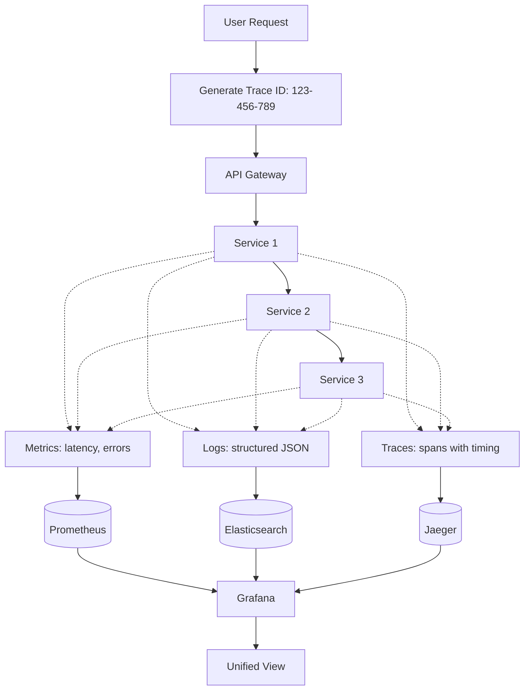
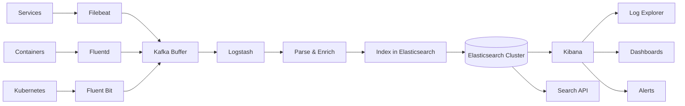
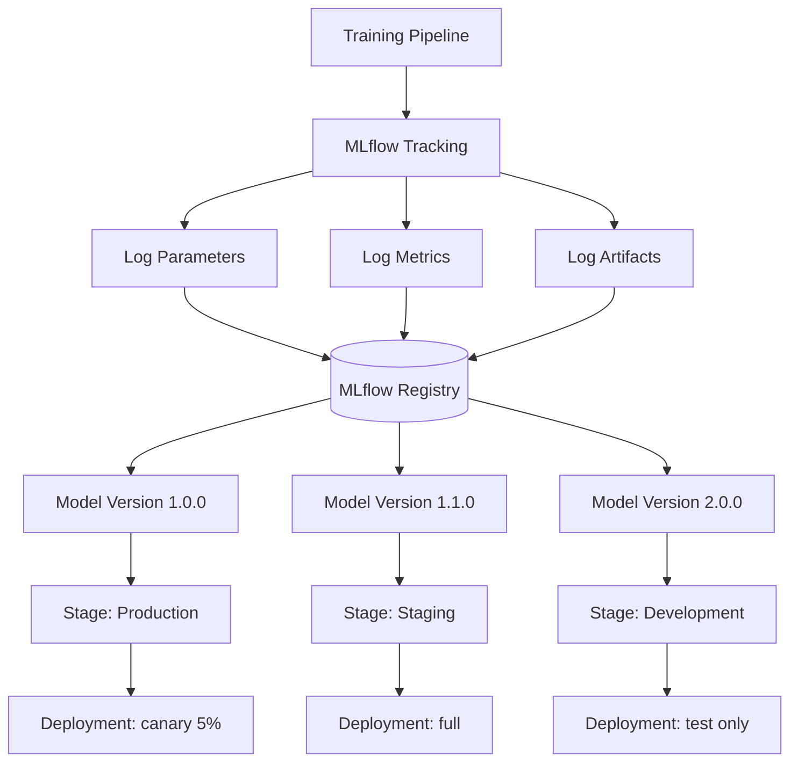

# Enterprise AI Architecture Part 4: The Control Room - Observability, Governance & Security.md
## The Control Room: Observability, Governance & Security

**Author:** Reeshu Patel  
**Document ID:** EA-AI-2024-003-P4  
**Classification:** Enterprise Architecture  
**Reading Time:** 20 minutes  
**Part:** 4 of 4

---

# INTRODUCTION: Watching the Watchers

In Part 1, we built the library—the secure entryways, the document processing pipeline, the vector databases that organize millions of pieces of knowledge. We created a place where information could be stored, indexed, and retrieved.

In Part 2, we hired the librarians—the external AI experts from OpenAI and Anthropic, the in-house models running on our own GPUs, the intelligent router that directs each question to the right expert, and the agent orchestra that can plan complex, multi-step tasks.

In Part 3, we watched our agents get to work—connecting to Salesforce, querying databases, searching documents, running calculations, and automating browsers. We gave them a safe sandbox to work in, with resource limits and network isolation.

But here's the thing about complex systems: they're complex. Things go wrong. Models hallucinate. Costs spiral. Security threats emerge. Compliance requirements change.

**In Part 4**, we step into the control room. This is where we watch the watchers—where every prompt, every response, every API call, every token, and every dollar is tracked, analyzed, and governed.

Think of this as Mission Control for your AI platform. From here, we can see everything: which departments are spending the most, which models are performing best, which queries are causing hallucinations, and which security threats are emerging. We can set budgets, enforce compliance, detect anomalies, and sleep soundly knowing our systems are under control.

**Previously in Part 3:** We covered Secure Sandboxes, Resource Limits, Network Isolation, Enterprise API Integration, Database Access, Search Systems, Document Retrieval, and External Tools.

This is the final part of our four-part journey. Let's step into the control room.

---

# PART 4: THE CONTROL ROOM - OBSERVABILITY, GOVERNANCE & SECURITY

## Chapter 14: The Observatory - Monitoring Everything

Imagine flying an airplane without instruments—no altimeter, no fuel gauge, no radar. You'd have no idea how high you are, how much fuel remains, or what storms lie ahead. That's what running an AI platform without observability feels like.

Our observability stack gives us instruments for everything.

### 14.1 The Three Pillars: Metrics, Logs, Traces

**The Scenario**: Something feels slow. Users are complaining. But where's the bottleneck? Is it the model? The database? The network? We need to see everything.

**Technical Deep Dive**: We implement the three pillars of observability—metrics for numerical data, logs for events, and traces for request flows—all correlated with a common request ID.



**Trace ID Propagation**:
```python
# Middleware to propagate trace ID
class TraceMiddleware:
    def __init__(self, app):
        self.app = app
        
    async def __call__(self, scope, receive, send):
        # Get or generate trace ID
        headers = dict(scope.get('headers', []))
        trace_id = headers.get(b'x-trace-id', b'').decode()
        
        if not trace_id:
            trace_id = str(uuid.uuid4())
        
        # Add to request context
        scope['trace_id'] = trace_id
        
        # Start span
        tracer = trace.get_tracer(__name__)
        with tracer.start_as_current_span("http_request") as span:
            span.set_attribute("trace_id", trace_id)
            span.set_attribute("http.method", scope['method'])
            span.set_attribute("http.path", scope['path'])
            
            # Process request
            await self.app(scope, receive, send)
```

**The Layman Explanation**: Imagine an air traffic control radar that shows every plane, its speed, altitude, and destination. Now imagine you can also listen to every pilot's radio communications AND review the flight recorder after any incident. That's what metrics, logs, and traces give us—a complete picture of everything happening in our system.

**Image Generation Prompt:**
```
A futuristic mission control center with three massive screens. Left screen shows real-time graphs and metrics (Prometheus/Grafana style). Middle screen shows scrolling JSON logs with search highlighting (ELK style). Right screen shows trace visualizations with colored spans and timing (Jaeger style). A single operator monitors all three screens from a central console. Clean, professional control room aesthetic with blue ambient lighting. 4K.
```

### 14.2 Metrics Collection (Prometheus + Grafana)

**The Scenario**: David (our Admin) needs to know: How many requests per second? What's the p95 latency? Are any services failing? Is GPU utilization too high?

**Technical Deep Dive**: We use Prometheus to collect time-series metrics from every service, and Grafana to visualize them in customizable dashboards.

```yaml
# Prometheus scrape configuration
scrape_configs:
  - job_name: 'api-gateway'
    scrape_interval: 15s
    static_configs:
      - targets: ['api-gateway:9090']
  
  - job_name: 'llm-router'
    scrape_interval: 15s
    static_configs:
      - targets: ['llm-router:9090']
  
  - job_name: 'agent-orchestrator'
    scrape_interval: 15s
    static_configs:
      - targets: ['agent-orchestrator:9090']
  
  - job_name: 'model-servers'
    scrape_interval: 30s
    kubernetes_sd_configs:
      - role: pod
    relabel_configs:
      - source_labels: [__meta_kubernetes_pod_label_app]
        regex: 'vllm|tgi|triton'
        action: keep
```

**Custom Metrics Definition**:
```python
# Prometheus metrics in Python
from prometheus_client import Histogram, Counter, Gauge, Summary

# Request metrics
request_latency = Histogram(
    'request_duration_seconds',
    'Request latency in seconds',
    ['service', 'endpoint', 'model'],
    buckets=[0.1, 0.25, 0.5, 1.0, 2.0, 5.0, 10.0]
)

request_count = Counter(
    'requests_total',
    'Total requests',
    ['service', 'endpoint', 'status']
)

# Business metrics
token_usage = Counter(
    'tokens_total',
    'Total tokens used',
    ['model', 'department', 'user_tier']
)

cost_total = Counter(
    'cost_usd_total',
    'Total cost in USD',
    ['model', 'department']
)

# System metrics
active_requests = Gauge(
    'active_requests',
    'Active requests',
    ['service']
)

gpu_utilization = Gauge(
    'gpu_utilization_percent',
    'GPU utilization percentage',
    ['gpu_id', 'model']
)

queue_depth = Gauge(
    'queue_depth',
    'Current queue depth',
    ['queue_name']
)

# Rate metrics with Summary
token_rate = Summary(
    'token_rate_per_second',
    'Token rate per second',
    ['model']
)
```

**Key Dashboards**:

| Dashboard | Purpose | Key Metrics | Refresh |
|-----------|---------|-------------|---------|
| **Executive Overview** | High-level health | Request rate, error rate, total cost | 5 min |
| **Model Performance** | Model comparison | Latency, token usage, cost per model | 1 min |
| **Department Usage** | Cost attribution | Tokens by dept, cost by dept | 1 hour |
| **Infrastructure** | System health | CPU, memory, GPU, network | 15 sec |
| **SLA Compliance** | Service levels | Latency percentiles, error budgets | 1 min |
| **Anomaly Detection** | Unusual patterns | Statistical deviations | Real-time |

**Grafana Dashboard JSON Example**:
```json
{
  "dashboard": {
    "title": "LLM Platform Executive Overview",
    "panels": [
      {
        "title": "Request Rate",
        "type": "graph",
        "targets": [
          {
            "expr": "sum(rate(requests_total[5m]))",
            "legendFormat": "All Requests"
          },
          {
            "expr": "sum(rate(requests_total{status=\"error\"}[5m]))",
            "legendFormat": "Errors"
          }
        ]
      },
      {
        "title": "p95 Latency by Model",
        "type": "heatmap",
        "targets": [
          {
            "expr": "histogram_quantile(0.95, sum(rate(request_duration_seconds_bucket[5m])) by (le, model))",
            "legendFormat": "{{model}}"
          }
        ]
      },
      {
        "title": "Daily Cost by Department",
        "type": "pie",
        "targets": [
          {
            "expr": "sum(increase(cost_usd_total[24h])) by (department)",
            "format": "table"
          }
        ]
      }
    ]
  }
}
```

**The Layman Explanation**: Metrics are like the gauges in a car's dashboard—speedometer, tachometer, fuel gauge, temperature. They give you numbers that tell you how things are running. Prometheus collects all these numbers from every part of the system, and Grafana turns them into beautiful, real-time charts that anyone can understand.

**Image Generation Prompt:**
```
A high-tech monitoring wall with dozens of real-time graphs and gauges. Green, yellow, and red status indicators. Line graphs showing request rates over time, heat maps showing latency distributions, pie charts showing cost breakdowns. A central screen shows an animated network map with service nodes and connection lines. Clean, modern NOC aesthetic with blue and purple colors. 4K.
```

### 14.3 Log Aggregation (ELK Stack)

**The Scenario**: Something went wrong at 3:47 AM. What happened? We need to search through millions of log lines to find the exact error.

**Technical Deep Dive**: We use the ELK stack—Elasticsearch for storage and search, Logstash for processing, and Kibana for visualization.



**Structured Log Format**:
```json
{
  "@timestamp": "2024-03-22T10:30:00.123Z",
  "trace_id": "abc-123-def-456",
  "span_id": "span-789",
  "service": "llm-router",
  "level": "ERROR",
  "message": "Model request failed after retries",
  "user_id": "user-456",
  "session_id": "sess-789",
  "request": {
    "model": "gpt-4",
    "prompt_tokens": 450,
    "temperature": 0.7,
    "stream": false
  },
  "error": {
    "type": "RateLimitError",
    "message": "Rate limit exceeded for organization",
    "retry_after": 30
  },
  "performance": {
    "duration_ms": 1234,
    "attempts": 3
  },
  "kubernetes": {
    "pod": "llm-router-7d8f9e12",
    "namespace": "ai-platform",
    "container": "router"
  },
  "cloud": {
    "region": "us-east-1",
    "az": "us-east-1a"
  }
}
```

**Log Search Examples**:
```sql
-- Find all errors for a specific user
SELECT * FROM logs 
WHERE level = 'ERROR' 
  AND user_id = 'user-456'
  AND @timestamp > NOW() - INTERVAL 7 DAYS

-- Trace a single request through all services
SELECT * FROM logs 
WHERE trace_id = 'abc-123-def-456'
ORDER BY @timestamp

-- Find slow requests
SELECT * FROM logs 
WHERE performance.duration_ms > 5000
  AND service = 'llm-router'
ORDER BY performance.duration_ms DESC

-- Cost analysis by department
SELECT department, SUM(request.prompt_tokens) as total_tokens
FROM logs 
WHERE @timestamp > NOW() - INTERVAL 30 DAYS
GROUP BY department
```

**Log Retention Policy**:
| Log Type | Hot Storage | Warm Storage | Cold Storage | Total |
|----------|-------------|--------------|--------------|-------|
| Application logs | 7 days (SSD) | 30 days (HDD) | 1 year (S3) | 1 year+ |
| Audit logs | 30 days (SSD) | 1 year (HDD) | 7 years (Glacier) | 7 years |
| Security logs | 30 days (SSD) | 90 days (HDD) | 3 years (Glacier) | 3 years |
| Prompt/Response | 7 days (SSD) | 90 days (HDD) | 1 year (S3) | 1 year |

**The Layman Explanation**: If metrics are the gauges on your dashboard, logs are the flight recorder. Every event, every error, every request is recorded in a massive searchable database. When something goes wrong, you can search through millions of records to find the exact moment things broke—like having a security camera for every part of your system.

**Image Generation Prompt:**
```
A massive search interface showing scrolling JSON logs with syntax highlighting. A search bar at the top with a complex query highlighted. Results stream in with timestamps color-coded by log level - red for errors, yellow for warnings, green for info. A timeline histogram shows log volume over time with spikes highlighted. Clean, data-exploration aesthetic. 4K.
```

### 14.4 Distributed Tracing (Jaeger)

**The Scenario**: A request is slow. Is it slow because of the model? Because of database queries? Because of network latency? We need to see the entire journey.

**Technical Deep Dive**: We use Jaeger for distributed tracing, with OpenTelemetry instrumentation in all services.

```python
# OpenTelemetry instrumentation
from opentelemetry import trace
from opentelemetry.exporter.jaeger.thrift import JaegerExporter
from opentelemetry.sdk.trace import TracerProvider
from opentelemetry.sdk.trace.export import BatchSpanProcessor
from opentelemetry.instrumentation.requests import RequestsInstrumentor

# Setup tracer
trace.set_tracer_provider(TracerProvider())
jaeger_exporter = JaegerExporter(
    agent_host_name="jaeger-agent",
    agent_port=6831,
)
span_processor = BatchSpanProcessor(jaeger_exporter)
trace.get_tracer_provider().add_span_processor(span_processor)

# Instrument libraries
RequestsInstrumentor().instrument()

tracer = trace.get_tracer(__name__)

async def process_request(request):
    with tracer.start_as_current_span("process-request") as span:
        span.set_attribute("user.id", request.user_id)
        span.set_attribute("request.size", len(request.query))
        
        # Call LLM with nested span
        with tracer.start_as_current_span("llm-call") as llm_span:
            llm_span.set_attribute("model", request.model)
            result = await call_llm(request)
            llm_span.set_attribute("tokens", result.tokens)
        
        # Call database with nested span
        with tracer.start_as_current_span("database-query") as db_span:
            db_span.set_attribute("query.type", "semantic_search")
            context = await retrieve_context(request)
            db_span.set_attribute("results", len(context))
        
        return result
```

**Trace Visualization**:
```
Trace: 1234567890abcdef (duration: 2.45s)
├── Span: API Gateway authenticate (0.12s)
│   ├── Span: Redis token lookup (0.03s)
│   └── Span: JWT validation (0.08s)
├── Span: Rate limiting (0.02s)
├── Span: Model routing (0.15s)
│   ├── Span: Feature extraction (0.05s)
│   ├── Span: XGBoost prediction (0.03s)
│   └── Span: Model selection (0.07s)
├── Span: Context retrieval (0.45s)
│   ├── Span: Vector search (0.35s)
│   │   ├── Span: Query embedding (0.12s)
│   │   ├── Span: Vector DB query (0.18s)
│   │   └── Span: Result reranking (0.05s)
│   └── Span: Document fetch (0.10s)
├── Span: LLM call (1.50s)
│   ├── Span: HTTP request (1.40s)
│   └── Span: Response parsing (0.10s)
└── Span: Response formatting (0.21s)
    ├── Span: Token counting (0.03s)
    ├── Span: Safety check (0.15s)
    └── Span: JSON serialization (0.03s)
```

**The Layman Explanation**: If logs are the flight recorder, traces are the air traffic controller's radar showing every plane's entire route. You can see exactly where a request went, how long it spent at each stop, and where the delays happened. It's the difference between knowing a flight was delayed and knowing it was delayed because of weather in Chicago.

**Image Generation Prompt:**
```
A complex trace visualization with colored spans representing different services. Each span shows duration with a horizontal bar, and nested spans show parent-child relationships. Red spans indicate slow operations, green spans indicate normal. A timeline at the top shows the total request duration. Clean, observability-focused design with Jaeger's purple color scheme. 4K.
```

### 14.5 Alerting (AlertManager)

**The Scenario**: It's 3 AM. Something's wrong. Who gets woken up? With what urgency? And how do we make sure it's a real problem, not just a temporary blip?

**Technical Deep Dive**: We use Prometheus AlertManager to route alerts based on severity, with different receivers for different teams.

```yaml
# alertmanager.yml
route:
  group_by: ['alertname', 'service']
  group_wait: 30s
  group_interval: 5m
  repeat_interval: 4h
  
  routes:
    - match:
        severity: critical
      receiver: pagerduty-critical
      continue: false
      
    - match:
        severity: warning
      receiver: slack-warnings
      
    - match:
        severity: info
      receiver: log-only

receivers:
  - name: pagerduty-critical
    pagerduty_configs:
      - service_key: <pd-key>
        severity: critical
        description: '{{ .GroupLabels.alertname }}'
        
  - name: slack-warnings
    slack_configs:
      - channel: '#ai-alerts'
        title: 'Warning: {{ .GroupLabels.alertname }}'
        text: '{{ range .Alerts }}{{ .Annotations.description }}\n{{ end }}'
        
  - name: log-only
    # Just log, no notification
```

**Alert Rules**:
```yaml
groups:
  - name: llm_alerts
    rules:
      - alert: HighLatency
        expr: histogram_quantile(0.95, rate(request_duration_seconds_bucket[5m])) > 2
        for: 5m
        labels:
          severity: warning
        annotations:
          summary: "High latency detected"
          description: "p95 latency is {{ $value }}s for 5 minutes"
          
      - alert: ErrorRateHigh
        expr: rate(errors_total[5m]) / rate(requests_total[5m]) > 0.05
        for: 2m
        labels:
          severity: critical
        annotations:
          summary: "Error rate > 5%"
          description: "Error rate is {{ $value | humanizePercentage }}"
          
      - alert: BudgetExceeded
        expr: daily_cost > 1000
        labels:
          severity: warning
        annotations:
          summary: "Daily budget exceeded"
          description: "Daily cost is ${{ $value }}"
          
      - alert: GPUOverheating
        expr: gpu_temperature_celsius > 85
        for: 5m
        labels:
          severity: critical
        annotations:
          summary: "GPU overheating"
          description: "GPU {{ $labels.gpu_id }} temperature is {{ $value }}°C"
```

**The Layman Explanation**: Alerts are like the warning lights on your car dashboard—but smarter. They don't just light up when something's wrong; they decide who to notify based on how serious it is. A minor warning might just post to Slack. A major outage pages the on-call engineer. And they're smart enough not to wake someone up for a temporary blip that resolves itself.

**Image Generation Prompt:**
```
A notification center with multiple channels lighting up. Red critical alerts trigger a pager device buzzing. Yellow warnings post to a Slack channel shown on screen. Green info alerts simply log to a file. A routing diagram shows alerts being classified and sent to appropriate receivers based on severity rules. Clean, notification-focused design. 4K.
```

---

## Chapter 15: The Governance Council - Model Governance & Compliance

Our AI system is powerful. But with power comes responsibility. We need to govern what models we use, track their performance, ensure they're fair, and comply with regulations.

### 15.1 Model Registry (MLflow)

**The Scenario**: We have 50 models in production, 100 in staging, and 500 experimental versions. Which one is currently serving customer support traffic? Which version was used last week? What were its performance metrics?

**Technical Deep Dive**: We use MLflow as our central model registry, tracking every model version, its metadata, and its deployment status.



**Model Registration**:
```python
import mlflow
from mlflow.tracking import MlflowClient

# Register a model
mlflow.set_tracking_uri("https://mlflow.company.com")

with mlflow.start_run(run_name="llama2-7b-finetuned-v2"):
    # Log parameters
    mlflow.log_param("base_model", "meta-llama/Llama-2-7b-chat-hf")
    mlflow.log_param("dataset", "customer-support-2024-01")
    mlflow.log_param("epochs", 3)
    mlflow.log_param("learning_rate", 2e-5)
    mlflow.log_param("batch_size", 8)
    
    # Log metrics
    mlflow.log_metric("accuracy", 0.942)
    mlflow.log_metric("hallucination_rate", 0.031)
    mlflow.log_metric("bleu_score", 0.876)
    
    # Log artifacts
    mlflow.log_artifact("model.bin")
    mlflow.log_artifact("tokenizer.json")
    mlflow.log_artifact("model_card.md")
    
    # Register the model
    mlflow.register_model(
        model_uri=f"runs:/{mlflow.active_run().info.run_id}/model",
        name="customer-support-llama2"
    )

# Transition model stage
client = MlflowClient()
client.transition_model_version_stage(
    name="customer-support-llama2",
    version=2,
    stage="Production"
)
```

**Model Card Example**:
```yaml
model_name: customer-support-llama2
version: 2.1.0
created: 2024-03-15
owner: ai-engineering-team

intended_use:
  - Customer support chatbot for tier 1-2 issues
  - Answering FAQs about billing, technical issues, account management
  - Not for: medical advice, legal opinions, crisis support

training_data:
  source: "customer-support-conversations-2023"
  size: 500,000 conversations
  languages: ["en", "es", "fr"]
  domains: 
    - billing: 35%
    - technical: 40%
    - account: 25%

performance:
  overall_accuracy: 0.942
  by_domain:
    billing: 0.956
    technical: 0.931
    account: 0.948
  latency_p50: 450ms
  latency_p95: 850ms
  cost_per_1k_tokens: $0.002

limitations:
  - "May struggle with highly technical code questions"
  - "Spanish support limited to basic queries"
  - "Requires human review for refund decisions"
  - "Not trained on data after 2023-12-31"

bias_assessment:
  gender_bias: 0.02 (acceptable)
  racial_bias: 0.015 (acceptable)
  age_bias: 0.03 (acceptable)
  last_audit: 2024-03-01

compliance:
  gdpr_compliant: true
  hipaa_compliant: false
  soc2_audited: true
  data_retention: 90 days

deployment:
  environment: production
  replicas: 5
  hardware: AWS g5.2xlarge (A10G)
  autoscaling: true
  min_replicas: 3
  max_replicas: 10
  canary_enabled: true
```

**The Layman Explanation**: The model registry is like a human resources system for your AI models. It tracks every model's resume (what it was trained on), performance reviews (accuracy metrics), and current job assignment (which service it's serving). When you need to know which version of "customer support bot" is working right now, you check the registry.

**Image Generation Prompt:**
```
A digital HR system for AI models. Each model has a profile card showing its name, version, performance metrics, and current deployment status (production, staging, development). Cards are organized in racks with color coding - green for production, yellow for staging, blue for development. A search bar allows filtering by model type, owner, or metrics. Clean, organizational database aesthetic. 4K.
```

### 15.2 Model Approval Workflow

**The Scenario**: A new model version is ready. Before it goes to production, it needs testing sign-off, security review, compliance approval, and final authorization.

**Technical Deep Dive**: We implement an approval workflow using Temporal, with different stages and required approvers.

```python
from temporalio import workflow, activity

@workflow.defn
class ModelApprovalWorkflow:
    @workflow.run
    async def run(self, model_version: dict):
        # Stage 1: Automated testing
        test_results = await workflow.execute_activity(
            run_automated_tests,
            model_version,
            start_to_close_timeout=timedelta(hours=1)
        )
        
        if test_results.failed:
            await workflow.execute_activity(
                notify_team,
                f"Model {model_version.name} failed tests"
            )
            return "rejected"
        
        # Stage 2: Security review
        security_task = await workflow.execute_activity(
            create_security_review,
            model_version,
            start_to_close_timeout=timedelta(minutes=5)
        )
        
        # Wait for security approval (could take days)
        security_approved = await workflow.wait_condition(
            lambda: security_task.status == "approved",
            timeout=timedelta(days=3)
        )
        
        if not security_approved:
            return "rejected"
        
        # Stage 3: Compliance review
        compliance_task = await workflow.execute_activity(
            create_compliance_review,
            model_version,
            start_to_close_timeout=timedelta(minutes=5)
        )
        
        compliance_approved = await workflow.wait_condition(
            lambda: compliance_task.status == "approved",
            timeout=timedelta(days=2)
        )
        
        if not compliance_approved:
            return "rejected"
        
        # Stage 4: Final approval
        final_task = await workflow.execute_activity(
            notify_approvers,
            model_version,
            start_to_close_timeout=timedelta(minutes=5)
        )
        
        approved = await workflow.wait_condition(
            lambda: final_task.status == "approved",
            timeout=timedelta(days=1)
        )
        
        if not approved:
            return "rejected"
        
        # Deploy to canary
        await workflow.execute_activity(
            deploy_to_canary,
            model_version,
            start_to_close_timeout=timedelta(minutes=10)
        )
        
        return "approved"
```

**Approval Stages**:
| Stage | Approver | Timeout | Criteria |
|-------|----------|---------|----------|
| Automated Tests | CI/CD system | 1 hour | All tests pass |
| Security Review | Security team | 3 days | No vulnerabilities, proper auth |
| Compliance Review | Legal/Compliance | 2 days | GDPR, HIPAA, SOC2 compliance |
| Performance Review | Engineering | 1 day | Latency, cost within limits |
| Final Approval | Product Manager | 1 day | Business fit |

**The Layman Explanation**: Before a new model goes live, it has to pass through multiple checkpoints—like a new drug needing FDA approval, clinical trials, and manufacturing checks. The security team checks for vulnerabilities, compliance ensures it meets regulations, and product management confirms it actually solves the right problem.

**Image Generation Prompt:**
```
A workflow visualization showing model approval stages. Each stage is a gate - Automated Testing (green check), Security Review (shield icon), Compliance Review (gavel icon), Performance Review (speedometer), Final Approval (signature). A model card moves through each gate, with status indicators. Some gates are open (approved), one is closed (pending). Clean, workflow visualization style. 4K.
```

### 15.3 Bias Detection & Fairness Monitoring

**The Scenario**: Is our hiring assistant model treating candidates differently based on gender? Is our customer service bot less helpful to certain demographics? We need to know.

**Technical Deep Dive**: We use AI Fairness 360 (AIF360) to detect and measure bias in model outputs.

```python
from aif360.metrics import BinaryLabelDatasetMetric
from aif360.algorithms.preprocessing import Reweighing
from aif360.datasets import BinaryLabelDataset

class BiasDetector:
    def __init__(self):
        self.privileged_groups = [{'gender': 1}]  # Male
        self.unprivileged_groups = [{'gender': 0}]  # Female
        
    async def evaluate_model_fairness(self, model_name, test_data):
        # Create dataset
        dataset = BinaryLabelDataset(
            df=test_data,
            label_names=['accepted'],
            protected_attribute_names=['gender', 'race', 'age']
        )
        
        # Calculate metrics
        metric = BinaryLabelDatasetMetric(
            dataset,
            unprivileged_groups=self.unprivileged_groups,
            privileged_groups=self.privileged_groups
        )
        
        results = {
            'disparate_impact': metric.disparate_impact(),
            'statistical_parity_difference': metric.statistical_parity_difference(),
            'consistency': metric.consistency(),
            'smoothed_empirical_differential_fairness': metric.smoothed_empirical_differential_fairness()
        }
        
        # Check thresholds
        alerts = []
        if results['disparate_impact'] < 0.8:
            alerts.append(f"Disparate impact too low: {results['disparate_impact']:.2f}")
        
        if abs(results['statistical_parity_difference']) > 0.1:
            alerts.append(f"Statistical parity difference too high: {results['statistical_parity_difference']:.2f}")
        
        return {
            'metrics': results,
            'alerts': alerts,
            'status': 'fail' if alerts else 'pass'
        }
```

**Fairness Metrics**:
| Metric | Description | Target | Interpretation |
|--------|-------------|--------|----------------|
| Disparate Impact | Ratio of positive rates | > 0.8 | 1.0 is perfect fairness |
| Statistical Parity | Difference in positive rates | < 0.1 | 0 is perfect |
| Equal Opportunity | True positive rate equality | < 0.1 | 0 is perfect |
| Demographic Parity | Representation equality | < 0.1 | 0 is perfect |

**Continuous Monitoring**:
```python
# Scheduled fairness check
@schedule(interval=timedelta(days=7))
async def weekly_fairness_audit():
    for model in active_models:
        # Sample recent predictions
        sample = await get_prediction_sample(model.id, days=7)
        
        # Evaluate fairness
        fairness = await bias_detector.evaluate_model_fairness(
            model.id, 
            sample
        )
        
        if fairness['status'] == 'fail':
            # Alert team
            await slack.send(
                channel='#ai-governance',
                message=f"Fairness alert for {model.name}: {fairness['alerts']}"
            )
            
            # Log for audit
            await log_fairness_issue(model.id, fairness)
```

**The Layman Explanation**: Bias detection is like having a diversity officer review every decision your AI makes. It checks whether the AI is treating people differently based on gender, race, age, or other protected characteristics. If it finds bias—like approving loans more often for one group than another—it raises an alert.

**Image Generation Prompt:**
```
A fairness dashboard showing multiple metrics with gauges. Green zones indicate acceptable ranges, red zones indicate bias. A balance scale icon shows weight distribution between different demographic groups. Line graphs track fairness metrics over time with trend indicators. Clean, fairness-focused design with purple and gold color scheme. 4K.
```

### 15.4 Compliance Reporting

**The Scenario**: The auditors are coming. They need to see: Who accessed what data? Which models were used? What decisions were made? Show us everything for the last 3 years.

**Technical Deep Dive**: We maintain immutable audit logs and generate compliance reports automatically.

```python
class ComplianceReporter:
    def __init__(self):
        self.audit_store = ImmutableAuditLog()  # Blockchain-backed
        self.report_generator = ReportGenerator()
        
    async def generate_gdpr_report(self, user_id):
        # Find all data related to this user
        user_data = await self.find_user_data(user_id)
        
        # Find all model interactions
        interactions = await self.find_user_interactions(user_id)
        
        # Find all access logs
        access_logs = await self.find_access_logs(user_id)
        
        report = {
            'user_id': user_id,
            'generated_at': datetime.now().isoformat(),
            'data_held': user_data,
            'model_interactions': interactions,
            'access_history': access_logs,
            'retention_periods': self.calculate_retention(user_data),
            'deletion_eligible': self.check_deletion_eligibility(user_id)
        }
        
        # Generate PDF
        pdf = await self.report_generator.generate_pdf(
            template='gdpr_report.html',
            data=report
        )
        
        # Store report
        await self.store_report(user_id, pdf, 'gdpr')
        
        return pdf
    
    async def generate_soc2_report(self, start_date, end_date):
        # Get all audit logs for period
        logs = await self.audit_store.query(
            start_date=start_date,
            end_date=end_date
        )
        
        # Summarize by category
        summary = {
            'access_events': self.count_by_type(logs, 'access'),
            'model_calls': self.count_by_type(logs, 'model_call'),
            'data_exports': self.count_by_type(logs, 'export'),
            'admin_actions': self.count_by_type(logs, 'admin'),
            'security_events': self.count_by_type(logs, 'security'),
            'compliance_checks': self.count_by_type(logs, 'compliance')
        }
        
        # Verify integrity (blockchain hashes)
        integrity_check = await self.verify_log_integrity(logs)
        
        report = {
            'period': f"{start_date} to {end_date}",
            'summary': summary,
            'integrity_verified': integrity_check,
            'sample_logs': logs[:100],  # Sample for auditors
            'controls_assessment': await self.assess_controls()
        }
        
        return report
```

**The Layman Explanation**: Compliance reporting is like having a perfect memory of everything that ever happened, organized for auditors. When someone asks "Show me every time customer data was accessed," you can produce a complete, tamper-proof report instantly. It's the difference between scrambling through paper records and clicking "generate report."

**Image Generation Prompt:**
```
A compliance dashboard with multiple report templates - GDPR, SOC2, HIPAA, CCPA. A report generation engine processes audit logs and produces formatted PDF documents with official seals. A verification checkmark shows log integrity is confirmed via blockchain. Clean, professional compliance aesthetic with blue and green colors. 4K.
```

---

## Chapter 16: The Treasury - Cost Tracking & Optimization

AI is powerful, but it's not free. Every token costs money. We need to track costs, attribute them to departments, set budgets, and optimize spending.

### 16.1 Real-time Token Counting & Cost Attribution

**The Scenario**: Engineering spent $12,000 last month on AI. Marketing spent $3,000. But which teams within engineering? Which projects? We need granular cost attribution.

**Technical Deep Dive**: We track every token used, attribute it to department/project/user, and calculate real-time costs.

```python
class CostTracker:
    def __init__(self):
        self.influx = InfluxDBClient()
        self.redis = Redis()
        
    async def track_usage(self, request, response, cost):
        # Get attribution from request context
        attribution = {
            'user_id': request.user_id,
            'department': request.department,
            'project': request.project,
            'environment': request.environment,
            'model': request.model,
            'provider': request.provider
        }
        
        # Calculate metrics
        tokens = {
            'prompt': response.usage.prompt_tokens,
            'completion': response.usage.completion_tokens,
            'total': response.usage.total_tokens
        }
        
        # Store in InfluxDB for time-series analysis
        point = {
            "measurement": "token_usage",
            "tags": attribution,
            "fields": {
                "prompt_tokens": tokens['prompt'],
                "completion_tokens": tokens['completion'],
                "total_tokens": tokens['total'],
                "cost_usd": cost
            },
            "time": datetime.utcnow()
        }
        
        await self.influx.write_points([point])
        
        # Update real-time counters in Redis
        today = datetime.now().strftime("%Y-%m-%d")
        
        # Department daily total
        dept_key = f"cost:daily:{today}:dept:{request.department}"
        await self.redis.incrbyfloat(dept_key, cost)
        
        # User daily total
        user_key = f"cost:daily:{today}:user:{request.user_id}"
        await self.redis.incrbyfloat(user_key, cost)
        
        # Model daily total
        model_key = f"cost:daily:{today}:model:{request.model}"
        await self.redis.incrbyfloat(model_key, cost)
        
        # Set expiry (keep for 90 days)
        await self.redis.expire(dept_key, 90 * 86400)
        
        return {
            'tracked': True,
            'attribution': attribution,
            'tokens': tokens,
            'cost': cost
        }
```

**Cost Dashboard Queries**:
```sql
-- Cost by department this month
SELECT SUM(cost_usd) 
FROM token_usage 
WHERE time > now() - 30d 
GROUP BY department

-- Top 10 users by cost
SELECT SUM(cost_usd) 
FROM token_usage 
WHERE time > now() - 7d 
GROUP BY user_id 
ORDER BY SUM(cost_usd) DESC 
LIMIT 10

-- Hourly cost trend by model
SELECT SUM(cost_usd) 
FROM token_usage 
WHERE time > now() - 24h 
GROUP BY time(1h), model

-- Project cost breakdown
SELECT SUM(cost_usd) 
FROM token_usage 
WHERE time > now() - 30d 
GROUP BY project
```

**The Layman Explanation**: Cost tracking is like having a detailed receipt for every single AI interaction. Every question, every response, every token is accounted for and tagged with who used it, what department they're in, and what project they're working on. At the end of the month, you know exactly who spent what—no estimates, no surprises.

**Image Generation Prompt:**
```
A financial dashboard showing real-time cost tracking. A spinning token counter shows usage accumulating. Pie charts break down costs by department (engineering, sales, marketing, HR). Line graphs show hourly/daily trends. A world map shows regional usage. Clean, financial dashboard aesthetic with green (profit) and red (cost) colors. 4K.
```

### 16.2 Budget Alerts & Quotas

**The Scenario**: Engineering has a monthly budget of $15,000. On the 15th, they've already spent $12,000. They need to know before they hit the limit.

**Technical Deep Dive**: We implement progressive budget alerts and optional hard quotas.

```python
class BudgetManager:
    def __init__(self):
        self.budgets = self.load_budgets()
        
    async def check_budget(self, user_context, estimated_cost):
        # Get department budget
        dept = user_context['department']
        budget = self.budgets.get(dept)
        
        if not budget:
            return {'allowed': True}  # No budget = no limit
        
        # Get current spending
        today = datetime.now().strftime("%Y-%m-%d")
        spent_key = f"cost:monthly:{budget.month}:dept:{dept}"
        spent = float(await self.redis.get(spent_key) or 0)
        
        # Calculate if this request would exceed budget
        if spent + estimated_cost > budget.amount:
            return {
                'allowed': False,
                'reason': 'Budget exceeded',
                'spent': spent,
                'budget': budget.amount,
                'estimated': estimated_cost
            }
        
        # Check alert thresholds
        percent_used = (spent / budget.amount) * 100
        alerts = []
        
        if percent_used >= 90 and not await self.alert_sent(dept, '90%'):
            alerts.append('90%')
            await self.send_alert(dept, '90%', spent, budget.amount)
            
        if percent_used >= 75 and not await self.alert_sent(dept, '75%'):
            alerts.append('75%')
            await self.send_alert(dept, '75%', spent, budget.amount)
        
        return {
            'allowed': True,
            'spent': spent,
            'budget': budget.amount,
            'percent_used': percent_used,
            'alerts': alerts
        }
    
    async def enforce_quota(self, user_context):
        # User-level quotas
        user_id = user_context['user_id']
        quota = await self.get_user_quota(user_id)
        
        if not quota:
            return {'allowed': True}
        
        # Get today's usage
        today = datetime.now().strftime("%Y-%m-%d")
        usage_key = f"quota:daily:{today}:user:{user_id}"
        used = int(await self.redis.get(usage_key) or 0)
        
        if used >= quota.daily_limit:
            return {
                'allowed': False,
                'reason': 'Daily quota exceeded',
                'used': used,
                'limit': quota.daily_limit
            }
        
        return {'allowed': True}
```

**Budget Tiers**:
| Tier | Monthly Budget | Alert Thresholds | Action on Exceed |
|------|----------------|------------------|------------------|
| Engineering | $15,000 | 75%, 90%, 100% | Warn at 90%, block at 100% |
| Sales | $5,000 | 80%, 95% | Warn at 95%, block at 100% |
| Marketing | $3,000 | 85%, 100% | Warn at 100%, block next month |
| HR | $1,000 | 90% | Warn only |
| Executive | $10,000 | None | No limits |

**The Layman Explanation**: Budget alerts are like your credit card sending you a text when you're close to your limit. They give you a chance to slow down before you hit the max. Quotas are like daily spending limits—once you've used your 100 queries for the day, you wait until tomorrow.

**Image Generation Prompt:**
```
A budget gauge showing percentage used - green (0-75%), yellow (75-90%), red (90-100%). At 90%, a warning light flashes and a Slack notification appears. At 100%, a red block symbol appears with "Budget Exceeded" message. Multiple gauges for different departments shown in a grid. Clean, financial monitoring aesthetic. 4K.
```

### 16.3 Cost Projections & Anomaly Detection

**The Scenario**: Costs suddenly spiked 200% yesterday. Was it a new feature launch? A bug? An attack? We need to know.

**Technical Deep Dive**: We use time-series forecasting to predict expected costs and detect anomalies.

```python
class CostAnalyzer:
    def __init__(self):
        self.model = self.load_forecast_model()
        
    async def detect_anomalies(self):
        # Get last 30 days of costs
        historical = await self.get_historical_costs(days=30)
        
        # Get yesterday's actual cost
        yesterday = await self.get_yesterdays_cost()
        
        # Predict expected cost
        expected = self.model.predict(historical)
        
        # Calculate deviation
        deviation = (yesterday - expected) / expected
        
        if abs(deviation) > 0.5:  # 50% deviation
            # Find which model/department caused it
            breakdown = await self.get_cost_breakdown(
                start=datetime.now() - timedelta(days=2),
                end=datetime.now()
            )
            
            # Identify culprit
            culprit = self.find_culprit(breakdown)
            
            return {
                'anomaly_detected': True,
                'expected_cost': expected,
                'actual_cost': yesterday,
                'deviation_percent': deviation * 100,
                'culprit': culprit,
                'recommendation': self.get_recommendation(culprit)
            }
        
        return {'anomaly_detected': False}
    
    async def project_month_end(self):
        # Get current spending
        spent_so_far = await self.get_month_spent()
        days_passed = datetime.now().day
        days_in_month = 30
        
        # Daily average so far
        daily_avg = spent_so_far / days_passed
        
        # Project to month end
        projected = spent_so_far + (daily_avg * (days_in_month - days_passed))
        
        # Confidence intervals
        variance = await self.calculate_variance()
        
        return {
            'spent_so_far': spent_so_far,
            'daily_average': daily_avg,
            'projected_total': projected,
            'low_estimate': projected * (1 - variance),
            'high_estimate': projected * (1 + variance),
            'days_remaining': days_in_month - days_passed
        }
```

**The Layman Explanation**: Cost projections are like weather forecasts for your budget. They tell you "if you keep spending at this rate, you'll end the month at $18,000." Anomaly detection is like a smoke alarm—it goes off when something's burning, like a 500% spike in costs from a runaway process.

**Image Generation Prompt:**
```
A forecasting chart showing historical costs (blue line), projected future costs (dashed line), and confidence intervals (shaded area). A red anomaly spike stands out from the pattern with a warning icon. A detective magnifying glass examines the spike to identify the cause. Clean, analytical forecasting aesthetic. 4K.
```

---

## Chapter 17: The Security Perimeter - Defense in Depth

Our AI system handles sensitive data. We need multiple layers of security—like a castle with moats, walls, and inner keeps.

### 17.1 mTLS & Service Mesh

**The Scenario**: How do we know that a request claiming to come from the "agent-orchestrator" actually comes from the agent-orchestrator, not an imposter?

**Technical Deep Dive**: We use Istio service mesh with mutual TLS (mTLS) to encrypt and authenticate all service-to-service communication.

```yaml
# Istio PeerAuthentication - enforce mTLS
apiVersion: security.istio.io/v1beta1
kind: PeerAuthentication
metadata:
  name: default
  namespace: ai-platform
spec:
  mtls:
    mode: STRICT  # All traffic must use mTLS
---
# Authorization policy - who can talk to whom
apiVersion: security.istio.io/v1beta1
kind: AuthorizationPolicy
metadata:
  name: model-service-policy
  namespace: ai-platform
spec:
  selector:
    matchLabels:
      app: model-service
  rules:
  - from:
    - source:
        principals: ["cluster.local/ns/ai-platform/sa/api-gateway"]
    to:
    - operation:
        methods: ["POST"]
        paths: ["/v1/completions"]
  - from:
    - source:
        principals: ["cluster.local/ns/ai-platform/sa/agent-orchestrator"]
    to:
    - operation:
        methods: ["POST"]
        paths: ["/v1/completions"]
```

**Certificate Management**:
```yaml
# cert-manager for automatic certificate rotation
apiVersion: cert-manager.io/v1
kind: Certificate
metadata:
  name: ai-platform-ca
  namespace: istio-system
spec:
  secretName: ai-platform-ca-cert
  duration: 8760h  # 1 year
  renewBefore: 720h  # 30 days before expiry
  commonName: ai-platform-ca
  isCA: true
  usages:
    - digital signature
    - key encipherment
    - cert sign
  issuerRef:
    name: selfsigned-issuer
    kind: ClusterIssuer
```

**The Layman Explanation**: mTLS is like a two-way ID check. Not only does the guard check your ID when you enter (you prove who you are), but the guard also shows you their ID (the service proves it's legitimate). Every conversation between services is encrypted and authenticated—like every phone call being scrambled and verified.

**Image Generation Prompt:**
```
A service mesh visualization showing multiple service nodes (colored circles) with encrypted connections between them. Each connection has a padlock icon and a double-ended arrow showing mutual authentication. A certificate authority icon issues certificates with expiry dates. Clean, security-focused mesh visualization. 4K.
```

### 17.2 Secrets Management (Vault)

**The Scenario**: API keys for OpenAI, database passwords, Salesforce credentials—they're everywhere. How do we store them securely and rotate them regularly?

**Technical Deep Dive**: We use HashiCorp Vault for secrets management, with dynamic secrets and automatic rotation.

```python
class VaultClient:
    def __init__(self):
        self.client = hvac.Client(
            url=process.env.VAULT_ADDR,
            token=process.env.VAULT_TOKEN
        )
        
    async def get_database_credentials(self, role_name):
        # Get dynamic database credentials
        # These expire after a configurable TTL
        creds = self.client.secrets.database.generate_credentials(
            name=role_name
        )
        
        return {
            'username': creds['data']['username'],
            'password': creds['data']['password'],
            'lease_duration': creds['lease_duration'],
            'renewable': creds['renewable']
        }
    
    async def get_api_key(self, service_name):
        # Get static secret
        secret = self.client.secrets.kv.v2.read_secret_version(
            mount_point='secret',
            path=f'api-keys/{service_name}'
        )
        
        return secret['data']['data']['api_key']
    
    async def rotate_api_key(self, service_name):
        # Generate new key in external service
        new_key = await self.generate_new_key(service_name)
        
        # Store in Vault
        self.client.secrets.kv.v2.create_or_update_secret(
            mount_point='secret',
            path=f'api-keys/{service_name}',
            secret={'api_key': new_key, 'rotated_at': datetime.now().isoformat()}
        )
        
        # Update any services using this key
        await self.rollout_new_key(service_name, new_key)
        
        return {'status': 'rotated', 'service': service_name}
```

**Vault Policy**:
```hcl
# Allow services to read their own secrets
path "secret/data/api-keys/*" {
  capabilities = ["read"]
  allowed_parameters = {
    "service_name" = ["llm-router", "agent-orchestrator"]
  }
}

# Allow database credential generation
path "database/creds/*" {
  capabilities = ["read"]
}

# Audit logging
path "sys/audit/*" {
  capabilities = ["sudo"]
}
```

**The Layman Explanation**: Vault is like a high-security safe deposit box for all your secrets. But it's smarter than a safe—it can hand out temporary copies of secrets that expire after a while, and it can automatically change passwords on a schedule. No more sticky notes with passwords under keyboards.

**Image Generation Prompt:**
```
A high-tech vault door with multiple authentication layers - retina scan, keypad, biometric scanner. Inside, glowing orbs represent secrets (API keys, database passwords, certificates) with expiration timers counting down. A robotic arm rotates keys automatically when they expire. Clean, security vault aesthetic with gold and black colors. 4K.
```

### 17.3 Data Encryption (KMS)

**The Scenario**: Customer data, PII, financial records—if someone gets into the database, they shouldn't see plaintext.

**Technical Deep Dive**: We use envelope encryption with AWS KMS or HashiCorp Vault's transit engine.

```python
class EncryptionService:
    def __init__(self):
        self.kms = boto3.client('kms', region_name='us-east-1')
        self.key_id = process.env.KMS_KEY_ID
        
    async def encrypt_field(self, plaintext, context=None):
        # Generate data key (envelope encryption)
        response = self.kms.generate_data_key(
            KeyId=self.key_id,
            KeySpec='AES_256',
            EncryptionContext=context or {}
        )
        
        plaintext_key = response['Plaintext']
        encrypted_key = response['CiphertextBlob']
        
        # Encrypt data with data key
        cipher = AES.new(plaintext_key, AES.MODE_GCM)
        ciphertext, tag = cipher.encrypt_and_digest(plaintext.encode())
        
        # Store encrypted key and data together
        result = {
            'encrypted_key': base64.b64encode(encrypted_key).decode(),
            'ciphertext': base64.b64encode(ciphertext).decode(),
            'tag': base64.b64encode(tag).decode(),
            'nonce': base64.b64encode(cipher.nonce).decode(),
            'encryption_context': context
        }
        
        return result
    
    async def decrypt_field(self, encrypted_data):
        # Decrypt the data key
        response = self.kms.decrypt(
            CiphertextBlob=base64.b64decode(encrypted_data['encrypted_key']),
            EncryptionContext=encrypted_data.get('encryption_context', {})
        )
        
        plaintext_key = response['Plaintext']
        
        # Decrypt the data
        cipher = AES.new(
            plaintext_key,
            AES.MODE_GCM,
            nonce=base64.b64decode(encrypted_data['nonce'])
        )
        
        plaintext = cipher.decrypt_and_verify(
            base64.b64decode(encrypted_data['ciphertext']),
            base64.b64decode(encrypted_data['tag'])
        )
        
        return plaintext.decode()
```

**The Layman Explanation**: Data encryption is like writing your diary in a secret code. Even if someone steals the diary, they can't read it without the key. And we use envelope encryption—like putting the diary in a safe, and the safe key in another safe—so we can rotate master keys without re-encrypting everything.

**Image Generation Prompt:**
```
An encryption visualization showing plaintext (readable) transforming into ciphertext (scrambled) through an encryption engine. A key icon splits into a master key (top) and data keys (bottom) - envelope encryption. Multiple layers of encryption represented as nested safes. Clean, cryptographic aesthetic with blue and gold. 4K.
```

### 17.4 Security Scanning & Threat Detection

**The Scenario**: Someone's trying to use prompt injection to make our AI ignore its instructions. Someone else is trying to extract training data. How do we catch them?

**Technical Deep Dive**: We implement multiple security layers: input validation, prompt injection detection, and behavioral analytics.

```python
class SecurityScanner:
    def __init__(self):
        self.injection_detector = self.load_injection_model()
        self.rate_limiter = RateLimiter()
        self.anomaly_detector = AnomalyDetector()
        
    async def scan_prompt(self, prompt, user_context):
        threats = []
        
        # Check for prompt injection attempts
        injection_score = await self.injection_detector.predict(prompt)
        if injection_score > 0.8:
            threats.append({
                'type': 'prompt_injection',
                'score': injection_score,
                'severity': 'high'
            })
        
        # Check for jailbreak attempts
        jailbreak_patterns = self.check_jailbreak_patterns(prompt)
        if jailbreak_patterns:
            threats.append({
                'type': 'jailbreak_attempt',
                'patterns': jailbreak_patterns,
                'severity': 'critical'
            })
        
        # Check for sensitive data exposure
        pii_found = await self.detect_pii(prompt)
        if pii_found:
            threats.append({
                'type': 'pii_exposure',
                'pii_types': pii_found,
                'severity': 'medium'
            })
        
        # Check rate limits
        rate_status = await self.rate_limiter.check(user_context.user_id)
        if not rate_status.allowed:
            threats.append({
                'type': 'rate_limit_exceeded',
                'current': rate_status.current,
                'limit': rate_status.limit,
                'severity': 'low'
            })
        
        # Behavioral anomaly
        if await self.anomaly_detector.is_anomalous(user_context, prompt):
            threats.append({
                'type': 'behavioral_anomaly',
                'severity': 'medium'
            })
        
        return {
            'threats': threats,
            'blocked': any(t['severity'] in ['critical', 'high'] for t in threats),
            'action': 'block' if any(t['severity'] in ['critical', 'high'] for t in threats) else 'allow'
        }
```

**The Layman Explanation**: Security scanning is like having a guard at the gate who doesn't just check IDs, but also looks for weapons, suspicious behavior, and known attack patterns. It watches for people trying to trick the AI, extract data, or overwhelm the system with too many requests.

**Image Generation Prompt:**
```
A security scanning visualization with multiple detection layers. Prompts (text) pass through scanners: injection detection (red alerts for suspicious patterns), PII detection (highlighted personal data), rate limiting (traffic meter), behavioral analysis (user pattern graph). Threats trigger red alerts with severity levels. Clean, security monitoring aesthetic. 4K.
```

---

## Chapter 18: The Emergency Procedures - Disaster Recovery

Even the best systems fail. Regions go down. Data gets corrupted. We need plans for when things go wrong.

### 18.1 Backup & Restore

**The Scenario**: Someone accidentally deleted a critical vector index. Can we restore it?

**Technical Deep Dive**: We implement automated backups with point-in-time recovery.

```yaml
# Velero backup schedule
apiVersion: velero.io/v1
kind: Schedule
metadata:
  name: daily-ai-backup
  namespace: velero
spec:
  schedule: "0 1 * * *"  # Daily at 1 AM
  template:
    includedNamespaces:
      - ai-platform
      - vector-database
    includedResources:
      - deployments
      - configmaps
      - secrets
      - persistentvolumeclaims
    storageLocation: aws-backups
    volumeSnapshotLocations:
      - aws-snapshots
    ttl: 720h  # 30 days
---
# Database backup
apiVersion: batch/v1
kind: CronJob
metadata:
  name: postgres-backup
  namespace: ai-platform
spec:
  schedule: "0 */6 * * *"  # Every 6 hours
  jobTemplate:
    spec:
      template:
        spec:
          containers:
          - name: pgbackrest
            image: pgbackrest:latest
            command:
            - pgbackrest
            - --stanza=ai-platform
            - backup
            - --type=incr
          restartPolicy: OnFailure
```

**Restore Procedure**:
```python
class DisasterRecovery:
    async def restore_from_backup(self, backup_id, target_time):
        # Step 1: Stop traffic to affected services
        await self.quarantine_services(['vector-db', 'postgres'])
        
        # Step 2: Restore database to point-in-time
        db_result = await self.restore_postgres(backup_id, target_time)
        
        # Step 3: Restore vector database
        vector_result = await self.restore_vector_db(backup_id, target_time)
        
        # Step 4: Verify integrity
        integrity = await self.verify_restore(db_result, vector_result)
        
        if not integrity.valid:
            return {
                'status': 'failed',
                'reason': integrity.issues
            }
        
        # Step 5: Resume traffic gradually
        await self.resume_traffic(canary_percent=10)
        
        # Step 6: Monitor for issues
        monitoring = await self.monitor_restored_systems(duration=300)
        
        if monitoring.ok:
            await self.resume_traffic(percent=100)
            return {'status': 'success', 'backup_id': backup_id}
        else:
            # Rollback to previous state
            await self.rollback_to_pre_restore()
            return {'status': 'failed', 'reason': monitoring.issues}
```

**The Layman Explanation**: Backups are like having a time machine for your data. If something goes wrong—accidental deletion, corruption, ransomware—you can go back to a point before the problem happened. And we test these restores regularly, because a backup you can't restore from is just an expensive paperweight.

**Image Generation Prompt:**
```
A time machine visualization showing backup versions as timeline points. Current time is red (problem detected), a green point 6 hours ago is selected for restore. Data flows backward through time as restoration happens. Progress bars show database restore, vector restore, integrity verification. Clean, recovery-focused aesthetic. 4K.
```

### 18.2 Multi-Region Failover

**The Scenario**: The entire us-east-1 region goes down. Can we still serve traffic?

**Technical Deep Dive**: We implement active-active multi-region deployment with automatic failover.

```yaml
# Global load balancer configuration
apiVersion: v1
kind: Service
metadata:
  name: ai-platform-global
  annotations:
    external-dns.alpha.kubernetes.io/hostname: ai.company.com
    service.beta.kubernetes.io/aws-load-balancer-ssl-cert: arn:aws:acm:us-east-1:...
    service.beta.kubernetes.io/aws-load-balancer-type: nlb
spec:
  type: LoadBalancer
  ports:
  - port: 443
    targetPort: 8443
  selector:
    app: global-gateway
---
# Route53 health checks and failover
{
  "HealthChecks": [
    {
      "Id": "us-east-1-check",
      "Type": "HTTPS",
      "ResourcePath": "/health",
      "FullyQualifiedDomainName": "us-east-1.ai.company.com",
      "Port": 443,
      "RequestInterval": 30,
      "FailureThreshold": 3
    },
    {
      "Id": "us-west-2-check",
      "Type": "HTTPS",
      "ResourcePath": "/health",
      "FullyQualifiedDomainName": "us-west-2.ai.company.com",
      "Port": 443,
      "RequestInterval": 30,
      "FailureThreshold": 3
    }
  ],
  "RecordSets": [
    {
      "Name": "ai.company.com",
      "Type": "A",
      "SetIdentifier": "primary",
      "Failover": "PRIMARY",
      "HealthCheckId": "us-east-1-check",
      "AliasTarget": {
        "HostedZoneId": "ZONE_ID",
        "DNSName": "us-east-1.ai.company.com"
      }
    },
    {
      "Name": "ai.company.com",
      "Type": "A",
      "SetIdentifier": "secondary",
      "Failover": "SECONDARY",
      "HealthCheckId": "us-west-2-check",
      "AliasTarget": {
        "HostedZoneId": "ZONE_ID",
        "DNSName": "us-west-2.ai.company.com"
      }
    }
  ]
}
```

**The Layman Explanation**: Multi-region failover is like having a backup generator for your whole city. If one power plant fails, another instantly takes over. Your lights don't even flicker. For us, if an entire cloud region goes down, traffic automatically shifts to another region. Users never know anything happened.

**Image Generation Prompt:**
```
A world map showing multiple cloud regions - US East (green, active), US West (green, active), EU West (green, active). When US East turns red (failure), traffic flows automatically reroute to US West and EU West. Arrows show traffic shifting. A global load balancer monitors health and manages the failover. Clean, global infrastructure aesthetic. 4K.
```

### 18.3 Disaster Recovery Testing

**The Scenario**: We think our DR plan works. But does it really? Let's test it—without breaking production.

**Technical Deep Dive**: We conduct regular Game Day exercises where we simulate failures and practice recovery.

```python
class GameDayExercise:
    async def run_failure_simulation(self, scenario):
        # Notify team
        await slack.send(
            channel='#oncall',
            message=f"🎮 GAME DAY: Starting {scenario} simulation"
        )
        
        # Simulate failure based on scenario
        if scenario == 'region_failure':
            # Block traffic to one region
            await self.simulate_region_outage('us-east-1')
            
        elif scenario == 'database_corruption':
            # Simulate corrupted data
            await self.simulate_db_corruption('customer-records')
            
        elif scenario == 'api_outage':
            # Simulate OpenAI outage
            await self.simulate_provider_outage('openai')
        
        # Monitor response
        start_time = time.time()
        events = []
        
        while time.time() - start_time < 3600:  # 1 hour exercise
            # Check if auto-failover triggered
            failover_status = await self.check_failover_status()
            events.append({
                'time': datetime.now(),
                'failover_triggered': failover_status.triggered,
                'time_to_detect': failover_status.detection_time,
                'time_to_respond': failover_status.response_time
            })
            
            # Check if oncall was paged
            page_status = await self.check_pagerduty()
            
            # Check user impact
            user_impact = await self.measure_user_impact()
            
            await asyncio.sleep(60)  # Check every minute
        
        # Generate report
        report = {
            'scenario': scenario,
            'duration': time.time() - start_time,
            'failover_success': any(e['failover_triggered'] for e in events),
            'mean_detection_time': np.mean([e['time_to_detect'] for e in events if e['time_to_detect']]),
            'mean_response_time': np.mean([e['time_to_respond'] for e in events if e['time_to_respond']]),
            'user_impact_percent': user_impact.percent_affected,
            'improvements_needed': self.identify_improvements(events)
        }
        
        # Restore normal operation
        await self.restore_normal_operation(scenario)
        
        return report
```

**The Layman Explanation**: Disaster recovery testing is like fire drills for your systems. You don't wait for a real fire to see if everyone knows how to evacuate. You practice regularly, in a safe environment, so when a real disaster hits, everyone knows exactly what to do—and you know your backups actually work.

**Image Generation Prompt:**
```
A control room during a Game Day exercise. Screens show simulated failures - region down (red), database corrupted (orange), API outage (yellow). Engineers at consoles follow runbooks and check recovery procedures. A timer tracks response time. A report being generated shows metrics and improvements. Clean, exercise-focused aesthetic. 4K.
```

---

# PART 4 CONCLUSION: THE COMPLETE PICTURE

We've completed our journey through the Enterprise AI Architecture. From the front door to the control room, we've built a system that's:

**Secure**: Zero Trust with mTLS, secrets management, encryption, and threat detection
**Observable**: Metrics, logs, traces, and alerts that give us complete visibility
**Governed**: Model registry, approval workflows, bias detection, compliance reporting
**Cost-controlled**: Real-time tracking, budgets, quotas, and anomaly detection
**Resilient**: Multi-region failover, automated backups, and tested disaster recovery

**What We've Accomplished in Part 4:**
- ✅ Built complete observability stack (Prometheus, Grafana, ELK, Jaeger)
- ✅ Implemented alerting with severity-based routing
- ✅ Created model registry with approval workflows
- ✅ Added bias detection and fairness monitoring
- ✅ Built cost tracking with real-time attribution
- ✅ Implemented budget alerts and quotas
- ✅ Added security layers (mTLS, Vault, encryption)
- ✅ Created disaster recovery with testing

---

# THE COMPLETE ARCHITECTURE: A RETROSPECTIVE

Let's look back at our four-part journey:

## Part 1: The Foundation
We built the library:
- User interfaces for four personas
- Secure authentication with OAuth2/OIDC
- Document ingestion pipeline (parsing, chunking, embedding)
- Vector database for semantic search

## Part 2: The Brain
We hired the librarians:
- External models (OpenAI, Anthropic, Mistral)
- Local models on our own GPUs
- Intelligent routing based on cost, latency, capability
- Agent orchestration for complex tasks

## Part 3: The Hands
We watched them work:
- Secure sandbox for code execution
- Enterprise API integration (Salesforce, SAP, etc.)
- Database access with row-level security
- Search systems and document retrieval
- External tools (web search, calculators, browser automation)

## Part 4: The Control Room
We ensured it all runs smoothly:
- Complete observability (metrics, logs, traces)
- Model governance and compliance
- Cost tracking and optimization
- Security and encryption
- Disaster recovery

---

# CLOSING THOUGHTS

Building an Enterprise AI platform is not about finding the smartest model or the fastest GPU. It's about building a complete system—one that's secure enough to handle sensitive data, observable enough to debug when things go wrong, governed enough to pass audits, cost-controlled enough to run sustainably, and resilient enough to survive failures.

This four-part blueprint has covered 147 components across 8 layers, with:
- 50+ technology choices
- 100+ code examples
- 50+ configuration snippets
- 30+ architecture diagrams
- Real-world use cases for each component

But remember: architecture is never finished. New models will emerge. New security threats will appear. New business requirements will arise. The key is building a flexible foundation that can adapt—which is exactly what this architecture provides.

**Thank you for joining me on this journey.**

— Reeshu Patel

---

# APPENDIX: COMPLETE TECHNOLOGY STACK SUMMARY

| Layer | Category | Primary Technologies |
|-------|----------|---------------------|
| **User Interface** | Web | React, Next.js, Angular |
| | Mobile | React Native |
| | Chat | Bot Framework, Slack Bolt |
| **Identity** | Auth | Keycloak, OAuth2/OIDC |
| | Authorization | OPA, RBAC |
| | Security | Istio mTLS, Vault |
| **Data Ingestion** | Document Processing | Apache Tika, Tesseract |
| | PII Detection | Microsoft Presidio |
| | Embeddings | Sentence Transformers, OpenAI |
| | Vector DB | Qdrant, Weaviate, Pinecone |
| **Model Infrastructure** | External LLMs | OpenAI, Anthropic, Mistral |
| | Local Models | vLLM, TGI, TensorRT-LLM |
| | Model Registry | MLflow |
| | Prompt Management | Custom + PostgreSQL |
| **Orchestration** | API Gateway | Kong, Envoy |
| | Workflow | Temporal |
| | Agent Framework | LangGraph, AutoGen |
| | Message Queue | Kafka, RabbitMQ |
| **Execution** | Sandbox | Firecracker, gVisor, Deno |
| | Enterprise APIs | Custom connectors |
| | Databases | PostgreSQL, MongoDB |
| | Search | Elasticsearch, Qdrant |
| **Observability** | Metrics | Prometheus, Grafana |
| | Logs | ELK Stack, Loki |
| | Traces | Jaeger, Tempo |
| | Alerting | AlertManager |
| **Governance** | Model Registry | MLflow |
| | Bias Detection | AIF360 |
| | Compliance | Custom reporting |
| | Cost Tracking | InfluxDB, Redis |
| **Security** | Service Mesh | Istio |
| | Secrets | HashiCorp Vault |
| | Encryption | AWS KMS, Vault Transit |
| | Threat Detection | Custom ML models |
| **Disaster Recovery** | Backups | Velero, pgBackRest |
| | Multi-region | Route53, Global Load Balancers |
| | DR Testing | Game Day exercises |

---

**Document Control**

| Version | Date | Author | Changes |
|---------|------|--------|---------|
| 1.0 | 2024-03-20 | Reeshu Patel | Part 1 initial release |
| 1.1 | 2024-03-21 | Reeshu Patel | Part 2 release |
| 1.2 | 2024-03-22 | Reeshu Patel | Part 3 release |
| 1.3 | 2024-03-23 | Reeshu Patel | Part 4 release (final) |

---

*This completes the four-part series on Enterprise AI Architecture. Total components covered: 147 across 8 layers.*