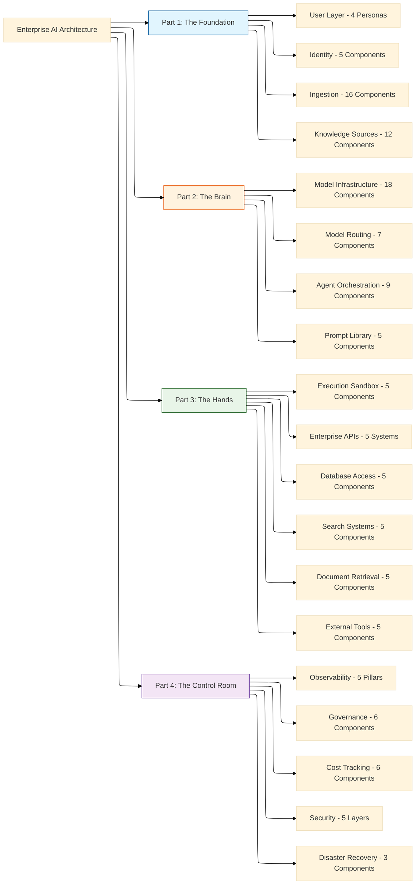

# diagram_01_the-four-part-journey

```mermaid
---
config:
  theme: base
  layout: elk
---
flowchart LR
    A["Enterprise AI Architecture"] --> B["Part 1: The Foundation"] & C["Part 2: The Brain"] & D["Part 3: The Hands"] & E["Part 4: The Control Room"]
    B --> B1["User Layer - 4 Personas"] & B2["Identity - 5 Components"] & B3["Ingestion - 16 Components"] & B4["Knowledge Sources - 12 Components"]
    C --> C1["Model Infrastructure - 18 Components"] & C2["Model Routing - 7 Components"] & C3["Agent Orchestration - 9 Components"] & C4["Prompt Library - 5 Components"]
    D --> D1["Execution Sandbox - 5 Components"] & D2["Enterprise APIs - 5 Systems"] & D3["Database Access - 5 Components"] & D4["Search Systems - 5 Components"] & D5["Document Retrieval - 5 Components"] & D6["External Tools - 5 Components"]
    E --> E1["Observability - 5 Pillars"] & E2["Governance - 6 Components"] & E3["Cost Tracking - 6 Components"] & E4["Security - 5 Layers"] & E5["Disaster Recovery - 3 Components"]

    style B fill:#e1f5fe,stroke:#01579b
    style C fill:#fff3e0,stroke:#e65100
    style D fill:#e8f5e8,stroke:#1b5e20
    style E fill:#f3e5f5,stroke:#4a148c
```
