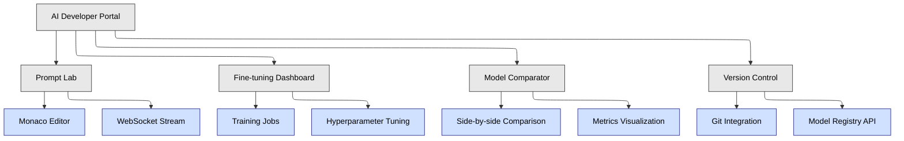

# diagram_01_technical-deep-dive-the-ai-developer-portal-i-0532

```mermaid
---
config:
  theme: base
  themeVariables:
    primaryColor: '#f0f0f0'
    primaryTextColor: '#000'
    primaryBorderColor: '#555'
    lineColor: '#333'
    secondaryColor: '#e0e0e0'
    tertiaryColor: '#fff'
  layout: elk
---
flowchart TB
    A["AI Developer Portal"] --> B["Prompt Lab"] & C["Fine-tuning Dashboard"] & D["Model Comparator"] & E["Version Control"]
    B --> F["Monaco Editor"] & G["WebSocket Stream"]
    C --> H["Training Jobs"] & I["Hyperparameter Tuning"]
    D --> J["Side-by-side Comparison"] & K["Metrics Visualization"]
    E --> L["Git Integration"] & M["Model Registry API"]

     F:::leaf
     G:::leaf
     H:::leaf
     I:::leaf
     J:::leaf
     K:::leaf
     L:::leaf
     M:::leaf
    classDef default fill:#e8e8e8,stroke:#333,stroke-width:1px,color:#000
    classDef leaf fill:#d0e0ff,stroke:#228,stroke-width:1px,color:#000
```
