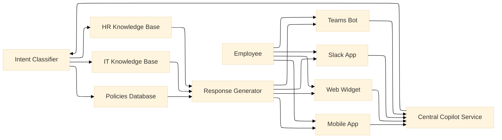

# diagram_02_technical-deep-dive-the-employee-copilot-is-a-d34e

```mermaid
---
config:
  theme: base
  layout: elk
---
graph LR
    A[Employee] --> B[Teams Bot]
    A --> C[Slack App]
    A --> D[Web Widget]
    A --> E[Mobile App]
    
    B --> F[Central Copilot Service]
    C --> F
    D --> F
    E --> F
    
    F --> G[Intent Classifier]
    G --> H[HR Knowledge Base]
    G --> I[IT Knowledge Base]
    G --> J[Policies Database]
    
    H --> K[Response Generator]
    I --> K
    J --> K
    
    K --> B
    K --> C
    K --> D
    K --> E
```
