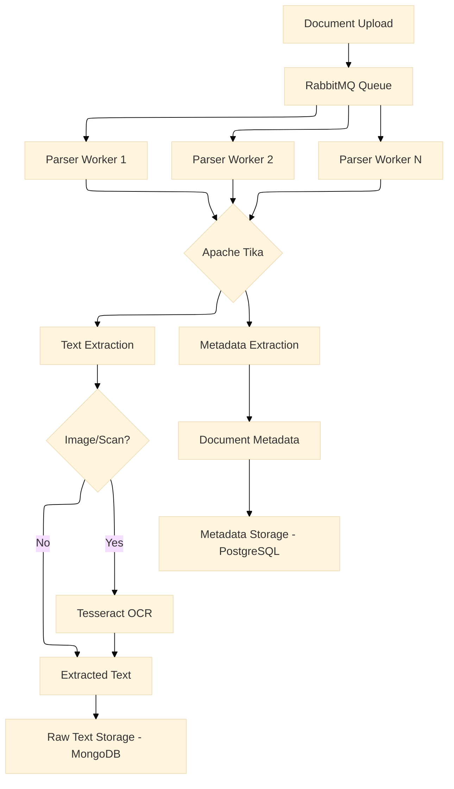

# diagram_04_technical-deep-dive-we-use-apache-tika-as-our-1083

```mermaid
---
config:
  theme: base
  layout: elk
---
graph TD
    A[Document Upload] --> B[RabbitMQ Queue]
    B --> C[Parser Worker 1]
    B --> D[Parser Worker 2]
    B --> E[Parser Worker N]
    
    C --> F{Apache Tika}
    D --> F
    E --> F
    
    F --> G[Text Extraction]
    F --> H[Metadata Extraction]
    
    G --> I{Image/Scan?}
    I -->|Yes| J[Tesseract OCR]
    J --> K[Extracted Text]
    I -->|No| K
    
    H --> L[Document Metadata]
    
    K --> M[Raw Text Storage - MongoDB]
    L --> N[Metadata Storage - PostgreSQL]
```
