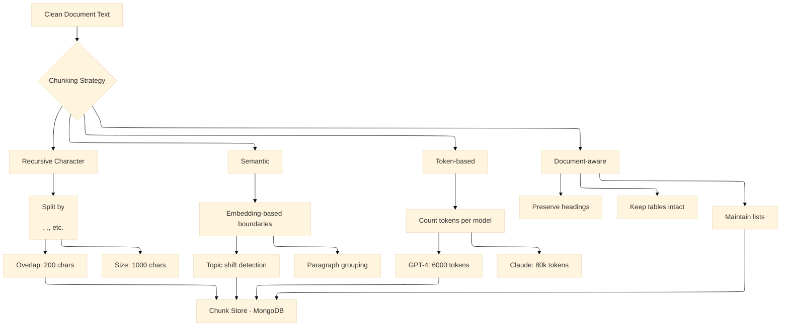

# diagram_05_technical-deep-dive-we-implement-multiple-chu-d331

```mermaid
---
config:
  theme: base
  layout: elk
---
graph TD
    A[Clean Document Text] --> B{Chunking Strategy}
    
    B --> C[Recursive Character]
    B --> D[Semantic]
    B --> E[Token-based]
    B --> F[Document-aware]
    
    C --> C1[Split by \n\n, ., etc.]
    C1 --> C2[Overlap: 200 chars]
    C1 --> C3[Size: 1000 chars]
    
    D --> D1[Embedding-based boundaries]
    D1 --> D2[Topic shift detection]
    D1 --> D3[Paragraph grouping]
    
    E --> E1[Count tokens per model]
    E1 --> E2[GPT-4: 6000 tokens]
    E1 --> E3[Claude: 80k tokens]
    
    F --> F1[Preserve headings]
    F --> F2[Keep tables intact]
    F --> F3[Maintain lists]
    
    C2 --> G[Chunk Store - MongoDB]
    D2 --> G
    E2 --> G
    F3 --> G
```
