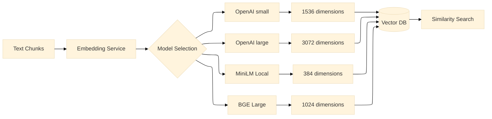

# diagram_06_technical-deep-dive-we-use-embedding-models-t-6537

```mermaid
---
config:
  theme: base
  layout: elk
---
graph LR
    A[Text Chunks] --> B[Embedding Service]
    B --> C{Model Selection}
    
    C --> D[OpenAI small]
    C --> E[OpenAI large]
    C --> F[MiniLM Local]
    C --> G[BGE Large]
    
    D --> H[1536 dimensions]
    E --> I[3072 dimensions]
    F --> J[384 dimensions]
    G --> K[1024 dimensions]
    
    H --> L[(Vector DB)]
    I --> L
    J --> L
    K --> L
    
    L --> M[Similarity Search]
```
