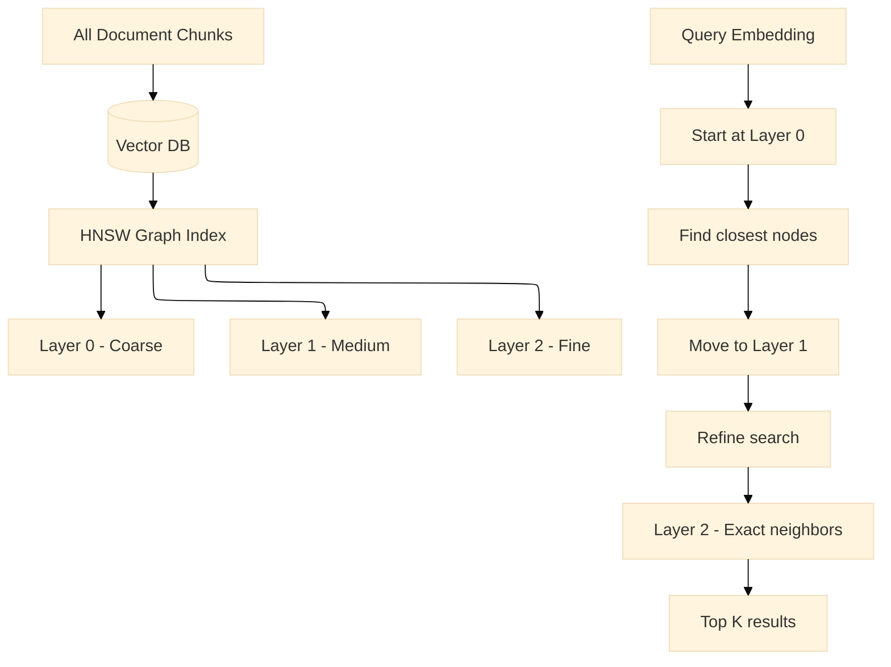

# diagram_07_technical-deep-dive-we-use-qdrant-as-our-vect-ccef

```mermaid
---
config:
  theme: base
  layout: elk
---
graph TD
    A[All Document Chunks] --> B[(Vector DB)]
    B --> C[HNSW Graph Index]
    
    C --> D[Layer 0 - Coarse]
    C --> E[Layer 1 - Medium]
    C --> F[Layer 2 - Fine]
    
    G[Query Embedding] --> H[Start at Layer 0]
    H --> I[Find closest nodes]
    I --> J[Move to Layer 1]
    J --> K[Refine search]
    K --> L[Layer 2 - Exact neighbors]
    L --> M[Top K results]
```
