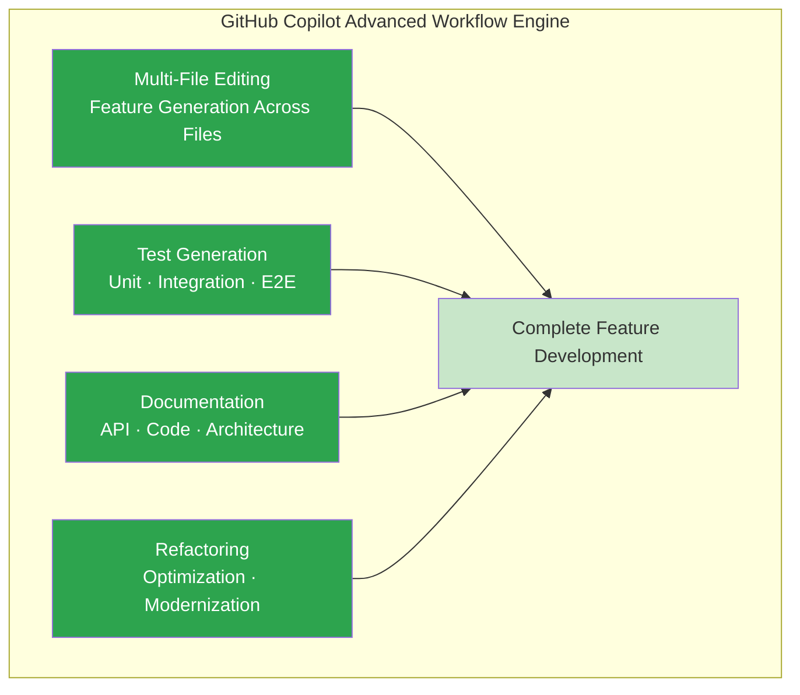
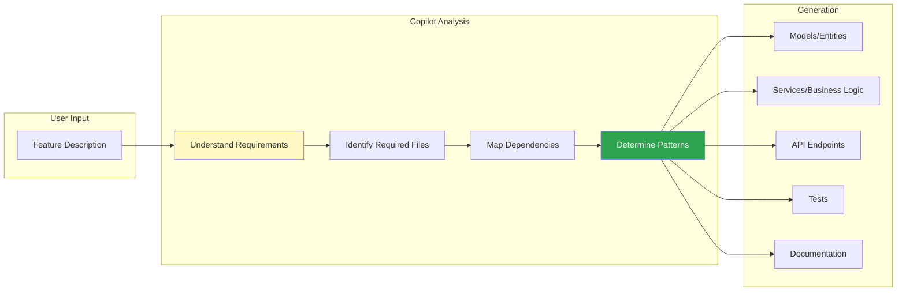
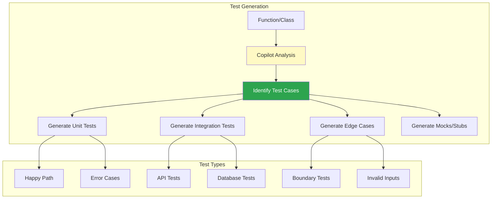
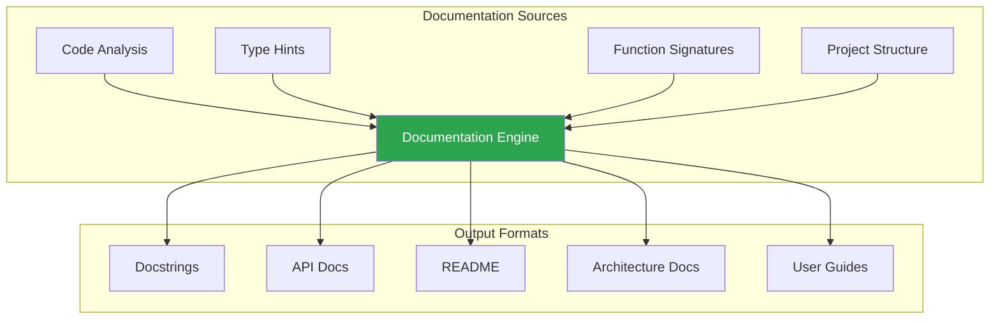
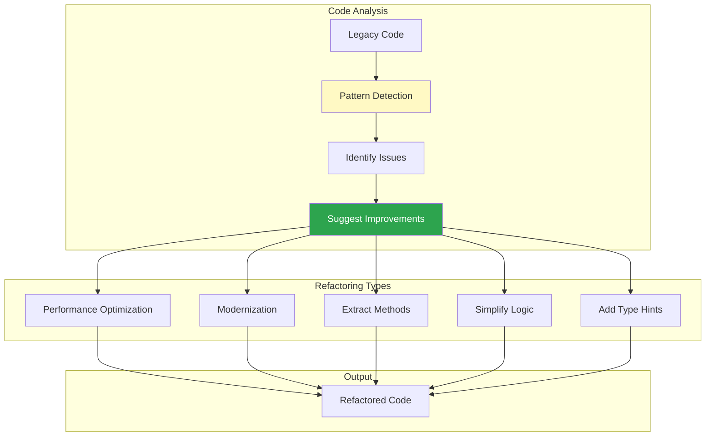
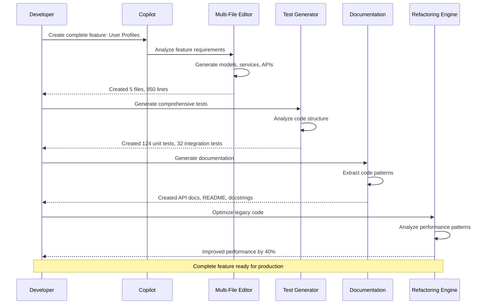

# GitHub Copilot Mastery Series

## Complete GitHub Copilot Mastery Series (4 stories):

- 🚀 [**1. GitHub Copilot Mastery - The Intelligence Layer: Code Completion, Context Awareness, AI Suggestions, and Learning Patterns**](#) – A deep dive into semantic code completion, intelligent context understanding, advanced AI suggestions beyond autocomplete, and personalized pattern learning.

- 🔌 [**2. GitHub Copilot Mastery - The Integration Ecosystem: IDE Support, Chat Interface, CLI Tools, and Pull Request Integration**](#) – How to leverage Copilot across your entire development workflow with VS Code integration, natural language chat, command-line tools, and GitHub PR assistance.

- ⚡ [**3. GitHub Copilot Mastery - The Advanced Workflow Engine: Multi-File Editing, Test Generation, Documentation, and Refactoring**](#) – Mastering complex code generation across multiple files, automated test suite creation, intelligent documentation generation, and AI-powered code refactoring. *(This story)*

- 🏗️ [**4. GitHub Copilot Mastery - From Code to Production: VS Code Integration, Enterprise Workflows, and Best Practices**](#) – A hands-on guide to integrating Copilot with VS Code, building production-ready applications, establishing team workflows, and implementing security best practices.

---

# ⚡ Story 3: GitHub Copilot Mastery - The Advanced Workflow Engine
## Multi-File Editing, Test Generation, Documentation, and Refactoring

### Introduction: Beyond Single-Line Suggestions

While GitHub Copilot excels at inline code completion, its true power emerges when you leverage it for complex, multi-step workflows. The Advanced Workflow Engine transforms Copilot from a simple autocomplete tool into a sophisticated development assistant capable of generating entire features, writing comprehensive test suites, creating production-ready documentation, and refactoring legacy code at scale.



---

### Feature 1: Multi-File Editing — Feature Generation Across Files

Multi-file editing is Copilot's ability to understand and generate code across multiple related files, maintaining consistency and following architectural patterns.

#### Multi-File Editing Architecture



#### Step-by-Step Multi-File Feature Generation

**Step 1: Define the Feature in Comments**

```python
# Create a comprehensive user profile feature with:
# - Profile model with extended fields (bio, avatar, social links)
# - Profile service with CRUD operations
# - API endpoints for profile management
# - Profile validation rules
# - Unit and integration tests
# - API documentation

# Copilot will generate multiple files following this structure:

# File 1: src/models/profile.py
"""
Profile model with extended user information.
"""

from sqlalchemy import Column, Integer, String, Text, JSON, DateTime, ForeignKey
from sqlalchemy.sql import func
from sqlalchemy.orm import relationship
from src.models.base import Base

class Profile(Base):
    """User profile model with extended fields."""
    
    __tablename__ = "profiles"
    
    id = Column(Integer, primary_key=True, index=True)
    user_id = Column(Integer, ForeignKey("users.id"), unique=True, nullable=False)
    bio = Column(Text, nullable=True)
    avatar_url = Column(String(500), nullable=True)
    social_links = Column(JSON, nullable=True, default={})
    location = Column(String(255), nullable=True)
    website = Column(String(500), nullable=True)
    preferences = Column(JSON, nullable=True, default={})
    created_at = Column(DateTime(timezone=True), server_default=func.now())
    updated_at = Column(DateTime(timezone=True), onupdate=func.now())
    
    # Relationships
    user = relationship("User", back_populates="profile")
    
    def __repr__(self):
        return f"<Profile(user_id={self.user_id})>"
```

**Step 2: Generate Service Layer**

```python
# Copilot generates the service layer next
# File 2: src/services/profile_service.py

"""
Profile service with CRUD operations and business logic.
"""

from typing import Optional, Dict, Any
from sqlalchemy.ext.asyncio import AsyncSession
from sqlalchemy import select
from src.models.profile import Profile
from src.schemas.profile import ProfileCreate, ProfileUpdate, ProfileResponse
from src.core.cache import CacheClient
from src.core.exceptions import NotFoundError, ValidationError
import structlog

logger = structlog.get_logger()

class ProfileService:
    """Service for managing user profiles."""
    
    def __init__(self, db: AsyncSession, cache: CacheClient):
        self.db = db
        self.cache = cache
        self.cache_prefix = "profile:"
        self.cache_ttl = 3600  # 1 hour
    
    async def get_profile_async(self, user_id: int) -> ProfileResponse:
        """
        Get profile by user ID with caching.
        
        Args:
            user_id: User identifier
            
        Returns:
            ProfileResponse object
            
        Raises:
            NotFoundError: If profile doesn't exist
        """
        # Check cache first
        cache_key = f"{self.cache_prefix}{user_id}"
        cached = await self.cache.get(cache_key)
        
        if cached:
            logger.info("profile_cache_hit", user_id=user_id)
            return ProfileResponse.model_validate_json(cached)
        
        # Query database
        stmt = select(Profile).where(Profile.user_id == user_id)
        result = await self.db.execute(stmt)
        profile = result.scalar_one_or_none()
        
        if not profile:
            logger.warning("profile_not_found", user_id=user_id)
            raise NotFoundError(f"Profile for user {user_id} not found")
        
        # Cache for future requests
        response = ProfileResponse.model_validate(profile)
        await self.cache.set(
            cache_key,
            response.model_dump_json(),
            ex=self.cache_ttl
        )
        
        logger.info("profile_retrieved", user_id=user_id)
        return response
    
    async def create_profile_async(
        self,
        user_id: int,
        profile_data: ProfileCreate
    ) -> ProfileResponse:
        """
        Create a new profile for a user.
        
        Args:
            user_id: User identifier
            profile_data: Profile creation data
            
        Returns:
            Created profile
            
        Raises:
            ValidationError: If profile already exists
        """
        logger.info("creating_profile", user_id=user_id)
        
        # Check if profile already exists
        stmt = select(Profile).where(Profile.user_id == user_id)
        result = await self.db.execute(stmt)
        existing = result.scalar_one_or_none()
        
        if existing:
            logger.warning("profile_already_exists", user_id=user_id)
            raise ValidationError(f"Profile for user {user_id} already exists")
        
        # Create new profile
        profile = Profile(
            user_id=user_id,
            bio=profile_data.bio,
            avatar_url=profile_data.avatar_url,
            social_links=profile_data.social_links.model_dump() if profile_data.social_links else {},
            location=profile_data.location,
            website=profile_data.website,
            preferences=profile_data.preferences or {}
        )
        
        self.db.add(profile)
        await self.db.commit()
        await self.db.refresh(profile)
        
        # Cache the new profile
        response = ProfileResponse.model_validate(profile)
        cache_key = f"{self.cache_prefix}{user_id}"
        await self.cache.set(
            cache_key,
            response.model_dump_json(),
            ex=self.cache_ttl
        )
        
        logger.info("profile_created", user_id=user_id, profile_id=profile.id)
        return response
    
    async def update_profile_async(
        self,
        user_id: int,
        profile_data: ProfileUpdate
    ) -> ProfileResponse:
        """
        Update an existing profile.
        
        Args:
            user_id: User identifier
            profile_data: Profile update data
            
        Returns:
            Updated profile
            
        Raises:
            NotFoundError: If profile doesn't exist
        """
        logger.info("updating_profile", user_id=user_id)
        
        # Get existing profile
        stmt = select(Profile).where(Profile.user_id == user_id)
        result = await self.db.execute(stmt)
        profile = result.scalar_one_or_none()
        
        if not profile:
            logger.warning("profile_not_found_for_update", user_id=user_id)
            raise NotFoundError(f"Profile for user {user_id} not found")
        
        # Update fields
        update_data = profile_data.model_dump(exclude_unset=True)
        
        for field, value in update_data.items():
            if field == "social_links" and value:
                value = value.model_dump()
            setattr(profile, field, value)
        
        await self.db.commit()
        await self.db.refresh(profile)
        
        # Invalidate and update cache
        cache_key = f"{self.cache_prefix}{user_id}"
        await self.cache.delete(cache_key)
        
        response = ProfileResponse.model_validate(profile)
        await self.cache.set(
            cache_key,
            response.model_dump_json(),
            ex=self.cache_ttl
        )
        
        logger.info("profile_updated", user_id=user_id)
        return response
    
    async def delete_profile_async(self, user_id: int) -> None:
        """
        Soft delete a profile.
        
        Args:
            user_id: User identifier
            
        Raises:
            NotFoundError: If profile doesn't exist
        """
        logger.info("deleting_profile", user_id=user_id)
        
        stmt = select(Profile).where(Profile.user_id == user_id)
        result = await self.db.execute(stmt)
        profile = result.scalar_one_or_none()
        
        if not profile:
            logger.warning("profile_not_found_for_delete", user_id=user_id)
            raise NotFoundError(f"Profile for user {user_id} not found")
        
        # Soft delete by marking inactive (if using soft delete)
        # For this example, we'll hard delete
        await self.db.delete(profile)
        await self.db.commit()
        
        # Invalidate cache
        cache_key = f"{self.cache_prefix}{user_id}"
        await self.cache.delete(cache_key)
        
        logger.info("profile_deleted", user_id=user_id)
```

**Step 3: Generate API Endpoints**

```python
# File 3: src/api/profile.py
"""
Profile API endpoints with authentication and authorization.
"""

from fastapi import APIRouter, Depends, HTTPException, status
from sqlalchemy.ext.asyncio import AsyncSession
from src.core.database import get_db
from src.core.cache import get_cache, CacheClient
from src.services.profile_service import ProfileService
from src.schemas.profile import (
    ProfileCreate,
    ProfileUpdate,
    ProfileResponse
)
from src.middleware.auth import require_auth, get_current_user
from src.core.exceptions import NotFoundError, ValidationError
import structlog

logger = structlog.get_logger()
router = APIRouter(prefix="/api/v1/profiles", tags=["profiles"])

@router.get(
    "/me",
    response_model=ProfileResponse,
    summary="Get current user's profile",
    description="Retrieve the profile of the authenticated user"
)
async def get_my_profile(
    current_user: dict = Depends(require_auth),
    db: AsyncSession = Depends(get_db),
    cache: CacheClient = Depends(get_cache)
) -> ProfileResponse:
    """
    Get the profile for the currently authenticated user.
    
    Returns:
        Profile information for the current user
        
    Raises:
        404: Profile not found
    """
    logger.info("get_my_profile_request", user_id=current_user["id"])
    
    service = ProfileService(db, cache)
    
    try:
        profile = await service.get_profile_async(current_user["id"])
        return profile
    except NotFoundError as e:
        raise HTTPException(status_code=404, detail=str(e))
    except Exception as e:
        logger.error("get_profile_failed", error=str(e))
        raise HTTPException(
            status_code=500,
            detail="Failed to retrieve profile"
        )

@router.post(
    "/me",
    response_model=ProfileResponse,
    status_code=status.HTTP_201_CREATED,
    summary="Create profile",
    description="Create a profile for the authenticated user"
)
async def create_my_profile(
    profile_data: ProfileCreate,
    current_user: dict = Depends(require_auth),
    db: AsyncSession = Depends(get_db),
    cache: CacheClient = Depends(get_cache)
) -> ProfileResponse:
    """
    Create a profile for the current user.
    
    Args:
        profile_data: Profile information to create
        
    Returns:
        Created profile information
        
    Raises:
        400: Profile already exists
    """
    logger.info("create_my_profile_request", user_id=current_user["id"])
    
    service = ProfileService(db, cache)
    
    try:
        profile = await service.create_profile_async(
            current_user["id"],
            profile_data
        )
        return profile
    except ValidationError as e:
        raise HTTPException(status_code=400, detail=str(e))
    except Exception as e:
        logger.error("create_profile_failed", error=str(e))
        raise HTTPException(
            status_code=500,
            detail="Failed to create profile"
        )

@router.patch(
    "/me",
    response_model=ProfileResponse,
    summary="Update profile",
    description="Update the profile of the authenticated user"
)
async def update_my_profile(
    profile_data: ProfileUpdate,
    current_user: dict = Depends(require_auth),
    db: AsyncSession = Depends(get_db),
    cache: CacheClient = Depends(get_cache)
) -> ProfileResponse:
    """
    Update the current user's profile.
    
    Args:
        profile_data: Fields to update
        
    Returns:
        Updated profile information
        
    Raises:
        404: Profile not found
    """
    logger.info("update_my_profile_request", user_id=current_user["id"])
    
    service = ProfileService(db, cache)
    
    try:
        profile = await service.update_profile_async(
            current_user["id"],
            profile_data
        )
        return profile
    except NotFoundError as e:
        raise HTTPException(status_code=404, detail=str(e))
    except Exception as e:
        logger.error("update_profile_failed", error=str(e))
        raise HTTPException(
            status_code=500,
            detail="Failed to update profile"
        )

@router.delete(
    "/me",
    status_code=status.HTTP_204_NO_CONTENT,
    summary="Delete profile",
    description="Delete the profile of the authenticated user"
)
async def delete_my_profile(
    current_user: dict = Depends(require_auth),
    db: AsyncSession = Depends(get_db),
    cache: CacheClient = Depends(get_cache)
) -> None:
    """
    Delete the current user's profile.
    
    Raises:
        404: Profile not found
    """
    logger.info("delete_my_profile_request", user_id=current_user["id"])
    
    service = ProfileService(db, cache)
    
    try:
        await service.delete_profile_async(current_user["id"])
    except NotFoundError as e:
        raise HTTPException(status_code=404, detail=str(e))
    except Exception as e:
        logger.error("delete_profile_failed", error=str(e))
        raise HTTPException(
            status_code=500,
            detail="Failed to delete profile"
        )
```

---

### Feature 2: Test Generation — Automated Test Suite Creation

Copilot excels at generating comprehensive test suites that cover unit tests, integration tests, and edge cases.

#### Test Generation Architecture



#### Step-by-Step Test Generation

**Step 1: Generate Unit Tests**

```python
# Write a function, then ask Copilot to generate tests
# File: src/utils/validators.py

def validate_email(email: str) -> bool:
    """Validate email format."""
    import re
    pattern = r'^[a-zA-Z0-9._%+-]+@[a-zA-Z0-9.-]+\.[a-zA-Z]{2,}$'
    return bool(re.match(pattern, email))

def validate_password(password: str, min_length: int = 8) -> tuple[bool, str]:
    """
    Validate password strength.
    
    Returns:
        Tuple of (is_valid, error_message)
    """
    if len(password) < min_length:
        return False, f"Password must be at least {min_length} characters"
    
    if not any(c.isupper() for c in password):
        return False, "Password must contain at least one uppercase letter"
    
    if not any(c.islower() for c in password):
        return False, "Password must contain at least one lowercase letter"
    
    if not any(c.isdigit() for c in password):
        return False, "Password must contain at least one number"
    
    if not any(c in "!@#$%^&*()_+-=[]{}|;:,.<>?/" for c in password):
        return False, "Password must contain at least one special character"
    
    return True, "Password is valid"

# Copilot generates comprehensive tests:
# File: tests/unit/test_validators.py

import pytest
from src.utils.validators import validate_email, validate_password

class TestValidateEmail:
    """Test suite for email validation."""
    
    def test_valid_emails(self):
        """Test various valid email formats."""
        valid_emails = [
            "user@example.com",
            "user.name@example.com",
            "user+tag@example.com",
            "user@subdomain.example.com",
            "user@example.co.uk",
            "user123@example.com",
            "user@example.io"
        ]
        
        for email in valid_emails:
            assert validate_email(email) is True, f"Email {email} should be valid"
    
    def test_invalid_emails(self):
        """Test various invalid email formats."""
        invalid_emails = [
            "user@",
            "user@example",
            "user@.com",
            "user@example.",
            "@example.com",
            "user@example..com",
            "user name@example.com",
            "user@exam ple.com"
        ]
        
        for email in invalid_emails:
            assert validate_email(email) is False, f"Email {email} should be invalid"
    
    def test_edge_cases(self):
        """Test edge cases for email validation."""
        assert validate_email("") is False
        assert validate_email("a@b.c") is True  # Minimal valid email
        assert validate_email("a@b.co.uk") is True  # Multiple TLD
        assert validate_email("a@b.c.d.e") is True  # Multiple subdomains


class TestValidatePassword:
    """Test suite for password validation."""
    
    def test_valid_password(self):
        """Test valid password meets all criteria."""
        is_valid, message = validate_password("Password123!")
        assert is_valid is True
        assert message == "Password is valid"
    
    def test_minimum_length(self):
        """Test password length validation."""
        is_valid, message = validate_password("Pass1!", min_length=8)
        assert is_valid is False
        assert "at least 8 characters" in message
    
    def test_uppercase_requirement(self):
        """Test uppercase letter requirement."""
        is_valid, message = validate_password("password123!")
        assert is_valid is False
        assert "uppercase letter" in message
    
    def test_lowercase_requirement(self):
        """Test lowercase letter requirement."""
        is_valid, message = validate_password("PASSWORD123!")
        assert is_valid is False
        assert "lowercase letter" in message
    
    def test_number_requirement(self):
        """Test number requirement."""
        is_valid, message = validate_password("Password!")
        assert is_valid is False
        assert "number" in message
    
    def test_special_character_requirement(self):
        """Test special character requirement."""
        is_valid, message = validate_password("Password123")
        assert is_valid is False
        assert "special character" in message
    
    @pytest.mark.parametrize("password,expected_valid", [
        ("Pass123!", True),
        ("P@ssword1", True),
        ("Secret@2024", True),
        ("short1!", False),
        ("NOLOWERCASE1!", False),
        ("nouppercase1!", False),
        ("NoNumber!", False),
        ("NoSpecial123", False),
    ])
    def test_password_variations(self, password, expected_valid):
        """Test various password combinations."""
        is_valid, _ = validate_password(password)
        assert is_valid == expected_valid
```

**Step 2: Generate Integration Tests**

```python
# Copilot generates integration tests for API endpoints
# File: tests/integration/test_profile_api.py

import pytest
from fastapi.testclient import TestClient
from sqlalchemy import create_engine
from sqlalchemy.orm import sessionmaker
from src.main import app
from src.core.database import get_db
from src.models.base import Base

# Test database setup
SQLALCHEMY_DATABASE_URL = "sqlite:///./test.db"
engine = create_engine(SQLALCHEMY_DATABASE_URL, connect_args={"check_same_thread": False})
TestingSessionLocal = sessionmaker(autocommit=False, autoflush=False, bind=engine)

def override_get_db():
    try:
        db = TestingSessionLocal()
        yield db
    finally:
        db.close()

app.dependency_overrides[get_db] = override_get_db

@pytest.fixture
def client():
    """Create test client."""
    Base.metadata.create_all(bind=engine)
    with TestClient(app) as test_client:
        yield test_client
    Base.metadata.drop_all(bind=engine)

@pytest.fixture
def auth_token(client):
    """Create authenticated user and return token."""
    # Register user
    user_data = {
        "email": "test@example.com",
        "password": "Test123!",
        "full_name": "Test User"
    }
    response = client.post("/api/v1/auth/register", json=user_data)
    assert response.status_code == 201
    
    # Login
    login_data = {
        "username": "test@example.com",
        "password": "Test123!"
    }
    response = client.post("/api/v1/auth/login", data=login_data)
    assert response.status_code == 200
    
    return response.json()["access_token"]

class TestProfileAPI:
    """Integration tests for profile endpoints."""
    
    def test_create_profile_success(self, client, auth_token):
        """Test successful profile creation."""
        headers = {"Authorization": f"Bearer {auth_token}"}
        profile_data = {
            "bio": "Software developer passionate about AI",
            "location": "San Francisco, CA",
            "website": "https://example.com",
            "social_links": {
                "twitter": "@username",
                "github": "username"
            }
        }
        
        response = client.post(
            "/api/v1/profiles/me",
            json=profile_data,
            headers=headers
        )
        
        assert response.status_code == 201
        data = response.json()
        assert data["bio"] == profile_data["bio"]
        assert data["location"] == profile_data["location"]
        assert data["website"] == profile_data["website"]
        assert data["social_links"]["twitter"] == "@username"
    
    def test_get_profile_success(self, client, auth_token):
        """Test successful profile retrieval."""
        headers = {"Authorization": f"Bearer {auth_token}"}
        
        # Create profile first
        profile_data = {"bio": "Test bio", "location": "Test City"}
        client.post("/api/v1/profiles/me", json=profile_data, headers=headers)
        
        # Retrieve profile
        response = client.get("/api/v1/profiles/me", headers=headers)
        
        assert response.status_code == 200
        data = response.json()
        assert data["bio"] == profile_data["bio"]
        assert data["location"] == profile_data["location"]
    
    def test_get_profile_not_found(self, client, auth_token):
        """Test profile retrieval when profile doesn't exist."""
        headers = {"Authorization": f"Bearer {auth_token}"}
        
        response = client.get("/api/v1/profiles/me", headers=headers)
        
        assert response.status_code == 404
        assert "not found" in response.json()["detail"].lower()
    
    def test_update_profile_success(self, client, auth_token):
        """Test successful profile update."""
        headers = {"Authorization": f"Bearer {auth_token}"}
        
        # Create profile
        profile_data = {"bio": "Original bio"}
        client.post("/api/v1/profiles/me", json=profile_data, headers=headers)
        
        # Update profile
        update_data = {"bio": "Updated bio", "location": "New Location"}
        response = client.patch("/api/v1/profiles/me", json=update_data, headers=headers)
        
        assert response.status_code == 200
        data = response.json()
        assert data["bio"] == "Updated bio"
        assert data["location"] == "New Location"
    
    def test_update_profile_partial(self, client, auth_token):
        """Test partial profile update."""
        headers = {"Authorization": f"Bearer {auth_token}"}
        
        # Create profile
        profile_data = {"bio": "Original bio", "location": "Original City"}
        client.post("/api/v1/profiles/me", json=profile_data, headers=headers)
        
        # Update only bio
        update_data = {"bio": "Updated bio only"}
        response = client.patch("/api/v1/profiles/me", json=update_data, headers=headers)
        
        assert response.status_code == 200
        data = response.json()
        assert data["bio"] == "Updated bio only"
        assert data["location"] == "Original City"  # Unchanged
    
    def test_delete_profile_success(self, client, auth_token):
        """Test successful profile deletion."""
        headers = {"Authorization": f"Bearer {auth_token}"}
        
        # Create profile
        profile_data = {"bio": "To be deleted"}
        client.post("/api/v1/profiles/me", json=profile_data, headers=headers)
        
        # Delete profile
        response = client.delete("/api/v1/profiles/me", headers=headers)
        
        assert response.status_code == 204
        
        # Verify profile is deleted
        get_response = client.get("/api/v1/profiles/me", headers=headers)
        assert get_response.status_code == 404
```

---

### Feature 3: Documentation — Intelligent Documentation Generation

Copilot can generate comprehensive documentation including docstrings, API documentation, README files, and architecture diagrams.

#### Documentation Generation Architecture



#### Step-by-Step Documentation Generation

**Step 1: Generate Comprehensive Docstrings**

```python
# Copilot generates detailed docstrings for complex functions
# File: src/services/payment_service.py

async def process_refund(
    self,
    payment_intent_id: str,
    amount: Optional[float] = None,
    reason: Optional[str] = None,
    metadata: Optional[Dict[str, str]] = None
) -> RefundResponse:
    """
    Process a refund for a completed payment.
    
    This method handles refund processing with support for partial refunds,
    idempotency keys, and proper error handling. It validates the refund
    amount against the original charge, applies business rules (e.g., refund
    window, maximum refund amount), and logs the transaction for audit.
    
    Args:
        payment_intent_id: Stripe payment intent identifier for the original charge.
            Must be a valid Stripe payment intent that has been successfully charged.
        amount: Optional refund amount in smallest currency unit (e.g., cents for USD).
            If not provided, full refund is processed. Must be less than or equal
            to the original charge amount.
        reason: Optional refund reason. Supported values: 'duplicate', 'fraudulent',
            'requested_by_customer', 'other'. Used for business analytics.
        metadata: Optional dictionary of additional data to attach to the refund.
            Useful for tracking refunds by order ID, customer ID, or internal references.
    
    Returns:
        RefundResponse object containing:
            - id: Unique refund identifier
            - amount: Amount refunded
            - status: Refund status ('pending', 'succeeded', 'failed')
            - created_at: Timestamp of refund creation
            - metadata: Associated metadata
    
    Raises:
        PaymentError: If the payment intent is not found, already refunded,
            or the refund amount exceeds the remaining balance.
        ValidationError: If amount is negative or reason is invalid.
        IdempotencyError: If the same refund is attempted multiple times
            with different parameters.
    
    Examples:
        # Full refund
        refund = await payment_service.process_refund(
            payment_intent_id="pi_123",
            reason="requested_by_customer"
        )
        
        # Partial refund
        refund = await payment_service.process_refund(
            payment_intent_id="pi_123",
            amount=2500,  # $25.00
            reason="duplicate",
            metadata={"order_id": "ORD-789"}
        )
    
    Notes:
        - Refunds are idempotent using a combination of payment_intent_id and amount
        - Full refunds can only be processed within 180 days of original charge
        - Partial refunds can be processed until the full amount is refunded
        - This method uses a distributed lock to prevent race conditions
    
    See Also:
        - `process_payment()` for creating original charges
        - `get_refund_status()` for checking refund progress
        - Stripe API documentation: https://stripe.com/docs/refunds
    """
    # Implementation follows...
```

**Step 2: Generate API Documentation with OpenAPI**

```yaml
# Copilot generates OpenAPI specification
# File: docs/openapi.yaml

openapi: 3.0.0
info:
  title: E-Commerce API
  description: |
    REST API for the E-Commerce platform.
    
    ## Features
    - Product catalog management
    - Shopping cart operations
    - Order processing
    - User authentication
    - Payment integration
    - Refund handling
    
    ## Authentication
    This API uses JWT tokens for authentication.
    Include the token in the Authorization header:
    
    ```
    Authorization: Bearer <your-token>
    ```
    
    ## Rate Limiting
    API requests are limited to 100 requests per minute per IP.
    
  version: 2.0.0
  contact:
    name: API Support
    email: support@example.com
    url: https://example.com/support
  license:
    name: MIT
    url: https://opensource.org/licenses/MIT

servers:
  - url: https://api.example.com/v2
    description: Production server
  - url: https://staging-api.example.com/v2
    description: Staging server
  - url: http://localhost:8000/v2
    description: Local development

tags:
  - name: Products
    description: Product catalog operations
  - name: Orders
    description: Order management
  - name: Auth
    description: Authentication and user management
  - name: Profiles
    description: User profile management

components:
  securitySchemes:
    BearerAuth:
      type: http
      scheme: bearer
      bearerFormat: JWT
      description: JWT token obtained from `/auth/login`
  
  schemas:
    Product:
      type: object
      required:
        - name
        - price
      properties:
        id:
          type: integer
          example: 123
          description: Unique product identifier
        name:
          type: string
          maxLength: 255
          example: "Wireless Headphones"
          description: Product name
        description:
          type: string
          example: "High-quality wireless headphones with noise cancellation"
          description: Detailed product description
        price:
          type: number
          format: float
          minimum: 0
          example: 99.99
          description: Price in USD
        stock_quantity:
          type: integer
          minimum: 0
          example: 150
          description: Available inventory count
        category_id:
          type: integer
          example: 5
          description: Product category identifier
        metadata:
          type: object
          additionalProperties: true
          example: {"brand": "AudioTech", "color": "black"}
          description: Additional product attributes
        created_at:
          type: string
          format: date-time
          description: Creation timestamp
        updated_at:
          type: string
          format: date-time
          description: Last update timestamp
    
    ProductCreate:
      type: object
      required:
        - name
        - price
      properties:
        name:
          type: string
          maxLength: 255
        description:
          type: string
        price:
          type: number
          format: float
          minimum: 0
        stock_quantity:
          type: integer
          minimum: 0
          default: 0
        category_id:
          type: integer
        metadata:
          type: object
    
    ProductListResponse:
      type: object
      properties:
        items:
          type: array
          items:
            $ref: '#/components/schemas/Product'
        total:
          type: integer
          description: Total number of matching products
        page:
          type: integer
          description: Current page number
        page_size:
          type: integer
          description: Items per page
        has_next:
          type: boolean
          description: Whether there are more results

paths:
  /products:
    get:
      summary: List products
      description: |
        Retrieve a paginated list of products with optional filtering.
        
        **Filtering Examples:**
        - `/products?category=5` - Filter by category
        - `/products?min_price=10&max_price=50` - Price range
        - `/products?in_stock=true` - Only in-stock items
        - `/products?search=headphones` - Full-text search
        
      tags:
        - Products
      parameters:
        - name: page
          in: query
          schema:
            type: integer
            minimum: 1
            default: 1
          description: Page number
        - name: page_size
          in: query
          schema:
            type: integer
            minimum: 1
            maximum: 100
            default: 20
          description: Items per page
        - name: category_id
          in: query
          schema:
            type: integer
          description: Filter by category ID
        - name: min_price
          in: query
          schema:
            type: number
            format: float
            minimum: 0
          description: Minimum price filter
        - name: max_price
          in: query
          schema:
            type: number
            format: float
            minimum: 0
          description: Maximum price filter
        - name: in_stock
          in: query
          schema:
            type: boolean
          description: Filter by stock availability
        - name: search
          in: query
          schema:
            type: string
          description: Full-text search query
        - name: sort_by
          in: query
          schema:
            type: string
            enum: [price_asc, price_desc, name_asc, name_desc, newest]
            default: newest
          description: Sorting criteria
      responses:
        200:
          description: Successful response
          content:
            application/json:
              schema:
                $ref: '#/components/schemas/ProductListResponse'
        400:
          description: Invalid parameters
          content:
            application/json:
              schema:
                $ref: '#/components/schemas/ErrorResponse'
        429:
          description: Rate limit exceeded
          headers:
            X-RateLimit-Limit:
              schema:
                type: integer
            X-RateLimit-Remaining:
              schema:
                type: integer
            X-RateLimit-Reset:
              schema:
                type: integer
          content:
            application/json:
              schema:
                $ref: '#/components/schemas/ErrorResponse'
    
    post:
      summary: Create product
      description: Create a new product in the catalog
      tags:
        - Products
      security:
        - BearerAuth: []
      requestBody:
        required: true
        content:
          application/json:
            schema:
              $ref: '#/components/schemas/ProductCreate'
      responses:
        201:
          description: Product created successfully
          content:
            application/json:
              schema:
                $ref: '#/components/schemas/Product'
        400:
          description: Validation error
        401:
          description: Unauthorized
        403:
          description: Forbidden - Insufficient permissions

  /products/{product_id}:
    get:
      summary: Get product by ID
      description: Retrieve detailed information about a specific product
      tags:
        - Products
      parameters:
        - name: product_id
          in: path
          required: true
          schema:
            type: integer
          description: Product identifier
      responses:
        200:
          description: Product details
          content:
            application/json:
              schema:
                $ref: '#/components/schemas/Product'
        404:
          description: Product not found

  /profiles/me:
    get:
      summary: Get current user's profile
      description: Retrieve profile information for the authenticated user
      tags:
        - Profiles
      security:
        - BearerAuth: []
      responses:
        200:
          description: Profile retrieved successfully
          content:
            application/json:
              schema:
                $ref: '#/components/schemas/ProfileResponse'
        401:
          description: Unauthorized
        404:
          description: Profile not found
```

---

### Feature 4: Refactoring — AI-Powered Code Improvement

Copilot can analyze existing code and suggest or implement refactorings to improve performance, maintainability, and readability.

#### Refactoring Architecture



#### Step-by-Step Refactoring

**Step 1: Refactor Legacy Code**

```python
# Legacy code - before refactoring
def process_orders(orders):
    total = 0
    for i in range(len(orders)):
        order = orders[i]
        if order['status'] == 'completed':
            if order['payment_status'] == 'paid':
                if order['items']:
                    subtotal = 0
                    for j in range(len(order['items'])):
                        item = order['items'][j]
                        price = item['price']
                        qty = item['quantity']
                        subtotal = subtotal + (price * qty)
                    
                    tax = subtotal * 0.08
                    shipping = 5.99
                    if subtotal > 50:
                        shipping = 0
                    
                    total = total + subtotal + tax + shipping
                    
                    # Update inventory
                    for j in range(len(order['items'])):
                        item = order['items'][j]
                        product_id = item['product_id']
                        qty = item['quantity']
                        # Update database
                        update_inventory(product_id, -qty)
                    
                    # Send email
                    send_email(order['customer_email'], 'Order confirmed')
    
    return total

# Copilot suggests refactored version:
from typing import List, Dict, Any
from dataclasses import dataclass
import logging

logger = logging.getLogger(__name__)

@dataclass
class OrderItem:
    """Order item with price and quantity."""
    product_id: int
    price: float
    quantity: int

@dataclass
class Order:
    """Order with customer and payment information."""
    id: int
    status: str
    payment_status: str
    items: List[OrderItem]
    customer_email: str
    subtotal: float = 0.0
    tax: float = 0.0
    shipping: float = 0.0
    total: float = 0.0

class OrderProcessor:
    """Process orders with inventory updates and notifications."""
    
    TAX_RATE = 0.08
    BASE_SHIPPING = 5.99
    FREE_SHIPPING_THRESHOLD = 50.0
    
    def __init__(self, inventory_service, notification_service):
        self.inventory_service = inventory_service
        self.notification_service = notification_service
    
    def process_orders(self, orders: List[Dict[str, Any]]) -> float:
        """
        Process completed and paid orders.
        
        Args:
            orders: List of order dictionaries
            
        Returns:
            Total revenue from processed orders
        """
        total_revenue = 0.0
        
        for order_data in orders:
            if not self._is_processable(order_data):
                continue
            
            try:
                order = self._create_order(order_data)
                order = self._calculate_totals(order)
                
                self._update_inventory(order.items)
                self._send_confirmation(order)
                
                total_revenue += order.total
                logger.info(f"Order {order.id} processed successfully")
                
            except Exception as e:
                logger.error(f"Failed to process order {order_data.get('id')}: {e}")
                continue
        
        return total_revenue
    
    def _is_processable(self, order: Dict[str, Any]) -> bool:
        """Check if order is ready for processing."""
        return (
            order.get('status') == 'completed' and
            order.get('payment_status') == 'paid' and
            order.get('items')
        )
    
    def _create_order(self, order_data: Dict[str, Any]) -> Order:
        """Create Order object from dictionary data."""
        items = [
            OrderItem(
                product_id=item['product_id'],
                price=item['price'],
                quantity=item['quantity']
            )
            for item in order_data.get('items', [])
        ]
        
        return Order(
            id=order_data['id'],
            status=order_data['status'],
            payment_status=order_data['payment_status'],
            items=items,
            customer_email=order_data['customer_email']
        )
    
    def _calculate_totals(self, order: Order) -> Order:
        """Calculate order totals including tax and shipping."""
        order.subtotal = sum(
            item.price * item.quantity 
            for item in order.items
        )
        
        order.tax = order.subtotal * self.TAX_RATE
        order.shipping = self._calculate_shipping(order.subtotal)
        order.total = order.subtotal + order.tax + order.shipping
        
        return order
    
    def _calculate_shipping(self, subtotal: float) -> float:
        """Calculate shipping cost based on order subtotal."""
        return 0.0 if subtotal > self.FREE_SHIPPING_THRESHOLD else self.BASE_SHIPPING
    
    def _update_inventory(self, items: List[OrderItem]) -> None:
        """Update inventory levels for ordered items."""
        for item in items:
            self.inventory_service.update_stock(
                item.product_id,
                -item.quantity
            )
    
    def _send_confirmation(self, order: Order) -> None:
        """Send order confirmation email."""
        self.notification_service.send_email(
            to=order.customer_email,
            subject="Order Confirmed",
            template="order_confirmation",
            context={
                "order_id": order.id,
                "subtotal": order.subtotal,
                "tax": order.tax,
                "shipping": order.shipping,
                "total": order.total
            }
        )
```

**Step 2: Add Type Hints and Modern Syntax**

```javascript
// Legacy JavaScript - before refactoring
function getUserData(userId, includeOrders, includeProfile) {
    return fetch('/api/users/' + userId + '?include=' + (includeOrders ? 'orders' : '') + ',' + (includeProfile ? 'profile' : ''))
        .then(function(response) {
            if (response.ok) {
                return response.json();
            } else {
                throw new Error('Failed to fetch user');
            }
        })
        .then(function(data) {
            if (includeOrders && data.orders) {
                data.orders = data.orders.map(function(order) {
                    return {
                        id: order.id,
                        total: order.total,
                        date: new Date(order.created_at)
                    };
                });
            }
            return data;
        })
        .catch(function(error) {
            console.error('Error fetching user:', error);
            return null;
        });
}

// Copilot suggests modern TypeScript refactoring:
interface User {
    id: number;
    name: string;
    email: string;
    createdAt: Date;
    orders?: Order[];
    profile?: UserProfile;
}

interface Order {
    id: number;
    total: number;
    date: Date;
    items: OrderItem[];
}

interface UserProfile {
    bio?: string;
    avatarUrl?: string;
    location?: string;
}

interface UserQueryParams {
    includeOrders?: boolean;
    includeProfile?: boolean;
    includeOrdersItems?: boolean;
}

/**
 * Fetch user data with optional related data.
 * 
 * @param userId - User identifier
 * @param options - Query options for included data
 * @returns Promise resolving to user data or null if error
 */
async function getUserData(
    userId: number,
    options: UserQueryParams = {}
): Promise<User | null> {
    const { includeOrders = false, includeProfile = false, includeOrdersItems = false } = options;
    
    // Build query parameters
    const includeFields: string[] = [];
    if (includeOrders) includeFields.push('orders');
    if (includeProfile) includeFields.push('profile');
    if (includeOrdersItems && includeOrders) includeFields.push('orders.items');
    
    const queryParams = includeFields.length 
        ? `?include=${includeFields.join(',')}`
        : '';
    
    const url = `/api/users/${userId}${queryParams}`;
    
    try {
        const response = await fetch(url);
        
        if (!response.ok) {
            throw new Error(`HTTP ${response.status}: ${response.statusText}`);
        }
        
        const data = await response.json();
        
        // Transform orders data if needed
        if (includeOrders && data.orders) {
            data.orders = data.orders.map((order: any) => ({
                ...order,
                date: new Date(order.created_at)
            }));
        }
        
        return data as User;
        
    } catch (error) {
        console.error('Error fetching user data:', error);
        return null;
    }
}
```

---

### Putting It All Together: Complete Advanced Workflow



### Quick Reference: Advanced Workflow Commands

| Workflow | Trigger | Output | Benefit |
|----------|---------|--------|---------|
| **Multi-File Editing** | Comment describing feature | Complete feature across files | End-to-end feature development |
| **Test Generation** | `/tests` or comment | Unit + integration tests | Comprehensive test coverage |
| **Documentation** | `/docs` or comment | Docstrings, API docs, README | Production-ready documentation |
| **Refactoring** | `/refactor` or selection | Optimized, modernized code | Improved code quality |

### Performance Metrics

```yaml
without_advanced_workflows:
  feature_development_time: 8-12 hours
  test_coverage: 40-60%
  documentation_time: 2-3 hours
  refactoring_effort: 4-6 hours
  
with_advanced_workflows:
  feature_development_time: 2-3 hours
  test_coverage: 85-95%
  documentation_time: 30-45 minutes
  refactoring_effort: 1-2 hours
  time_saved: 60-75%
```

---

*Next in the series:*

**🏗️ Story 4: GitHub Copilot Mastery - From Code to Production: VS Code Integration, Enterprise Workflows, and Best Practices**

---

*Found this helpful? Follow for more deep dives into GitHub Copilot, AI-assisted development, and modern coding practices.*