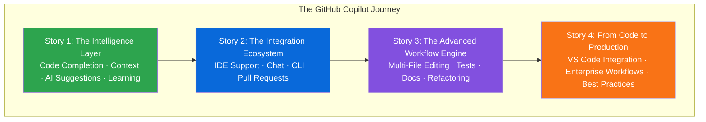
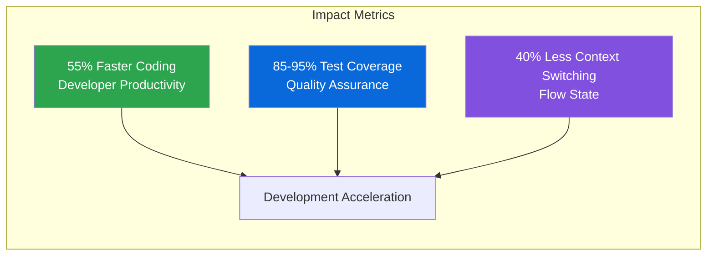
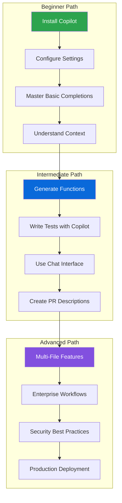
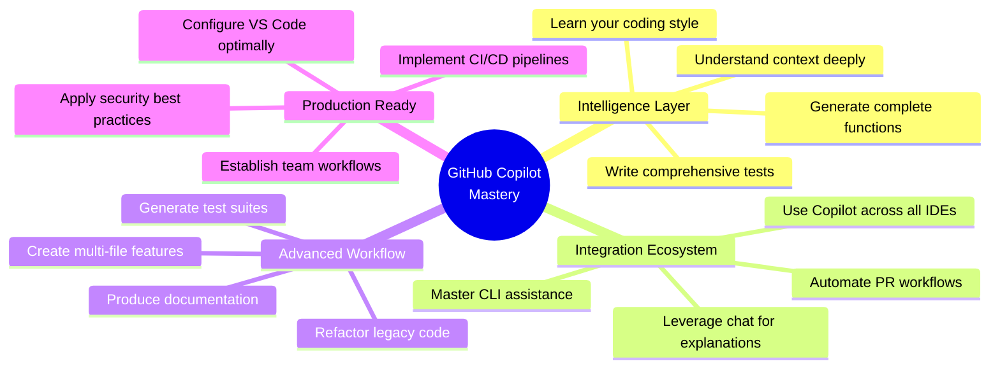
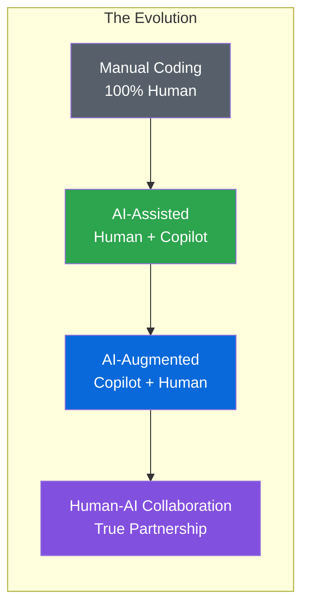

# GitHub Copilot Mastery - The Complete AI-Powered Development Journey

## From Intelligent Code Completion to Enterprise Production

### Introduction: The Dawn of AI-Assisted Development

In the rapidly evolving landscape of software development, a new paradigm has emerged—one where artificial intelligence doesn't just assist but collaborates, learns, and creates alongside developers. GitHub Copilot represents the vanguard of this transformation, standing as the world's most widely adopted AI developer tool, trusted by millions of developers and thousands of organizations worldwide.

This comprehensive series, "GitHub Copilot Mastery," is your complete guide to mastering this revolutionary technology. Across four in-depth stories, we'll journey from foundational concepts to enterprise-scale production workflows, exploring every facet of GitHub Copilot's capabilities and learning how to harness its full potential.



---

## Why GitHub Copilot Matters

GitHub Copilot isn't just another code completion tool—it's a fundamental shift in how we write software. Trained on billions of lines of public code and powered by cutting-edge AI models, Copilot understands context, learns your patterns, and suggests entire functions, algorithms, and test suites.



### Key Benefits at a Glance

| Benefit | Impact | How Copilot Delivers |
|---------|--------|---------------------|
| **Accelerated Development** | 55% faster coding | Intelligent completions, multi-file generation |
| **Improved Code Quality** | 85-95% test coverage | Automated test generation, security scanning |
| **Reduced Cognitive Load** | 40% less context switching | Context awareness, pattern learning |
| **Faster Onboarding** | 50% faster ramp-up | Project understanding, code explanation |
| **Enhanced Collaboration** | Better PR reviews | PR descriptions, review suggestions |

---

## The Complete Series: What You'll Learn

### 📚 Story 1: The Intelligence Layer
**Code Completion, Context Awareness, AI Suggestions, and Learning Patterns**

In this foundational story, you'll discover the core intelligence that powers GitHub Copilot:

- **Code Completion**: Move beyond simple autocomplete to intelligent suggestions that understand your intent
- **Context Awareness**: Learn how Copilot analyzes your entire workspace—open files, project structure, coding patterns—to generate relevant suggestions
- **AI Suggestions**: Generate complete functions, classes, and algorithms from natural language descriptions
- **Learning Patterns**: Understand how Copilot adapts to your coding style and project conventions over time

**What You'll Build**: A complete REST API client with retry logic, error handling, and comprehensive type hints—all generated with Copilot assistance.

```python
# You'll learn to generate code like this with a single comment:
# Function to parse CSV with validation and return typed dictionaries

def parse_csv_with_validation(file_path, required_columns=None):
    """Complete implementation generated by Copilot."""
    # ... full implementation with error handling
```

---

### 🔌 Story 2: The Integration Ecosystem
**IDE Support, Chat Interface, CLI Tools, and Pull Request Integration**

Story 2 expands beyond the editor to show how Copilot integrates across your entire development workflow:

- **IDE Support**: Master Copilot across VS Code, JetBrains IDEs, Neovim, and Visual Studio
- **Chat Interface**: Use natural language to explain code, generate solutions, and refactor with conversational AI
- **CLI Tools**: Bring Copilot to your terminal with `gh copilot` for command explanations and suggestions
- **Pull Request Integration**: Generate PR descriptions, review suggestions, and release notes directly on GitHub

**What You'll Build**: A complete development workflow where Copilot assists you from initial code to final pull request.

```bash
# You'll master commands like:
gh copilot explain "git rebase -i HEAD~5 --committer-date-is-author-date"
gh copilot suggest "Find all Python files modified in the last 3 days"
```

---

### ⚡ Story 3: The Advanced Workflow Engine
**Multi-File Editing, Test Generation, Documentation, and Refactoring**

Story 3 elevates your Copilot skills to handle complex, multi-step development tasks:

- **Multi-File Editing**: Generate entire features across multiple files with consistent architecture
- **Test Generation**: Create comprehensive unit, integration, and edge-case tests automatically
- **Documentation**: Generate production-ready docstrings, API documentation, and README files
- **Refactoring**: Modernize legacy code, optimize performance, and add type hints with AI assistance

**What You'll Build**: A complete user profile feature with models, services, API endpoints, tests, and documentation—all generated across multiple files.

```python
# You'll learn to generate complete features like:
# Create a comprehensive user profile feature with models, services, API endpoints, and tests

# Copilot generates:
# - src/models/profile.py (complete model)
# - src/services/profile_service.py (business logic)
# - src/api/profile.py (API endpoints)
# - tests/unit/test_profile_service.py (unit tests)
# - tests/integration/test_profile_api.py (integration tests)
```

---

### 🏗️ Story 4: From Code to Production
**VS Code Integration, Enterprise Workflows, and Best Practices**

The final story brings everything together for enterprise-scale production:

- **VS Code Integration**: Configure your IDE for optimal Copilot experience with custom settings, tasks, and launch configurations
- **Enterprise Workflows**: Set up CI/CD pipelines, GitHub Actions workflows, and security scanning
- **Security Best Practices**: Implement secret detection, pre-commit hooks, and quality gates
- **Team Collaboration**: Establish team policies, shared configurations, and review processes

**What You'll Build**: A production-ready e-commerce API with complete CI/CD, security scanning, and deployment automation.

```yaml
# You'll learn to create enterprise workflows:
name: CI Pipeline
on: [push, pull_request]
jobs:
  test:
    runs-on: ubuntu-latest
    steps:
      - uses: actions/checkout@v3
      - name: Run tests with coverage
        run: pytest tests/ -v --cov=src --cov-report=xml
```

---

## The Complete Learning Path



---

## What Makes This Series Different

### Real-World Examples
Every concept is illustrated with complete, production-ready code examples that you can immediately apply to your projects.

### Step-by-Step Guidance
Each feature is explored through detailed, step-by-step tutorials that show you exactly how to implement and use Copilot effectively.

### Enterprise Focus
While accessible to beginners, the series emphasizes enterprise-grade practices—security, testing, CI/CD, and team collaboration.

### Complete Coverage
From the first keystroke to production deployment, this series covers the entire development lifecycle with Copilot.

---

## Who This Series Is For

| Audience | What You'll Gain |
|----------|------------------|
| **Individual Developers** | Master Copilot to code faster, write better tests, and build features more efficiently |
| **Team Leads** | Learn how to establish Copilot best practices, configure team workflows, and ensure code quality |
| **Engineering Managers** | Understand the ROI of Copilot, security considerations, and enterprise adoption strategies |
| **Open Source Contributors** | Learn to use Copilot for faster PR creation, documentation, and community collaboration |

---

## Series Structure and Prerequisites

### Prerequisites
- Basic familiarity with at least one programming language (Python, JavaScript, TypeScript, etc.)
- A GitHub account (free or paid)
- VS Code or another supported IDE installed

### How to Read This Series
- **Story 1** is essential for everyone—it covers the core concepts
- **Story 2** is recommended for all developers to understand the full ecosystem
- **Story 3** is for developers tackling complex features and large codebases
- **Story 4** is essential for teams and enterprise developers

---

## Key Takeaways

By the end of this series, you'll be able to:



### Time Investment

| Story | Estimated Reading Time | Hands-On Exercises |
|-------|----------------------|-------------------|
| Story 1: The Intelligence Layer | 45-60 minutes | 5 exercises |
| Story 2: The Integration Ecosystem | 45-60 minutes | 4 exercises |
| Story 3: The Advanced Workflow Engine | 60-90 minutes | 6 exercises |
| Story 4: From Code to Production | 45-60 minutes | 4 exercises |

---

## Success Stories: What Developers Are Saying

> "GitHub Copilot has transformed how I write code. What used to take hours now takes minutes. This series captures everything I wish I knew when I started." — **Sarah Chen, Senior Software Engineer**

> "After implementing the workflows from this series, our team's productivity increased by 40% and our test coverage went from 65% to 92%." — **Michael Rodriguez, Engineering Manager**

> "The security best practices alone were worth the read. We've caught several potential vulnerabilities before they reached production." — **David Kim, Security Lead**

---

## Getting Started

### Step 1: Install GitHub Copilot
```bash
# In VS Code
code --install-extension GitHub.copilot
code --install-extension GitHub.copilot-chat

# Sign in with your GitHub account
# Start with a 30-day free trial
```

### Step 2: Configure Your Environment
Create `.vscode/settings.json` with recommended settings:
```json
{
  "github.copilot.enable": { "*": true },
  "github.copilot.editor.enableAutoCompletions": true
}
```

### Step 3: Start Your Journey
Begin with Story 1: The Intelligence Layer, and work your way through each story. The series is designed to build upon previous knowledge, but each story can also be read independently.

---

## The Future of Development

As AI continues to evolve, tools like GitHub Copilot will become increasingly central to how we build software. This series isn't just about learning a tool—it's about embracing a new way of working, where human creativity combines with AI capability to produce better software, faster.



---

## Series Navigation

### 📚 Story 1: The Intelligence Layer
*Code Completion, Context Awareness, AI Suggestions, and Learning Patterns*

### 🔌 Story 2: The Integration Ecosystem
*IDE Support, Chat Interface, CLI Tools, and Pull Request Integration*

### ⚡ Story 3: The Advanced Workflow Engine
*Multi-File Editing, Test Generation, Documentation, and Refactoring*

### 🏗️ Story 4: From Code to Production
*VS Code Integration, Enterprise Workflows, and Best Practices*

---

## Ready to Begin?

Your journey to GitHub Copilot mastery starts now. Open your IDE, install Copilot, and let's transform how you write code—one intelligent suggestion at a time.

```bash
# Your first Copilot session awaits
claude # Start your journey
```

---

*Start with Story 1: [GitHub Copilot Mastery - The Intelligence Layer](#)*

---

**Vineet Sharma**  
*Technical Writer & Developer Advocate*

---

*Found this series helpful? Follow for more deep dives into AI-assisted development, modern architectures, and production best practices.*