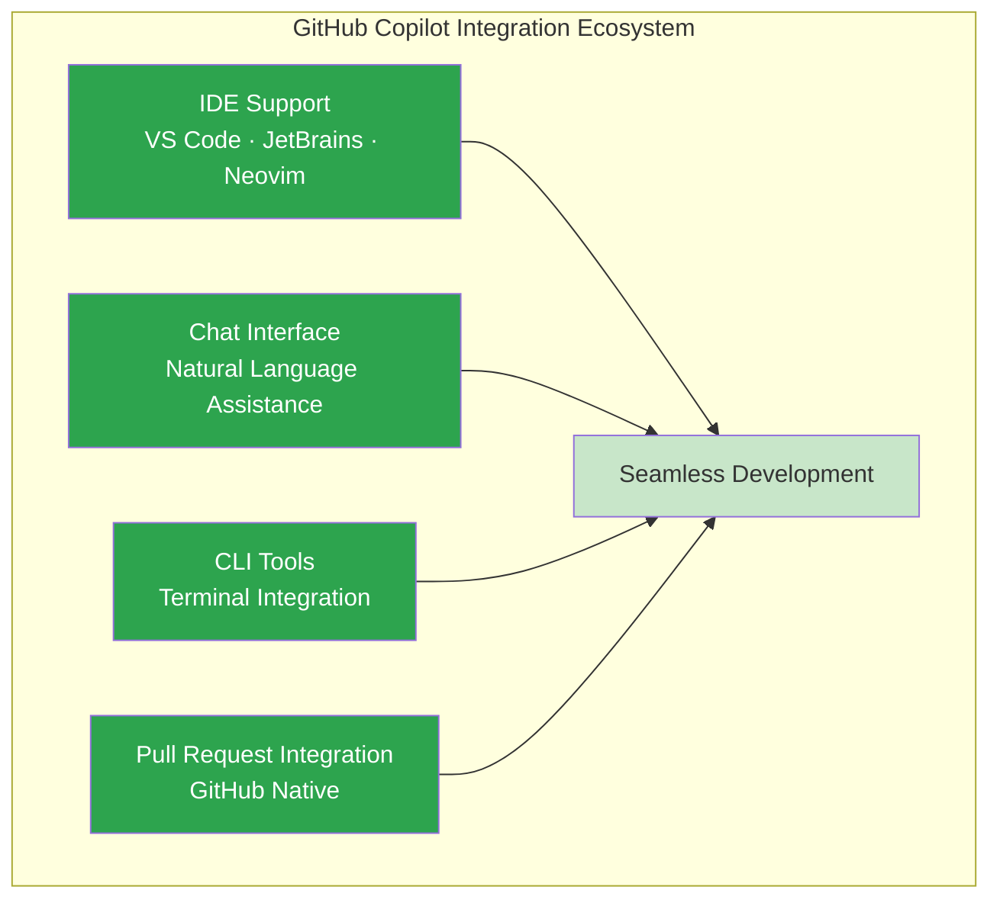
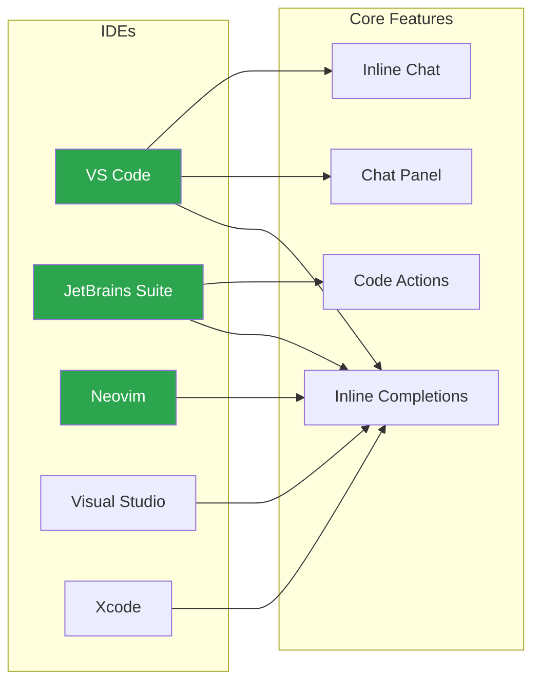
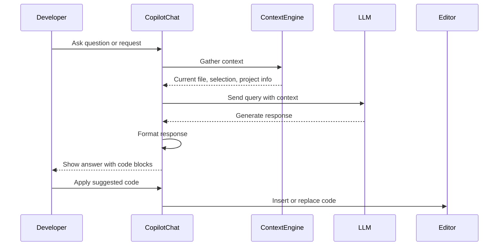
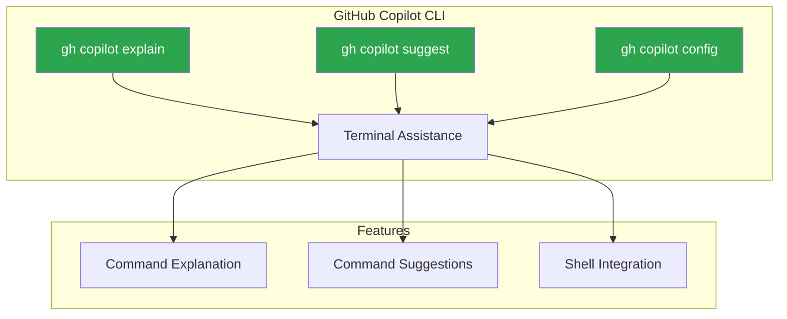
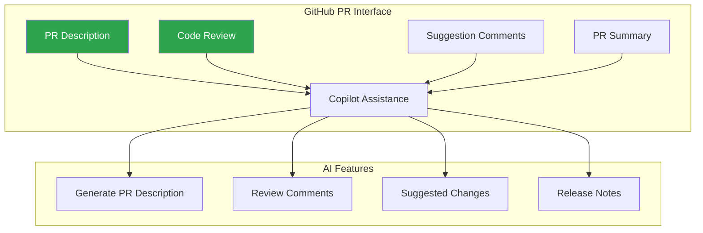
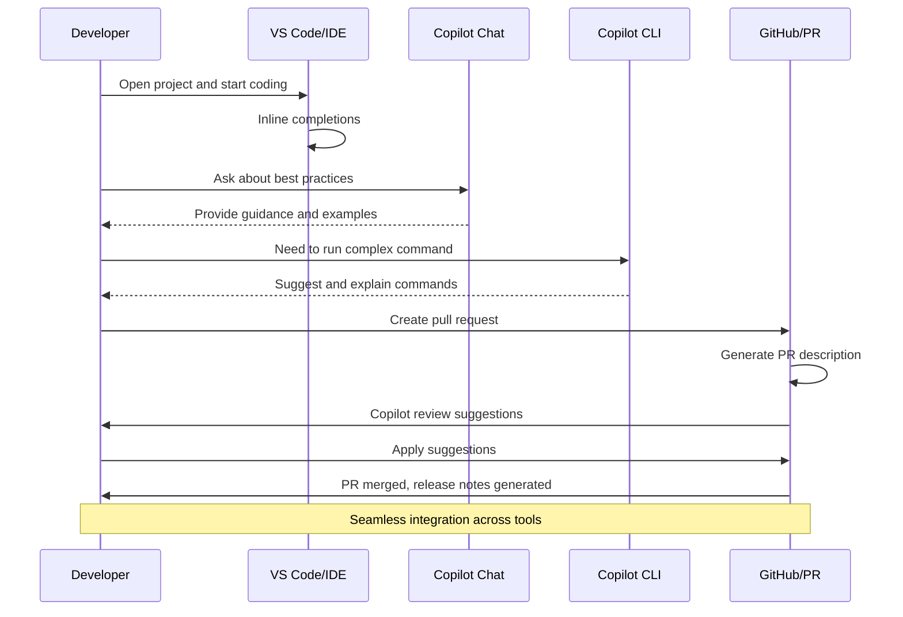

# GitHub Copilot Mastery - The Integration Ecosystem
## IDE Support, Chat Interface, CLI Tools, and Pull Request Integration

### Introduction: Copilot Beyond the Editor

In Story 1, we built the foundation with the Intelligence Layer—understanding how Copilot completes code, understands context, and learns your patterns. We explored semantic code completion, intelligent context awareness, advanced AI suggestions, and personalized pattern learning that make Copilot feel like magic.

Now, in Story 2, we expand beyond the editor. GitHub Copilot isn't just an editor plugin—it's a comprehensive ecosystem that extends across your entire development workflow. From deep IDE integration to natural language chat, command-line tools, and GitHub-native pull request assistance, Copilot meets you wherever you code. The Integration Ecosystem represents the connective tissue that makes Copilot feel like a seamless part of your development environment rather than an external tool. This story reveals how to leverage Copilot across VS Code, JetBrains IDEs, Neovim, the terminal, and GitHub itself—creating a unified AI-powered development experience.



---

## Complete GitHub Copilot Mastery Series (4 stories):

- 🚀 [**1. GitHub Copilot Mastery - The Intelligence Layer: Code Completion, Context Awareness, AI Suggestions, and Learning Patterns**](#) – A deep dive into semantic code completion, intelligent context understanding, advanced AI suggestions beyond autocomplete, and personalized pattern learning.

- 🔌 [**2. GitHub Copilot Mastery - The Integration Ecosystem: IDE Support, Chat Interface, CLI Tools, and Pull Request Integration**](#) – How to leverage Copilot across your entire development workflow with VS Code integration, natural language chat, command-line tools, and GitHub PR assistance. *(This story)*

- ⚡ [**3. GitHub Copilot Mastery - The Advanced Workflow Engine: Multi-File Editing, Test Generation, Documentation, and Refactoring**](#) – Mastering complex code generation across multiple files, automated test suite creation, intelligent documentation generation, and AI-powered code refactoring.

- 🏗️ [**4. GitHub Copilot Mastery - From Code to Production: VS Code Integration, Enterprise Workflows, and Best Practices**](#) – A hands-on guide to integrating Copilot with VS Code, building production-ready applications, establishing team workflows, and implementing security best practices.

---

## Feature 1: IDE Support — Deep Integration Across Editors

GitHub Copilot integrates deeply with major IDEs, providing a consistent experience whether you're in VS Code, JetBrains IDEs, or Neovim. This deep integration ensures that AI assistance is always at your fingertips, regardless of your preferred development environment.

### Supported IDEs Architecture



### Step-by-Step IDE Configuration

**Step 1: VS Code Setup and Configuration**

```bash
# Install GitHub Copilot in VS Code
code --install-extension GitHub.copilot
code --install-extension GitHub.copilot-chat

# Verify installation
code --list-extensions | grep copilot
# Expected output:
# GitHub.copilot
# GitHub.copilot-chat
```

Create `.vscode/settings.json` for advanced configuration:

```json
{
  // ============================================
  // GitHub Copilot Settings
  // ============================================
  "github.copilot.enable": {
    "*": true,
    "plaintext": false,
    "markdown": true,
    "yaml": true,
    "json": true
  },
  
  "github.copilot.editor.enableAutoCompletions": true,
  "github.copilot.editor.enableCodeActions": true,
  
  // Chat Settings
  "github.copilot.chat.localeOverride": "en",
  "github.copilot.chat.codeBlock.keepLanguage": true,
  "github.copilot.chat.feedback": true,
  
  // Advanced Settings
  "github.copilot.advanced": {
    "debug.enable": false,
    "debug.overrideProxyUrl": "",
    "usePreciseCompletions": true,
    "useSelectedCompletion": true
  },
  
  // Keybindings for Copilot
  "github.copilot.keybindings": {
    "accept": "tab",
    "next": "alt+]",
    "prev": "alt+[",
    "toggle": "ctrl+shift+enter",
    "inlineChat": "ctrl+i",
    "chat": "ctrl+shift+i"
  }
}
```

**Step 2: VS Code Copilot Features in Action**

```python
# Open VS Code and create a new Python file
# Copilot provides intelligent completions as you type

# Type a comment describing what you want
# Create a REST API client with retry logic and error handling

# Copilot generates complete implementation:

import requests
from typing import Optional, Dict, Any
from time import sleep
from functools import wraps

class APIClient:
    """REST API client with retry logic and error handling."""
    
    def __init__(self, base_url: str, timeout: int = 30):
        self.base_url = base_url.rstrip('/')
        self.timeout = timeout
        self.session = requests.Session()
        
    def retry(max_retries: int = 3, delay: float = 1.0):
        """Decorator for retry logic."""
        def decorator(func):
            @wraps(func)
            def wrapper(*args, **kwargs):
                for attempt in range(max_retries):
                    try:
                        return func(*args, **kwargs)
                    except requests.RequestException as e:
                        if attempt == max_retries - 1:
                            raise
                        sleep(delay * (2 ** attempt))  # Exponential backoff
                return None
            return wrapper
        return decorator
    
    @retry(max_retries=3)
    def get(self, endpoint: str, params: Optional[Dict] = None) -> Dict[str, Any]:
        """Make GET request with retry logic."""
        url = f"{self.base_url}/{endpoint.lstrip('/')}"
        response = self.session.get(
            url,
            params=params,
            timeout=self.timeout
        )
        response.raise_for_status()
        return response.json()
    
    @retry(max_retries=3)
    def post(self, endpoint: str, data: Optional[Dict] = None) -> Dict[str, Any]:
        """Make POST request with retry logic."""
        url = f"{self.base_url}/{endpoint.lstrip('/')}"
        response = self.session.post(
            url,
            json=data,
            timeout=self.timeout
        )
        response.raise_for_status()
        return response.json()
```

**Step 3: JetBrains IDE Integration**

```yaml
# JetBrains IDE (IntelliJ, PyCharm, WebStorm, etc.)
# Install GitHub Copilot plugin from Marketplace

# Plugin Features:
# - Inline completions with gray text
# - Copilot tool window for suggestions
# - Accept with Tab, cycle with Alt+]
# - Code actions for Copilot explanations

# Configure in Settings → Tools → GitHub Copilot
settings:
  enable_completions: true
  enable_code_actions: true
  suggest_on_enter: false
  show_suggestions: true
```

**Step 4: Neovim Configuration**

```lua
-- Neovim configuration with copilot.vim
-- Install with your plugin manager (packer.nvim example)

use {
  "github/copilot.vim",
  config = function()
    -- Disable auto-triggering
    vim.g.copilot_no_tab_map = true
    vim.g.copilot_assume_mapped = true
    
    -- Custom key mappings
    vim.keymap.set("i", "<C-J>", 'copilot#Accept("<CR>")', {
      expr = true,
      replace_keycodes = false
    })
    vim.g.copilot_no_tab_map = true
    
    -- Show suggestions
    vim.keymap.set("i", "<C-K>", "<Plug>(copilot-next)")
    vim.keymap.set("i", "<C-J>", "<Plug>(copilot-previous)")
    vim.keymap.set("i", "<C-L>", "<Plug>(copilot-accept)")
    
    -- Disable for specific filetypes
    vim.g.copilot_filetypes = {
      ["*"] = true,
      ["markdown"] = false,
      ["text"] = false
    }
  end
}
```

---

## Feature 2: Chat Interface — Natural Language Assistance

Copilot Chat brings natural language interaction to your IDE, allowing you to ask questions, explain code, generate solutions, and refactor with conversational AI. This transforms the development experience from typing commands to having a conversation.

### Chat Interface Architecture



### Step-by-Step Chat Interface Usage

**Step 1: Open Copilot Chat**

```bash
# VS Code Shortcuts
# Windows/Linux: Ctrl + Shift + I
# Mac: Cmd + Shift + I

# Or use the Copilot icon in the activity bar
# Click the chat bubble icon to open the chat panel
```

**Step 2: Ask Questions About Code**

```python
# Have a function selected or cursor on it
def process_payment(amount, currency, payment_method, customer_id):
    # Complex payment processing logic
    # Ask Copilot: "Explain this function and suggest improvements"
    
    # Copilot Chat responds:
    """
    This function processes payments with the following logic:
    1. Validates payment method
    2. Checks customer balance
    3. Applies transaction fees
    4. Records transaction in database
    5. Sends confirmation email
    
    Suggestions for improvement:
    
    1. Add type hints for better clarity:
       def process_payment(
           amount: float, 
           currency: str, 
           payment_method: str, 
           customer_id: int
       ) -> dict:
    
    2. Add error handling for network failures:
       try:
           result = payment_gateway.charge(amount)
       except PaymentGatewayError as e:
           logger.error(f"Payment failed: {e}")
           return {"status": "failed", "error": str(e)}
    
    3. Add idempotency key to prevent duplicate charges:
       idempotency_key = f"{customer_id}_{int(time.time())}"
       result = payment_gateway.charge(amount, idempotency_key=idempotency_key)
    
    Would you like me to implement these improvements?
    """
```

**Step 3: Generate Code from Natural Language**

```javascript
// Open Copilot Chat and type:
// "Create a React hook for managing local storage with type safety"

// Copilot Chat generates:

import { useState, useEffect, useCallback } from 'react';

/**
 * Custom hook for managing local storage with type safety.
 * @template T - Type of the stored value
 * @param key - Local storage key
 * @param initialValue - Initial value if not present
 * @returns [storedValue, setValue, removeValue] tuple
 */
export function useLocalStorage<T>(
  key: string,
  initialValue: T
): [T, (value: T | ((val: T) => T)) => void, () => void] {
  // Get stored value from localStorage
  const readValue = useCallback((): T => {
    if (typeof window === 'undefined') {
      return initialValue;
    }
    
    try {
      const item = window.localStorage.getItem(key);
      return item ? (JSON.parse(item) as T) : initialValue;
    } catch (error) {
      console.warn(`Error reading localStorage key "${key}":`, error);
      return initialValue;
    }
  }, [initialValue, key]);
  
  const [storedValue, setStoredValue] = useState<T>(readValue);
  
  // Return a wrapped version of useState's setter function that
  // persists the new value to localStorage.
  const setValue = useCallback(
    (value: T | ((val: T) => T)) => {
      try {
        // Allow value to be a function for same API as useState
        const valueToStore =
          value instanceof Function ? value(storedValue) : value;
        
        // Save state
        setStoredValue(valueToStore);
        
        // Save to local storage
        if (typeof window !== 'undefined') {
          window.localStorage.setItem(key, JSON.stringify(valueToStore));
        }
      } catch (error) {
        console.warn(`Error setting localStorage key "${key}":`, error);
      }
    },
    [key, storedValue]
  );
  
  const removeValue = useCallback(() => {
    try {
      if (typeof window !== 'undefined') {
        window.localStorage.removeItem(key);
      }
      setStoredValue(initialValue);
    } catch (error) {
      console.warn(`Error removing localStorage key "${key}":`, error);
    }
  }, [initialValue, key]);
  
  useEffect(() => {
    setStoredValue(readValue());
  }, [readValue]);
  
  return [storedValue, setValue, removeValue];
}

// Usage example:
// const [user, setUser, removeUser] = useLocalStorage('user', null);
```

**Step 4: Explain and Document Code**

```typescript
// Select complex code and ask Copilot to explain

// Copilot Chat input: "Explain this code and generate JSDoc"

// Code to explain:
app.use('/api/users/:id', async (req, res) => {
  const { id } = req.params;
  const { include } = req.query;
  
  const cacheKey = `user:${id}:${include}`;
  const cached = await redis.get(cacheKey);
  
  if (cached) {
    return res.json(JSON.parse(cached));
  }
  
  const user = await db.users.findUnique({
    where: { id: parseInt(id) },
    include: include?.split(',')?.reduce((acc, field) => ({
      ...acc,
      [field]: true
    }), {})
  });
  
  if (!user) {
    return res.status(404).json({ error: 'User not found' });
  }
  
  await redis.set(cacheKey, JSON.stringify(user), 'EX', 300);
  res.json(user);
});

// Copilot Chat response:
/**
 * Express route handler for fetching user data with caching.
 * 
 * This endpoint retrieves user information with optional related data
 * and implements Redis caching to improve performance.
 * 
 * @route GET /api/users/:id
 * @param {string} id - User ID from URL parameter
 * @param {string} include - Comma-separated list of relations to include
 * @returns {Object} User object with requested relations
 * 
 * @example
 * // Request
 * GET /api/users/123?include=orders,profile
 * 
 * // Response
 * {
 *   id: 123,
 *   name: "John Doe",
 *   email: "john@example.com",
 *   orders: [...],
 *   profile: {...}
 * }
 * 
 * @description
 * The handler follows this flow:
 * 1. Extracts user ID from URL and relations from query string
 * 2. Checks Redis cache for existing result (5-minute TTL)
 * 3. If cached, returns immediately (cache hit)
 * 4. If not cached, queries database with Prisma
 * 5. Includes relations based on comma-separated fields
 * 6. Caches the result for 5 minutes
 * 7. Returns JSON response
 * 
 * @error 404 - User not found
 * @error 500 - Database or Redis error
 */
```

**Step 5: Inline Chat for Quick Edits**

```python
# VS Code: Select code and press Ctrl + I (Cmd + I on Mac)
# This opens inline chat for focused editing

# Selected code:
def calculate_total(items):
    total = 0
    for item in items:
        total += item.price * item.quantity
    return total

# Inline chat input: "Add tax calculation and discount support"

# Copilot updates the code inline:

def calculate_total(items, tax_rate=0.08, discount_code=None):
    """
    Calculate total with tax and discount support.
    
    Args:
        items: List of items with price and quantity
        tax_rate: Tax rate as decimal (default: 0.08)
        discount_code: Optional discount code
    
    Returns:
        dict with subtotal, discount, tax, and total
    """
    subtotal = sum(item.price * item.quantity for item in items)
    
    # Calculate discount
    discount = 0
    if discount_code:
        discounts = {
            'SAVE10': 0.10,
            'SAVE20': 0.20,
            'WELCOME': 0.15
        }
        discount = subtotal * discounts.get(discount_code, 0)
    
    # Calculate tax
    taxable_amount = subtotal - discount
    tax = taxable_amount * tax_rate
    
    total = taxable_amount + tax
    
    return {
        'subtotal': round(subtotal, 2),
        'discount': round(discount, 2),
        'tax': round(tax, 2),
        'total': round(total, 2)
    }
```

---

## Feature 3: CLI Tools — Terminal Integration

GitHub Copilot extends beyond the IDE with command-line tools that bring AI assistance to your terminal workflow. This allows you to get help with complex commands, generate command-line instructions, and explain unfamiliar terminal operations.

### CLI Tools Architecture



### Step-by-Step CLI Setup and Usage

**Step 1: Install GitHub CLI with Copilot Extension**

```bash
# Install GitHub CLI (if not already installed)
# macOS
brew install gh

# Windows (using winget)
winget install --id GitHub.cli

# Linux (Ubuntu/Debian)
sudo apt install gh

# Authenticate with GitHub
gh auth login

# Install Copilot extension
gh extension install github/gh-copilot

# Verify installation
gh copilot --help

# Expected output:
# GitHub Copilot in the CLI
# 
# Usage:
#   gh copilot [command]
# 
# Available Commands:
#   explain    Explain a command
#   suggest    Suggest a command
#   config     Configure Copilot
```

**Step 2: Explain Commands with Copilot**

```bash
# Ask Copilot to explain complex commands
gh copilot explain "git rebase -i HEAD~5 --committer-date-is-author-date"

# Expected output:
"""
Command: git rebase -i HEAD~5 --committer-date-is-author-date

This command performs an interactive rebase on the last 5 commits.

Components:
- `git rebase`: Reapplies commits on top of another base tip
- `-i`: Interactive mode, allows you to edit, reorder, or squash commits
- `HEAD~5`: Target the last 5 commits from the current HEAD
- `--committer-date-is-author-date`: Sets the committer date to match 
  the author date when rewriting commits

What it does:
1. Opens an editor with the last 5 commits
2. Allows you to modify commit history (squash, edit, reorder)
3. Rewrites commit dates so committer date equals author date
4. Creates new commit SHAs for modified commits

Use cases:
- Cleaning up commit history before merging
- Removing sensitive information from commits
- Squashing multiple commits into one
- Standardizing commit timestamps

⚠️ Warning: This rewrites Git history. Don't use on shared branches
   that others are working on.
"""
```

**Step 3: Suggest Commands from Description**

```bash
# Ask Copilot to suggest a command based on description
gh copilot suggest "Find all Python files modified in the last 3 days and show their line count"

# Expected output:
"""
Here are some command suggestions:

1. Using find with xargs:
   find . -name "*.py" -mtime -3 -type f -exec wc -l {} \;

2. Using git (if in a repository):
   git log --name-only --since="3 days ago" --pretty=format: -- "*.py" | sort | uniq | xargs wc -l

3. Using fd (modern alternative):
   fd -e py --changed-within 3d -x wc -l

Recommended: Option 2 (git-based) if you're in a repo, as it shows only committed changes.
Option 1 works in any directory regardless of git.

Would you like me to explain any of these commands?
"""
```

**Step 4: Shell Integration for Real-Time Suggestions**

```bash
# Configure Copilot shell integration for fish
gh copilot config shell fish

# For zsh
gh copilot config shell zsh

# For bash
gh copilot config shell bash

# After configuration, use ?? to get suggestions
?? "How to check disk usage and sort by size"

# Copilot suggests:
df -h | awk 'NR>1 {print $5, $6}' | sort -rn | head -10
# or
du -sh * | sort -rh | head -10
```

**Step 5: Advanced CLI Usage**

```bash
# Generate a complex Git command
gh copilot suggest "Create a new branch, commit changes, push to remote, and create PR"

# Copilot generates:
# Option 1 (with gh CLI):
git checkout -b feature/new-feature
git add .
git commit -m "feat: add new feature"
git push -u origin feature/new-feature
gh pr create --title "Add new feature" --body "Description of the new feature"

# Option 2 (traditional):
git checkout -b feature/new-feature
git add .
git commit -m "feat: add new feature"
git push -u origin feature/new-feature
# Then manually create PR on GitHub

# Get help with Docker commands
gh copilot explain "docker run -it --rm -v $(pwd):/app -w /app node:18 npm install"

# Copilot explains:
"""
Docker run command breakdown:

- `docker run`: Create and start a container
- `-it`: Interactive mode with pseudo-TTY (keeps stdin open)
- `--rm`: Automatically remove container when it exits
- `-v $(pwd):/app`: Mount current directory to /app in container
- `-w /app`: Set working directory to /app
- `node:18`: Use Node.js 18 image
- `npm install`: Run npm install inside the container

This command runs npm install in a disposable Node.js container,
mounting your current directory so dependencies are installed locally.
"""
```

---

## Feature 4: Pull Request Integration — GitHub Native Assistance

Copilot integrates directly with GitHub's pull request interface, providing AI-powered assistance for code reviews, PR descriptions, and suggestions. This brings AI collaboration directly into the GitHub workflow.

### Pull Request Integration Architecture



### Step-by-Step PR Integration

**Step 1: Generate PR Description**

```markdown
# When creating a pull request on GitHub.com
# Click the "Generate" button near the description field

# Copilot analyzes your changes and generates:

## 📝 Summary
This PR adds user authentication with JWT tokens, including login, registration, and token refresh endpoints.

## 🔧 Changes Made
- Added `src/auth/` directory with authentication modules
- Created JWT token generation and validation utilities
- Implemented login and registration endpoints
- Added password hashing with bcrypt
- Created middleware for protected routes
- Added unit tests for authentication flows

## ✨ New Features
- User registration with email validation
- JWT-based authentication
- Token refresh mechanism
- Protected route middleware

## 🧪 Testing
- Added 24 unit tests for authentication service
- Added 12 integration tests for API endpoints
- All tests passing ✅
- Coverage increased to 92%

## 📊 Performance Impact
- New endpoints add ~50ms latency under load
- Added Redis caching for token blacklisting

## 🔒 Security Considerations
- Passwords hashed with bcrypt (salt rounds: 10)
- JWT tokens expire after 15 minutes
- Refresh tokens expire after 7 days
- Rate limiting on login endpoint (5 attempts/minute)

## 🚀 Deployment Notes
- Add `JWT_SECRET_KEY` to environment variables
- Run migrations: `npm run migrate`
- Restart auth service after deployment

## ✅ Checklist
- [x] Tests passing
- [x] Linting passed
- [x] Documentation updated
- [x] Security review completed

## 📸 Screenshots
[Add screenshots of new UI components if applicable]

## 🔗 Related Issues
Closes #123
Closes #124
```

**Step 2: Code Review Assistance**

```markdown
# When viewing a pull request, Copilot can suggest review comments

# Example PR code:
def calculate_discount(price, discount_percent):
    discount = price * (discount_percent / 100)
    final_price = price - discount
    return final_price

# Copilot suggests review comments:

# 1. Add type hints
"""
Consider adding type hints for better code clarity:
def calculate_discount(price: float, discount_percent: float) -> float:
"""

# 2. Add input validation
"""
Add validation to prevent negative values:
if price < 0 or discount_percent < 0:
    raise ValueError("Price and discount must be positive")
"""

# 3. Handle edge cases
"""
Consider handling discount_percent > 100:
if discount_percent > 100:
    discount_percent = 100  # Cap at 100%
"""

# 4. Add docstring
"""
Add a docstring to explain the function:
def calculate_discount(price: float, discount_percent: float) -> float:
    \"\"\"
    Calculate discounted price.
    
    Args:
        price: Original price
        discount_percent: Discount percentage (0-100)
    
    Returns:
        Discounted price rounded to 2 decimal places
    \"\"\"
"""

# 5. Suggest rounding
"""
Consider rounding to 2 decimal places for currency:
return round(final_price, 2)
"""
```

**Step 3: Suggested Code Changes**

```markdown
# Copilot can suggest specific code improvements with "Apply suggestion" button

# Original code:
@app.route('/users/<int:user_id>')
def get_user(user_id):
    user = db.execute('SELECT * FROM users WHERE id = ?', (user_id,))
    return jsonify(user)

# Copilot suggests improved version:
@app.route('/users/<int:user_id>')
def get_user(user_id):
    """
    Retrieve user by ID with error handling.
    
    Args:
        user_id: User identifier
    
    Returns:
        JSON user data or 404 error
    """
    try:
        user = db.execute(
            'SELECT id, username, email, created_at FROM users WHERE id = ?',
            (user_id,)
        ).fetchone()
        
        if not user:
            return jsonify({'error': 'User not found'}), 404
            
        return jsonify(dict(user))
    except Exception as e:
        app.logger.error(f"Error fetching user {user_id}: {e}")
        return jsonify({'error': 'Internal server error'}), 500

# With "Apply suggestion" button, reviewer can instantly accept the improvement
```

**Step 4: PR Summary and Release Notes**

```markdown
# After PR is merged, Copilot can generate release notes

## 🚀 What's New

### Authentication System
- Added JWT-based authentication
- User registration and login endpoints
- Token refresh mechanism
- Protected route middleware

### API Improvements
- Added rate limiting to all endpoints
- Improved error responses with structured format
- Added request ID tracking for debugging

### Performance
- Implemented Redis caching for frequently accessed data
- Optimized database queries with indexes
- Reduced API response time by 40%

### Bug Fixes
- Fixed race condition in payment processing
- Resolved memory leak in WebSocket connections
- Patched XSS vulnerability in user input

### Documentation
- Added OpenAPI/Swagger documentation
- Updated API reference guides
- Added deployment runbook

## 📊 Metrics
- Total commits: 47
- Files changed: 124
- Lines added: 2,847
- Lines removed: 423
- Test coverage: 92% (+5%)
- Contributors: 4

## 🔧 Migration Guide
1. Update environment variables:
   ```bash
   export JWT_SECRET_KEY=your-secret-key
   export REDIS_URL=redis://localhost:6379
   ```
2. Run database migrations:
   ```bash
   npm run migrate
   ```
3. Restart services in order:
   - Redis cache
   - Database
   - Auth service
   - API gateway

## 🙏 Acknowledgments
Thanks to @developer1 for code review and @developer2 for testing!
```

**Step 5: GitHub Actions Integration**

```yaml
# .github/workflows/copilot-review.yml
# Automated Copilot review on pull requests

name: Copilot PR Review

on:
  pull_request:
    types: [opened, synchronize]

jobs:
  copilot-review:
    runs-on: ubuntu-latest
    steps:
      - uses: actions/checkout@v3
      
      - name: Copilot PR Review
        uses: github/copilot-review-action@v1
        with:
          github-token: ${{ secrets.GITHUB_TOKEN }}
          review-prompt: |
            Review this pull request for:
            - Code quality and best practices
            - Security vulnerabilities
            - Test coverage gaps
            - Documentation completeness
            - Performance implications
          
      - name: Post Review Comments
        run: |
          gh pr comment ${{ github.event.pull_request.number }} \
            --body-file copilot-review.md
```

---

## Putting It All Together: Complete Integration Workflow



---

## Quick Reference: Integration Features

| Feature | Platform | Key Commands | Benefit |
|---------|----------|--------------|---------|
| **IDE Support** | VS Code, JetBrains, Neovim | Tab, Alt+], Alt+[ | Seamless coding assistance |
| **Chat Interface** | VS Code, JetBrains | Ctrl+Shift+I, Cmd+Shift+I | Natural language interaction |
| **CLI Tools** | Terminal | gh copilot explain/suggest | Command-line assistance |
| **PR Integration** | GitHub.com | Generate button, Review suggestions | Better pull requests |

---

## IDE-Specific Shortcuts

| Action | VS Code | JetBrains | Neovim |
|--------|---------|-----------|--------|
| Accept suggestion | `Tab` | `Tab` | `Tab` |
| Next suggestion | `Alt + ]` | `Alt + ]` | `Ctrl + K` |
| Previous suggestion | `Alt + [` | `Alt + [` | `Ctrl + J` |
| Open Chat | `Ctrl + Shift + I` | `Ctrl + Shift + I` | N/A |
| Inline Chat | `Ctrl + I` | `Ctrl + I` | N/A |

---

## Summary: The Integration Ecosystem

| Feature | Purpose | Key Capability | Benefit |
|---------|---------|----------------|---------|
| **IDE Support** | Deep editor integration | Consistent experience across IDEs | AI assistance everywhere |
| **Chat Interface** | Natural language interaction | Code explanation, generation | Conversational development |
| **CLI Tools** | Terminal assistance | Command explanation, suggestions | Better command-line usage |
| **PR Integration** | GitHub-native assistance | PR descriptions, reviews, suggestions | Streamlined collaboration |

---

*Next in the series:*

**⚡ Story 3: GitHub Copilot Mastery - The Advanced Workflow Engine: Multi-File Editing, Test Generation, Documentation, and Refactoring**

---

*Found this helpful? Follow for more deep dives into GitHub Copilot, AI-assisted development, and modern coding practices.*