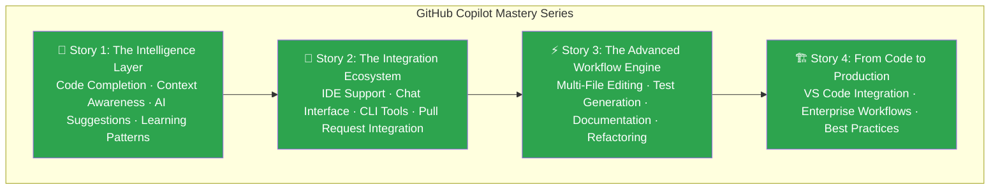
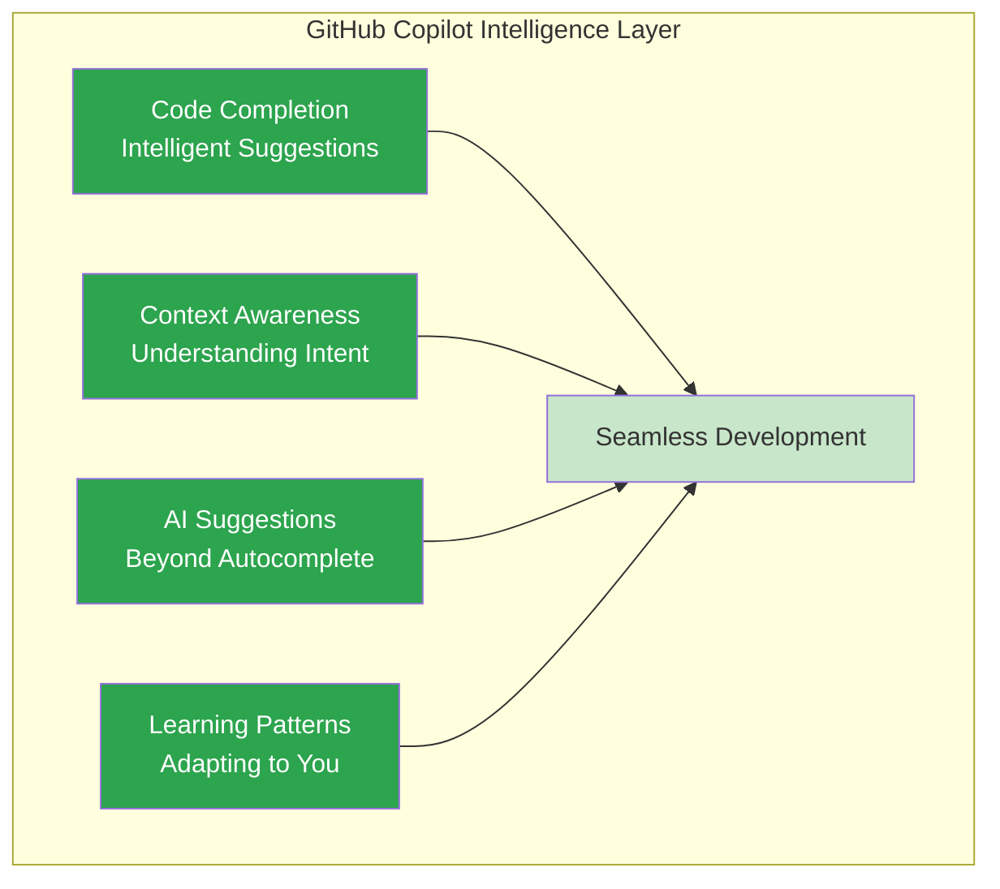
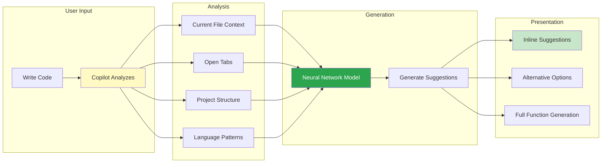
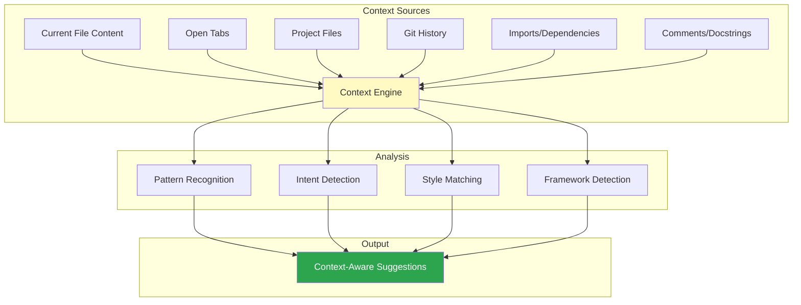
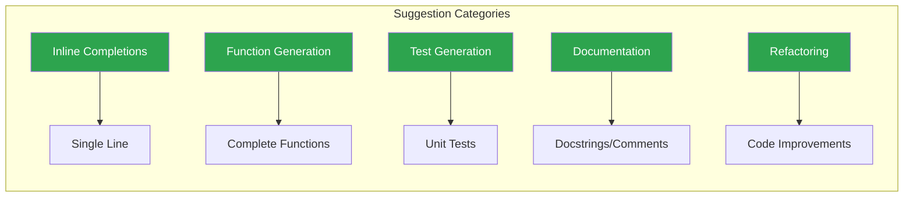
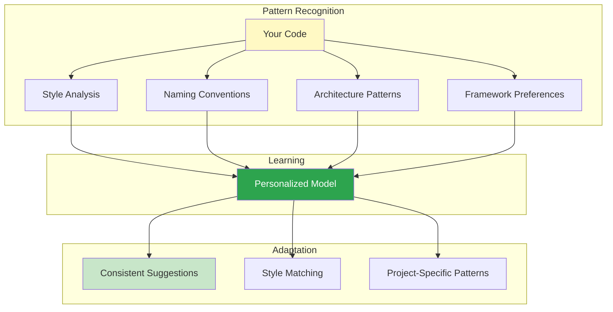
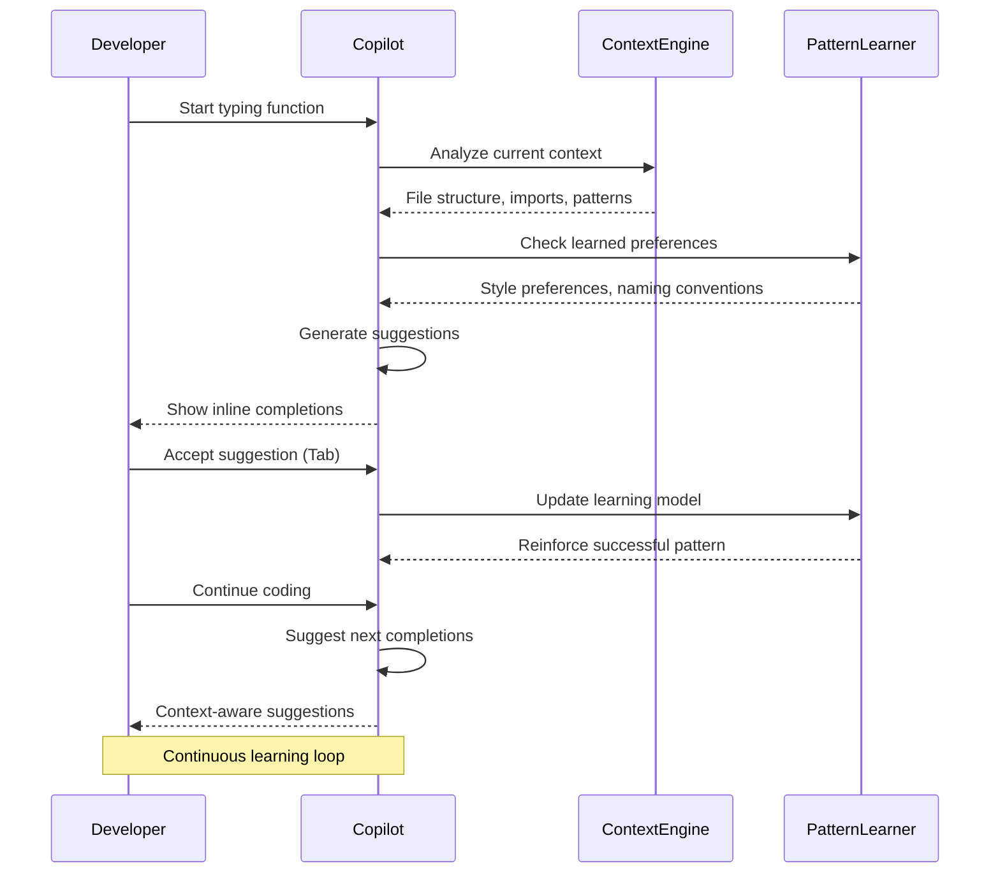

# GitHub Copilot Mastery - The Intelligence Layer

## Complete Series Overview



---

# 🚀 Story 1: GitHub Copilot Mastery - The Intelligence Layer
## Code Completion, Context Awareness, AI Suggestions, and Learning Patterns

### Introduction: The AI Pair Programmer

GitHub Copilot represents a paradigm shift in software development—an AI pair programmer that doesn't just autocomplete but understands your intent, learns your patterns, and suggests entire functions, algorithms, and test cases. The Intelligence Layer forms the foundation of this AI-powered development experience, comprising four critical capabilities that make Copilot feel like magic.



---

### Feature 1: Code Completion — Intelligent Suggestions

GitHub Copilot's core capability goes far beyond traditional autocomplete. It understands the semantic meaning of your code and suggests complete lines, functions, and even complex algorithms.

#### How Code Completion Works



#### Step-by-Step Implementation

**Step 1: Install GitHub Copilot Extension**

```bash
# Open VS Code
# Go to Extensions (Ctrl+Shift+X)
# Search for "GitHub Copilot"
# Click Install
# Sign in with GitHub account

# Verify installation
code --list-extensions | grep copilot
# Expected output: GitHub.copilot
```

**Step 2: Configure Copilot Settings**

Create `.vscode/settings.json`:

```json
{
  "github.copilot.enable": {
    "*": true,
    "plaintext": false,
    "markdown": true
  },
  "github.copilot.editor.enableAutoCompletions": true,
  "github.copilot.edener.enable": true,
  "github.copilot.advanced": {
    "debug.enable": false,
    "usePreciseCompletions": true
  }
}
```

**Step 3: Experience Basic Code Completion**

```python
# Example 1: Write a function signature - Copilot completes the logic

def validate_email_address(email):
    # Copilot suggests:
    """
    Validate email address format.
    
    Args:
        email: Email address to validate
    
    Returns:
        Boolean indicating if email is valid
    """
    import re
    pattern = r'^[a-zA-Z0-9._%+-]+@[a-zA-Z0-9.-]+\.[a-zA-Z]{2,}$'
    return bool(re.match(pattern, email))

# Example 2: Write a comment - Copilot generates implementation

# Function to fetch user data from API with retry logic

# Copilot generates:
import requests
from time import sleep
from typing import Optional, Dict

def fetch_user_data(user_id: int, max_retries: int = 3) -> Optional[Dict]:
    """
    Fetch user data from API with retry logic.
    
    Args:
        user_id: User ID to fetch
        max_retries: Maximum number of retry attempts
    
    Returns:
        User data dictionary or None if failed
    """
    url = f"https://api.example.com/users/{user_id}"
    
    for attempt in range(max_retries):
        try:
            response = requests.get(url, timeout=5)
            response.raise_for_status()
            return response.json()
        except requests.RequestException as e:
            if attempt == max_retries - 1:
                print(f"Failed to fetch user {user_id}: {e}")
                return None
            sleep(2 ** attempt)  # Exponential backoff
    
    return None
```

**Step 4: Navigate Multiple Suggestions**

```python
# Write a function to calculate Fibonacci numbers
def fibonacci(n):
    # Press Tab to accept suggestion
    # Press Alt+] to cycle through alternatives
    
    # Suggestion 1: Recursive approach
    if n <= 1:
        return n
    return fibonacci(n-1) + fibonacci(n-2)
    
    # Suggestion 2: Iterative approach (cycle to this)
    # if n <= 1:
    #     return n
    # a, b = 0, 1
    # for _ in range(n):
    #     a, b = b, a + b
    # return a
    
    # Suggestion 3: Memoized approach (cycle to this)
    # memo = {0: 0, 1: 1}
    # if n not in memo:
    #     memo[n] = fibonacci(n-1) + fibonacci(n-2)
    # return memo[n]
```

**Expected Output:**

```
> fibonacci(10)
55

> fibonacci(20)
6765
```

---

### Feature 2: Context Awareness — Understanding Intent

Context Awareness is what makes Copilot feel like it's reading your mind. It analyzes not just the current line but your entire workspace—open files, project structure, coding patterns, and even comments.

#### Context Awareness Architecture



#### Step-by-Step Context Awareness in Action

**Step 1: Framework Detection**

```python
# Create a new FastAPI application
from fastapi import FastAPI, HTTPException, Depends
from pydantic import BaseModel
from typing import Optional
import asyncpg

app = FastAPI(title="User Management API")

# Define a Pydantic model for user
class UserCreate(BaseModel):
    # Copilot suggests fields based on typical user models
    email: str
    password: str
    full_name: Optional[str] = None
    is_active: bool = True

class UserResponse(BaseModel):
    id: int
    email: str
    full_name: Optional[str]
    is_active: bool
    created_at: str

# Type: "Create a POST endpoint for user registration"
# Copilot detects FastAPI framework and generates complete endpoint:

@app.post("/users", response_model=UserResponse, status_code=201)
async def create_user(user_data: UserCreate):
    """
    Register a new user.
    
    - **email**: User's email address
    - **password**: User's password (will be hashed)
    - **full_name**: User's full name (optional)
    """
    # Check if user already exists
    # Hash password
    # Insert into database
    # Return user data
    
    # Copilot fills in the implementation:
    try:
        # Check existing user
        existing = await db.fetchrow(
            "SELECT id FROM users WHERE email = $1",
            user_data.email
        )
        
        if existing:
            raise HTTPException(
                status_code=400,
                detail="Email already registered"
            )
        
        # Hash password
        hashed_password = bcrypt.hashpw(
            user_data.password.encode('utf-8'),
            bcrypt.gensalt()
        )
        
        # Insert user
        user_id = await db.execute(
            """
            INSERT INTO users (email, password_hash, full_name)
            VALUES ($1, $2, $3)
            RETURNING id
            """,
            user_data.email,
            hashed_password.decode('utf-8'),
            user_data.full_name
        )
        
        # Fetch created user
        user = await db.fetchrow(
            "SELECT id, email, full_name, is_active, created_at FROM users WHERE id = $1",
            user_id
        )
        
        return UserResponse(
            id=user['id'],
            email=user['email'],
            full_name=user['full_name'],
            is_active=user['is_active'],
            created_at=user['created_at'].isoformat()
        )
        
    except Exception as e:
        raise HTTPException(status_code=500, detail=str(e))
```

**Step 2: Project Pattern Recognition**

```javascript
// Project uses React with TypeScript and follows specific patterns
// Copilot learns from existing code in the project

// Existing component pattern in project:
// - Uses functional components with TypeScript
// - Imports from '@/components' alias
// - Uses Tailwind CSS classes
// - Includes loading and error states

// Start typing a new data table component:

import React, { useState, useEffect } from 'react';
import { Table, TableHeader, TableRow, TableCell } from '@/components/ui/table';
import { LoadingSpinner } from '@/components/ui/loading';
import { ErrorMessage } from '@/components/ui/error';

interface DataTableProps<T> {
  // Copilot suggests based on project patterns:
  data: T[];
  columns: {
    key: keyof T;
    label: string;
    sortable?: boolean;
    render?: (value: T[keyof T], item: T) => React.ReactNode;
  }[];
  loading?: boolean;
  error?: string | null;
  onRowClick?: (item: T) => void;
  emptyMessage?: string;
}

export function DataTable<T extends { id: string | number }>({
  data,
  columns,
  loading = false,
  error = null,
  onRowClick,
  emptyMessage = "No data available"
}: DataTableProps<T>) {
  // Copilot completes with project's standard patterns:
  const [sortField, setSortField] = useState<keyof T | null>(null);
  const [sortDirection, setSortDirection] = useState<'asc' | 'desc'>('asc');
  const [sortedData, setSortedData] = useState<T[]>(data);
  
  useEffect(() => {
    if (sortField) {
      const sorted = [...data].sort((a, b) => {
        const aValue = a[sortField];
        const bValue = b[sortField];
        
        if (aValue < bValue) return sortDirection === 'asc' ? -1 : 1;
        if (aValue > bValue) return sortDirection === 'asc' ? 1 : -1;
        return 0;
      });
      setSortedData(sorted);
    } else {
      setSortedData(data);
    }
  }, [data, sortField, sortDirection]);
  
  const handleSort = (key: keyof T) => {
    if (sortField === key) {
      setSortDirection(sortDirection === 'asc' ? 'desc' : 'asc');
    } else {
      setSortField(key);
      setSortDirection('asc');
    }
  };
  
  if (loading) {
    return <LoadingSpinner />;
  }
  
  if (error) {
    return <ErrorMessage message={error} />;
  }
  
  if (sortedData.length === 0) {
    return (
      <div className="text-center py-8 text-gray-500">
        {emptyMessage}
      </div>
    );
  }
  
  return (
    <div className="overflow-x-auto">
      <table className="min-w-full divide-y divide-gray-200">
        <thead className="bg-gray-50">
          <tr>
            {columns.map((column) => (
              <th
                key={String(column.key)}
                className="px-6 py-3 text-left text-xs font-medium text-gray-500 uppercase tracking-wider cursor-pointer hover:bg-gray-100"
                onClick={() => column.sortable && handleSort(column.key)}
              >
                <div className="flex items-center gap-1">
                  {column.label}
                  {column.sortable && sortField === column.key && (
                    <span className="text-blue-600">
                      {sortDirection === 'asc' ? '↑' : '↓'}
                    </span>
                  )}
                </div>
              </th>
            ))}
          </tr>
        </thead>
        <tbody className="bg-white divide-y divide-gray-200">
          {sortedData.map((item) => (
            <tr
              key={item.id}
              onClick={() => onRowClick?.(item)}
              className={onRowClick ? 'cursor-pointer hover:bg-gray-50' : ''}
            >
              {columns.map((column) => (
                <td key={String(column.key)} className="px-6 py-4 whitespace-nowrap text-sm text-gray-900">
                  {column.render
                    ? column.render(item[column.key], item)
                    : String(item[column.key])}
                </td>
              ))}
            </tr>
          ))}
        </tbody>
      </table>
    </div>
  );
}
```

---

### Feature 3: AI Suggestions — Beyond Autocomplete

AI Suggestions represent Copilot's ability to generate entire functions, classes, and complex algorithms from natural language descriptions or partial code.

#### Suggestion Types



#### Step-by-Step AI Suggestions

**Step 1: Generate Function from Description**

```python
# Type a comment describing what you want
# Function to parse a CSV file and return a list of dictionaries with data validation

# Copilot generates complete implementation:
import csv
from typing import List, Dict, Any, Optional
from pathlib import Path

def parse_csv_with_validation(
    file_path: str,
    required_columns: Optional[List[str]] = None,
    delimiter: str = ',',
    encoding: str = 'utf-8'
) -> List[Dict[str, Any]]:
    """
    Parse a CSV file with data validation.
    
    Args:
        file_path: Path to the CSV file
        required_columns: List of required column names
        delimiter: CSV delimiter character
        encoding: File encoding
    
    Returns:
        List of dictionaries with validated data
    
    Raises:
        FileNotFoundError: If file doesn't exist
        ValueError: If required columns are missing or validation fails
    """
    data = []
    
    # Check if file exists
    if not Path(file_path).exists():
        raise FileNotFoundError(f"File not found: {file_path}")
    
    try:
        with open(file_path, 'r', encoding=encoding) as file:
            csv_reader = csv.DictReader(file, delimiter=delimiter)
            
            # Validate required columns
            if required_columns:
                missing_columns = set(required_columns) - set(csv_reader.fieldnames or [])
                if missing_columns:
                    raise ValueError(f"Missing required columns: {missing_columns}")
            
            # Parse rows
            for row_num, row in enumerate(csv_reader, start=2):  # Start at 2 (1-indexed, header is line 1)
                validated_row = {}
                
                for column, value in row.items():
                    # Skip empty required columns
                    if column in (required_columns or []) and not value:
                        raise ValueError(f"Row {row_num}: Required column '{column}' is empty")
                    
                    validated_row[column] = value.strip() if value else None
                
                data.append(validated_row)
        
        return data
        
    except csv.Error as e:
        raise ValueError(f"CSV parsing error: {e}")
    except Exception as e:
        raise Exception(f"Error reading CSV file: {e}")

# Example usage:
# users = parse_csv_with_validation(
#     'users.csv',
#     required_columns=['email', 'name'],
#     delimiter=','
# )
# print(f"Loaded {len(users)} users")
```

**Step 2: Generate Test Suite**

```python
# Write a test for the CSV parser
# Copilot generates comprehensive test suite:

import pytest
import tempfile
import os
from your_module import parse_csv_with_validation

class TestParseCSVWithValidation:
    """Test suite for CSV parsing with validation."""
    
    def test_valid_csv_file(self):
        """Test parsing a valid CSV file."""
        # Create a temporary CSV file
        with tempfile.NamedTemporaryFile(mode='w', suffix='.csv', delete=False) as f:
            f.write("name,email,age\n")
            f.write("John Doe,john@example.com,30\n")
            f.write("Jane Smith,jane@example.com,25\n")
            temp_file = f.name
        
        try:
            result = parse_csv_with_validation(temp_file)
            
            assert len(result) == 2
            assert result[0]['name'] == 'John Doe'
            assert result[0]['email'] == 'john@example.com'
            assert result[0]['age'] == '30'
            assert result[1]['name'] == 'Jane Smith'
            assert result[1]['email'] == 'jane@example.com'
        finally:
            os.unlink(temp_file)
    
    def test_missing_required_columns(self):
        """Test CSV with missing required columns."""
        with tempfile.NamedTemporaryFile(mode='w', suffix='.csv', delete=False) as f:
            f.write("name,age\n")
            f.write("John Doe,30\n")
            temp_file = f.name
        
        try:
            with pytest.raises(ValueError) as exc_info:
                parse_csv_with_validation(temp_file, required_columns=['name', 'email'])
            
            assert "Missing required columns" in str(exc_info.value)
            assert "email" in str(exc_info.value)
        finally:
            os.unlink(temp_file)
    
    def test_empty_required_column(self):
        """Test CSV with empty value in required column."""
        with tempfile.NamedTemporaryFile(mode='w', suffix='.csv', delete=False) as f:
            f.write("name,email\n")
            f.write("John Doe,\n")
            temp_file = f.name
        
        try:
            with pytest.raises(ValueError) as exc_info:
                parse_csv_with_validation(temp_file, required_columns=['name', 'email'])
            
            assert "Required column 'email' is empty" in str(exc_info.value)
        finally:
            os.unlink(temp_file)
    
    def test_file_not_found(self):
        """Test with non-existent file."""
        with pytest.raises(FileNotFoundError):
            parse_csv_with_validation("nonexistent.csv")
    
    def test_custom_delimiter(self):
        """Test CSV with custom delimiter."""
        with tempfile.NamedTemporaryFile(mode='w', suffix='.csv', delete=False) as f:
            f.write("name;email\n")
            f.write("John Doe;john@example.com\n")
            temp_file = f.name
        
        try:
            result = parse_csv_with_validation(temp_file, delimiter=';')
            
            assert len(result) == 1
            assert result[0]['name'] == 'John Doe'
            assert result[0]['email'] == 'john@example.com'
        finally:
            os.unlink(temp_file)
```

**Step 3: Generate Documentation**

```python
# After writing a function, Copilot suggests docstrings
def calculate_order_total(items, tax_rate=0.08, shipping_cost=5.99):
    # Copilot generates:
    """
    Calculate the total cost of an order including tax and shipping.
    
    This function takes a list of items with their prices and quantities,
    calculates subtotal, applies tax, and adds shipping costs.
    
    Args:
        items (list): List of dictionaries containing 'price' and 'quantity' for each item
            Example: [{'price': 10.99, 'quantity': 2}, {'price': 5.99, 'quantity': 1}]
        tax_rate (float, optional): Tax rate as decimal. Defaults to 0.08 (8%)
        shipping_cost (float, optional): Flat shipping cost. Defaults to 5.99
    
    Returns:
        dict: A dictionary containing:
            - subtotal (float): Total before tax and shipping
            - tax_amount (float): Calculated tax
            - shipping (float): Shipping cost applied
            - total (float): Final total after all calculations
    
    Raises:
        ValueError: If items list is empty or contains invalid data
        TypeError: If items is not a list or contains non-dictionary elements
    
    Examples:
        >>> items = [{'price': 19.99, 'quantity': 1}, {'price': 9.99, 'quantity': 2}]
        >>> result = calculate_order_total(items)
        >>> print(result['total'])
        46.55
    """
    if not items:
        raise ValueError("Items list cannot be empty")
    
    if not isinstance(items, list):
        raise TypeError("Items must be a list")
    
    subtotal = 0
    for item in items:
        if not isinstance(item, dict):
            raise TypeError("Each item must be a dictionary")
        
        price = item.get('price', 0)
        quantity = item.get('quantity', 1)
        
        if not isinstance(price, (int, float)) or price < 0:
            raise ValueError(f"Invalid price: {price}")
        
        if not isinstance(quantity, int) or quantity < 0:
            raise ValueError(f"Invalid quantity: {quantity}")
        
        subtotal += price * quantity
    
    tax_amount = subtotal * tax_rate
    total = subtotal + tax_amount + shipping_cost
    
    return {
        'subtotal': round(subtotal, 2),
        'tax_amount': round(tax_amount, 2),
        'shipping': shipping_cost,
        'total': round(total, 2)
    }
```

---

### Feature 4: Learning Patterns — Adapting to You

Learning Patterns is Copilot's ability to adapt to your coding style, project conventions, and personal preferences over time.

#### Pattern Learning Architecture



#### Step-by-Step Pattern Learning

**Step 1: Establish Coding Style**

```python
# Copilot learns your preferred patterns over time

# Your preferred pattern: Use type hints and docstrings
def process_user_data(user_id: int, include_orders: bool = False) -> dict:
    """
    Process user data and return enriched information.
    
    Args:
        user_id: User identifier
        include_orders: Whether to include order history
    
    Returns:
        Dictionary with user details
    """
    pass

# After seeing this pattern, Copilot suggests similar style for new functions
def fetch_product_details(product_id: int, include_inventory: bool = True) -> dict:
    """
    Fetch product details with optional inventory information.
    
    Args:
        product_id: Product identifier
        include_inventory: Whether to include stock levels
    
    Returns:
        Dictionary with product information
    """
    # Copilot continues with consistent pattern
    result = {
        'product_id': product_id,
        'name': '',
        'price': 0.0,
        'description': ''
    }
    
    if include_inventory:
        result['inventory'] = {
            'in_stock': 0,
            'reserved': 0,
            'available': 0
        }
    
    return result
```

**Step 2: Learn Naming Conventions**

```typescript
// Your preferred naming conventions
// - Interfaces: PascalCase with I prefix (optional)
// - Types: PascalCase
// - Variables: camelCase
// - Constants: UPPER_SNAKE_CASE
// - Functions: camelCase with descriptive verbs

interface IUserProfile {
  userId: string;
  userName: string;
  userEmail: string;
  createdAt: Date;
}

type UserRole = 'admin' | 'user' | 'guest';

const MAX_LOGIN_ATTEMPTS = 5;

function getUserById(userId: string): Promise<IUserProfile> {
  // Copilot suggests following these conventions
}

// After learning your patterns, Copilot generates consistent code
interface IProductInventory {
  // Copilot suggests I prefix for interfaces
  productId: string;
  sku: string;
  quantity: number;
  lastUpdated: Date;
}

type InventoryStatus = 'in_stock' | 'low_stock' | 'out_of_stock';

const MIN_STOCK_THRESHOLD = 10;

async function updateInventoryLevels(productId: string, quantity: number): Promise<IProductInventory> {
  // Copilot maintains consistent naming patterns
  const currentStock = await getCurrentStock(productId);
  const newQuantity = currentStock + quantity;
  
  const status: InventoryStatus = newQuantity <= 0 
    ? 'out_of_stock' 
    : newQuantity < MIN_STOCK_THRESHOLD 
      ? 'low_stock' 
      : 'in_stock';
  
  return {
    productId,
    sku: await getSku(productId),
    quantity: newQuantity,
    lastUpdated: new Date()
  };
}
```

**Step 3: Adapt to Architecture Patterns**

```python
# Your project uses repository pattern with dependency injection
# Copilot learns this pattern and suggests it consistently

# Base repository pattern you established
class BaseRepository:
    def __init__(self, db_session):
        self.db = db_session
    
    async def get(self, id: int):
        raise NotImplementedError
    
    async def create(self, data: dict):
        raise NotImplementedError

# UserRepository following your pattern
class UserRepository(BaseRepository):
    async def get(self, user_id: int):
        return await self.db.fetch_one(
            "SELECT * FROM users WHERE id = $1", user_id
        )
    
    async def create(self, user_data: dict):
        return await self.db.fetch_one(
            """
            INSERT INTO users (email, name, password_hash)
            VALUES ($1, $2, $3)
            RETURNING *
            """,
            user_data['email'],
            user_data['name'],
            user_data['password_hash']
        )

# Copilot now suggests the same pattern for new repositories
class OrderRepository(BaseRepository):
    # Copilot suggests with consistent pattern
    async def get(self, order_id: int):
        """Get order by ID with related items."""
        return await self.db.fetch_one(
            """
            SELECT o.*, 
                   json_agg(oi.*) as items
            FROM orders o
            LEFT JOIN order_items oi ON o.id = oi.order_id
            WHERE o.id = $1
            GROUP BY o.id
            """,
            order_id
        )
    
    async def create(self, order_data: dict):
        """Create order with items."""
        async with self.db.transaction():
            # Create order
            order = await self.db.fetch_one(
                """
                INSERT INTO orders (user_id, total_amount, status)
                VALUES ($1, $2, $3)
                RETURNING *
                """,
                order_data['user_id'],
                order_data['total_amount'],
                order_data.get('status', 'pending')
            )
            
            # Create order items
            for item in order_data.get('items', []):
                await self.db.execute(
                    """
                    INSERT INTO order_items (order_id, product_id, quantity, price)
                    VALUES ($1, $2, $3, $4)
                    """,
                    order['id'],
                    item['product_id'],
                    item['quantity'],
                    item['price']
                )
            
            return order
```

**Step 4: Framework-Specific Patterns**

```javascript
// Your React component patterns: functional components, custom hooks, TypeScript
// Copilot learns and applies these patterns

// Your standard component structure
import React, { useState, useEffect } from 'react';
import { useQuery } from '@tanstack/react-query';
import { api } from '@/lib/api';

interface ComponentProps {
  id: string;
  className?: string;
  onSuccess?: (data: any) => void;
}

export const DataComponent: React.FC<ComponentProps> = ({ 
  id, 
  className = '',
  onSuccess 
}) => {
  const [localState, setLocalState] = useState(null);
  
  const { data, isLoading, error } = useQuery({
    queryKey: ['data', id],
    queryFn: () => api.fetchData(id),
    onSuccess: (data) => {
      onSuccess?.(data);
      setLocalState(data);
    }
  });
  
  if (isLoading) return <div>Loading...</div>;
  if (error) return <div>Error: {error.message}</div>;
  
  return (
    <div className={className}>
      {/* Component content */}
    </div>
  );
};

// Copilot now suggests similar pattern for new components
import React, { useState, useEffect } from 'react';
import { useMutation, useQueryClient } from '@tanstack/react-query';
import { api } from '@/lib/api';

interface UserFormProps {
  userId?: string;
  onSuccess?: () => void;
  onCancel?: () => void;
}

export const UserForm: React.FC<UserFormProps> = ({ 
  userId, 
  onSuccess, 
  onCancel 
}) => {
  const queryClient = useQueryClient();
  const [formData, setFormData] = useState({
    email: '',
    name: '',
    role: 'user'
  });
  
  const mutation = useMutation({
    mutationFn: (data) => userId 
      ? api.updateUser(userId, data)
      : api.createUser(data),
    onSuccess: () => {
      queryClient.invalidateQueries({ queryKey: ['users'] });
      onSuccess?.();
    }
  });
  
  const handleSubmit = (e: React.FormEvent) => {
    e.preventDefault();
    mutation.mutate(formData);
  };
  
  return (
    <form onSubmit={handleSubmit} className="space-y-4">
      {/* Form fields with consistent styling */}
    </form>
  );
};
```

---

### Putting It All Together: Complete Intelligence Layer Workflow



### Quick Reference: GitHub Copilot Shortcuts

| Action | Windows/Linux | Mac |
|--------|---------------|-----|
| Accept suggestion | `Tab` | `Tab` |
| Next suggestion | `Alt + ]` | `Option + ]` |
| Previous suggestion | `Alt + [` | `Option + [` |
| Open Copilot panel | `Ctrl + Enter` | `Cmd + Enter` |
| Trigger inline suggestion | `Alt + \` | `Option + \` |
| Disable for current line | `Ctrl + Shift + Enter` | `Cmd + Shift + Enter` |

### Summary: The Intelligence Layer

| Feature | Purpose | Key Capability | Benefit |
|---------|---------|----------------|---------|
| **Code Completion** | Intelligent suggestions | Semantic understanding | 10x faster coding |
| **Context Awareness** | Understanding intent | Framework detection, pattern matching | Accurate suggestions |
| **AI Suggestions** | Beyond autocomplete | Full function generation | Complex logic assistance |
| **Learning Patterns** | Adaptation | Personalized style matching | Consistent codebase |

---

*Next in the series:*

**🔌 Story 2: GitHub Copilot Mastery - The Integration Ecosystem**
*IDE Support · Chat Interface · CLI Tools · Pull Request Integration*

---

*Found this helpful? Follow for more deep dives into GitHub Copilot, AI-assisted development, and modern coding practices.*