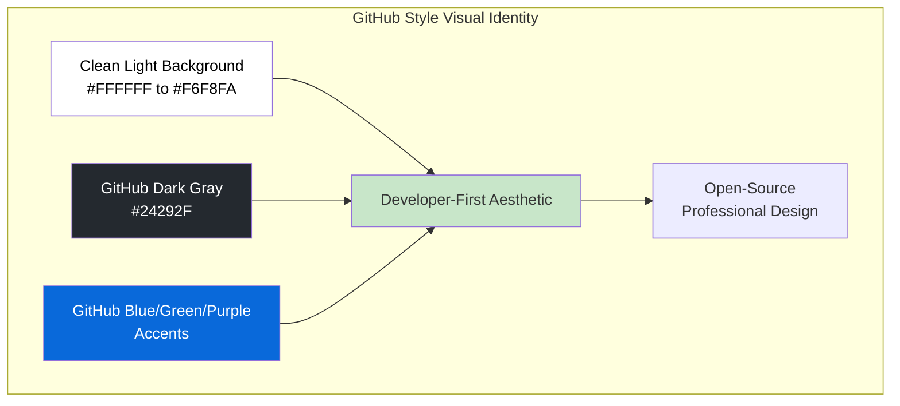
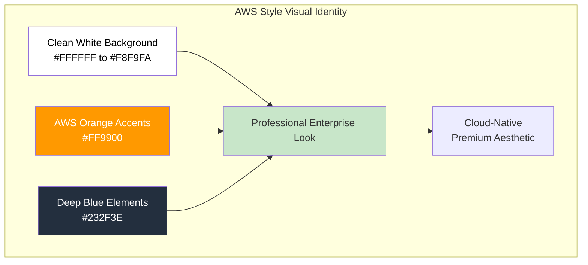

# 🎨 Gemini Image Prompts for GitHub Copilot Mastery Series

## Complete Visual Identity Guide - GitHub Style Theme

**Style Guidelines:**
- **Background**: Clean, GitHub-inspired design with light gradients (#FFFFFF to #F6F8FA) and subtle gray accents
- **Color Palette**: White/light backgrounds with GitHub brand colors: dark gray (#24292F), GitHub blue (#0969DA), GitHub green (#2DA44E), and GitHub purple (#8250DF)
- **Elements**: Circuit patterns, flowchart connectors, technology logos, abstract code visualizations with soft shadows, GitHub-style UI elements
- **Typography**: Bold titles with gradient colors, clean sans-serif fonts (SF Mono, Inter), GitHub-inspired typography
- **Placement**: "Vineet Sharma" in subtle but readable font at bottom right corner
- **Mood**: Professional, developer-first, open-source, GitHub-native aesthetic



---

## Story 1: The Intelligence Layer

### Image Prompt

```
Create a professional, developer-centric illustration with a clean GitHub-style light background (#FFFFFF) transitioning to subtle gray (#F6F8FA), featuring GitHub brand colors with dark gray, blue, and green accents.

**TITLE**: "GITHUB COPILOT MASTERY - THE INTELLIGENCE LAYER" with dual-color treatment:
- "GITHUB COPILOT MASTERY" in GitHub dark gray (#24292F) with subtle shadow
- "THE INTELLIGENCE LAYER" in GitHub blue (#0969DA) with subtle glow
- Both parts in large, bold text using GitHub's system fonts, centered at the top

**SUBTITLE**: "Code Completion · Context Awareness · AI Suggestions · Learning Patterns" in clean, modern sans-serif font, GitHub gray (#57606A) with blue accent dots between words.

**MAIN VISUAL ELEMENTS**: 
- A central glowing neural network node representing "AI Intelligence" with radiating connection lines in GitHub blue
- Four interconnected GitHub-style cards or containers around it representing the four features:
  - Left: Code completion spark icon with syntax highlighting (Code Completion) - GitHub green (#2DA44E)
  - Top: Context awareness icon with file structure visualization and document panels (Context Awareness) - GitHub blue (#0969DA)
  - Right: AI suggestion bulb with radiating light rays and floating code snippets (AI Suggestions) - GitHub purple (#8250DF)
  - Bottom: Learning pattern icon with evolving graphs, neural pathways (Learning Patterns) - GitHub green (#2DA44E)
- Flowing connection lines in GitHub blue forming an intelligent perimeter around all elements
- Abstract binary code and code snippets floating with GitHub-style syntax highlighting
- GitHub Octocat silhouette subtly integrated in background
- Small GitHub, VS Code, Python, JavaScript logos integrated as flat design elements with GitHub styling

**TECHNOLOGY VISUALS**:
- Git branch visualization as GitHub blue branches
- Code completion dropdown with GitHub UI styling
- Context window showing surrounding code with GitHub light theme
- Neural network pattern with data flow in GitHub colors
- Floating code blocks with GitHub light theme syntax highlighting

**COMPOSITION**: Balanced, symmetrical, with clear visual hierarchy on light background. Title stacked with gray top line and blue bottom line, central visualization, Vineet Sharma in small but readable font at bottom right corner, GitHub-style light background with subtle blue glow effects.
```

---

## Story 2: The Integration Ecosystem

### Image Prompt

```
Create a professional, developer ecosystem illustration with clean GitHub-style light background (#FFFFFF) transitioning to subtle gray (#F6F8FA), featuring GitHub brand colors with flowing connection lines.

**TITLE**: "GITHUB COPILOT MASTERY - THE INTEGRATION ECOSYSTEM" with dual-color treatment:
- "GITHUB COPILOT MASTERY" in GitHub dark gray (#24292F) with subtle shadow
- "THE INTEGRATION ECOSYSTEM" in GitHub blue (#0969DA) with subtle glow
- Both parts in large, bold text using GitHub's system fonts, centered at the top

**SUBTITLE**: "IDE Support · Chat Interface · CLI Tools · Pull Request Integration" in clean modern font, GitHub gray (#57606A) with blue accent dots between words.

**MAIN VISUAL ELEMENTS**: 
- A central modular "Core" cube with GitHub-style design, featuring GitHub blue glow
- Four extension arms radiating outward like a star, each with distinct GitHub-style icons:
  - Top-left: VS Code icon with clean editor window (IDE Support) - GitHub dark gray
  - Top-right: Chat bubble with conversation threads and GitHub-style avatar (Chat Interface) - GitHub blue
  - Bottom-left: Terminal window with command line, GitHub CLI styling (CLI Tools) - GitHub green
  - Bottom-right: GitHub pull request interface with merge visualization, review comments (Pull Request Integration) - GitHub purple
- GitHub blue flowing data streams connecting all extensions back to the core
- Abstract network of APIs, databases, cloud services as floating GitHub-style icons
- Open-source logos (VS Code, GitHub, Docker, Kubernetes) integrated into the network with GitHub styling
- GitHub-inspired UI elements with border-radius and subtle shadows

**TECHNOLOGY VISUALS**:
- API gateway symbols with GitHub-style connection points
- Database cylinder icons with data flow lines in GitHub blue
- Cloud service icons with GitHub design language
- Webhook/trigger symbols with notification indicators
- Plugin marketplace icons with download symbols
- GitHub Pull Request interface elements

**COMPOSITION**: Radial/spokes design with core at center on GitHub-style light background. Title at top with dual colors, extension arms creating star pattern, Vineet Sharma at bottom right corner, GitHub-style light background with subtle blue gradient glow effects at edges.
```

---

## Story 3: The Advanced Workflow Engine

### Image Prompt

```
Create a dynamic, professional workflow orchestration illustration with clean GitHub-style light background (#FFFFFF) transitioning to subtle gray (#F6F8FA), featuring GitHub brand colors with circuit patterns.

**TITLE**: "GITHUB COPILOT MASTERY - THE ADVANCED WORKFLOW ENGINE" with dual-color treatment:
- "GITHUB COPILOT MASTERY" in GitHub dark gray (#24292F) with subtle shadow
- "THE ADVANCED WORKFLOW ENGINE" in GitHub blue (#0969DA) with subtle glow
- Both parts in large, bold text using GitHub's system fonts, centered at the top

**SUBTITLE**: "Multi-File Editing · Test Generation · Documentation · Refactoring" in clean modern font, GitHub gray (#57606A) with blue accent dots between words.

**MAIN VISUAL ELEMENTS**: 
- A central "Orchestrator" engine hub with GitHub Actions-style workflow visualization
- Four workflow zones arranged in parallel lanes with GitHub-style cards:
  - Zone 1 (Left): Multiple file icons connected by branching paths (Multi-File Editing)
    - File trees expanding with GitHub-style connections
    - Code diff visualization
  - Zone 2 (Upper-right): Test tubes with checkmarks and GitHub Actions style (Test Generation)
    - Unit test icons with GitHub green checkmarks
    - Coverage badge: 85-95%
    - Test suite visualization
  - Zone 3 (Center-right): Document pages with floating text (Documentation)
    - README style pages
    - API documentation with GitHub markdown styling
  - Zone 4 (Lower-right): Code transformation with arrows (Refactoring)
    - Legacy code transforming to modern syntax
    - GitHub-style diff view showing improvements
    - Performance metrics: 40% improvement
- GitHub blue processing arrows showing parallel execution
- Token compression visualization with percentage savings (60-75% time saved)
- GitHub Actions workflow YAML styling elements

**TECHNOLOGY VISUALS**:
- Parallel processing arrows in GitHub blue
- Code transformation visualization with GitHub diff styling
- Test coverage progress bars with GitHub green
- API documentation pages with GitHub markdown styling
- Refactoring indicators with optimization metrics
- Progress bars and completion indicators with GitHub UI styling

**COMPOSITION**: Dynamic, flowing from left to right, showing workflow progression on GitHub-style light background. Title at top with dual colors, engine hub central, Vineet Sharma at bottom right corner, GitHub-style light background with subtle blue glow.
```

---

## Story 4: From Code to Production

### Image Prompt

```
Create a comprehensive, professional development environment illustration with clean GitHub-style light background (#FFFFFF) transitioning to subtle gray (#F6F8FA), featuring GitHub brand colors with technological landscape.

**TITLE**: "GITHUB COPILOT MASTERY - FROM CODE TO PRODUCTION" with dual-color treatment:
- "GITHUB COPILOT MASTERY" in GitHub dark gray (#24292F) with subtle shadow
- "FROM CODE TO PRODUCTION" in GitHub blue (#0969DA) with subtle glow
- Both parts in large, bold text using GitHub's system fonts, centered at the top

**SUBTITLE**: "VS Code Integration · Enterprise Workflows · Best Practices" in clean modern font, GitHub gray (#57606A) with blue accent.

**MAIN VISUAL ELEMENTS**: 
- Left side: VS Code IDE interface with GitHub theme
  - Recognizable VS Code layout with sidebar, editor, terminal
  - GitHub Copilot extension panel visible with suggestions
  - Code with GitHub light theme syntax highlighting
  - GitHub-style activity bar

- Center: Bridge/connector visualization
  - Flowing data streams connecting terminal to IDE in GitHub blue
  - Syncing arrows with GitHub green checkmarks
  - Integration badges with GitHub styling

- Right side: GitHub Actions and Deployment visualization
  - GitHub Actions workflow YAML visualization
  - CI/CD pipeline flow: test → build → deploy
  - GitHub Packages registry icon
  - Deployment status badges (✅ passing, 🚀 deployed)

- Bottom: Complete enterprise workflow
  - GitHub Issues and Projects integration
  - Pull request review interface
  - Security scanning with GitHub Advanced Security shield icons
  - CodeQL analysis visualization
  - Dependabot alerts indicators

**TECHNOLOGY VISUALS**:
- VS Code logo with GitHub styling
- GitHub Actions logo with workflow animation
- GitHub Packages logo
- GitHub Advanced Security shield
- GitHub Copilot logo
- FastAPI, Python, PostgreSQL, Redis logos with GitHub styling
- GitHub Octocat silhouette elements
- Git branch visualization with merge arrows

**COMPOSITION**: Panoramic, three-part structure (VS Code → Bridge → GitHub Actions) with infrastructure foundation on GitHub-style light background. Title at top with dual colors, Vineet Sharma at bottom right corner, GitHub-style light background with subtle blue technological elements.
```

---

## Bonus: Series Cover Image

### Image Prompt

```
Create a grand, comprehensive cover illustration for a 4-part technology series with clean, professional GitHub-inspired aesthetic.

**TITLE**: "GITHUB COPILOT MASTERY" in largest, boldest text with GitHub dark gray (#24292F) and subtle shadow effect, centered at top.

**SUBTITLE**: "Complete 4-Feature Deep Dive Series" in GitHub blue (#0969DA) text with subtle glow, slightly smaller, below main title.

**MAIN VISUAL**: 
- Central glowing GitHub Octocat silhouette integrated with Copilot icon, radiating blue and green energy
- 4 feature icons arranged in a circular orbit around the core, using GitHub brand colors:
  1. Brain/Neural Network (Intelligence Layer) - GitHub blue (#0969DA)
  2. Connected nodes with IDE/Cloud icons (Integration Ecosystem) - GitHub green (#2DA44E)
  3. Multiple files with workflow arrows (Advanced Workflow Engine) - GitHub purple (#8250DF)
  4. GitHub Actions workflow with rocket (Code to Production) - GitHub orange (#F97316)

- Background: Clean white to light gray gradient with subtle GitHub-style circuit patterns
- Technology logos integrated: GitHub, VS Code, Python, JavaScript, Docker, Kubernetes, GitHub Actions, FastAPI in clean flat design with GitHub styling
- Flowing data streams connecting all elements in GitHub blue and green

**BOTTOM**: "A 4-Part Technical Series" in GitHub gray text with blue accent, with series badges: 
"Story 1 · Story 2 · Story 3 · Story 4" in GitHub brand colors

**PLACEMENT**: "Vineet Sharma" at bottom right corner in elegant but subtle typography

**STYLE**: Clean, modern, developer-centric technology aesthetic. GitHub-style light background with subtle gradient glow effects. Premium, professional, open-source educational content feel inspired by GitHub design language.
```

---

## Technical Specifications for All Images

```yaml
image_specs:
  aspect_ratio: "16:9 (1920x1080 recommended)"
  resolution: "High (4K ready)"
  style: "Clean, professional, developer-centric GitHub-inspired aesthetic"
  background: "White (#FFFFFF) to light gray (#F6F8FA) gradient"
  primary_colors: 
    - GitHub Dark Gray (#24292F) - Primary title, text
    - GitHub Blue (#0969DA) - Secondary title, primary accents
    - GitHub Green (#2DA44E) - Success indicators, code elements
    - GitHub Purple (#8250DF) - Secondary accents
  accent_colors:
    - GitHub Gray (#57606A) - Subtitles, supporting text
    - Light Gray (#E1E4E8) - Borders, dividers
    - White (#FFFFFF) - Background
  lighting: "Soft shadows, subtle glow effects, clean highlights"
  typography:
    title: "Bold sans-serif (Inter, SF Pro), dark gray and blue, large size, all caps"
    subtitle: "Medium sans-serif, gray with blue accent dots, medium size"
    credits: "Subtle, readable, bottom right corner"
  elements:
    - GitHub-style UI components (cards, buttons, badges)
    - Clean circuit patterns with rounded corners
    - Flow connectors with soft shadows
    - Technology logos with flat GitHub-inspired design
    - Abstract code blocks with GitHub light theme syntax
    - Data flow lines with subtle gradients
    - Soft shadow nodes with border-radius
    - Terminal windows with GitHub CLI styling
    - VS Code interface elements with GitHub theme
    - Octocat silhouette elements (subtle)
  placement:
    credits: "Vineet Sharma at bottom right corner"
    consistent: "All images follow same GitHub branding and style"
  effects:
    - Soft shadows (0px 4px 12px rgba(0,0,0,0.05))
    - Subtle glow (0px 0px 8px rgba(9,105,218,0.15))
    - Clean gradients
    - GitHub-style border-radius (6px, 8px, 12px)
```

---

## GitHub Brand Color Reference Guide

```yaml
color_scheme:
  # GitHub Brand Colors
  github_dark_gray:
    hex: "#24292F"
    name: "GitHub Dark Gray"
    usage: "Primary title, main text, primary elements"
    effect: "Subtle shadow"
    
  github_blue:
    hex: "#0969DA"
    name: "GitHub Blue"
    usage: "Secondary title, primary accents, links, glow effects"
    effect: "Subtle blue glow"
    
  github_green:
    hex: "#2DA44E"
    name: "GitHub Green"
    usage: "Success indicators, code elements, positive actions"
    effect: "Soft green glow"
    
  github_purple:
    hex: "#8250DF"
    name: "GitHub Purple"
    usage: "Secondary accents, premium features"
    effect: "Subtle purple glow"
    
  github_orange:
    hex: "#F97316"
    name: "GitHub Orange"
    usage: "Warning indicators, highlights"
    effect: "Warm glow"
    
  # Background Colors
  background_white:
    hex: "#FFFFFF"
    name: "Pure White"
    usage: "Primary background"
    
  background_light:
    hex: "#F6F8FA"
    name: "GitHub Light Gray"
    usage: "Secondary background, cards, containers"
    
  # Text Colors
  text_primary:
    hex: "#24292F"
    name: "GitHub Dark Gray"
    usage: "Primary text"
    
  text_secondary:
    hex: "#57606A"
    name: "GitHub Gray"
    usage: "Subtitles, supporting text"
    
  text_tertiary:
    hex: "#6E7781"
    name: "GitHub Light Gray"
    usage: "Metadata, less important text"
    
  # Border Colors
  border_light:
    hex: "#E1E4E8"
    name: "GitHub Border Light"
    usage: "Dividers, borders"
    
  border_medium:
    hex: "#D0D7DE"
    name: "GitHub Border Medium"
    usage: "Card borders, containers"
    
  # Accent Colors
  accent_blue_light:
    hex: "#54AEFF"
    name: "GitHub Blue Light"
    usage: "Hover states, highlights"
    
  accent_green_light:
    hex: "#57AB5A"
    name: "GitHub Green Light"
    usage: "Success hover states"
```

---

## Typography Hierarchy

```yaml
typography:
  title_layout:
    stacked: true
    separator: "none"
    
    line_one:
      text: "GITHUB COPILOT MASTERY"
      color: "GitHub Dark Gray (#24292F)"
      size: "Medium (48-56pt)"
      weight: "Extra Bold (700)"
      font: "Inter, SF Pro, -apple-system"
      effect: "Subtle shadow (0px 2px 4px rgba(0,0,0,0.05))"
      
    line_two:
      text: "Story Specific Title"
      color: "GitHub Blue (#0969DA)"
      size: "Large (64-72pt)"
      weight: "Extra Bold (700)"
      font: "Inter, SF Pro, -apple-system"
      effect: "Subtle blue glow (0px 0px 8px rgba(9,105,218,0.15))"
      
  subtitle:
    text: "Feature list or description"
    color: "GitHub Gray (#57606A)"
    size: "Medium (18-20pt)"
    weight: "Regular (400)"
    font: "Inter, SF Pro, -apple-system"
    accent: "Blue dots (·) between items"
    
  credits:
    text: "Vineet Sharma"
    color: "GitHub Light Gray (#6E7781)"
    size: "Small (12-14pt)"
    weight: "Regular (400)"
    position: "Bottom right corner"
    opacity: "0.7"
```

---

## GitHub UI Elements Styling

```yaml
github_ui_elements:
  cards:
    background: "#FFFFFF"
    border: "1px solid #E1E4E8"
    border_radius: "6px"
    shadow: "0px 1px 2px rgba(0,0,0,0.05)"
    padding: "16px"
    
  badges:
    background: "#F6F8FA"
    border: "1px solid #E1E4E8"
    border_radius: "2em"
    padding: "4px 8px"
    font_size: "12px"
    
  buttons:
    primary:
      background: "#2DA44E"
      color: "#FFFFFF"
      border_radius: "6px"
      padding: "8px 16px"
    secondary:
      background: "#F6F8FA"
      border: "1px solid #E1E4E8"
      color: "#24292F"
      border_radius: "6px"
      padding: "8px 16px"
      
  code_blocks:
    background: "#F6F8FA"
    border: "1px solid #E1E4E8"
    border_radius: "6px"
    padding: "16px"
    font_family: "SF Mono, Monaco, Consolas"
    
  avatars:
    border_radius: "50%"
    size: "32px"
    border: "1px solid #E1E4E8"
```

---

## Usage Instructions for Gemini

When generating these images in Gemini, use this prompt template:

```
Generate a 16:9 high-resolution image with the following specifications:

[Insert story-specific prompt above]

Additional requirements:
- Clean GitHub-style light background: white (#FFFFFF) to light gray (#F6F8FA) gradient
- Clean, professional, developer-centric GitHub-inspired aesthetic
- Title color scheme: "GITHUB COPILOT MASTERY" in GitHub dark gray (#24292F), story-specific part in GitHub blue (#0969DA)
- Use GitHub brand colors: blue (#0969DA), green (#2DA44E), purple (#8250DF) for accents
- Use soft shadows (0px 4px 12px rgba(0,0,0,0.05)) and subtle glow effects (0px 0px 8px rgba(9,105,218,0.15))
- Include "Vineet Sharma" text at bottom right corner in subtle GitHub gray (#6E7781)
- Ensure all text is clearly readable with proper contrast
- Use GitHub's system fonts: Inter, SF Pro, -apple-system
- Incorporate GitHub-style UI elements: cards with border-radius (6px), badges, buttons
- Include relevant technology logos with GitHub-inspired flat design
- Create a professional, educational content feel suitable for a developer-focused technical series
- Subtitles should use GitHub gray (#57606A) with blue accent dots between items
- Use GitHub border colors (#E1E4E8) for dividing elements
- GitHub Octocat silhouette can be subtly integrated in backgrounds
- Maintain clean, uncluttered design with proper spacing
- Premium, professional, open-source aesthetic
```

---

## Summary of Story Titles with Color Coding

| Story | Title Part 1 (Dark Gray) | Title Part 2 (Blue) |
|-------|--------------------------|---------------------|
| Story 1 | **GITHUB COPILOT MASTERY** | **THE INTELLIGENCE LAYER** |
| Story 2 | **GITHUB COPILOT MASTERY** | **THE INTEGRATION ECOSYSTEM** |
| Story 3 | **GITHUB COPILOT MASTERY** | **THE ADVANCED WORKFLOW ENGINE** |
| Story 4 | **GITHUB COPILOT MASTERY** | **FROM CODE TO PRODUCTION** |
| Cover | **GITHUB COPILOT MASTERY** (Dark Gray) | (Blue subtitle below) |

---

## GitHub Brand Assets Integration

```yaml
github_brand_elements:
  octocat:
    usage: "Subtle silhouette in backgrounds"
    opacity: "0.05 - 0.1"
    position: "Corners or as watermark"
    
  copilot_logo:
    usage: "Central element in cover, accent in stories"
    color: "GitHub Blue or White"
    size: "Medium to large"
    
  github_mark:
    usage: "Small icon in corners or as connector"
    color: "GitHub Dark Gray"
    size: "Small (24-32px)"
    
  github_actions_logo:
    usage: "Story 3 and 4 prominently"
    color: "GitHub Blue"
    animation: "Subtle pulse"
```

---

This completes the visual identity package for the GitHub Copilot Mastery Series with GitHub's own brand aesthetic—clean, developer-centric, professional, and inspired by GitHub's design language. The theme features light backgrounds, GitHub brand colors, soft shadows, and GitHub-style UI elements that feel familiar to developers.

# 🎨 Gemini Image Prompts for GitHub Copilot Mastery Series

## Complete Visual Identity Guide - AWS Style Theme

**Style Guidelines:**
- **Background**: Clean, professional, AWS-inspired design with light gradients (#FFFFFF to #F8F9FA) and subtle orange accents
- **Color Palette**: White/light backgrounds with AWS orange (#FF9900), deep blue (#232F3E), and vibrant green (#2DA44E) accents
- **Elements**: Circuit patterns, flowchart connectors, technology logos, abstract code visualizations with soft shadows
- **Typography**: Bold titles with gradient colors, clean sans-serif subtitles
- **Placement**: "Vineet Sharma" in subtle but readable font at bottom right corner
- **Mood**: Professional, enterprise-grade, cloud-native, AWS-inspired aesthetic



---

## Story 1: The Intelligence Layer

### Image Prompt

```
Create a professional, enterprise-grade illustration with a clean white background (#FFFFFF) transitioning to subtle light gray (#F8F9FA), featuring AWS-inspired design elements with soft orange and deep blue accents.

**TITLE**: "GITHUB COPILOT MASTERY - THE INTELLIGENCE LAYER" with dual-color treatment:
- "GITHUB COPILOT MASTERY" in AWS deep blue (#232F3E) with subtle shadow
- "THE INTELLIGENCE LAYER" in AWS orange (#FF9900) with warm glow
- Both parts in large, bold text, centered at the top

**SUBTITLE**: "Code Completion · Context Awareness · AI Suggestions · Learning Patterns" in clean, modern sans-serif font, medium gray (#4A5568) with orange accent dots between words.

**MAIN VISUAL ELEMENTS**: 
- A central glowing orange neural network node representing "AI Intelligence" with radiating connection lines
- Four interconnected pillars or shields around it representing the four features with soft shadows:
  - Left: Code completion spark icon with syntax highlighting (Code Completion) - blue accent
  - Top: Context awareness icon with file structure visualization and document panels (Context Awareness) - orange accent
  - Right: AI suggestion bulb with radiating light rays and floating code snippets (AI Suggestions) - blue accent
  - Bottom: Learning pattern icon with evolving graphs, DNA helix of code patterns (Learning Patterns) - orange accent
- Flowing orange connector lines forming an intelligent perimeter around all elements
- Abstract binary code and code snippets floating with subtle shadows
- AWS-inspired cloud elements with soft edges
- Small GitHub, VS Code, Python, JavaScript logos integrated as flat design elements

**TECHNOLOGY VISUALS**:
- Git branch visualization as blue branches
- Code completion dropdown with clean UI
- Context window showing surrounding code with light borders
- Neural network pattern with data flow
- Floating code blocks with clean syntax highlighting

**COMPOSITION**: Balanced, symmetrical, with clear visual hierarchy on light background. Title stacked with blue top line and orange bottom line, central visualization, Vineet Sharma in small but readable font at bottom right corner, white background with soft orange glow effects.
```

---

## Story 2: The Integration Ecosystem

### Image Prompt

```
Create a professional, enterprise ecosystem illustration with clean white background (#FFFFFF) transitioning to subtle light gray (#F8F9FA), featuring AWS-inspired design elements with soft orange and deep blue connection lines.

**TITLE**: "GITHUB COPILOT MASTERY - THE INTEGRATION ECOSYSTEM" with dual-color treatment:
- "GITHUB COPILOT MASTERY" in AWS deep blue (#232F3E) with subtle shadow
- "THE INTEGRATION ECOSYSTEM" in AWS orange (#FF9900) with warm glow
- Both parts in large, bold text, centered at the top

**SUBTITLE**: "IDE Support · Chat Interface · CLI Tools · Pull Request Integration" in clean modern font, medium gray (#4A5568) with orange accent dots between words.

**MAIN VISUAL ELEMENTS**: 
- A central modular "Core" cube with soft shadow, featuring AWS orange glow
- Four extension arms radiating outward like a star, each with distinct iconography:
  - Top-left: VS Code icon with clean editor window (IDE Support) - blue
  - Top-right: Chat bubble with conversation threads (Chat Interface) - orange
  - Bottom-left: Terminal window with command line (CLI Tools) - blue
  - Bottom-right: GitHub pull request interface with merge visualization (Pull Request Integration) - orange
- Orange and blue flowing data streams connecting all extensions back to the core
- Abstract network of APIs, databases, cloud services as floating icons
- Open-source logos (VS Code, JetBrains, Neovim, GitHub, Docker) integrated into the network
- AWS-inspired cloud architecture background with soft gradients

**TECHNOLOGY VISUALS**:
- API gateway symbols with clean connection points
- Database cylinder icons with data flow lines
- Cloud service icons (AWS, GitHub) with flat design
- Webhook/trigger symbols with notification indicators
- Plugin marketplace icons with download symbols

**COMPOSITION**: Radial/spokes design with core at center on light background. Title at top with dual colors, extension arms creating star pattern, Vineet Sharma at bottom right corner, white background with soft orange gradient glow effects at edges.
```

---

## Story 3: The Advanced Workflow Engine

### Image Prompt

```
Create a dynamic, professional workflow orchestration illustration with clean white background (#FFFFFF) transitioning to subtle light gray (#F8F9FA), featuring AWS-inspired design elements with soft orange and deep blue circuit patterns.

**TITLE**: "GITHUB COPILOT MASTERY - THE ADVANCED WORKFLOW ENGINE" with dual-color treatment:
- "GITHUB COPILOT MASTERY" in AWS deep blue (#232F3E) with subtle shadow
- "THE ADVANCED WORKFLOW ENGINE" in AWS orange (#FF9900) with warm glow
- Both parts in large, bold text, centered at the top

**SUBTITLE**: "Multi-File Editing · Test Generation · Documentation · Refactoring" in clean modern font, medium gray (#4A5568) with orange accent dots between words.

**MAIN VISUAL ELEMENTS**: 
- A central "Orchestrator" engine hub with clean gear visualization, featuring AWS orange glow
- Four workflow zones arranged in parallel lanes:
  - Zone 1 (Left): Multiple file icons connected by branching paths (Multi-File Editing)
    - File trees expanding with clean connections
  - Zone 2 (Upper-right): Test tubes with checkmarks (Test Generation)
    - Unit test icons with green checkmarks
    - Coverage percentage visualization: 85-95%
  - Zone 3 (Center-right): Document pages with floating text (Documentation)
    - OpenAPI specification pages
  - Zone 4 (Lower-right): Code transformation with arrows (Refactoring)
    - Legacy code transforming to modern syntax
    - Performance metrics: 40% improvement
- Orange processing arrows showing parallel execution
- Token compression visualization with percentage savings (60-75% time saved)
- Clean terminal command line interface elements

**TECHNOLOGY VISUALS**:
- Parallel processing arrows in orange
- Code transformation visualization with before/after
- Test coverage progress bars
- API documentation pages
- Refactoring indicators with optimization metrics
- Progress bars and completion indicators

**COMPOSITION**: Dynamic, flowing from left to right, showing workflow progression on light background. Title at top with dual colors, engine hub central, Vineet Sharma at bottom right corner, white background with soft orange glow.
```

---

## Story 4: From Code to Production

### Image Prompt

```
Create a comprehensive, professional development environment illustration with clean white background (#FFFFFF) transitioning to subtle light gray (#F8F9FA), featuring AWS-inspired design elements with soft orange and deep blue technological landscape.

**TITLE**: "GITHUB COPILOT MASTERY - FROM CODE TO PRODUCTION" with dual-color treatment:
- "GITHUB COPILOT MASTERY" in AWS deep blue (#232F3E) with subtle shadow
- "FROM CODE TO PRODUCTION" in AWS orange (#FF9900) with warm glow
- Both parts in large, bold text, centered at the top

**SUBTITLE**: "VS Code Integration · Enterprise Workflows · Best Practices" in clean modern font, medium gray (#4A5568) with orange accent.

**MAIN VISUAL ELEMENTS**: 
- Left side: VS Code IDE interface with clean design
  - Recognizable VS Code layout with sidebar, editor, terminal
  - GitHub Copilot extension panel visible
  - Code with syntax highlighting

- Center: Bridge/connector visualization
  - Flowing data streams connecting terminal to IDE
  - Syncing arrows with checkmarks
  - Integration badges with AWS orange accents

- Right side: Production environment visualization
  - AWS cloud infrastructure with service icons
  - Docker containers with whale icons
  - Kubernetes pods with orchestration lines
  - Monitoring dashboard with metrics (success rate, latency)

- Bottom: Complete enterprise workflow
  - CI/CD pipeline flow (GitHub Actions logo, test → build → deploy)
  - Security scanning with shield icons
  - Code review interface
  - Deployment stages (canary → full rollout)

**TECHNOLOGY VISUALS**:
- VS Code logo integration
- AWS service icons (EC2, ECS, Lambda, S3)
- Docker whale logo
- Kubernetes logo
- GitHub Actions logo
- FastAPI, Python, PostgreSQL, Redis logos
- Prometheus/Grafana monitoring icons
- Cloud infrastructure icons with clean design

**COMPOSITION**: Panoramic, three-part structure (VS Code → Bridge → Production) with infrastructure foundation on light background. Title at top with dual colors, Vineet Sharma at bottom right corner, white background with soft orange technological elements, clean grid lines.
```

---

## Bonus: Series Cover Image

### Image Prompt

```
Create a grand, comprehensive cover illustration for a 4-part technology series with clean, professional AWS-inspired aesthetic.

**TITLE**: "GITHUB COPILOT MASTERY" in largest, boldest text with AWS deep blue (#232F3E) and subtle shadow effect, centered at top.

**SUBTITLE**: "Complete 4-Feature Deep Dive Series" in AWS orange (#FF9900) text with warm glow, slightly smaller, below main title.

**MAIN VISUAL**: 
- Central glowing "GitHub Copilot" logo radiating orange and blue energy
- 4 feature icons arranged in a circular orbit around the core, alternating AWS orange and deep blue:
  1. Brain/Neural Network (Intelligence Layer) - blue
  2. Connected nodes with IDE/Cloud icons (Integration Ecosystem) - orange
  3. Multiple files with workflow arrows (Advanced Workflow Engine) - blue
  4. Rocket launch with AWS cloud architecture (Code to Production) - orange

- Background: Clean white to light gray gradient with subtle AWS-inspired circuit patterns
- Technology logos integrated: GitHub, VS Code, Python, JavaScript, Docker, Kubernetes, AWS, FastAPI in clean flat design
- Flowing data streams connecting all elements in orange and blue

**BOTTOM**: "A 4-Part Technical Series" in medium gray text with orange accent, with series badges: 
"Story 1 · Story 2 · Story 3 · Story 4" in alternating orange and blue

**PLACEMENT**: "Vineet Sharma" at bottom right corner in elegant but subtle typography

**STYLE**: Clean, modern, enterprise-grade technology aesthetic. White background with soft orange gradient glow effects. Premium, professional, educational content feel inspired by AWS design language.
```

---

## Technical Specifications for All Images

```yaml
image_specs:
  aspect_ratio: "16:9 (1920x1080 recommended)"
  resolution: "High (4K ready)"
  style: "Clean, professional, enterprise-grade technology aesthetic"
  background: "White (#FFFFFF) to light gray (#F8F9FA) gradient"
  primary_colors: 
    - AWS Deep Blue (#232F3E) - Primary title
    - AWS Orange (#FF9900) - Secondary title, primary accents
    - GitHub Green (#2DA44E) - Code elements
  accent_colors:
    - Soft Gray (#4A5568)
    - Light Gray (#E2E8F0)
    - White (#FFFFFF)
  lighting: "Soft shadows, subtle glow effects, clean highlights"
  typography:
    title: "Bold sans-serif, blue and orange, large size, all caps"
    subtitle: "Medium sans-serif, gray with orange accent dots, medium size"
    credits: "Subtle, readable, bottom right corner"
  elements:
    - Clean circuit patterns
    - Flow connectors with soft shadows
    - Technology logos with flat design
    - Abstract code blocks with clean syntax
    - Data flow lines with subtle gradients
    - Soft shadow nodes
    - Terminal windows with clean borders
    - IDE interface elements with flat design
  placement:
    credits: "Vineet Sharma at bottom right corner"
    consistent: "All images follow same branding and style"
  effects:
    - Soft shadows
    - Subtle glow
    - Clean gradients
    - Flat design elements
```

---

## Color Reference Guide

```yaml
color_scheme:
  # AWS Brand Colors
  aws_deep_blue:
    hex: "#232F3E"
    name: "AWS Deep Blue"
    usage: "Primary title, main elements"
    effect: "Subtle shadow"
    
  aws_orange:
    hex: "#FF9900"
    name: "AWS Orange"
    usage: "Secondary title, primary accents, glow effects"
    effect: "Warm glow"
    
  github_green:
    hex: "#2DA44E"
    name: "GitHub Green"
    usage: "Code elements, success indicators"
    effect: "Soft glow"
    
  # Background Colors
  background_white:
    hex: "#FFFFFF"
    name: "Pure White"
    usage: "Primary background"
    
  background_light:
    hex: "#F8F9FA"
    name: "Light Gray"
    usage: "Secondary background, gradients"
    
  # Text Colors
  text_primary:
    hex: "#1F2937"
    name: "Dark Gray"
    usage: "Primary text"
    
  text_secondary:
    hex: "#4A5568"
    name: "Medium Gray"
    usage: "Subtitles, supporting text"
    
  text_light:
    hex: "#6B7280"
    name: "Light Gray"
    usage: "Accent text"
    
  # Accent Colors
  accent_blue:
    hex: "#3B82F6"
    name: "Bright Blue"
    usage: "Secondary accents"
    
  accent_green:
    hex: "#10B981"
    name: "Emerald Green"
    usage: "Success indicators"
```

---

## Typography Hierarchy

```yaml
typography:
  title_layout:
    stacked: true
    separator: "none"
    
    line_one:
      text: "GITHUB COPILOT MASTERY"
      color: "AWS Deep Blue (#232F3E)"
      size: "Medium (48-56pt)"
      weight: "Extra Bold"
      effect: "Subtle shadow"
      
    line_two:
      text: "Story Specific Title"
      color: "AWS Orange (#FF9900)"
      size: "Large (64-72pt)"
      weight: "Extra Bold"
      effect: "Warm glow"
      
  subtitle:
    text: "Feature list or description"
    color: "Medium Gray (#4A5568)"
    accent: "Orange dots (·) between items"
    
  credits:
    text: "Vineet Sharma"
    color: "Light Gray (#6B7280)"
    position: "Bottom right corner"
```

---

## Usage Instructions for Gemini

When generating these images in Gemini, use this prompt template:

```
Generate a 16:9 high-resolution image with the following specifications:

[Insert story-specific prompt above]

Additional requirements:
- Clean white background (#FFFFFF) with subtle light gray gradient (#F8F9FA)
- Clean, modern, enterprise-grade AWS-inspired aesthetic
- Title color scheme: "GITHUB COPILOT MASTERY" in AWS deep blue (#232F3E), story-specific part in AWS orange (#FF9900)
- Use soft shadows and subtle glow effects instead of neon
- Include "Vineet Sharma" text at bottom right corner in subtle light gray
- Ensure all text is clearly readable with proper contrast
- Use modern sans-serif fonts (similar to Inter, SF Pro, or Roboto)
- Incorporate clean circuit patterns and flow connectors between elements using orange and blue
- Include relevant technology logos with flat design (AWS, GitHub, VS Code, Python, Docker, Kubernetes, FastAPI)
- Create a professional, educational content feel suitable for an enterprise technical series
- Subtitles should use medium gray with orange accent dots between items
- Use soft shadows and clean gradients for depth
- AWS-inspired cloud elements with clean edges
- Professional, premium, enterprise-grade finish
```

---

## Summary of Story Titles with Color Coding

| Story | Title Part 1 (Blue) | Title Part 2 (Orange) |
|-------|---------------------|----------------------|
| Story 1 | **GITHUB COPILOT MASTERY** | **THE INTELLIGENCE LAYER** |
| Story 2 | **GITHUB COPILOT MASTERY** | **THE INTEGRATION ECOSYSTEM** |
| Story 3 | **GITHUB COPILOT MASTERY** | **THE ADVANCED WORKFLOW ENGINE** |
| Story 4 | **GITHUB COPILOT MASTERY** | **FROM CODE TO PRODUCTION** |
| Cover | **GITHUB COPILOT MASTERY** (Blue) | (Orange subtitle below) |

---

This completes the visual identity package for the GitHub Copilot Mastery Series with AWS-inspired clean, professional theme featuring white backgrounds, AWS deep blue and orange accents, and enterprise-grade aesthetic.

# 🎨 Gemini Image Prompts for GitHub Copilot Mastery Series

## Complete Visual Identity Guide

**Style Guidelines:**
- **Background**: Dark, deep, modern technology aesthetic with vibrant green accents (GitHub Copilot's signature color)
- **Color Palette**: Dark backgrounds (#0D1117, #161B22) with neon green (#2DA44E), electric blue, and purple highlights
- **Elements**: Circuit patterns, flowchart connectors, technology logos, abstract code visualizations with glow effects
- **Typography**: Bold titles with gradient colors, clean sans-serif subtitles on dark backgrounds
- **Placement**: "Vineet Sharma" in subtle but readable font at bottom right corner
- **Mood**: Modern, innovative, AI-powered development, professional, premium tech aesthetic
- **Contrast**: High contrast with bright neon accents against dark backgrounds

---

## Story 1: The Intelligence Layer

### Image Prompt

```
Create a futuristic, high-tech illustration with a deep dark background (#0D1117) and vibrant neon green circuit patterns. 

**TITLE**: "GITHUB COPILOT MASTERY - THE INTELLIGENCE LAYER" with dual-color treatment:
- "GITHUB COPILOT MASTERY" in vibrant neon green (#2DA44E) with electric glow
- "THE INTELLIGENCE LAYER" in electric blue (#00A3FF) with cyan glow
- Both parts in large, bold gradient text, centered at the top

**SUBTITLE**: "Code Completion · Context Awareness · AI Suggestions · Learning Patterns" in clean, modern sans-serif font, light gray (#E6EDF3) with green accent dots between words.

**MAIN VISUAL ELEMENTS**: 
- A central glowing neon green brain/neural network node representing "AI Intelligence" with pulsing energy rings
- Four interconnected pillars or shields around it representing the four features with glowing borders:
  - Left: Code completion spark icon with syntax highlighting (Code Completion) - green glow
  - Top: Context awareness icon with file structure visualization and holographic code panels (Context Awareness) - blue accent
  - Right: AI suggestion bulb with radiating light rays and floating code snippets (AI Suggestions) - purple glow
  - Bottom: Learning pattern icon with evolving graphs, DNA helix of code patterns, and neural pathways (Learning Patterns) - green accent
- Flowing neon green connector lines forming an intelligent perimeter around all elements
- Abstract binary code and code snippets floating in space with green syntax highlighting
- Dark cyberpunk background with subtle grid lines and data streams
- Small GitHub, VS Code, Python, JavaScript logos integrated as glowing holographic elements

**TECHNOLOGY VISUALS**:
- Git branch visualization as glowing green branches
- Code completion dropdown with neon suggestions
- Context window showing surrounding code with translucent panels
- Neural network pattern with pulsing data flow
- Floating code blocks with syntax highlighting in green and blue

**COMPOSITION**: Balanced, symmetrical, with clear visual hierarchy on dark background. Title stacked with green top line and blue bottom line, central visualization with neon glow, Vineet Sharma in small but readable font at bottom right corner, dark background with neon green glow effects and data streams.
```

---

## Story 2: The Integration Ecosystem

### Image Prompt

```
Create a vibrant, high-tech ecosystem illustration with deep dark background (#0D1117) and flowing neon green connection lines. 

**TITLE**: "GITHUB COPILOT MASTERY - THE INTEGRATION ECOSYSTEM" with dual-color treatment:
- "GITHUB COPILOT MASTERY" in vibrant neon green (#2DA44E) with electric glow
- "THE INTEGRATION ECOSYSTEM" in electric blue (#00A3FF) with cyan glow
- Both parts in large, bold gradient text, centered at the top

**SUBTITLE**: "IDE Support · Chat Interface · CLI Tools · Pull Request Integration" in clean modern font, light gray (#E6EDF3) with green accent dots between words.

**MAIN VISUAL ELEMENTS**: 
- A central modular "Core" cube glowing with neon green energy with rotating holographic panels
- Four extension arms radiating outward like a star, each with distinct iconography and neon borders:
  - Top-left: VS Code icon with glowing editor window and floating code (IDE Support) - green glow
  - Top-right: Chat bubble with conversation threads and AI avatar (Chat Interface) - blue accent
  - Bottom-left: Terminal window with command line and glowing cursor (CLI Tools) - purple glow
  - Bottom-right: GitHub pull request interface with merge visualization and review comments (Pull Request Integration) - green accent
- Neon green flowing data streams connecting all extensions back to the core
- Abstract network of APIs, databases, cloud services as floating holographic icons
- Open-source logos (VS Code, JetBrains, Neovim, GitHub, Docker) integrated into the network with glow effects
- Dark cyberpunk background with circuit board patterns and data flow animations

**TECHNOLOGY VISUALS**:
- API gateway symbols with connection points and neon outlines
- Database cylinder icons with data flow lines in green
- Cloud service icons (AWS, GitHub) with holographic effects
- Webhook/trigger symbols with pulsing notification indicators
- Plugin marketplace icons with download symbols and glow effects
- Terminal commands scrolling with syntax highlighting

**COMPOSITION**: Radial/spokes design with core at center on dark background. Title at top with dual colors, extension arms creating star pattern with neon trails, Vineet Sharma at bottom right corner, dark background with neon green gradient glow effects at edges and data streams.
```

---

## Story 3: The Advanced Workflow Engine

### Image Prompt

```
Create a dynamic, high-tech workflow orchestration illustration with deep dark background (#0D1117) and complex neon green circuit patterns. 

**TITLE**: "GITHUB COPILOT MASTERY - THE ADVANCED WORKFLOW ENGINE" with dual-color treatment:
- "GITHUB COPILOT MASTERY" in vibrant neon green (#2DA44E) with electric glow
- "THE ADVANCED WORKFLOW ENGINE" in electric blue (#00A3FF) with cyan glow
- Both parts in large, bold gradient text, centered at the top

**SUBTITLE**: "Multi-File Editing · Test Generation · Documentation · Refactoring" in clean modern font, light gray (#E6EDF3) with green accent dots between words.

**MAIN VISUAL ELEMENTS**: 
- A central "Orchestrator" engine hub with spinning gear visualization, glowing with neon green energy
- Four workflow zones arranged in parallel lanes with holographic interfaces:
  - Zone 1 (Left): Multiple file icons connected by branching paths with synchronized editing visualization (Multi-File Editing)
    - File trees expanding with glowing connections
    - Code flowing between file panels
  - Zone 2 (Upper-right): Test tubes with checkmarks and passing test indicators (Test Generation)
    - Unit test icons with green checkmarks
    - Coverage percentage visualization with 85-95% glowing
  - Zone 3 (Center-right): Document pages with floating text and API documentation (Documentation)
    - OpenAPI specification glowing pages
    - Docstring generation visualization
  - Zone 4 (Lower-right): Code transformation with arrows showing before/after states (Refactoring)
    - Legacy code transforming to modern syntax
    - Performance metrics showing 40% improvement
- Neon green processing arrows showing parallel execution and workflow progression
- Token compression visualization with percentage savings (60-75% time saved)
- Terminal command line interface elements with syntax highlighting

**TECHNOLOGY VISUALS**:
- Parallel processing arrows showing simultaneous execution in neon green
- Code transformation visualization with before/after states
- Test coverage progress bars with glow effects
- API documentation pages with floating endpoints
- Refactoring indicators with optimization metrics
- Progress bars and completion indicators with neon trails

**COMPOSITION**: Dynamic, flowing from left to right, showing workflow progression on dark background. Title at top with dual colors, engine hub central with neon glow, Vineet Sharma at bottom right corner, dark background with electric green glow and motion lines.
```

---

## Story 4: From Code to Production

### Image Prompt

```
Create a comprehensive, futuristic development environment illustration with deep dark background (#0D1117) and neon green technological landscape. 

**TITLE**: "GITHUB COPILOT MASTERY - FROM CODE TO PRODUCTION" with dual-color treatment:
- "GITHUB COPILOT MASTERY" in vibrant neon green (#2DA44E) with electric glow
- "FROM CODE TO PRODUCTION" in electric blue (#00A3FF) with cyan glow
- Both parts in large, bold gradient text, centered at the top

**SUBTITLE**: "VS Code Integration · Enterprise Workflows · Best Practices" in clean modern font, light gray (#E6EDF3) with green accent.

**MAIN VISUAL ELEMENTS**: 
- Left side: VS Code IDE interface with glowing panels
  - Recognizable VS Code layout with sidebar, editor, terminal
  - GitHub Copilot extension panel visible with active suggestions
  - Code with neon green syntax highlighting
  - Floating AI assistance indicators

- Center: Bridge/connector visualization with flowing data streams
  - Neon green and blue data streams connecting terminal to IDE
  - Syncing arrows with checkmarks and glowing effects
  - Integration badges with holographic effects
  - CI/CD pipeline visualization

- Right side: Production environment visualization
  - Docker containers with neon whale icons and pulsing effects
  - Kubernetes pods with orchestration lines in green
  - Cloud infrastructure with glowing server racks
  - Monitoring dashboard with metrics (success rate, latency) in neon graphs

- Bottom: Complete enterprise workflow visualization
  - GitHub Actions workflow with test → build → deploy stages in neon arrows
  - Security scanning with shield icons and checkmarks
  - Code review interface with approval indicators
  - Deployment pipeline with canary and full rollout stages

**TECHNOLOGY VISUALS**:
- VS Code logo with neon green glow
- Docker whale logo with holographic effect
- Kubernetes logo with spinning elements
- GitHub Actions logo with workflow animation
- FastAPI, Python, PostgreSQL, Redis logos with neon outlines
- Prometheus/Grafana monitoring icons with real-time graphs
- Cloud infrastructure icons with glowing server racks
- Git branch visualization with merging animation
- Container orchestration lines with data flow
- Security shield icons with green checkmarks

**COMPOSITION**: Panoramic, three-part structure (VS Code → Bridge → Production) with infrastructure foundation on dark background. Title at top with dual colors, Vineet Sharma at bottom right corner, dark background with neon green technological elements, holographic grid lines representing development workspace.
```

---

## Bonus: Series Cover Image

### Image Prompt

```
Create a grand, comprehensive cover illustration for a 4-part technology series with dark, energetic cyberpunk aesthetic.

**TITLE**: "GITHUB COPILOT MASTERY" in largest, boldest text with vibrant neon green (#2DA44E) and electric glow effect, centered at top.

**SUBTITLE**: "Complete 4-Feature Deep Dive Series" in electric blue (#00A3FF) text with subtle glow, slightly smaller, below main title.

**MAIN VISUAL**: 
- Central glowing "GitHub Copilot" logo radiating neon green and blue energy
- 4 feature icons arranged in a circular orbit around the core, alternating green and blue accents with holographic effects:
  1. Brain/Neural Network (Intelligence Layer) - green
  2. Connected nodes with IDE/Cloud icons (Integration Ecosystem) - blue
  3. Multiple files with workflow arrows (Advanced Workflow Engine) - green
  4. Rocket launch with production dashboard (Code to Production) - purple

- Background: Abstract dark circuit board pattern with neon green flow lines and data streams
- Technology logos integrated: GitHub, VS Code, Python, JavaScript, Docker, Kubernetes, FastAPI using green and blue neon outlines
- Flowing data streams connecting all elements in dual colors across dark space

**BOTTOM**: "A 4-Part Technical Series" in light gray text with green accent, with series badges: 
"Story 1 · Story 2 · Story 3 · Story 4" in alternating green and blue

**PLACEMENT**: "Vineet Sharma" at bottom right corner in elegant but subtle typography with slight glow

**STYLE**: Clean, modern, cyberpunk technology aesthetic. Deep dark background (#0D1117) with neon green and blue gradient glow effects. Premium, professional, educational content feel with high contrast.
```

---

## Technical Specifications for All Images

```yaml
image_specs:
  aspect_ratio: "16:9 (1920x1080 recommended)"
  resolution: "High (4K ready)"
  style: "Modern, cyberpunk, high-tech technology aesthetic"
  background: "Deep dark (#0D1117) with neon green gradient glow at edges"
  primary_colors: 
    - Neon Green (#2DA44E) - GitHub Copilot signature
    - Electric Blue (#00A3FF) - Accent
    - Vibrant Purple (#7C3AED) - Secondary accent
  accent_colors:
    - Cyan Glow (#00FFFF)
    - Light Gray (#E6EDF3)
    - Dark Gray (#161B22)
  lighting: "Neon glow effects, holographic highlights, rim lighting on icons"
  typography:
    title: "Bold sans-serif, gradient fill (green to blue), large size, all caps"
    subtitle: "Light sans-serif, light gray with green accent dots, medium size"
    credits: "Subtle, readable, bottom right corner with slight glow"
  elements:
    - Circuit patterns in neon green
    - Flow connectors with glow trails
    - Technology logos with neon outlines
    - Abstract code blocks with syntax highlighting
    - Data flow lines with pulsing effects
    - Glowing nodes and holographic elements
    - Terminal windows with neon borders
    - IDE interface elements with glassmorphism effects
    - Holographic displays and data visualizations
  placement:
    credits: "Vineet Sharma at bottom right corner"
    consistent: "All images follow same branding and style with dark theme"
  effects:
    - Neon glow
    - Holographic transparency
    - Data stream animations
    - Pulse effects on key elements
    - Glassmorphism panels
```

---

## Color Reference Guide

```yaml
color_scheme:
  # Dark Theme Colors
  background_dark:
    hex: "#0D1117"
    name: "GitHub Dark"
    usage: "Primary background"
    
  background_darker:
    hex: "#161B22"
    name: "Dark Gray"
    usage: "Secondary elements"
    
  # Primary Accent Colors
  github_green:
    hex: "#2DA44E"
    name: "GitHub Copilot Green"
    usage: "Primary title, main accents, glow effects"
    effect: "Electric glow"
    
  electric_blue:
    hex: "#00A3FF"
    name: "Electric Blue"
    usage: "Secondary title, alternate accents"
    effect: "Cyan glow"
    
  vibrant_purple:
    hex: "#7C3AED"
    name: "Vibrant Purple"
    usage: "Tertiary accents, highlights"
    effect: "Purple glow"
    
  # Text Colors
  text_primary:
    hex: "#E6EDF3"
    name: "Light Gray"
    usage: "Subtitles, primary text"
    
  text_secondary:
    hex: "#8B949E"
    name: "Medium Gray"
    usage: "Supporting text"
    
  # Glow Effects
  green_glow: "rgba(45, 164, 78, 0.4)"
  blue_glow: "rgba(0, 163, 255, 0.4)"
  purple_glow: "rgba(124, 58, 237, 0.4)"
  cyan_glow: "rgba(0, 255, 255, 0.3)"
```

---

## Typography Hierarchy

```yaml
typography:
  title_layout:
    stacked: true
    separator: "none (no dash)"
    
    line_one:
      text: "GITHUB COPILOT MASTERY"
      color: "Neon Green (#2DA44E)"
      size: "Medium (48-56pt)"
      weight: "Extra Bold"
      effect: "Electric green glow"
      
    line_two:
      text: "Story Specific Title"
      color: "Electric Blue (#00A3FF)"
      size: "Large (64-72pt)"
      weight: "Extra Bold"
      effect: "Cyan glow"
      
  subtitle:
    text: "Feature list or description"
    color: "Light Gray (#E6EDF3)"
    accent: "Green dots (·) between items"
    
  credits:
    text: "Vineet Sharma"
    color: "Medium Gray (#8B949E) with subtle glow"
    position: "Bottom right corner"
```

---

## Usage Instructions for Gemini

When generating these images in Gemini, use this prompt template:

```
Generate a 16:9 high-resolution image with the following specifications:

[Insert story-specific prompt above]

Additional requirements:
- Deep dark background (#0D1117) with subtle neon green and blue gradient glow at edges
- Clean, modern, cyberpunk technology aesthetic with high contrast
- Title color scheme: "GITHUB COPILOT MASTERY" in neon green (#2DA44E), story-specific part in electric blue (#00A3FF)
- Use vibrant purple (#7C3AED) for secondary accents and highlights
- Include "Vineet Sharma" text at bottom right corner in subtle light gray with slight glow
- Ensure all text is clearly readable with proper contrast against dark background
- Use modern sans-serif fonts (similar to Inter, SF Pro, or Roboto) with bold weights
- Incorporate neon circuit patterns and flow connectors between elements using green and blue gradients
- Include relevant technology logos with neon outlines and glow effects
- Create a professional, educational content feel suitable for a technical series with premium aesthetic
- Subtitles should use light gray with green accent dots between items
- Dual-color glow effects on title for premium feel
- Use holographic transparency effects and glassmorphism for panels
- Add pulsing glow effects on key elements
- Ensure proper visual hierarchy with green line slightly smaller than blue line
- Dark theme with bright neon accents for maximum contrast
```

---

## Summary of Story Titles with Color Coding

| Story | Title Part 1 (Green) | Title Part 2 (Blue) |
|-------|---------------------|----------------------|
| Story 1 | **GITHUB COPILOT MASTERY** | **THE INTELLIGENCE LAYER** |
| Story 2 | **GITHUB COPILOT MASTERY** | **THE INTEGRATION ECOSYSTEM** |
| Story 3 | **GITHUB COPILOT MASTERY** | **THE ADVANCED WORKFLOW ENGINE** |
| Story 4 | **GITHUB COPILOT MASTERY** | **FROM CODE TO PRODUCTION** |
| Cover | **GITHUB COPILOT MASTERY** (Green only) | (Blue subtitle below) |

---

This completes the visual identity package for the GitHub Copilot Mastery Series with reversed background and content contrast (dark theme vs light theme), maintaining consistent branding with neon green GitHub Copilot colors and high-contrast cyberpunk aesthetic.